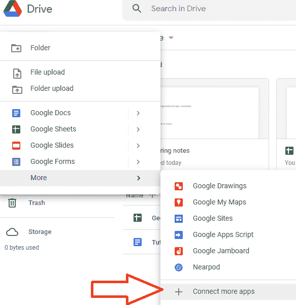
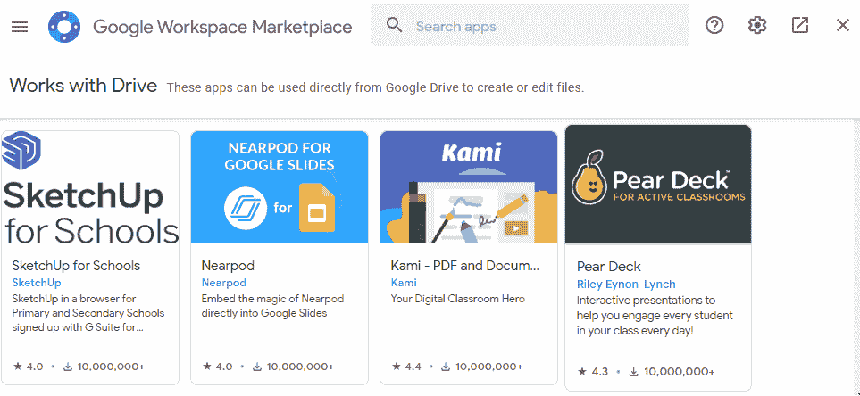
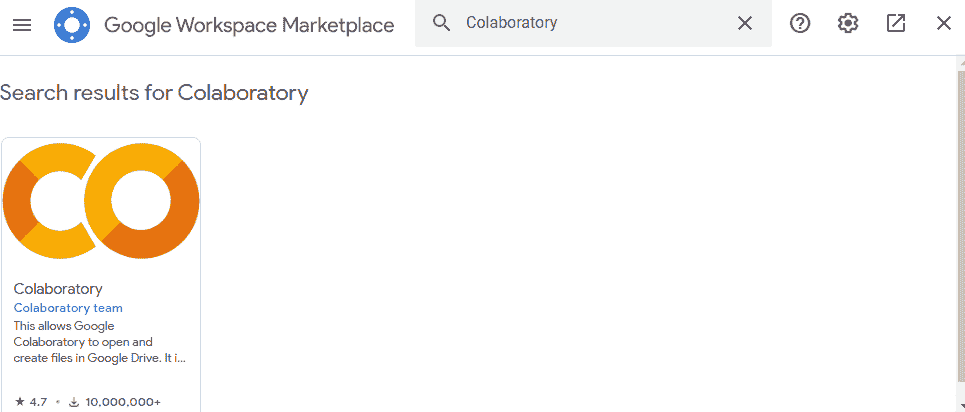
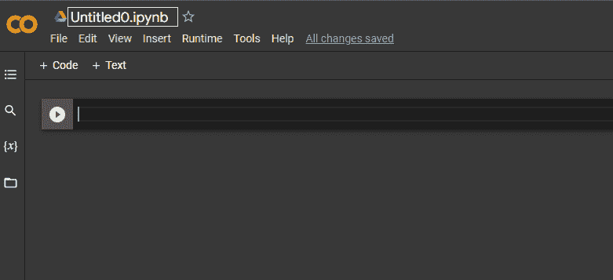
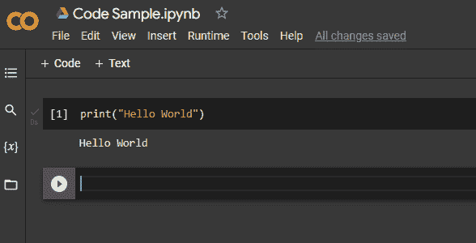
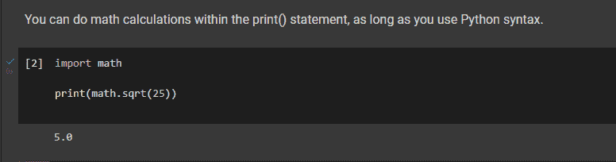

# 谷歌合作实验室——如何在你的谷歌硬盘上运行 Python 代码

> 原文：<https://www.freecodecamp.org/news/google-colaboratory-python-code-in-your-google-drive/>

谷歌合作实验室(“Colab”)是一个笔记本(类似于 Jupyter 笔记本)，你可以在谷歌驱动器中运行 Python 代码。

您可以在同一个笔记本中编写文本、编写代码、运行代码并查看输出结果。

## Google Colab 的优势

共享笔记本就像共享任何谷歌文档一样简单。你也可以从手机上下载应用程序并运行代码。

你可以在你的 Google Drive 中使用强大而流行的 Python 语言，设置过程不到五分钟。

因为 Python 运行在服务器上(而不是在您的本地浏览器或本地计算机上)，所以您可以轻松地使用它与在线数据库进行交互，并在需要保持代码私有的情况下分析数据。

## 如何将 Colab 添加到您的 Google Drive

1.  在你的电脑上，在你的 Google Drive 中，点击“+ new”按钮。

2.点击“更多”，然后点击新菜单底部的“连接更多应用”。

3。在 Google Workspace Marketplace 的搜索框中输入“colab”。

4.单击以添加 Google 协同实验室。

5。现在，您的可用应用列表中有了 Colab。

## 
如何使用 Google Colab

现在，当你点击“+新建”按钮，并点击“更多”(在第一个列表的底部)，你会看到“谷歌合作实验室”在下一个列表。

单击它打开一个新的 Colab 笔记本。给你的笔记本起个名字，就像你给任何谷歌文档或电子表格起名字一样。此笔记本处于黑暗模式:

键入一个简单的命令作为测试。要运行任何单元格中的代码，您可以单击代码单元格左侧的“运行”按钮(看起来像一个圆圈中有一个三角形的“播放”按钮)，或者您可以单击[shift] + [enter]。输出将出现在代码单元格的正下方。

您可以导入许多流行的库，而不必先安装它们。

如果您在一个单元格中导入了一个库或定义了一个函数，那么至少在几分钟内，其他单元格仍然可以使用它。如果你 30 分钟没有运行一个单元，或者你打开笔记本 12 个小时，运行时将会断开。

## 探索 Colab

如果您已经安装了 Google Colaboratory，那么您已经准备好构建自己的项目了。

如果你点击笔记本左下角的“ **< >** ”符号，你会发现你可以使用的代码片段。谷歌也为你提供了许多资源，其中一些在 https://colab.research.google.com/的(只要关闭出现的弹出窗口)。

在 freeCodeCamp，我们正在建立一个课程，向您展示如何使用 Python 来解决数学问题。现在，工具唾手可得。编码快乐！