# 谷歌文档横向教程-如何使谷歌文档横向

> 原文：<https://www.freecodecamp.org/news/google-docs-landscape-tutorial-how-to-make-a-google-doc-landscape-orientation/>

大多数文档在纵向看起来更好。但是，有时您需要额外的水平空间来显示图表或类似证书的东西。

在本文中，我们将讨论如何将 Google Docs 上的文档方向改为横向，如何将其设为默认方向，等等。

## 如何在桌面上将谷歌文档改为横向

在我们开始之前，重要的一点是:不可能只把谷歌文档的一部分改成横向的。在撰写本文时，整个 Google 文档必须是横向或纵向的。

解决了这个问题，下面是如何将谷歌文档的方向改为横向。

### 步骤 1:打开“页面设置”菜单

首先，点击左上角的“文件”，然后点击“页面设置”:

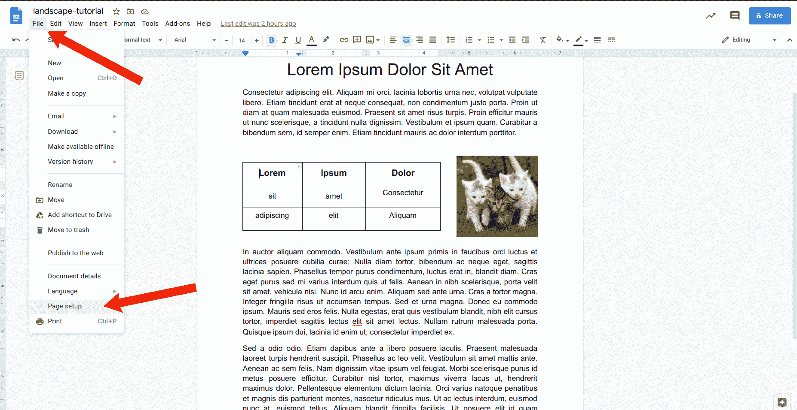

### 步骤 2:将页面方向设置为横向

在“页面设置”菜单中，您会看到两个页面方向选项:“纵向”和“横向”。

选择“横向”，然后点击右下角的蓝色“确定”按钮:

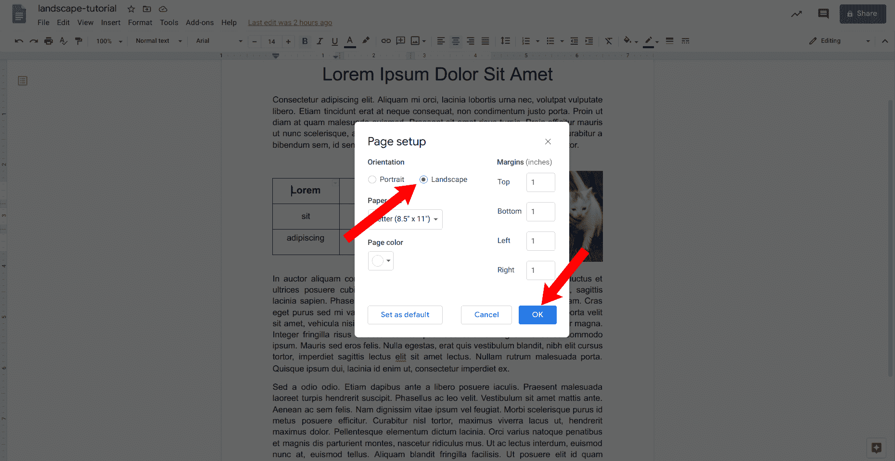

一旦你这样做，你的整个文件将在横向:

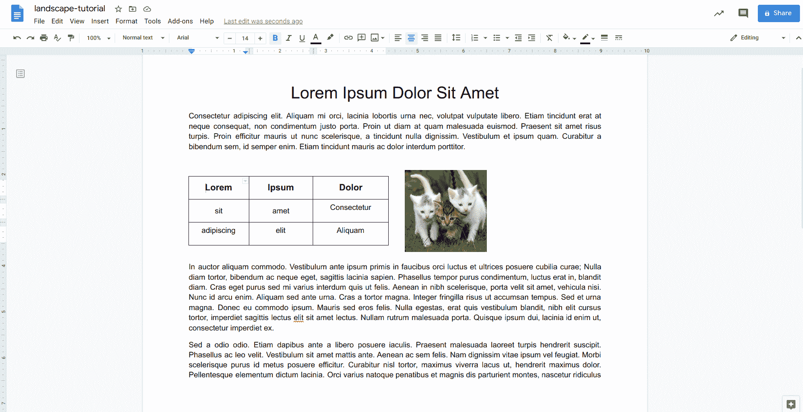

因为整个文档已经改变了方向，所以文档中任何现有的表格、图形、图像和其他元素都有可能需要调整。

这很简单，但是如果你在移动设备上使用谷歌文档呢？幸运的是，这也很简单。

## 如何在手机上将谷歌文档改为横向

就像桌面上的谷歌文档一样，不可能只将文档的一部分改为横向——要么全有，要么全无。

此外，我将在 Android 上使用谷歌文档来完成这部分教程，尽管在 iOS 上的过程应该是相似的。

说到这里，让我们开始吧。

### 步骤 1:打开“页面设置”菜单

打开文稿，然后轻按右下方的铅笔图标:

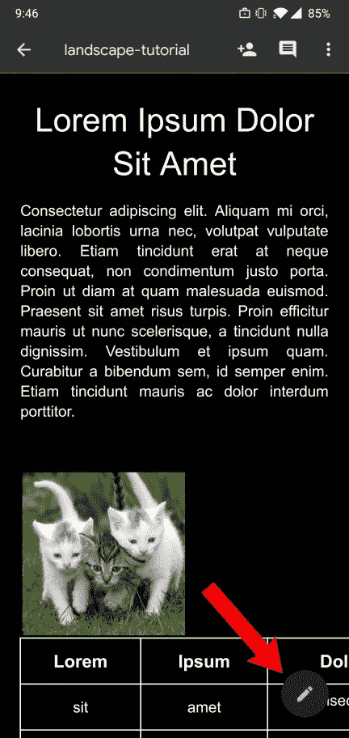

轻按右上角的三个垂直点:

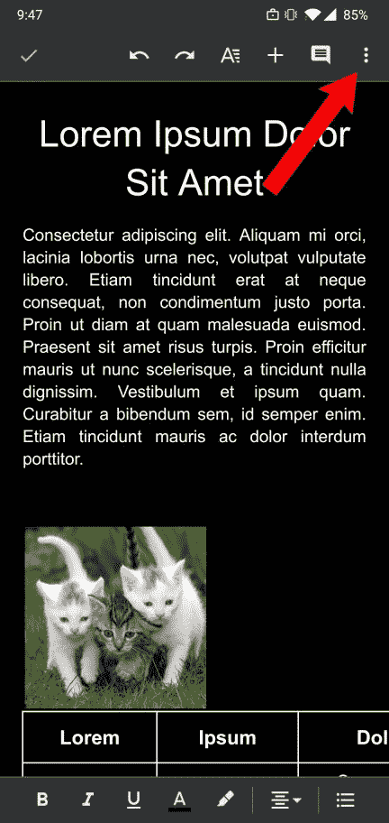

然后点击“页面设置”:

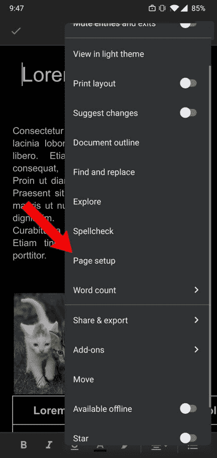

### 步骤 2:将页面方向设置为横向

在“页面设置”菜单中，点击“方向”:

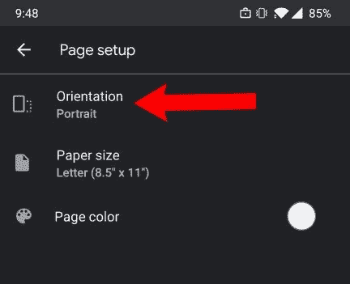

选择“横向”，然后轻按左上角的箭头返回“页面设置”菜单:

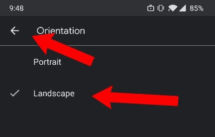

按左上角的箭头返回编辑器屏幕。

即使您的文档现在是横向的，它看起来也和以前一样:

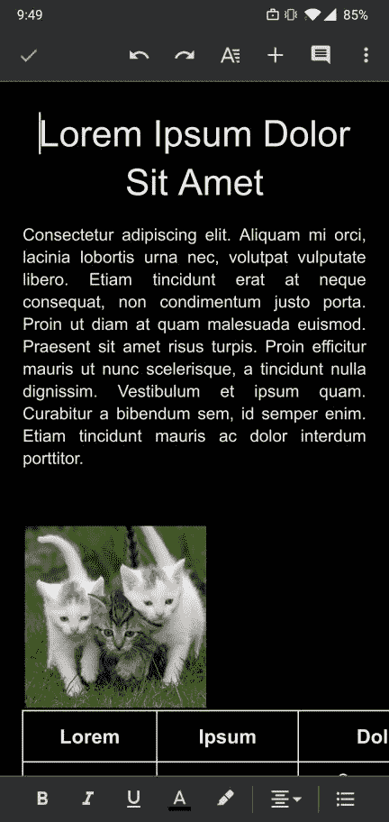

I assure you, this is in landscape mode!

要查看新的方向，您需要在“页面布局”模式下查看您的 Google 文档。

### 步骤 3:切换打印布局模式(可选)

要确认您的文档为横向，请点击右上角的三个垂直点，然后点击“打印布局”开关:

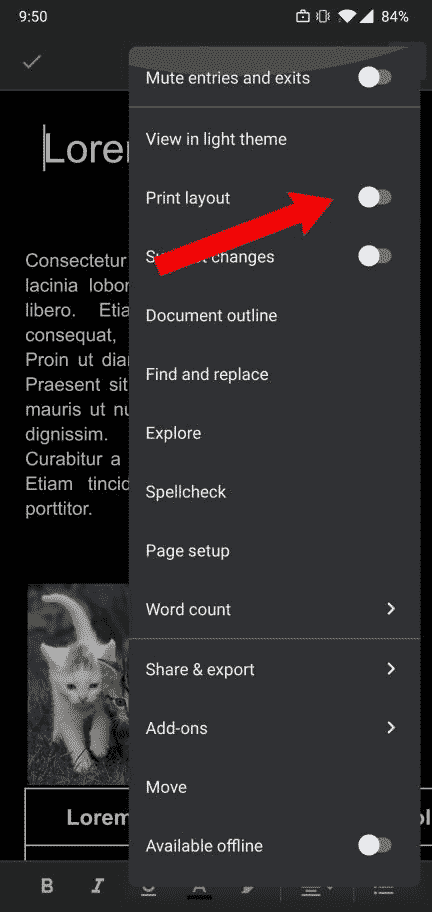

现在，您可以查看文档的所有景观:

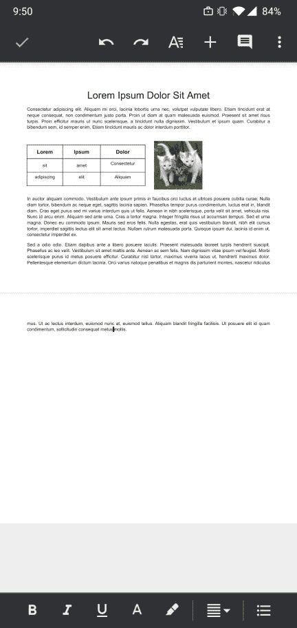

Note: You may need to zoom out to see your entire document

就是这样！现在，您应该已经拥有了在桌面和移动设备上更改 Google 文档页面方向所需的一切。