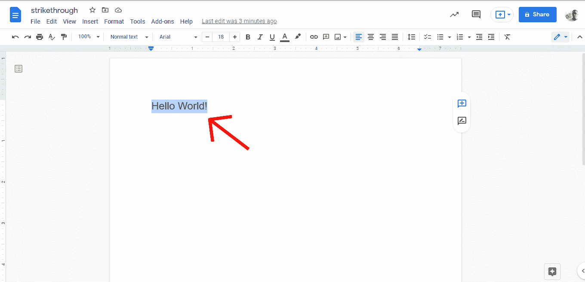
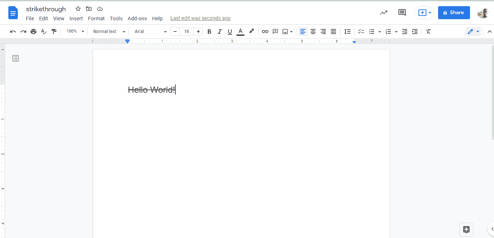
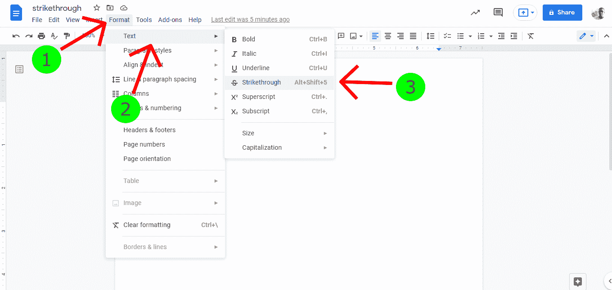

# 谷歌文档删除线–如何删除谷歌文档中的文本

> 原文：<https://www.freecodecamp.org/news/google-docs-strikethrough-how-to-cross-out-text-in-google-docs/>

当你写作时，有时你可能想删除某些文本。这意味着添加一条贯穿一段文本的水平线。

看起来是这样的:~~你是一个很棒的人。~~

这些是删除线的各种用例:

*   表示应该删除的一段或一组文本。
*   表示一段或一段文字已经过时。
*   显示任务完成。这通常出现在待办事项列表中。
*   写作时传达一个无关的或幽默的信息，等等。

在这篇文章中，我们将看到在使用谷歌文档写作时如何删除文本。

## 如何在谷歌文档中删除文本

在 Google Docs 中删除文本时，我们可以使用两种方法——使用快捷命令或从 Google Docs 标题部分的格式选项卡中选择删除线选项。

### 如何使用快捷命令删除 Google 文档中的文本

以下是在谷歌文档中使用快捷命令删除文本时应遵循的步骤:

*   打开[谷歌文档](https://docs.google.com/)并创建一个空白文档。
*   在您的文档中写一些文本。
*   突出显示您写的文本。

*   在 windows 上，按`Alt` + `Shift` + `5`。
*   在 Mac 上，按`⌘` + `Shift` + `X`。

好了，我们使用了一个快捷命令来删除谷歌文档中的文本。

### 如何使用“格式”标签删除 Google 文档中的文本

在这一节中，我们将看到如何使用格式选项删除 Google 文档中的文本。以下是步骤:

*   打开[谷歌文档](https://docs.google.com/)并创建一个空白文档。
*   在您的文档中写一些文本。
*   突出显示您写的文本。
*   点击标题中的`Format`选项卡。
*   点击`Text`。
*   点击`Strikethrough`选项。

做完这些后，你的文字应该被划掉。

## 结论

在这篇文章中，我们讨论了书写中的删除线，它们的用例以及如何在谷歌文档中删除文本。

~~感谢您的阅读！~~不过说真的，感谢阅读！:)