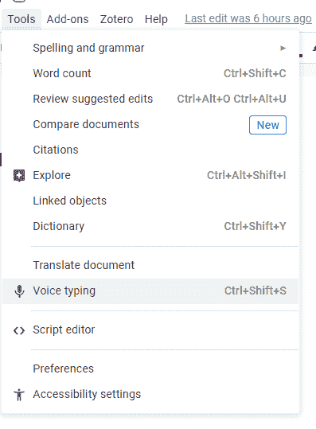
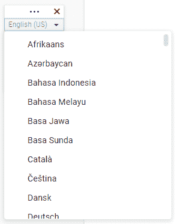

# 谷歌文档语音输入——如何在谷歌文档中使用语音转文本

> 原文：<https://www.freecodecamp.org/news/google-docs-voice-typing-how-to-use-speech-to-text-in-a-google-doc/>

如果打字对你来说很困难，语音转文本是一个非常有用的辅助工具。或者你也可以使用它，如果你喜欢大声思考并转录你所说的话。

在本教程中，我将向您展示如何在谷歌文档中使用语音到文本。不过，请注意，这项功能只有在你使用谷歌的 Chrome 浏览器时才可用。

## 如何激活语音转文本工具

您可以从“工具”菜单中激活语音转文本功能，这是倒数第四个菜单项。或者您可以使用`Ctrl+Shift+S`(Windows 上)或`Command+Shift+S`(Mac 上)快捷键来激活它。

The Tool menu. The Voice typing menu item is the tenth item from the top, or the fourth from the bottom.

这将打开一个带有麦克风和下拉菜单的小标签。

The voice typing tab. 

你可以用顶部的三个水平点拖动它。你可以点击这些点旁边的 X 来关闭它。就在下面，你会看到一个下拉菜单，在这里你可以改变语言(它显示了当前设置的语言)。下面是一个大的方形按钮，中间有一个灰色的麦克风。

如果您想更改语音输入工具的语言设置，您需要使用下拉菜单。它会让你在多种语言中进行选择。只要选择你喜欢的语言，你就可以开始使用它了。

The drop down menu expanded. It has a lot of languages you can choose from.

## 如何在谷歌文档中使用语音打字

您可以通过单击麦克风按钮开始语音输入。当它被激活时，它会变成红色。

如果您收到来自 Google Docs 的提醒，要求允许使用您的麦克风，请继续并授予许可，否则您将无法使用语音输入。

The microphone icon when activated: all the other options disappear, and the microphone icon turns red and is now surrounded by a red circle.

现在，开始说话，谷歌文档会记录你说的话。为了获得更好的效果，你需要说得清楚，不要太快。

当谷歌解释你所说的话时，会有一个小方块的图案显示，在它完成解释后，单词会出现在那里。

While Google is elaborating, a pattern of squares similar to this will be shown. When elaboration is finished, it will be replaced with the words.

## 语音命令

撰写文档通常包括编辑和格式化。语音命令允许你只用你的声音做所有的编辑和格式化。

语音命令仅适用于英语。当您说出某些单词和短语时，如“移到行尾”或“选择段落”，这些动作将被执行。

你可以通过说出“语音命令列表”来找到可用命令的完整列表，或者在[谷歌文档指南文章中找到可用语音命令的完整列表](https://support.google.com/docs/answer/4492226)。

## 语音打字和语音命令的作用

[https://www.youtube.com/embed/uFXMwa-PXvY?feature=oembed](https://www.youtube.com/embed/uFXMwa-PXvY?feature=oembed)

## 结论

语音打字，或语音到文本，是一个有用的辅助工具。我希望这篇文章已经教会了你如何使用它，你将能够用更少的打字来写作！