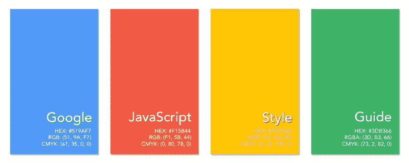

# 谷歌 JavaScript 风格指南中值得注意的 13 点

> 原文：<https://www.freecodecamp.org/news/google-publishes-a-javascript-style-guide-here-are-some-key-lessons-1810b8ad050b/>

丹尼尔·西蒙斯

# 谷歌 JavaScript 风格指南中值得注意的 13 点



对于那些还不熟悉的人来说， [Google 发布了一个编写 JavaScript 的风格指南](https://google.github.io/styleguide/jsguide.html)，列出了(Google 认为是)编写干净易懂代码的最佳风格实践。

这些并不是编写有效 JavaScript 的硬性规则，只是为了在整个源文件中保持一致和吸引人的风格选择。这对于 JavaScript 来说尤其有趣，它是一种灵活、宽容的语言，允许多种多样的风格选择。

谷歌和 Airbnb 有两个最受欢迎的风格指南。如果你花很多时间写 JS，我绝对推荐你把它们都看看。

以下是谷歌 JS 风格指南中我认为最有趣和最相关的 13 条规则。

它们处理各种问题，从激烈争论的问题(制表符和空格，以及分号应该如何使用的争议问题)，到一些令我惊讶的更模糊的规范。他们肯定会改变我今后写 JS 的方式。

对于每一条规则，我都会给出一个规范的概要，后面是一段来自风格指南的支持性引文，详细描述了这条规则。在适用的地方，我还将提供一个这种风格在实践中的例子，并将它与不遵循规则的代码进行对比。

#### 使用空格，而不是制表符

> 除了行结束符序列，ASCII 水平空格字符(0x20)是唯一出现在源文件中的空白字符。这意味着…制表符是用于缩进的**而不是**。

指南后来规定你应该使用两个空格(而不是四个)来缩进。

```
// badfunction foo() {∙∙∙∙let name;}// badfunction bar() {∙let name;}// goodfunction baz() {∙∙let name;}
```

#### 分号是必需的

> 每条语句都必须以分号结束。禁止依赖自动分号插入。

尽管我无法想象为什么有人反对这个想法，但在 JS 中一致使用分号正在成为新的“空格还是制表符”的争论。谷歌坚定地站出来捍卫分号。

```
// badlet luke = {}let leia = {}[luke, leia].forEach(jedi => jedi.father = 'vader')
```

```
// goodlet luke = {};let leia = {};[luke, leia].forEach((jedi) => {  jedi.father = 'vader';});
```

#### 不要使用 ES6 模块(暂时)

> 暂时不要使用 ES6 模块(即`export`和`import`关键字)，因为它们的语义还没有最终确定。请注意，一旦语义完全标准化，我们将重新审视这个策略。

```
// Don't do this kind of thing yet:
```

```
//------ lib.js ------export function square(x) {    return x * x;}export function diag(x, y) {    return sqrt(square(x) + square(y));}//------ main.js ------import { square, diag } from 'lib';
```

#### 不鼓励(但不禁止)水平对齐

> 这种做法是允许的，但谷歌风格一般不鼓励这样做。甚至不要求*在已经使用的地方保持*水平对齐。

水平对齐是在代码中添加可变数量的额外空格的做法，以使某些标记出现在前面行中某些其他标记的正下方。

```
// bad{  tiny:   42,    longer: 435, };
```

```
// good{  tiny: 42,   longer: 435,};
```

#### 不要再用 var 了

> 用`*const*`或`*let*`声明所有局部变量。默认情况下使用 const，除非需要重新分配变量。不得使用`*var*`关键字。

我仍然看到有人在 StackOverflow 和其他地方的代码示例中使用`var`。我不知道是否有人会为此辩护，或者这只是一个旧习难改的例子。

```
// badvar example = 42;
```

```
// goodlet example = 42;
```

#### 箭头功能是首选

> 箭头函数提供了简洁的语法，并解决了许多与`*this*`相关的困难。优先选择箭头函数而不是`*function*`关键字，尤其是嵌套函数

老实说，我只是觉得箭头函数很棒，因为它们更简洁、更好看。原来它们还有一个非常重要的目的。

```
// bad[1, 2, 3].map(function (x) {  const y = x + 1;  return x * y;});// good[1, 2, 3].map((x) => {  const y = x + 1;  return x * y;});
```

#### 使用模板字符串而不是串联

> 在复杂的字符串连接中使用模板字符串(用`` ` ``分隔)，尤其是在涉及多个字符串文字的情况下。模板字符串可以跨多行。

```
// badfunction sayHi(name) {  return 'How are you, ' + name + '?';}// badfunction sayHi(name) {  return ['How are you, ', name, '?'].join();}// badfunction sayHi(name) {  return `How are you, ${ name }?`;}// goodfunction sayHi(name) {  return `How are you, ${name}?`;}
```

#### **不要对长字符串使用续行符**

> 不要在普通或模板字符串中使用*行继续符*(也就是说，用反斜杠结束字符串中的一行)。尽管 ES5 允许这样做，但如果斜杠后面有任何尾随空格，就会导致棘手的错误，而且对读者来说不太明显。

有趣的是，这是谷歌和 Airbnb 不同意的规则(这里是 Airbnb 的规范)。

虽然谷歌建议连接更长的字符串(如下所示)，但 Airbnb 的风格指南建议基本上什么都不做，让长字符串继续下去，只要他们需要。

```
// bad (sorry, this doesn't show up well on mobile)const longString = 'This is a very long string that \    far exceeds the 80 column limit. It unfortunately \    contains long stretches of spaces due to how the \    continued lines are indented.';
```

```
// goodconst longString = 'This is a very long string that ' +     'far exceeds the 80 column limit. It does not contain ' +     'long stretches of spaces since the concatenated ' +    'strings are cleaner.';
```

#### “for… of”是“for 循环”的首选类型

> 有了 ES6，这种语言现在有三种不同的`for`循环。所有都可以使用，尽管可能的话最好使用`for` - `of`回路。

如果你问我，这是一个奇怪的问题，但是我认为我应该把它包括进来，因为 Google 声明一个首选类型的`for`循环是非常有趣的。

我一直认为`for... in`循环更适合对象，而`for... of`更适合数组。“适合工作的合适工具”类型的情况。

虽然 Google 的规范并不一定与这个想法相矛盾，但是知道他们特别偏爱这个循环还是很有意思的。

#### 不要使用 eval()

> 不要使用`eval`或`Function(...string)`构造函数(代码加载器除外)。这些特性有潜在的危险，在 CSP 环境中根本不起作用。

`eval()`的 [MDN 页面](https://developer.mozilla.org/en-US/docs/Web/JavaScript/Reference/Global_Objects/eval)甚至有一个部分叫做“不要使用 eval！”

```
// badlet obj = { a: 20, b: 30 };let propName = getPropName();  // returns "a" or "b"eval( 'var result = obj.' + propName );
```

```
// goodlet obj = { a: 20, b: 30 };let propName = getPropName();  // returns "a" or "b"let result = obj[ propName ];  //  obj[ "a" ] is the same as obj.a
```

#### 常量应该全部用大写字母命名，并用下划线分隔

> 常量名使用`CONSTANT_CASE`:全大写字母，单词之间用下划线隔开。

如果你完全确定一个变量不应该改变，你可以通过大写常量的名字来表示。这使得常量的不变性显而易见，因为它会在整个代码中使用。

此规则的一个显著例外是常量是函数范围的。在这种情况下，应该用驼峰文字书写。

```
// badconst number = 5;
```

```
// goodconst NUMBER = 5;
```

#### 每个声明一个变量

> 每个局部变量声明只声明一个变量:不使用像`let a = 1, b = 2;`这样的声明。

```
// badlet a = 1, b = 2, c = 3;
```

```
// goodlet a = 1;let b = 2;let c = 3;
```

#### 使用单引号，不要使用双引号

> 普通字符串由单引号(`'`)分隔，而不是双引号(`"`)。

> 提示:如果一个字符串包含一个单引号字符，可以考虑使用一个模板字符串来避免对引号进行转义。

```
// badlet directive = "No identification of self or mission."
```

```
// badlet saying = 'Say it ain\u0027t so.';
```

```
// goodlet directive = 'No identification of self or mission.';
```

```
// goodlet saying = `Say it ain't so`;
```

#### 最后一点

正如我在开始时所说的，这些不是授权。谷歌只是众多科技巨头之一，这些也只是建议。

也就是说，看看像谷歌这样的公司提出的风格建议是很有趣的，谷歌雇佣了很多优秀的人，他们花了很多时间编写优秀的代码。

如果你想遵循“谷歌兼容源代码”的指导方针，你可以遵循这些规则——但是，当然，很多人不同意，你可以随意忽略这些。

我个人认为，在很多情况下，Airbnb 的规范比谷歌的更有吸引力。无论你对这些特殊的规则持什么样的立场，在编写任何类型的代码时，记住风格的一致性仍然是很重要的。