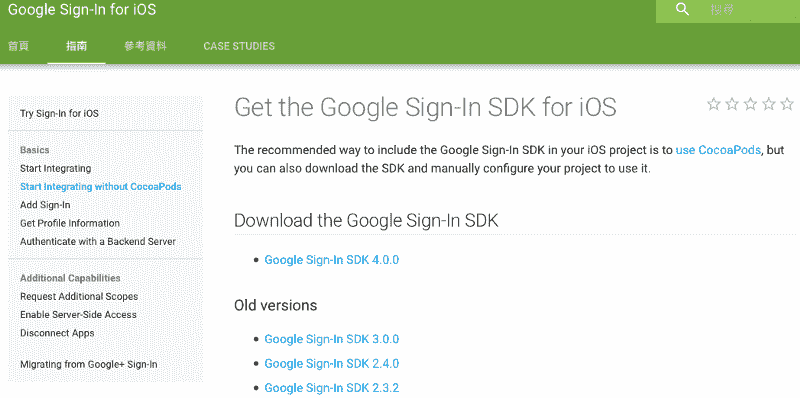
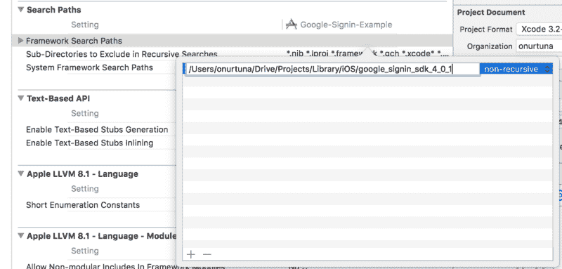
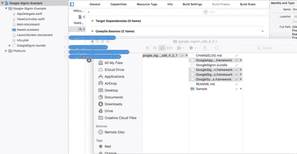
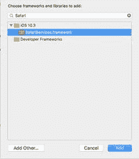
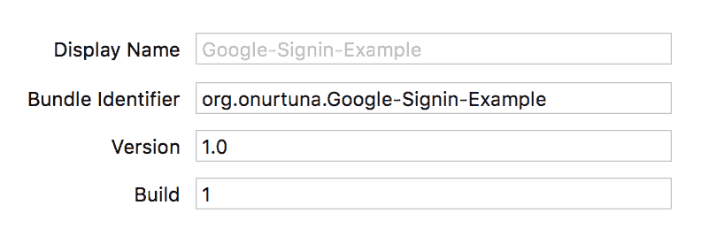
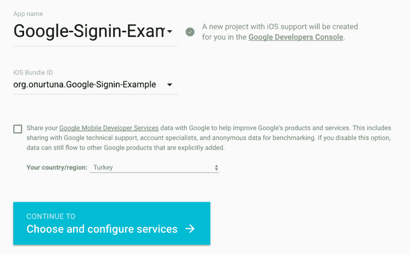
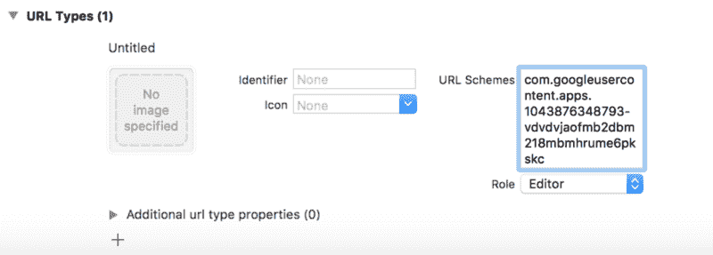

# 如何用 Swift for iOS 在 SDK 中设置 Google Sign

> 原文：<https://www.freecodecamp.org/news/google-sign-in-sdk-with-swift-for-ios-914316e0ade8/>

由 Onur 金枪鱼

# 如何用 Swift for iOS 在 SDK 中设置 Google Sign

这篇文章更清晰地解释了谷歌开发者教程中的实现。谷歌教程推荐你使用 pod，然而，我不喜欢使用 pod——我想要更多的自由。因此，本教程手动安装和设置 SDK。

Google 教程用 Objective-C 编写了他们的示例项目，在这篇文章的最后，你可以找到一个用 Swift 编写的示例项目。

#### **让我们开始**

现在我们将从[谷歌开发者](https://developers.google.com/identity/sign-in/ios/sdk/)页面安装最新的 SDK。在本教程中，SDK 版本是 4.0.1。您可以使用任何版本，但我建议使用最新版本。

当您下载 SDK 时，您将看到以下文件和文件夹:

*   CHANGELOG.md
*   GoogleAppUtilities.framework
*   GoogleSignIn.bundle
*   GoogleSignIn.framework
*   Google sign independencies . framework
*   Google symbolutilities . framework
*   README.md
*   示例:这是一个用 Objective-C 编写的示例项目。

现在使用 Xcode 创建一个项目。我们将把所有必要的框架连接到它上面。将位于 SDK 文件夹中的框架放在您想要的任何地方。我更喜欢将所有的库收集在我的主*项目*文件夹下的一个名为*库*的文件夹中。

打开你的项目并进入*构建设置*。输入框架所在的路径。

接下来，通过拖放到项目中来复制 GoogleSignIn.bundle 文件。你也必须拖放框架，但不要复制它们。

我们还需要两个框架: *Safari 服务*和*系统配置*。苹果提供了它们。你可以在*构建阶段>用 Librar*ie 链接它们。

在这一部分中，您应该做的最后一件事是添加一个链接器标志。在*构建设置中添加下面的旗帜*&g*t；其他链接器 Fl*ag:

> *$(OTHER_LDFLAGS) -ObjC*

#### **配置文件**

是时候为您的项目获取配置文件了。你应该在谷歌开发者页面启动一个应用。但是，您不会复制配置文件。相反，把它放在任何地方——其中的一些信息以后可能会用到。

进入[页面](https://developers.google.com/mobile/add?platform=ios&cntapi=signin&cnturl=https:%2F%2Fdevelopers.google.com%2Fidentity%2Fsign-in%2Fios%2Fsign-in%3Fconfigured%3Dtrue&cntlbl=Continue%20Adding%20Sign-In)创建项目。

选择一个应用程序名称，并给出您可以在 Xcode 中的 *General* 下找到的捆绑包标识符。在下一页中，您将通过点击*启用登录*按钮来为您的应用启用登录。完成所有这些之后，下载 *GoogleService-Info.plist* 文件。你想把它放在哪里都行。

回到你的 Xcode 项目。在您刚刚下载的 plist 文件中找到您的反向客户端 id。粘贴到*信息> URL 类型* es。

#### **将 Google 登录添加到应用程序**

Google Sign In SDK 是一个 Objective-C 库，因此您需要一个桥接头来将其绑定到您的 Swift 项目。您可以手动创建桥接标头。但是，您也可以让 Xcode 自动完成这项工作。

创建新的。m 文件使用了一个假名。它将要求您创建一个桥接头—说是。移除。m 档，不需要。在桥接头中导入 Google Sign In。

> #导入" GoogleSignIn/GoogleSignIn.h "

现在，转到名为 *AppDelegate.swift* 的应用程序委托文件。您的应用程序委托应该如下所示。

看起来代码很多。然而，当您创建一个新项目时，它的大部分是默认编写的。

让我解释一下这些变化。您的类 AppDelegate 现在实现了 *GIDSignInDelegate* 协议。为了确认委托，我们实现了一些方法:*应用程序:openURL:选项:*和*登录:登录:didSignInForUser:withError:* 。我们还在*应用程序中配置了 GIDSignIn 对象:didFinishLaunchingWithOptions:*方法。其他的都不重要。

一个重要的问题是，您应该在*应用程序中粘贴您的客户端 id:difinishlaunchingwithoptions:*方法。您可以在我们下载的 *plist* 文件中找到您的客户 id。

#### **签到按钮**

我们可以添加一个按钮，看着我们的应用程序工作。转到您的 *ViewController.swift* 。最终的代码应该如下所示:

只添加了一行代码。但是，注意我们的类实现了 *GIDSignInUIDelegate* 协议。我们需要一个按钮让用户点击。去你的故事板，在上面放一个观点。拖放一个 *UIView* 。将 *GIDSignInButton* 设为基类，就大功告成了。

现在运行应用程序并登录。您已经完成了基本操作。从现在起，您可以在您的应用程序中使用谷歌登录。万一你有任何问题，不要犹豫与我联系。

**示例代码**

[**onurtuna/Google-Sign in-Example**](https://github.com/onurtuna/Google-Signin-Example)
[*Google-Sign in-Example-Google Sign in Example 使用 Swift 3*github.com](https://github.com/onurtuna/Google-Signin-Example)