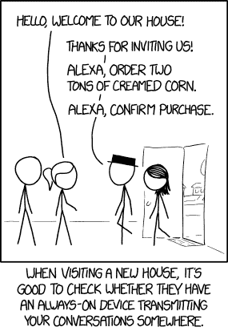
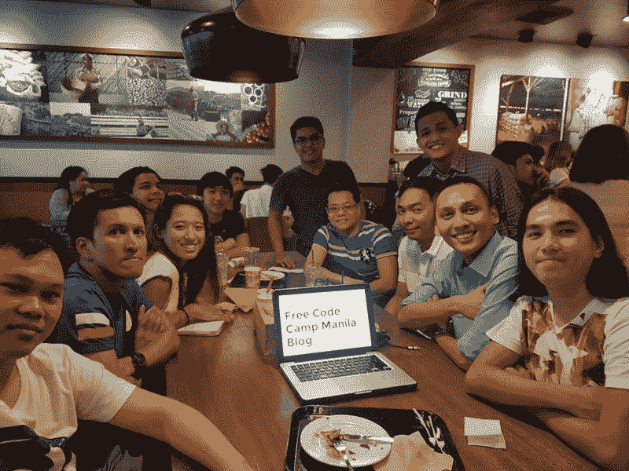

# 谷歌的深度学习人工智能项目诊断癌症的速度比病理学家还要快

> 原文：<https://www.freecodecamp.org/news/googles-deep-learning-ai-project-diagnoses-cancer-faster-than-pathologists-7f8bd1ffaca4/>

这里有三个值得你花时间的链接:

1.  谷歌的深度学习人工智能项目诊断癌症的速度比病理学家更快，准确率为 89%(相比之下，研究中的人类医生准确率为 73%)([2 分钟读数](http://bit.ly/2lw3Rsd))
2.  没有预算？没有借口。廉价的可靠用户体验设计实用指南( [10 分钟阅读](http://bit.ly/2mMClqR))
3.  使用混凝土 3D 打印一个小房子，然后为其布线——全部在 24 小时内完成，价格约为 10，000 美元( [7 分钟观察](http://bit.ly/2n61qcc)

### 想到这一天:

> "大多数人花更多的时间和精力去回避问题，而不是去解决问题。"—亨利·福特

### 今日趣事:

网络漫画作者 [XKCD](http://bit.ly/2lw1khI)

### 今日学习小组:

[马尼拉自由代码营](http://bit.ly/2mWVMtO)

编码快乐！

–昆西·拉森，自由代码营的老师