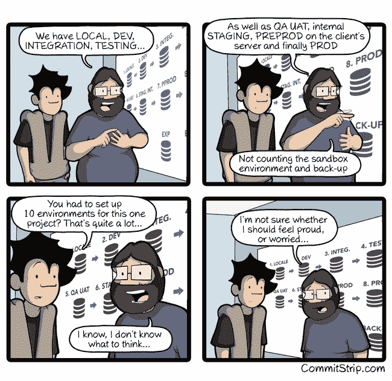

# 谷歌的整个代码库是一个包含 20 亿行代码的仓库

> 原文：<https://www.freecodecamp.org/news/googles-entire-codebase-is-a-single-repository-of-2-billion-lines-of-code-ececf7354188/>

这里有三个值得你花时间的链接:

1.  谷歌如何在 20 亿行代码的基础上构建网络框架
2.  如何只用一个 JSON 标记构建跨平台的移动应用( [9 分钟阅读](http://bit.ly/2l7zxDv))
3.  我采访了已经做了 20 年软件工程师的 Bill Sourour，他谈到了保持你的技能相关性和避免精疲力尽的问题

### 想到这一天:

> “互联网？那东西还在吗？”—荷马·辛普森

### 今日趣事:

网络漫画作者[提交漫画](http://www.commitstrip.com/en/2017/02/10/proud-or-worried/?)

### 今日学习小组:

多伦多自由代码营

编码快乐！

–昆西·拉森，自由代码营的老师