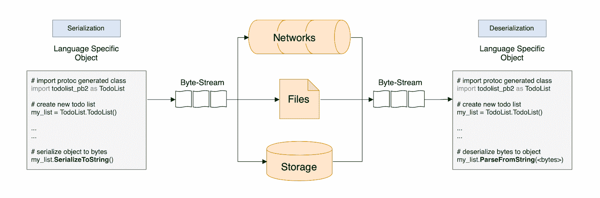
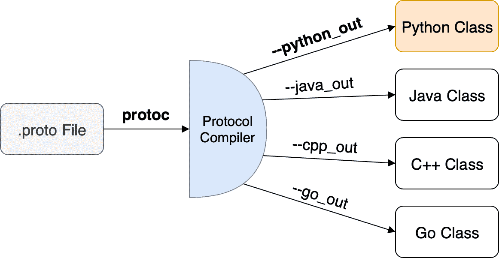

# 如何在 Python 中使用 Google 的协议缓冲区

> 原文：<https://www.freecodecamp.org/news/googles-protocol-buffers-in-python/>

当说不同语言的人聚在一起交谈时，他们会尽量使用群体中每个人都能理解的语言。

要做到这一点，每个人都必须把他们通常用母语表达的想法翻译成群体的语言。然而，这种语言的“编码和解码”导致了效率、速度和精确度的损失。

同样的概念也存在于计算机系统及其组件中。如果我们不需要直接理解他们在谈论什么，我们为什么要以 XML、JSON 或任何其他人类可读的格式发送数据呢？只要我们仍然可以把它翻译成人类可读的格式，如果明确需要的话。

协议缓冲区是一种在传输前对数据进行编码的方式，它可以有效地缩小数据块，从而提高发送速度。它将数据抽象成一种语言和平台中立的格式。

### 目录

*   为什么我们需要协议缓冲区？
*   什么是协议缓冲区，它们是如何工作的？
*   [Python 中的协议缓冲区](#python-and-protocol-buffers)
*   [期末笔记](#final-notes)

## 为什么是协议缓冲区？

协议缓冲区的最初目的是简化请求/响应协议的工作。在 ProtoBuf 之前，Google 使用了一种不同的格式，这种格式需要对发送的消息进行额外的处理[编组](https://en.wikipedia.org/wiki/Marshalling_(computer_science))。

除此之外，以前格式的新版本要求开发人员在替换旧版本之前确保新版本被理解，这使得使用起来很麻烦。

这种开销促使谷歌设计了一个界面来解决这些问题。

ProtoBuf 允许在不破坏兼容性的情况下对协议进行修改。此外，服务器可以传递数据并对数据执行读取操作，而无需修改其内容。

由于这种格式有点自描述性，ProtoBuf 被用作序列化器和反序列化器自动生成代码的基础。

另一个有趣的用例是 Google 如何将它用于短期的[远程过程调用](https://searchapparchitecture.techtarget.com/definition/Remote-Procedure-Call-RPC) (RPC)以及在 Bigtable 中持久存储数据。由于其特定的用例，他们将 RPC 接口集成到 ProtoBuf 中。这允许快速和直接的代码存根生成，可以用作实际实现的起点。(更多关于 [ProtoBuf RPC](https://medium.com/@EmperorRXF/evaluating-performance-of-rest-vs-grpc-1b8bdf0b22da) 。)

ProtoBuf 可以发挥作用的其他例子是通过移动网络连接的物联网设备，在这些设备中，发送的数据量必须保持较小，或者在高带宽仍然罕见的国家中的应用程序。以优化的二进制格式发送有效载荷会导致运营成本和速度的显著差异。

在您的 HTTPS 交流中使用`gzip`压缩可以进一步提高这些指标。

## 什么是协议缓冲区，它们是如何工作的？

一般来说，协议缓冲区是结构化数据序列化的定义接口。它定义了一种标准化的交流方式，完全独立于语言和平台。

谷歌是这样宣传它的 ProtoBuf 的:

> 协议缓冲区是 Google 的语言中立、平台中立、可扩展的机制，用于序列化结构化数据——想想 XML，但是更小、更快、更简单。您可以一次性定义您想要的数据结构……

ProtoBuf 接口描述了要发送的数据的结构。在所谓的原型文件中，有效载荷结构被定义为“消息”。那些文件总是以`.proto` 扩展名结尾。

例如，一个 **todolist.proto** 文件的基本结构看起来是这样的。在下一节中，我们还将看一个完整的例子。

```
syntax = "proto3";

// Not necessary for Python, should still be declared to avoid name collisions 
// in the Protocol Buffers namespace and non-Python languages
package protoblog;

message TodoList {
   // Elements of the todo list will be defined here
   ...
}
```

然后，使用 protoc 编译器中的代码生成器，使用这些文件为您选择的语言生成集成类或存根。目前的版本 Proto3 已经支持所有主要的编程语言。社区支持更多的第三方开源实现。

生成的类是协议缓冲区的核心元素。它们允许基于`.proto`文件通过实例化新消息来创建元素，然后用于序列化。在下一节中，我们将详细讨论如何用 Python 实现这一点。

独立于序列化语言，消息被序列化为非自描述的二进制格式，如果没有初始的结构定义，这种格式是毫无用处的。

然后可以存储二进制数据，通过网络发送，并以任何其他方式使用人类可读的数据，如 JSON 或 XML。在传输或存储之后，字节流可以被反序列化，并使用我们从。原型文件。

以 Python 为例，这个过程可能是这样的:



首先，我们创建一个新的 todo 列表，并用一些任务填充它。然后，该待办事项列表被序列化并通过网络发送，保存在文件中，或永久存储在数据库中。

发送的字节流使用特定于语言的编译类的 parse 方法进行反序列化。

目前大多数架构和基础设施，尤其是微服务，都是基于 REST、WebSockets 或者 GraphQL 通信。然而，当速度和效率至关重要时，低级 RPC 可以产生巨大的差异。

代替高开销的协议，我们可以使用一种快速和紧凑的方式将不同实体之间的数据移动到我们的服务中，而不会浪费很多资源。

### 但是为什么还没有到处使用呢？

协议缓冲区比其他人类可读的格式要复杂一些。这使得它们更难调试和集成到您的应用程序中。

工程中的迭代次数也会增加，因为数据更新需要在使用前更新原型文件。

由于 ProtoBuf 在许多情况下可能是一个过度设计的解决方案，因此必须进行仔细的考虑。

### 我有什么选择？

几个项目采用了类似于 Google 协议缓冲区的方法。

Google 的 Flatbuffers 和第三方实现，称为 T2 Cap ' n Proto T3，更侧重于删除解析和解包步骤，这是使用 ProtoBufs 访问实际数据所必需的。它们专为性能关键的应用程序而设计，比 ProtoBuf 更快，内存效率更高。

当关注 ProtoBuf(与 gRPC 一起使用)的 RPC 功能时，其他大公司如脸书(Apache Thrift)或微软(Bond protocols)的项目可以提供替代方案。

## Python 和协议缓冲区

Python 已经提供了一些使用 pickling 的数据持久化方法。Pickling 在只有 Python 的应用程序中很有用。它不太适合涉及与其他语言共享数据或更改模式的更复杂的场景。

相反，协议缓冲区正是为那些场景开发的。
我们之前快速介绍过的`.proto`文件允许用户为许多支持的语言生成代码。

为了将`.proto` 文件编译成我们选择的语言类，我们使用**protocol，**proto 编译器。

如果你还没有安装协议编译器，有很好的指南教你怎么做:

*   [MacOS / Linux](http://google.github.io/proto-lens/installing-protoc.html)
*   [窗户](https://github.com/protocolbuffers/protobuf/blob/master/src/README.md#c-installation---windows)

一旦我们在系统上安装了 protocol，我们就可以使用之前的 todo 列表结构的扩展示例，并从中生成 Python 集成类。

```
syntax = "proto3";

// Not necessary for Python but should still be declared to avoid name collisions 
// in the Protocol Buffers namespace and non-Python languages
package protoblog;

// Style guide prefers prefixing enum values instead of surrounding
// with an enclosing message
enum TaskState {
    TASK_OPEN = 0;
    TASK_IN_PROGRESS = 1;
    TASK_POST_PONED = 2;
    TASK_CLOSED = 3;
    TASK_DONE = 4;
}

message TodoList {
    int32 owner_id = 1;
    string owner_name = 2;

    message ListItems {
        TaskState state = 1;
        string task = 2;
        string due_date = 3;
    }

    repeated ListItems todos = 3;
} 
```

让我们更详细地看看`.proto`文件的结构来理解它。在 proto 文件的第一行，我们定义了是使用 Proto2 还是 proto 3。在这种情况下，我们使用的是[原型 3](https://developers.google.com/protocol-buffers/docs/proto3) 。

proto 文件中最不常见的元素是分配给每个消息实体的数字。这些专用编号使每个属性都是唯一的，用于在二进制编码的输出中标识分配的字段。

需要掌握的一个重要概念是，只有值 1-15 用少一个字节(十六进制)进行编码，理解这一点很有用，这样我们就可以将较大的数字分配给不常用的实体。这些数字既没有定义****编码**的顺序，也没有定义给定属性在编码消息中的位置**。****

****包定义有助于防止名称冲突。在 Python 中，包是由它们的目录定义的。因此，提供包属性对生成的 Python 代码没有任何影响。****

****请注意，仍然应该声明这一点，以避免协议缓冲区相关的名称冲突，并适用于其他语言，如 Java。****

****枚举是给定变量可能值的简单列表。在这种情况下，我们为待办事项列表中每个任务的可能状态定义一个枚举。
当我们查看 Python 中的用法时，我们将会看到如何使用它们。

正如我们在例子中看到的，我们也可以在消息中嵌套消息。
例如，如果我们想要一个与给定 todo 列表相关联的 todo 列表，我们可以使用**重复的**关键字，这相当于动态大小的数组。****

****为了生成可用的集成代码，我们使用 proto 编译器来编译给定的。proto 文件转换成特定于语言的集成类。在我们的例子中，我们使用 **- python-out** 参数来生成特定于 python 的代码。****

****`protoc -I=. --python_out=. ./todolist.proto`****

****在终端中，我们用三个参数调用协议编译器:****

1.  ******-I** :定义我们搜索任何依赖项的目录(我们使用。也就是当前目录)****
2.  ******- python_out** :定义我们想要生成 python 集成类的位置(我们再次使用**)。**当前目录)****
3.  ****最后一个**未命名参数**定义了。将要编译的 proto 文件(我们使用当前目录中的 todolist.proto 文件)****

********

****这将创建一个名为<name _ of _ proto _ file>_ Pb2 . py 的新 Python 文件。在我们的例子中，它是 todolist_pb2.py。当仔细查看这个文件时，我们无法立即了解它的结构。****

****这是因为生成器不产生直接的数据访问元素，而是使用[元类](https://stackoverflow.com/questions/100003/what-are-metaclasses-in-python)和每个属性的描述符进一步抽象出复杂性。它们描述了一个类的行为，而不是该类的每个实例。

更令人兴奋的部分是如何使用这些生成的代码来创建、构建和序列化数据。下面是我们最近生成的类的简单集成:****

```
**`import todolist_pb2 as TodoList

my_list = TodoList.TodoList()
my_list.owner_id = 1234
my_list.owner_name = "Tim"

first_item = my_list.todos.add()
first_item.state = TodoList.TaskState.Value("TASK_DONE")
first_item.task = "Test ProtoBuf for Python"
first_item.due_date = "31.10.2019"

print(my_list)`**
```

****它只是创建一个新的 todo 列表，并向其中添加一个条目。然后我们打印 todo 列表元素本身，可以看到我们刚刚在脚本中定义的数据的非二进制、非序列化版本。****

```
**`owner_id: 1234
owner_name: "Tim"
todos {
  state: TASK_DONE
  task: "Test ProtoBuf for Python"
  due_date: "31.10.2019"
}`**
```

****每个协议缓冲区类都有使用[协议缓冲区特定编码](https://developers.google.com/protocol-buffers/docs/encoding)来读写消息的方法，该编码将消息编码成二进制格式。
这两种方法分别是`SerializeToString()`和`ParseFromString()`。****

```
**`import todolist_pb2 as TodoList

my_list = TodoList.TodoList()
my_list.owner_id = 1234

# ...

with open("./serializedFile", "wb") as fd:
    fd.write(my_list.SerializeToString())

my_list = TodoList.TodoList()
with open("./serializedFile", "rb") as fd:
    my_list.ParseFromString(fd.read())

print(my_list)`**
```

****在上面的代码示例中，我们使用 **wb** 标志将序列化的字节字符串写入文件。****

****因为我们已经编写了文件，所以我们可以读回内容并使用 ParseFromString 解析它。ParseFromString 使用 **rb** 标志调用序列化类的新实例并解析它。****

****如果我们序列化这个消息并在控制台中打印它，我们将得到如下所示的字节表示。****

****`b'\x08\xd2\t\x12\x03Tim\x1a(\x08\x04\x12\x18Test ProtoBuf for Python\x1a\n31.10.2019'`****

****注意引号前面的 b。这表明下面的字符串是由 Python 中的八位字节组成的。****

****如果我们直接将其与 XML 进行比较，我们可以看到 ProtoBuf 序列化对大小的影响。****

```
**`<todolist>
	<owner_id>1234</owner_id>
	<owner_name>Tim</owner_name>
	<todos>
		<todo>
			<state>TASK_DONE</state>
			<task>Test ProtoBuf for Python</task>
			<due_date>31.10.2019</due_date>
		</todo>
	</todos>
</todolist>`**
```

****未经修饰的 JSON 表示如下所示。****

```
**`{
	"todoList": {
		"ownerId": "1234",
		"ownerName": "Tim",
		"todos": [
			{
				"state": "TASK_DONE",
				"task": "Test ProtoBuf for Python",
				"dueDate": "31.10.2019"
			}
		] 
	}
}`**
```

****只通过使用的总字节数来判断不同的格式，忽略格式化它的开销所需要的内存，我们当然能看出区别。

但是除了用于数据的内存，我们在 ProtoBuf 中还有 **12 个额外的字节用于格式化序列化数据。与 XML 相比，XML 中有 **171 个额外字节**用于格式化序列化数据。******

**如果没有 Schema，我们需要 JSON 中的 **136 个额外字节用于格式化序列化数据**。******

**如果我们谈论的是通过网络发送或存储在磁盘上的数千条消息，ProtoBuf 可以发挥作用。**

**然而，有一个问题。平台 Auth0.com 在 ProtoBuf 和 JSON 之间创建了一个广泛的比较。它表明，当压缩时，两者之间的大小差异可以很小(只有 9%左右)。**

**如果你对确切的数字感兴趣，请参考[全文](https://auth0.com/blog/beating-json-performance-with-protobuf/)，其中给出了对大小和速度等几个因素的详细分析。**

**一个有趣的附带说明是，每种数据类型都有一个默认值。如果未分配或更改属性，它们将保持默认值。在我们的例子中，如果我们不改变 ListItem 的 TaskState，默认情况下它的状态是“TASK_OPEN”。这样做的显著优点是未设置的值不会被序列化，从而节省了额外的空间。**

**例如，如果我们将任务的状态从 TASK_DONE 更改为 TASK_OPEN，它将不会被序列化。**

```
`owner_id: 1234
owner_name: "Tim"
todos {
  task: "Test ProtoBuf for Python"
  due_date: "31.10.2019"
}`
```

**`b'\x08\xd2\t\x12\x03Tim\x1a&\x12\x18Test ProtoBuf for Python\x1a\n31.10.2019'`**

## **最终注释**

**正如我们所见，在处理数据时，协议缓冲区在速度和效率方面非常方便。由于其强大的特性，即使定义新消息的语法很简单，也需要一些时间来适应 ProtoBuf 系统。**

**最后，我想指出，关于协议缓冲区对常规应用程序是否“有用”的讨论正在进行。它们是为谷歌考虑的问题而开发的。

如果您有任何问题或反馈，请随时在任何社交媒体上联系我，如[推特](https://twitter.com/timigrossmann)或[电子邮件](mailto:contact.timgrossmann@gmail.com):)**