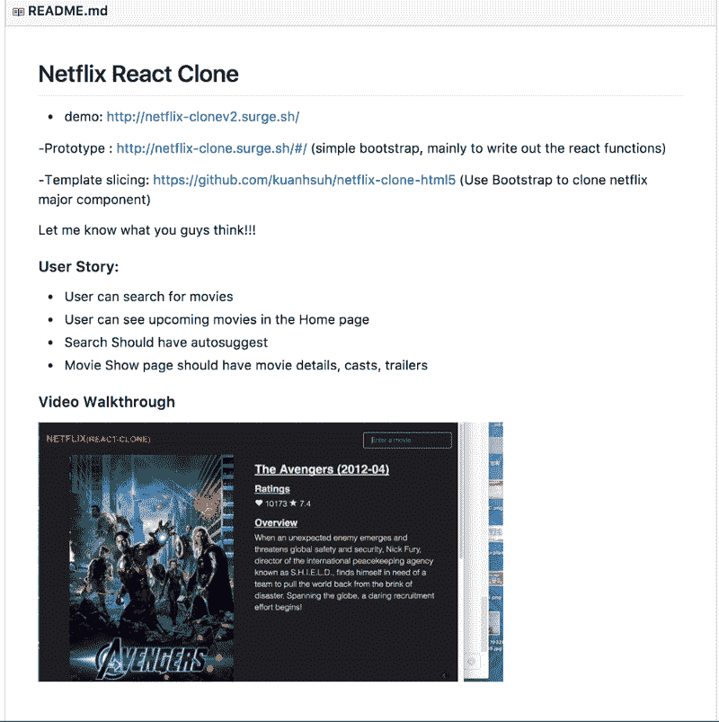
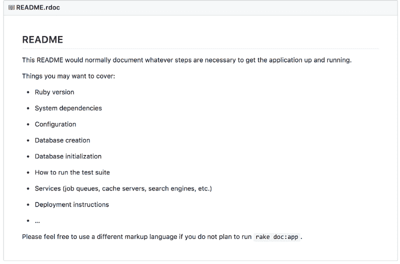
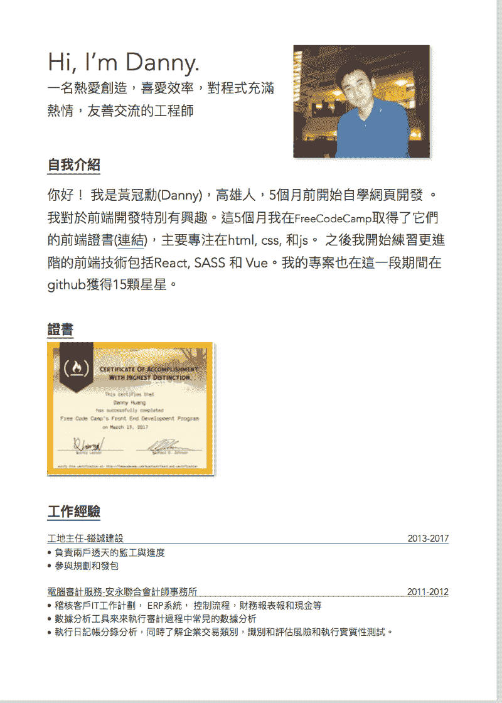

# 我如何在#100DaysOfCode 挑战赛中获得一份 React 开发人员的工作

> 原文：<https://www.freecodecamp.org/news/got-a-react-developer-job-during-my-100dayscodechallenge-f455175d3776/>

丹尼·黄

# 我如何在#100DaysOfCode 挑战赛中获得一份 React 开发人员的工作

Kaohsiung city — my hometown

### 背景

从大学开始，编程就是我想学的东西，但我觉得自己不够聪明。当我面对一个 bug 或问题时，我会放弃，认为编码不适合我。

即使我在大学时通过了 cs101，但我觉得我仍然不知道如何编码。2016 年，我在玩 Ruby on Rails，但再次放弃了，因为我没有取得进展。现在回过头来看，直接进入全栈框架并不是一个明智的选择。

我决定接受#100DaysOfCode 挑战，因为我后悔不知道如何编码。每当我看到一个帖子说有人通过学习如何编码找到了工作，我就想做同样的事情。我从 Medium 上的一个 freeCodeCamp 帖子中读到了#100DaysOfCode 挑战赛，并决定参加。最坏的情况是，我只会在 [#100DaysOfCode](https://twitter.com/intent/tweet?text=I%27m%20publicly%20committing%20to%20the%20100DaysOfCode%20Challenge%20starting%20July%2017,%202017.%20Join%20me!&url=https://medium.com/@ka11away/the-100daysofcode-movement-rounds-resistance-and-adaptation-432429cc3306&hashtags=100DaysOfCode) 挑战上浪费 100 天，我想。然而，这一次，我至少在 100 天内不会放弃。

我最初的计划是尝试 100 天。最终结果比我想象的要好得多。现在我很自信，我可以学习任何技术或语言。

另外，我今年 31 岁，最近有了第二个孩子。

这是我，我的女儿，和我胖乎乎的儿子。

Me, my daughter, and my chubby son.

### 目标

每天至少编码 1 小时。(对，就是这样！保持简单。)

### 挑战期间的成就

我在 [#100DaysOfCode 挑战赛](https://twitter.com/intent/tweet?text=I%27m%20publicly%20committing%20to%20the%20100DaysOfCode%20Challenge%20starting%20July%2017,%202017.%20Join%20me!&url=https://medium.com/@ka11away/the-100daysofcode-movement-rounds-resistance-and-adaptation-432429cc3306&hashtags=100DaysOfCode)中完成了以下任务:

收到我的 [freeCodeCamp 前端证书](https://www.freecodecamp.com/kuanhsuh/front-end-certification)

在我的博客上写了 34 篇博文

在我的 GitHub 上收到 15 颗 GitHub 星

排名第五的[Codewars.com](http://www.codewars.com/)与[我的 Codewar 简介](https://www.codewars.com/users/kuanhsuh)

收到两份工作邀请

### 我的编码时间表

第 1 天到第 30 天，我通过教程和阅读来工作

第 36 天我完成了 freeCampCode 前端证书

第 45 天我完成了 React Markdown 应用程序

第 48 天我完成了 React+Redux 配方+盒子应用程序

第 50 到 60 天我和 D3 一起玩

第 60 天到第 75 天，我为 HTML/CSS、Gulp 和 web 优化创建了模板

第 83 天我完成了我的网飞克隆

第 85 天到第 95 天，我为工作面试做准备

第 97 天我收到了第一份工作邀请

### 我遇到的技术

HTML，CSS，ES5，ES6，SCS，Gulp，React，vue，D3

### 我每天的编码时间表

我每天练习编码大约 2 到 4 个小时。

我了解到，在 4 个小时的编码后，我的大脑不再能够很好地集中注意力。

在业余时间，我看 YouTube 视频，读 Medium 帖子，或者听关于编码的播客。

我写日志来跟踪我的记录，这样我可以回顾我的进步。(要看我的日志，[点这里](https://kuanhsuh.github.io/tags/100DaysCodeChallenge/)。)

### 劈

#### 缩小你的研究领域

在挑战开始的时候，我在学习 Ruby on Rails 和 JavaScript。我很快意识到在 100 天内学会前端和后端编程是不可行的。所以我决定只关注前端。擅长一件事总比什么都不擅长好。

#### 让你的 GitHub 项目更有吸引力

你已经花了几个小时在你的兼职项目上，所以再花几分钟写你的 GitHub 自述文件。我为我的项目处理了我的 GitHub 自述文件，以确保它们看起来不错。我总是包括用户故事、视频演示和演示链接，以便让我的观众更容易浏览和理解我的回购协议。点击这里查看我的 GitHub。

这是我的一个项目的 GitHub 回购。

*One of my Github Repo.*

这是一个普通的 GitHub 的样子。

*Yeah, good luck getting people to look at your code.*

#### 在社交媒体上分享您的项目

你想这么做有两个原因。首先，你想得到对你的项目的反馈，这样你就可以改进它们。第二，你想获得曝光率。在编码挑战期间，我在我的本地前端脸书小组(分别是[高雄前端开发人员和台湾前端开发人员](https://www.facebook.com/Front-End-Developers-Taiwan-1631625207071478/?fref=ts))上分享了我的项目。在社交媒体上分享我的项目一两个月后，当我参加当地的编码会议时，人们认出了我，并告诉我他们在网上看到了我的工作。此外，在我的 4 次面试中，有 3 次面试官已经看到了我的作品。

#### 不要提交传统的简历

我决定让我的简历看起来不一样。与传统的单页简历相比，我的简历更加直观，也更容易阅读。我想我必须让我的简历脱颖而出，这样我才能和更有经验的开发人员竞争。这个策略非常有效。

这是一份传统的简历。

Boring…

这是我的简历。

It’s in Chinese, but you know what I mean.

### 临终遗言

#### 让编码成为一种习惯

每天编码一点比偶尔编码一次更有效。最好的例子是詹妮弗·德瓦尔特，她在 180 天内创建了 180 个网站。我相信她找开发人员的工作没问题。此外，当你把编码作为日常工作的一部分时，你就建立了动力。最终，编码会变得更容易。

#### 推销自己

参加当地的编码小组，活跃在社交媒体上，在各种编码论坛或小组上分享你的项目。尽可能多的争取 GitHub 明星。在我的挑战结束时，我获得了大约 30 名 GitHub 追随者和 15 颗 GitHub 星。

#### 不要放弃

继续编码吧。如果你坚持不懈，你最终会有“顿悟”的时刻，我向你保证，之后事情会变得更容易。

希望这篇文章对你有所帮助。我祝你在成为一名开发者的过程中一切顺利！ [#100DaysOfCode 挑战](https://twitter.com/intent/tweet?text=I%27m%20publicly%20committing%20to%20the%20100DaysOfCode%20Challenge%20starting%20July%2017,%202017.%20Join%20me!&url=https://medium.com/@ka11away/the-100daysofcode-movement-rounds-resistance-and-adaptation-432429cc3306&hashtags=100DaysOfCode)。

**如果你有兴趣学习前端开发，这里有我推荐的课程:**

[初学者]CSS:用 HTML5 和 CSS3([http://bit.ly/beginnercss](http://bit.ly/beginnercss))构建反应灵敏的真实世界网站

[高级]高级 CSS 和 Sass:让你的 CSS 更上一层楼([http://bit.ly/advancedcss](http://bit.ly/advancedcss))

【所有关卡】现代 JavaScript 从头开始([http://bit.ly/modernjavascript](http://bit.ly/modernjavascript))

[高级]JavaScript:理解奇怪的部分([http://bit.ly/weirdpartsjs](http://bit.ly/weirdpartsjs)

仅优惠价 10 美元-所有课程均适用:([http://bit.ly/udemy10limited](http://bit.ly/udemy10limited))

**首先点击折扣，然后点击推荐课程获得折扣* *