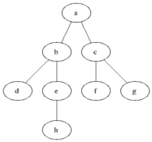

# 用 Java 和 C++例子解释图形算法和数据结构

> 原文：<https://www.freecodecamp.org/news/graph-algorithms-and-data-structures-explained-with-java-and-c-examples/>

## 什么是图算法？

图算法是一组遍历(访问节点)图的指令。

一些算法用于寻找特定的节点或两个给定节点之间的路径。

### 为什么图形算法很重要

图是非常有用的数据结构，可以用来模拟各种问题。这些算法直接应用于社交网站、状态机建模等等。

### 一些常见的图形算法

一些最常见的图形算法有:

*   广度优先搜索(BFS)
*   深度优先搜索
*   迪克斯特拉
*   弗洛伊德-沃肖尔算法

## 贝尔曼·福特算法

贝尔曼·福特的算法是一种最短路径查找算法，用于可以具有负权重的图。Bellman ford 的算法也非常适合检测负权重循环，因为该算法在 O(V*E)步内收敛到最优解。如果结果不是最佳的，则图形包含负权重循环。

以下是 Python 中的一个实现:

```
infinity = 1e10

def bellman_ford(graph, start, end):
    num_vertices = graph.get_num_vertices()
    edges = graph.get_edges()

    distance = [infinity for vertex in range(num_vertices)]
    previous = [None for vertex in range(num_vertices)]

    distance[start] = 0
    for i range(end+1):
        for (u, v) in edges:
            if distance[v] > distance[u] + graph.get_weight(u, v):
                distance[v] = distance[u] + graph.get_weight(u, v)
                previous[v] = u

    for (u,v) in edges:
        if distance[v] > distance[u] + graph.get_weight(u, v):
            raise NegativeWeightCycleError()
    return distance, previous
# 'distance' is the distance from start to that node in the shortest path, useful for printing the shortest distance.
# Previous is an array that tells the node that comes previous to current, useful for printing out the path. 
```

## 深度优先搜索

深度优先搜索是最简单的图形算法之一。它遍历图，首先检查当前节点，然后移动到它的一个后继节点，重复这个过程。如果当前节点没有要检查的后继者，我们返回到它的前任，过程继续(通过移动到另一个后继者)。如果找到了答案，搜索就停止了。

### (英)可视化(= visualization)


### 实现(C++14)

```
#include <iostream> 
#include <vector> 
#include <queue>  
#include <algorithm>
using namespace std; 

class Graph{ 
   int v;    // number of vertices 

   // pointer to a vector containing adjacency lists 
   vector < int > *adj;
public: 
   Graph(int v);  // Constructor 

   // function to add an edge to graph 
   void add_edge(int v, int w);  

   // prints dfs traversal from a given source `s` 
   void dfs();
   void dfs_util(int s, vector < bool> &visited);   
}; 

Graph::Graph(int v){ 
   this -> v = v; 
   adj = new vector < int >[v]; 
} 

void Graph::add_edge(int u, int v){ 
   adj[u].push_back(v); // add v to u’s list
   adj[v].push_back(v);  // add u to v's list (remove this statement if the graph is directed!)
} 
void Graph::dfs(){
   // visited vector - to keep track of nodes visited during DFS
   vector < bool > visited(v, false);  // marking all nodes/vertices as not visited
   for(int i = 0; i < v; i++)
       if(!visited[i])
           dfs_util(i, visited);
} 
// notice the usage of call-by-reference here!
void Graph::dfs_util(int s, vector < bool > &visited){ 
   // mark the current node/vertex as visited
   visited[s] = true;
    // output it to the standard output (screen)
   cout << s << " ";

   // traverse its adjacency list and recursively call dfs_util for all of its neighbours!
   // (only if the neighbour has not been visited yet!)
   for(vector < int > :: iterator itr = adj[s].begin(); itr != adj[s].end(); itr++)
       if(!visited[*itr])
           dfs_util(*itr, visited); 
} 

int main() 
{ 
   // create a graph using the Graph class we defined above
   Graph g(4); 
   g.add_edge(0, 1); 
   g.add_edge(0, 2); 
   g.add_edge(1, 2); 
   g.add_edge(2, 0); 
   g.add_edge(2, 3); 
   g.add_edge(3, 3); 

   cout << "Following is the Depth First Traversal of the provided graph"
        << "(starting from vertex 0): "; 
   g.dfs(); 
   // output would be: 0 1 2 3
   return 0; 
} 
```

### 估价

空间复杂度:O(n)

最坏情况时间复杂度:O(n)深度优先搜索是在有限的节点集上完成的。我在浅树上工作得更好。

### 在 C++中实现 DFS

```
#include<iostream>
#include<vector>
#include<queue>

using namespace std;

struct Graph{
	int v;
	bool **adj;
	public:
		Graph(int vcount);
		void addEdge(int u,int v);
		void deleteEdge(int u,int v);
		vector<int> DFS(int s);
		void DFSUtil(int s,vector<int> &dfs,vector<bool> &visited);
};
Graph::Graph(int vcount){
	this->v = vcount;
	this->adj=new bool*[vcount];
	for(int i=0;i<vcount;i++)
		this->adj[i]=new bool[vcount];
	for(int i=0;i<vcount;i++)
		for(int j=0;j<vcount;j++)
			adj[i][j]=false;
}

void Graph::addEdge(int u,int w){
	this->adj[u][w]=true;
	this->adj[w][u]=true;
}

void Graph::deleteEdge(int u,int w){
	this->adj[u][w]=false;
	this->adj[w][u]=false;
}

void Graph::DFSUtil(int s, vector<int> &dfs, vector<bool> &visited){
	visited[s]=true;
	dfs.push_back(s);
	for(int i=0;i<this->v;i++){
		if(this->adj[s][i]==true && visited[i]==false)
			DFSUtil(i,dfs,visited);
	}
}

vector<int> Graph::DFS(int s){
	vector<bool> visited(this->v);
	vector<int> dfs;
	DFSUtil(s,dfs,visited);
	return dfs;
} 
```

## 弗洛伊德·沃肖尔算法

Floyd Warshall 算法是一个寻找图中所有顶点间最短距离的伟大算法。它具有非常简洁的算法和 O(V^3 时间复杂度(其中 v 是顶点数)。它可以与负权重一起使用，尽管负权重循环不能出现在图表中。

### 估价

空间复杂性:O(V^2)

最坏情况时间复杂度:O(V^3)

### Python 实现

```
# A large value as infinity
inf = 1e10 

def floyd_warshall(weights):
    V = len(weights)
    distance_matrix = weights
    for k in range(V):
        next_distance_matrix = [list(row) for row in distance_matrix] # make a copy of distance matrix
        for i in range(V):
            for j in range(V):
                # Choose if the k vertex can work as a path with shorter distance
                next_distance_matrix[i][j] = min(distance_matrix[i][j], distance_matrix[i][k] + distance_matrix[k][j])
        distance_matrix = next_distance_matrix # update
    return distance_matrix

# A graph represented as Adjacency matrix
graph = [
    [0, inf, inf, -3],
    [inf, 0, inf, 8],
    [inf, 4, 0, -2],
    [5, inf, 3, 0]
]

print(floyd_warshall(graph)) 
```

## 广度优先搜索(BFS)

广度优先搜索是最简单的图算法之一。它遍历图，首先检查当前节点，然后通过将后继节点添加到下一级来扩展它。在移动到下一层之前，对当前层中的所有节点重复该过程。如果找到了答案，搜索就停止了。

### (英)可视化(= visualization)



### 估价

空间复杂度:O(n)

最坏情况时间复杂度:O(n)

广度优先搜索是在有限的节点集上完成的，并且如果从一个节点移动到另一个节点的成本是恒定的，则广度优先搜索是最优的。

### BFS 实现的 C++代码

```
// Program to print BFS traversal from a given 
// source vertex. BFS(int s) traverses vertices  
// reachable from s. 
#include<iostream> 
#include <list> 

using namespace std; 

// This class represents a directed graph using 
// adjacency list representation 
class Graph 
{ 
    int V;    // No. of vertices 

    // Pointer to an array containing adjacency 
    // lists 
    list<int> *adj;    
public: 
    Graph(int V);  // Constructor 

    // function to add an edge to graph 
    void addEdge(int v, int w);  

    // prints BFS traversal from a given source s 
    void BFS(int s);   
}; 

Graph::Graph(int V) 
{ 
    this->V = V; 
    adj = new list<int>[V]; 
} 

void Graph::addEdge(int v, int w) 
{ 
    adj[v].push_back(w); // Add w to v’s list. 
} 

void Graph::BFS(int s) 
{ 
    // Mark all the vertices as not visited 
    bool *visited = new bool[V]; 
    for(int i = 0; i < V; i++) 
        visited[i] = false; 

    // Create a queue for BFS 
    list<int> queue; 

    // Mark the current node as visited and enqueue it 
    visited[s] = true; 
    queue.push_back(s); 

    // 'i' will be used to get all adjacent 
    // vertices of a vertex 
    list<int>::iterator i; 

    while(!queue.empty()) 
    { 
        // Dequeue a vertex from queue and print it 
        s = queue.front(); 
        cout << s << " "; 
        queue.pop_front(); 

        // Get all adjacent vertices of the dequeued 
        // vertex s. If a adjacent has not been visited,  
        // then mark it visited and enqueue it 
        for (i = adj[s].begin(); i != adj[s].end(); ++i) 
        { 
            if (!visited[*i]) 
            { 
                visited[*i] = true; 
                queue.push_back(*i); 
            } 
        } 
    } 
} 

// Driver program to test methods of graph class 
int main() 
{ 
    // Create a graph given in the above diagram 
    Graph g(4); 
    g.addEdge(0, 1); 
    g.addEdge(0, 2); 
    g.addEdge(1, 2); 
    g.addEdge(2, 0); 
    g.addEdge(2, 3); 
    g.addEdge(3, 3); 

    cout << "Following is Breadth First Traversal "
         << "(starting from vertex 2) \n"; 
    g.BFS(2); 

    return 0; 
} 
```

## Dijkstra 算法

Dijkstra 算法是由 E.W. Dijkstra 提出的一种图算法。它在具有非负边的图中寻找单源最短路径。(为什么？)

我们创建了两个数组:visited 和 distance，分别记录一个顶点是否被访问，以及离源顶点的最小距离是多少。最初访问的数组被指定为 false，距离被指定为无穷大。

我们从源顶点开始。设当前顶点为 u，其相邻顶点为 v。现在，对于与 u 相邻的每个 v，如果它以前没有被访问过并且与 u 的距离小于其当前距离，则距离被更新。然后，我们选择下一个距离最小且未被访问过的顶点。

优先级队列通常用于在最少的时间内满足最后一个要求。下面是在 Java 中使用优先级队列实现相同的想法。

```
import java.util.*;
public class Dijkstra {
    class Graph {
	LinkedList<Pair<Integer>> adj[];
	int n; // Number of vertices.
	Graph(int n) {
	    this.n = n;
	    adj = new LinkedList[n];
	    for(int i = 0;i<n;i++) adj[i] = new LinkedList<>();
	}
	// add a directed edge between vertices a and b with cost as weight
	public void addEdgeDirected(int a, int b, int cost) {
	    adj[a].add(new Pair(b, cost));
	}
	public void addEdgeUndirected(int a, int b, int cost) {
	    addEdgeDirected(a, b, cost);
	    addEdgeDirected(b, a, cost);
	}
    }
    class Pair<E> {
	E first;
	E second;
	Pair(E f, E s) {
	    first = f;
	    second = s;
	}
    }

    // Comparator to sort Pairs in Priority Queue
    class PairComparator implements Comparator<Pair<Integer>> {
	public int compare(Pair<Integer> a, Pair<Integer> b) {
	    return a.second - b.second;
	}
    }

    // Calculates shortest path to each vertex from source and returns the distance
    public int[] dijkstra(Graph g, int src) {
	int distance[] = new int[g.n]; // shortest distance of each vertex from src
	boolean visited[] = new boolean[g.n]; // vertex is visited or not
	Arrays.fill(distance, Integer.MAX_VALUE);
	Arrays.fill(visited, false);
	PriorityQueue<Pair<Integer>> pq = new PriorityQueue<>(100, new PairComparator());
        pq.add(new Pair<Integer>(src, 0));
	distance[src] = 0;
	while(!pq.isEmpty()) {
	    Pair<Integer> x = pq.remove(); // Extract vertex with shortest distance from src
	    int u = x.first;
	    visited[u] = true;
	    Iterator<Pair<Integer>> iter = g.adj[u].listIterator();
	    // Iterate over neighbours of u and update their distances
	    while(iter.hasNext()) {
		Pair<Integer> y = iter.next();
		int v = y.first;
		int weight = y.second;
		// Check if vertex v is not visited
		// If new path through u offers less cost then update distance array and add to pq
		if(!visited[v] && distance[u]+weight<distance[v]) {
		    distance[v] = distance[u]+weight;
		    pq.add(new Pair(v, distance[v]));
		}
	    }
	}
	return distance;
    }

    public static void main(String args[]) {
	Dijkstra d = new Dijkstra();
	Dijkstra.Graph g = d.new Graph(4);
	g.addEdgeUndirected(0, 1, 2);
	g.addEdgeUndirected(1, 2, 1);
	g.addEdgeUndirected(0, 3, 6);
	g.addEdgeUndirected(2, 3, 1);
	g.addEdgeUndirected(1, 3, 3);

	int dist[] = d.dijkstra(g, 0);
	System.out.println(Arrays.toString(dist));
    }
} 
```

## 福特·富尔克森算法

福特富尔克森的算法解决了最大流图问题。它通过图的边找到最佳的流量组织，这样你就可以在另一端得到最大的流量。该源具有特定的输入速率，并且每个边具有与之相关联的权重，该权重是可以通过该边的最大物质。

福特富尔克森算法也被称为埃德蒙-卡普算法，因为该算法是由杰克埃德蒙兹和理查德·卡普提供完整的规格。

它的工作原理是创建增加的路径，即从源到汇点具有非零流量的路径。我们通过路径传递流，并更新限制。这可能导致我们没有更多的移动了。这就是该算法的“撤销”功能发挥巨大作用的地方。在被卡住的情况下，我们减少流量并打开边缘以通过我们当前的物质。

## 步伐

1.  为所有边设置零流量。
2.  虽然存在从源到汇点 do 的路径，
3.  求路径上的最小权重，设其为`limit`。
4.  对路径 do 上的所有边(u，v)，
    1。添加`limit`从 u 到 v 流动(对于当前移动)
    2。从从 v 到 u 的流程中减去`limit`(用于稍后移动中的撤消)

### 估价

时间复杂度:`O(V*E^2)`

### Python 实现

```
# Large number as infinity
inf = 1e10

def maximum_flow(graph, source, sink):
  max_flow = 0
  parent = bfs(graph, source, sink)
  while path:
    limit = inf
    v = sink
    while v != source:
        u = parent[s]
        path_flow = min(limit, graph[u][v])
        v = parent[v]
    max_flow += path_flow

    v = sink
    while v != source:
        u = parent[v]
        graph[u][v] -= path_flow
        graph[v][u] += path_flow
        v = parent[v]

    path = bfs(graph, source, sink)
  return max_flow 
```