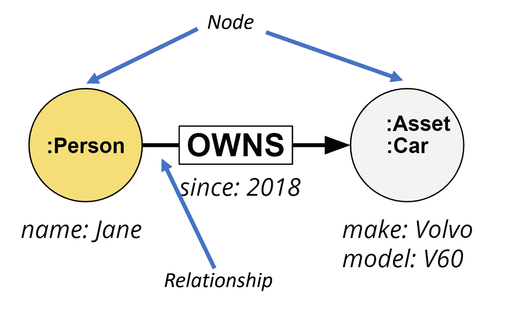
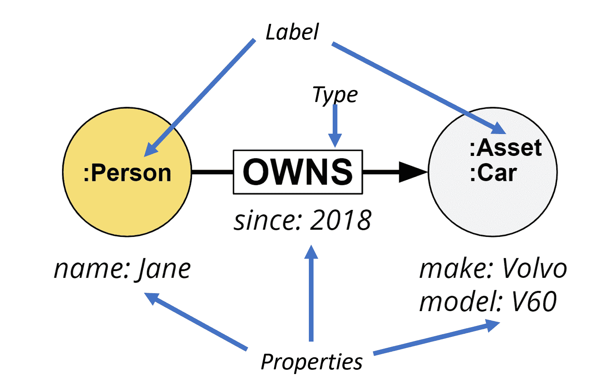
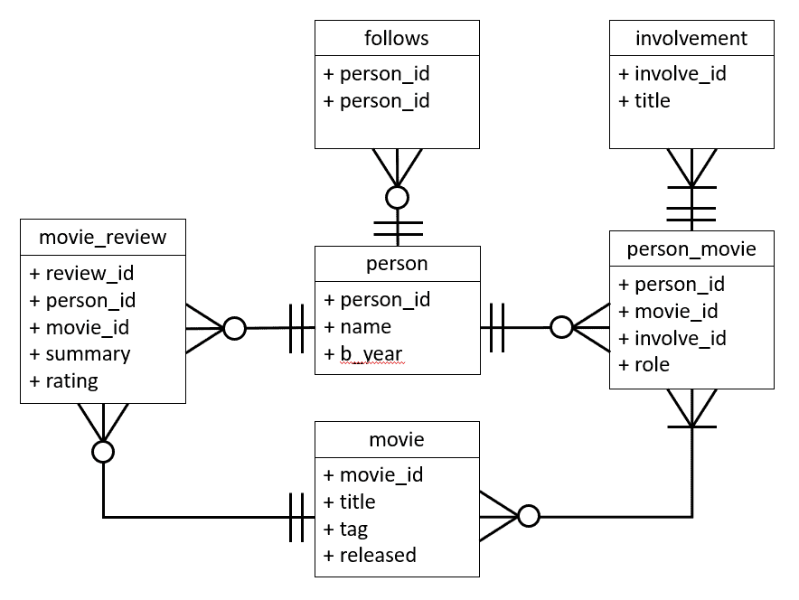
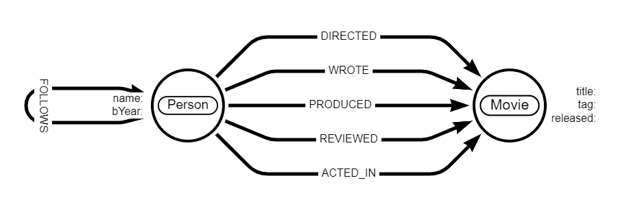

# 图形数据库与关系数据库——了解图形数据库如何工作

> 原文：<https://www.freecodecamp.org/news/graph-database-vs-relational-database/>

如果你对图形数据库以及它们与关系数据库管理系统的比较感兴趣，那么这本初学者友好的指南就是为你准备的。

在本文中，您将通过处理一个小的电影数据集来发现图表的威力。它基于 [Neo4j 沙箱](https://dev.neo4j.com/try)上可用的[内置数据集和指南](https://neo4j.com/developer/example-data/)。

想自己开车进去试一试吗？请做！你可以在这里找到如何[启动并运行](https://lju.medium.com/getting-started-with-play-movies-251228c12f2c)的说明。


## 我们将在本文中讨论的内容

图形数据库越来越受欢迎和采用。随着来自许多不同来源的数据量越来越大，能够理解这些数据并了解它们之间的联系是至关重要的。

如果你想了解更多关于图形数据库帮助解决的问题，以及你如何找到一个好的应用程序，这里有一篇介绍性的博客文章。

有些人可能听说过图形数据库(GDB)，有些人可能没有。在本文中，我们将详细介绍它们是什么，以及它们与更传统的关系数据库管理系统(RDBMS)相比有何不同，RDBMS 是过去 40 多年来最强大的软件应用程序。

受 Neo4j 使用的一个小电影数据集的启发，作为图形查询的引导性介绍，我们将并排查看数据模型或查询在图形数据库和关系数据库中的表现。

在本文中，我们将:

*   介绍图形数据库，简要介绍现有的两种模型
*   从概念上看一下关系范式和图形范式之间的区别
*   查看电影数据集，从 GDB 和 RDBMS 的角度比较和对比数据模型
*   基于 Cypher(GDB)或 SQL 比较和对比一些查询
*   讨论电影示例中出现的更有趣的查询，并准确地说明发生了什么

如果您想在阅读本文之前(或在阅读过程中)体验一下示例演练电影数据集。)，我们非常欢迎您这样做。你可以在这里找到更多[。](https://medium.com/neo4j/getting-started-with-play-movies-251228c12f2c)

## 什么是图形数据库？

首先，在我们深入什么是图形数据库之前，让我们定义一下这个术语。图形数据库是一种“不仅是 SQL”(NoSQL)数据存储。它们被设计成在图形结构中存储和检索数据。

使用的存储机制可能因数据库而异。一些 gdb 可能使用更传统的数据库结构，比如基于表的，然后在上面有一个图形 API 层。

其他的将是“本地”GDBs 从存储、管理和查询的整个数据库结构维护数据的图形结构。目前可用的许多图形数据库通过将实体之间的关系视为一等公民来实现这一点。

### 不同类型的图形数据库

大致有两种类型的 GDB，资源描述框架(RDF)/三元存储/语义图数据库和属性图数据库。

RDF GDB 使用三元组的概念，三元组是由三个元素组成的陈述:主语-谓语-宾语。

主语将是图中的一个资源或节点，宾语将是另一个节点或文字值，谓语代表主语和宾语之间的关系。节点或关系上没有内部结构，一切都由一个惟一的标识符标识，以 URI 的形式。

这种结构背后的动机是交换和发布数据。为了找到更多关于这种结构的信息，我会向你推荐 [Jesus Barrasa 的](https://jbarrasa.com/2016/11/17/neo4j-is-your-rdf-store-part-1/)在这方面的工作。

属性 GDB 侧重于存储接近逻辑模型的数据的概念。这反过来将基于对数据本身提出的问题，并侧重于使表示尽可能高效地用于存储和查询。

与基于 RDF 的图不同，在节点和关系上有内部结构，这有助于丰富的数据和相关元数据的表示。

以下两个图表并排比较了属性图数据库中表示的样本数据，并以 RDF 图的形式表示，这两个图表都表示电影《阿波罗 13 号》中汤姆·汉克斯扮演的角色吉姆·洛威尔。


RDF example of Tom Hanks in Apollo 13


Property Graph example of Tom Hanks in Apollo 13

## 
剖析属性图数据库

在本文的其余部分，我们将关注本地属性图数据库，特别是 Neo4j。让我们来看看主要组件。

属性图数据库的主要组件如下:

*   节点:在图论中也称为顶点——构成图形的主要数据元素
*   关系:在图论中也称为边——两个节点之间的链接。它将有**方向**和**类型**。允许没有关系的节点，不允许没有两个节点的关系



Node and Relationship

*   标签:定义一个节点类别，一个节点可以有多个
*   属性:丰富一个节点或关系，不需要空值！



Label, Type, and Property

## 图形数据库与关系数据库

### 关系数据库概述

许多开发人员都熟悉传统的关系数据库，其中数据存储在定义良好的模式中的表中。

表中的每一行都是离散的数据实体。行中的这些元素之一通常用于定义其唯一性:主键。它可能是一个唯一的 ID，也可能是一个人的社会保险号。

然后，我们通过一个称为标准化的过程来减少数据重复。在规范化中，我们将引用，比如一个人的地址，移到另一个表中。因此，我们从代表实体的行获得对代表该人地址的行的引用。

例如，如果有人更改了地址，您不会希望到处都有此人地址的多个版本，并且必须尝试并记住此人地址存在的所有不同实例。规范化确保您拥有数据的一个版本，因此您可以在一个地方进行更新。

然后当我们查询时，我们希望重新构建这些规范化的数据。我们做的是所谓的连接操作。

在我们的主实体行中，我们有标识实体 ID 的主键，比如说人。我们还有一个外键，代表地址表中的一行。我们通过主键和外键连接这两个表，并使用它们在地址表中查找地址。这称为连接，这些连接在查询时和读取时完成。

当我们在关系数据库中进行连接时，这是一个集合比较操作，我们要查看两组数据的重叠部分(在本例中，这两组数据是 person 表和 address 表)。在高层次上，这就是传统关系数据库的工作方式。


An example of the tables found and how they map to each other in a relational database for an insurance database


The equivalent example of the insurance database in a property graph database

### 原生图数据库如何工作:连接和无索引邻接

让我们快速浏览一下本地图形数据库及其工作原理。

我们谈到了关系数据库中的离散实体是表中的一行。在本地图形数据库中，该行相当于一个节点。它仍然是一个离散的实体，所以我们仍然有这个规范化的元素。

节点可以是一个实体。如果我们有 person 节点，我们将为一个人准备一个节点。我们会有某种程度的独特性，比如说社会保险号。

然而，关键的区别在于，当我们将这个 person 节点连接到另一个离散的实体时——例如，一个地址——我们在这两点之间创建了一个物理连接(也称为关系)。

该地址将有一个指针，指示连接到该节点的关系的出站部分是什么？然后，我们有了另一个指向另一个节点的关系入站部分的指针。

因此，实际上，我们正在收集一组指针，这是这两个实体之间物理连接的表现。这是最大的区别。

在关系数据库中，您可以在读取时使用连接来重组数据，这意味着在查询时，它会尝试找出事物是如何映射在一起的。

在图数据库中，因为我们已经知道这两个元素是连接的，所以我们不需要在查询时查找映射。我们所做的就是根据存储的关系找到其他节点。

这就是我们所说的无索引邻接。与其他数据库系统相比，无索引邻接的概念是理解原生图数据库性能优化的关键。

无索引邻接意味着在局部图遍历期间，沿着连接我的图中的节点的这些指针(关系)，操作的性能不依赖于图的整体大小。这取决于连接到您正在遍历的节点的关系的数量。

当我们谈到连接是集合操作(交集)时，我们使用关系数据库中的索引来查看这两个集合重叠的地方。这意味着随着表变大，连接操作的性能开始下降。

用大 O 符号术语来说，这类似于使用索引的对数增长——类似于 O(log n ),并且随着查询中连接的数量呈指数增长。

另一方面，遍历图中的关系更多的是基于我们实际遍历的节点中的关系数量的线性增长，而不是图的整体大小。

这是图形数据库进行的基本查询时间优化，为我们提供了无索引邻接。从性能角度来看，当我们考虑原生图形数据库时，这确实是需要考虑的最重要的事情。

## 电影《图表》简介

我们已经谈了很多关于图和关系数据库之间的理论差异。现在让我们开始看一些并排的比较。

电影图由一个数据集组成，该数据集由演员、导演、制片人、编剧、评论者和电影组成，以及关于他们如何相互联系的信息。

该数据集在 Neo4j 浏览器中可用，并且可以通过使用`:PLAY movies`命令轻松触发。提醒一下，这里有一个博客向你展示如何开始。

电影数据集包括:

*   133 个人节点/实体
*   38 个电影节点/实体
*   253 上述实体之间的关系/联系，描述如下联系:
*   导演电影的人
*   电影中的演员和角色
*   写电影的人
*   制作电影的人
*   对电影进行评论并给出评分和摘要的人
*   跟踪他人的人

虽然它是一个相对较小的数据集，但它全面地描述了图形的力量。

### 比较数据模型

首先，我们来看看各自数据库的数据模型。和所有的数据模型一样，它们看起来像什么最终取决于你问的问题的类型。所以让我们假设我们要问以下类型的问题:

*   一个人演过哪些电影？
*   一个人和什么电影有联系？
*   一个人曾经合作过的所有合作者是谁？

基于这些，下面是相关的潜在数据模型:



Entity Relationship data model for movie graph



Property Graph data model for movie graph

你马上就会发现一些东西——那些身份证不见了！当我们一知道有关联就把数据连接在一起时，我们不再需要它们，也不再需要那些映射表来让我们知道不同的数据行是如何连接在一起的。

### 比较查询

现在让我们继续比较一些查询。以`:PLAY movies`示例中的一些最初的查询为例，让我们看看 Cypher 查询的一些并列比较，以及等价的 SQL 查询看起来会是什么样子。

我听到你问什么是塞弗？ [Cypher 是一种图形查询语言](https://neo4j.com/developer/cypher/)，用于查询 Neo4j 图形数据库。还有一个 [OpenCypher](https://opencypher.org/) 版本，被许多其他厂商使用。

当我们浏览查询时，应该开始变得更清楚一个图形数据库，伴随着一个查询语言来帮助探索关系，是如何真正开始发挥作用的。让我们开始寻找汤姆·汉克斯吧！

#### 如何找到汤姆·汉克斯

```
MATCH (p:Person {name: "Tom Hanks"})
RETURN p
```

Cypher

```
SELECT * FROM person 
WHERE person.name = "Tom Hanks"
```

SQL

#### 如何找到汤姆·汉克斯的电影

```
MATCH (:Person {name: “Tom Hanks”})-->(m:Movie)
RETURN m.title
```

```
SELECT movie.title FROM movie
INNER JOIN movie_person ON movie.movie_id = person_movie.movie_id
INNER JOIN person ON person_movie.person_id = person.person_id
WHERE person.name = "Tom Hanks"
```

#### 如何找到汤姆·汉克斯执导的电影

```
MATCH (:Person {name: "Tom Hanks"})-[:DIRECTED]->(m:Movie)
RETURN m.title
```

```
SELECT movie.title FROM movie
INNER JOIN person_movie ON movie.movie_id = person_movie.movie_id
INNER JOIN person ON person_movie.person_id = person.person_id
INNER JOIN involvement ON person_movie.involve_id = involvement.involve_id
WHERE person.name = "Tom Hanks" AND involvement.title = "Director"
```

#### 如何找到汤姆·汉克斯的搭档

```
MATCH (:Person {name: "Tom Hanks"})-->(:Movie)<-[:ACTED_IN]-(coActor:Person)
RETURN coActor.name
```

```
WITH tom_movies AS (
    SELECT movie.movie_id FROM movie
    INNER JOIN person_movie ON movie.movie_id = person_movie.movie_id
    INNER JOIN person ON person_movie.person_id = person.person_id
    WHERE person.name = "Tom Hanks")
SELECT person.name FROM person
INNER JOIN person_movie ON tom_movies = person_movie.movie_id
INNER JOIN person ON person_movie.person_id = person.person_id
INNER JOIN involvement ON person_movie.involve_id = involvement.involve_id
WHERE involvement.title = "Actor"
```

## 更多关于密码的问题

希望您能了解 Cypher 和 SQL 查询之间的区别。也许你也很想了解他们！我们会在博文中进一步提及。

现在，让我们看看在`:PLAY movies`图示例中可以找到的其他一些 Cypher 查询，并解释发生了什么。

没有经典的[培根数问题](https://en.wikipedia.org/wiki/Six_Degrees_of_Kevin_Bacon)的电影图表是不完整的，我们的电影图表也不例外！

到目前为止，我们看到的例子每次都遍历一个关系。我们可以很容易地利用这些“写时连接”来遍历许多关系，以回答有趣的问题。

所以，回到凯文·贝肯号。下面的查询将从凯文·贝肯的 person 节点开始，然后从该起点向上跳 4 跳，返回所有连接的电影和人物。

```
MATCH (bacon:Person {name:"Kevin Bacon"})-[*1..4]-(hollywood)
RETURN DISTINCT hollywood
```

我们可以通过在查询模式的关系部分使用`*1..4`的语法来做到这一点:

*   `*`预示一切
*   `1..4`表示范围- 1 表示从 1 跳开始，4 表示最多 4 跳

我们可以在这个电影数据集上做的另一件事是两个节点之间的最短路径。

在这个例子中，让我们找出凯文·贝肯和梅格·瑞恩之间的最短路径。您会发现我们再次对关系模式使用了`*`语法——表示一切。

对你来说可能是新的是`p=`。您已经看到了我们如何为节点使用引用(例如，我们当前的查询中的`bacon`或`meg`)，我们也可以为关系使用引用。

我们还可以拥有对整个路径的引用(即所有涉及的节点和关系)。我们使用的语法是`refName =`，在本例中是`p=`。

我们还使用了 Cypher 函数`shortestPath()`——这是一个简单的最短路径函数，将返回两个指定节点之间的第一条最短路径。请注意，可能还有另一个同样短的路径，但是这个简单的函数将返回遇到的第一个路径。

对于那些对其他与路径相关的函数感兴趣的人，可以看看 APOC 和 GDS 的可用函数。

```
MATCH p=shortestPath(
(bacon:Person {name:"Kevin Bacon"})-[*]-(meg:Person {name:"Meg Ryan"}))
RETURN p
```

给你们所有人一个警告:你可能会看到那个`[*]`，并试图在没有`shortestPath()`函数或`1..4`范围约束的情况下运行你的图表。但这很可能会导致意想不到的事情。

在我们的凯文·贝肯和梅格·瑞恩的例子中，即使在这个非常小的数据集中只有 253 个关系，节点和关系之间的所有可能的路径组合可以很容易地在 Bacon 和 Ryan 之间找到数百万个不同的路径。

当在关系中使用`*`作为查询的一部分时，要非常小心！这个问题没有提出最短路径，因为当遇到比当前识别的最短路径更长的潜在路径时，它被立即丢弃。

### 一个简单的推荐查询

这里有两个查询真正展示了图形数据库的威力，我们可以很容易地使用数据中的连接来提出一些建议。

在我们的第一个问题中，我们在为汤姆·汉克斯寻找新的合作者，他还没有和谁合作过。该查询通过以下方式实现这一点:

*   首先，找到所有和他合作过的演员
*   然后，找到所有合作者的合作者(称为合作者)
*   接下来，我们要排除那些已经和汤姆合作过的合作演员，并确保合作演员不是汤姆本人
*   最后，我们返回建议的合作演员姓名，我们将对他们进行排序，但要列出与他们合作过的合作演员的数量——与该合作演员合作过的合作演员越多，推荐就越好。

```
MATCH (tom:Person {name:"Tom Hanks"})-[:ACTED_IN]->(m)<-[:ACTED_IN]-(coActors),
(coActors)-[:ACTED_IN]->(m2)<-[:ACTED_IN]-(cocoActors)
WHERE NOT (tom)-[:ACTED_IN]->()<-[:ACTED_IN]-(cocoActors) 
    AND tom <> cocoActors
RETURN cocoActors.name AS Recommended, count(*) AS Strength 
    ORDER BY Strength DESC
```

太好了，所以我们找到了一些潜在的合作演员。在下一个问题中，我们想推荐汤姆·克鲁斯作为汤姆·汉克斯的潜在合作伙伴。但是，谁来给这些汤姆互相介绍呢？回到电影图表上来。

在这个查询中，我们:

*   找出汤姆·汉克斯的联合演员，然后找出那些联合演员中谁也和汤姆·克鲁斯演过戏
*   然后，我们将返回与汤姆·汉克斯和汤姆·克鲁斯合作的演员和电影

```
MATCH (tom:Person {name:"Tom Hanks"})-[:ACTED_IN]->(m)<-[:ACTED_IN]-(coActors),
(coActors)-[:ACTED_IN]->(m2)<-[:ACTED_IN]-(cruise:Person {name:"Tom Cruise"})
RETURN tom, m, coActors, m2, cruise
```

## 遗言

我们已经完成了对电影数据库示例的演练。希望那些具有关系数据库背景的人对关系数据库和图形数据库之间的异同有更好的了解，并对 Cypher 查询语言有所了解。

如果你渴望了解更多关于建模和查询 Neo4j 的知识，请查看免费的 [Graph Academy](https://dev.neo4j.com/learn) 。