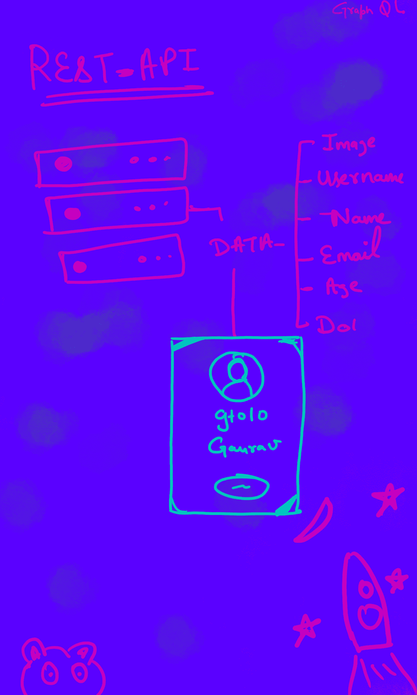
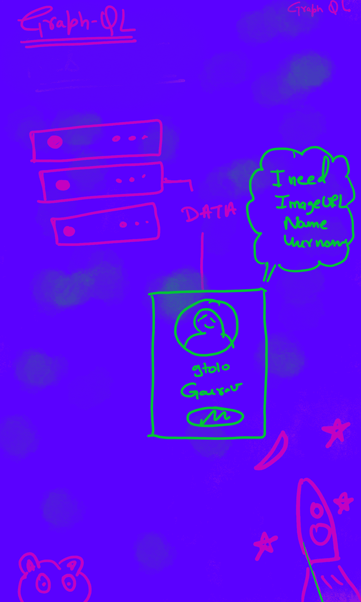
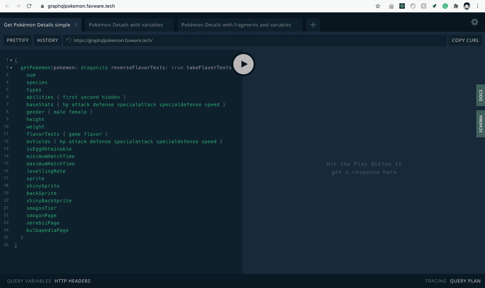
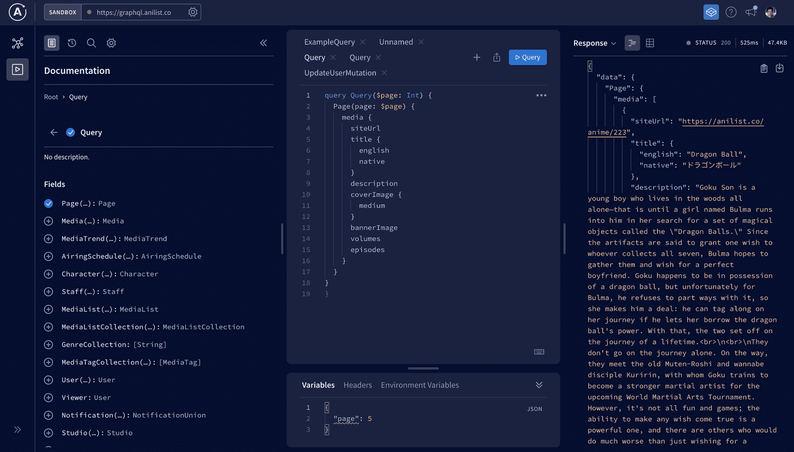
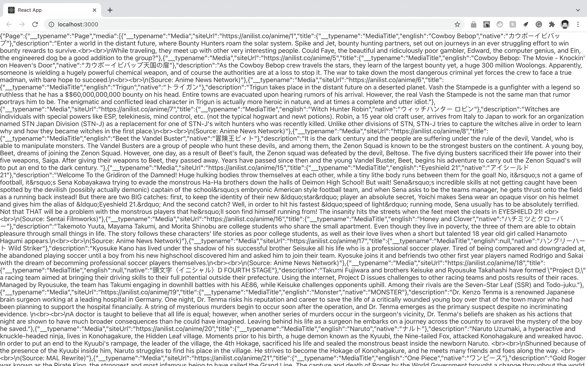
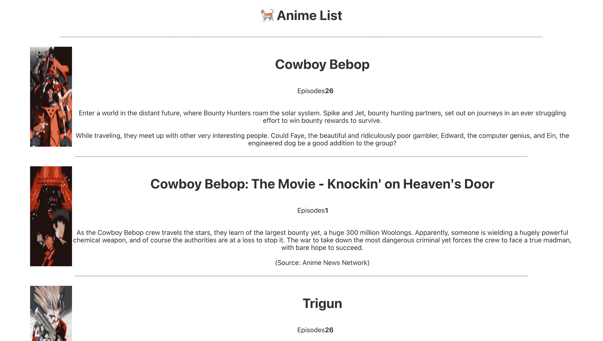
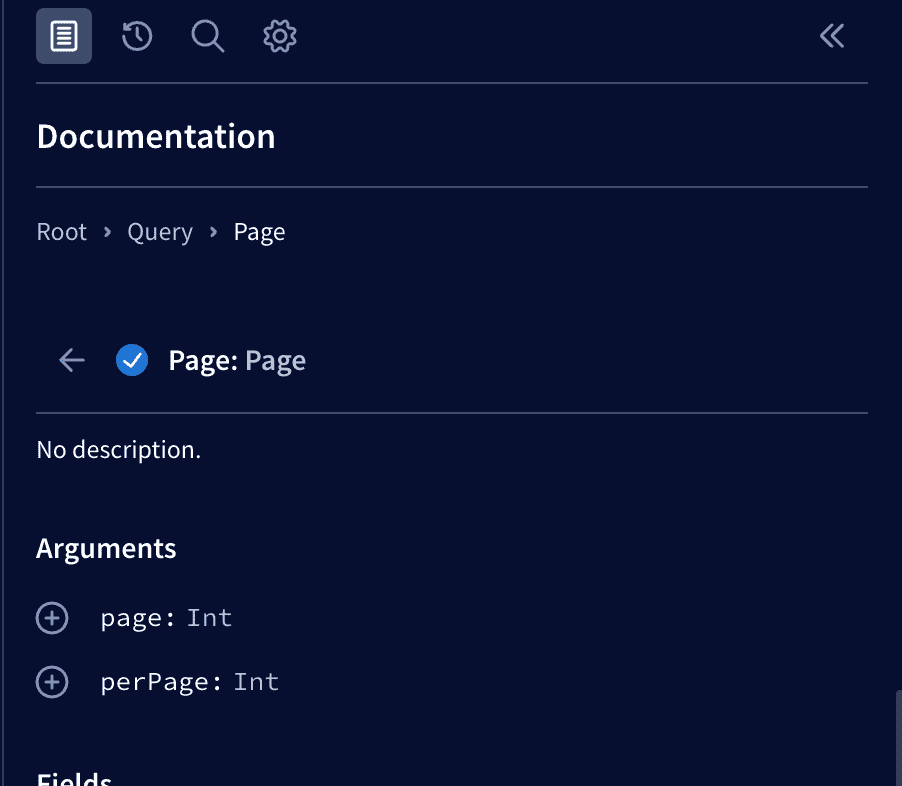
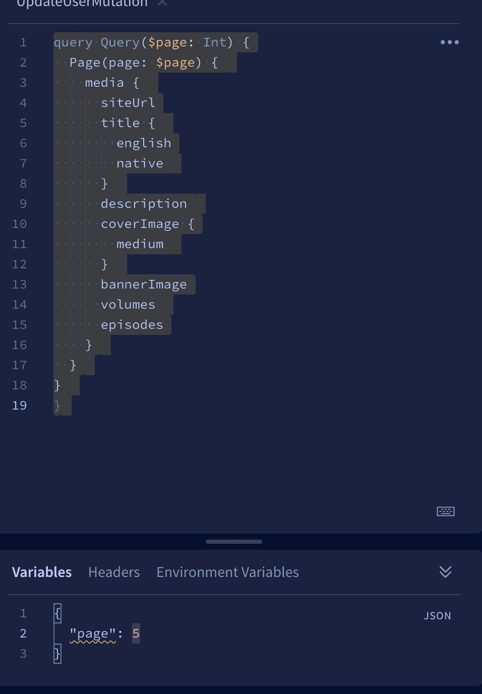

# 面向前端开发人员的 GraphQL

> 原文：<https://www.freecodecamp.org/news/graphql-for-front-end-developers/>

如果您是一名前端开发人员，刚刚接触 GraphQL，并且正在考虑开始使用它，那么这篇文章非常适合您。

在本文中，我们将探索 GraphQL 的基础知识，并通过构建一个简单的项目开始我们的旅程。

## GraphQL 是什么？

GraphQL 是一种查询语言，允许应用程序从 API 获取数据。但它的不同之处在于，它允许客户机指定当服务器返回数据时如何构造数据。这意味着客户机只要求它需要的数据，甚至指定它需要的数据的格式。

但是它实际上解决了什么问题呢？

它解决了欠取和过取的问题。好吧，但那是什么？好吧，让我告诉你。

比方说，你只需要在你的网站或应用程序的个人资料页面上显示用户名、用户图像和姓名。但是当你请求数据的时候，你得到了很多你不需要的关于用户的其他信息。

这被称为**过度获取**–您正在获取大量数据，甚至是您不需要的数据。另一方面，**欠取**是指我们得到的数据比你需要的少。所以两者都不伟大。



under Fetching example 

你可能会想好吧，这根本不是问题。在小规模应用中，这不是什么大问题。但是在拥有数百万用户的大规模应用程序中呢？在这些情况下，过度提取和提取不足会浪费大量资源，这就是 GraphQL 的用武之地。



# 如何开始使用 GraphQL

在这里，我们将介绍一些您在开始使用 graphQL 之前需要了解的关键概念

### 图 QL 操场

GraphQL playground 是一个用于 GraphQL 的交互式图形 IDE，您可以在其中直观地探索服务器。您可以在其中测试各种 GraphQL 查询，并亲眼看到它们的结果。

这里有一个 GraphQL playground 的链接，你可以去看看。



GraphQL playground

如果您单击播放按钮，它将运行查询。

### 如何在 GraphQL 中请求、写入或发布数据？

您通过 GraphQL 中的查询请求数据。为了写或发布数据，你使用突变。

每当我们执行一个 GraphQL 操作时，我们指定它是一个变异还是一个查询。然后我们命名该操作，这是执行 GraphQL 查询的基本方式。

```
 GraphQLOperatoinType Name {
 ....
 ........
 .....
 ...
} 
```

要进行简单的查询，语法应该是:

```
query getData {
...
}
```

类似地，要添加一个突变，我们可以用`mutation`代替`query`。

既然我们知道了基本知识，那就让我们动手吧。我们将使用 [Anilist API](https://studio.apollographql.com/sandbox/explorer?endpoint=https%3A%2F%2Fgraphql.anilist.co&explorerURLState=N4IgJg9gxgrgtgUwHYBcQC4TADpIAR4AKAhgOYJ474F6JgCWxluNNAzvSggKoBOANi1Z4UnfhSrCayUv3psAFkKlJiogG4JlNAL7aCYBGyi96AB1EQk2vdVs6QAGhDrip4gCNxbDFmy9cBx0gA&_gl=1*1sgkza2*_ga*MTg1Mzg5MTM4Ni4xNjM0MjExNTMz*_ga_0BGG5V2W2K*MTYzNDM2NTQxMS43LjEuMTYzNDM2ODk5Ny4w) 来获取一个动漫节目列表。



Apollo studio 

### 如何使用阿波罗工作室

您已经体验了 GraphQL playground，但是还有一个更棒的东西叫做 Apollo Studio。这使得前端开发人员的工作变得更加轻松。在其中，你只需要选择你想要的字段，它会为你写一个查询。

从左侧选择您想要在查询中使用的字段，就这样。GraphQL 将自动为您创建一个查询。现在您已经完成了查询，但是如何在您的应用程序中使用它呢？

让我们开始用它来构建一个简单的动画应用程序。

我们将在这个项目中使用 React，但是您可以选择您喜欢的任何框架或库。

首先，在 React 中创建一个新项目:

```
npx create-react-app graphql-example 
```

现在，一旦创建了项目，进入项目目录并安装 Apollo 客户机。

```
npm install graphql @apollo/client 
```

完成后，转到 src/index.js 并导入 ApolloClient、InMemoryCache 和 ApolloProvider:

```
import {ApolloClient, InMemoryCache, ApolloProvider} from '@apollo/client';
```

Apollo Client 是一个代表 Apollo 客户端本身的类，我们用它来创建一个新的客户端实例。

这里我们需要为它提供一些东西。一个是 URI，在这里我们指定 GraphQL 服务器的 URL。此外，我们的 Apollo 客户端的每个实例都需要一个缓存，这样可以减少网络请求，使我们的应用程序更快。

这是我们新客户的样子:

```
const client = new ApolloClient({
  uri : 'https://graphql.anilist.co/',
  cache: new InMemoryCache(),
})
```

现在，我们需要使这个客户端在我们的组件树中可用，因此我们将应用程序的顶级组件包装在 ApolloProvider 中。

现在我们已经完成了初始设置，所以是时候进行查询并向我们的 API 请求数据了——但是我们该怎么做呢？

我们可以使用 useQuery 钩子来做到这一点。但是在此之前，我们需要定义一个查询，这可以使用 GQL 来完成(我们需要将查询包装在其中)。现在，从 Apollo 客户端导入这两个:

```
import {useQuery, gql} from '@apollo/client'; 
```

在导入它们之后，我们将把我们的查询包装在 GQL 中:

```
 const AnimeList = gql`
 query Query {
  Page {
    media {
      siteUrl
      title {
        english
        native
      }
      description
      coverImage {
        medium
      }
      bannerImage
      volumes
      episodes
    }
  }
}
}

`; 
```

此时，您一定想知道查询部分是否已经完成，我们现在如何从中获取数据？

这就是 useQuery 钩子派上用场的地方。它返回我们可以使用的`loading`、`error`和`data`属性。

```
 const {loading, error, data} = useQuery(AnimeList); 
```

现在，我们可以只显示数据来检查我们的应用程序是否工作:

```
if(loading) return(<> Loading</>);
  if(error) return(<>{JSON.stringify(error)}</>)
  return (
   <>
   {JSON.stringify(data)}
   </>);
```



好了，它现在工作了——是时候改变它的风格了。

也许我们可以使用对象链来很好地实现这一点:

```
 <div className="container"> 
     <h1> 🐈 Anime List </h1>
     <hr width="80%" />
   {data?.Page?.media.map(anime => (
     <>
   <div className="card" >
      
      <div> 
         <h1>{anime.title.english} </h1>
           <div className="episodes" >Episodes  <b>{anime.episodes} </b></div>
          <div  dangerouslySetInnerHTML={{__html: anime.description}} ></div> 
      </div> 
  </div>
  <hr width="75%"/>
 </>
   ))}
   <div className="buttonContainer">
    { page != 1 && <button> Previous Page</button> } 
     <div className="pageText"> {page}</div>
     <button onClick={NextPage}>  Next Page </button> 
   </div>
   </div>);
```

after styling 



minimistic styled app

你可以看看这个 [GitHub repo 的 CSS 文件](https://github.com/tewarig/graphql-Example/blob/7df5c7c199878484e36742287e513d5a249b466b/src/App.css)。

现在我们可以从 API 中得到一个动画电影的列表。那么，我们需要从应用程序的下一页获得什么呢？

我们需要将一个具有页面名称的变量传递到查询中。这就是 GraphQL 中变量出现的原因。

首先，进入 Apollo Studio，点击左侧的参数(首先进入 root > query >page，你会看到它):



点击页面，它会为您的查询添加一个参数。



还要注意的是，在 variables 部分的 variable 页面中，您可以更改它的值，并对它进行一些调整。但是数据只会根据页面变化。

现在我们需要将这个变量传递到查询中——然后我们将能够在我们的应用程序中显示下一页的动画。

为此，我们将使用 useState 钩子来跟踪当前页面的值。我们还需要创建一个函数来增加和减少它。

```
 const [page, setPage] = useState(1);
  //this is how we would be passing the page in the query.
  const {loading, error, data} = useQuery(AnimeList , {  variables: { "page" : page } });

const NextPage = () => {
    setPage(page+1);
  }
  const PreviousPage = () => {
    setPage(page - 1);
  }

   <div className="buttonContainer">
    { page != 1 && <button onClick={PreviousPage}> Previous Page</button> } 
     <div className="pageText"> {page}</div>
     <button onClick={NextPage}>  Next Page </button> 
   </div> 
```

现在我们已经用 GraphQL 完成了简单应用的构建。如果你想查看代码库，[这里是链接](https://github.com/tewarig/graphql-Example)。

## 包扎

在本文中，我们介绍了一些基本概念，以帮助您开始使用 GraphQL。感谢您的阅读，祝您编码愉快。