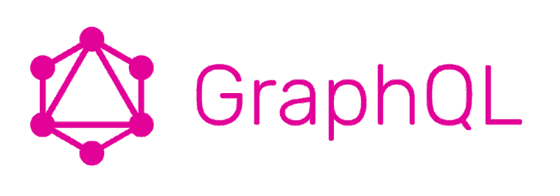

# GraphQL:前端查询变得简单

> 原文：<https://www.freecodecamp.org/news/graphql-front-end-queries-made-easy-68e9d9ded283/>

拉希德·布斯塔姆

# GraphQL:前端查询变得简单

如果您一直在阅读前端开发的最新趋势，您可能听说过一些关于 GraphQL 的东西。在本文中，我们将介绍 GraphQL 是什么(不是什么)，GraphQL 背后的一些最佳实践，以及最重要的是，为什么它使您作为前端开发人员的工作变得更加容易。

注意:这并不是 GraphQL 教程。这篇文章仅仅是为了描述为什么 GraphQL 让前端开发人员的工作变得更容易。

### GraphQL 是什么？

GraphQL 是一种由脸书创建的查询语言。它允许前端开发人员编写具有您想要的精确数据形状的查询。

值得注意的是，尽管名为“GraphQL”，但它并不是数据库语言。事实上，我已经将 GraphQL 用于许多数据库，包括 SQL、MongoDB，甚至连接到数据库的 REST API(我甚至不知道数据库语言是用什么编写的)。

相反，服务器上的 GraphQL 允许您定义如何获取数据。然后，在客户机上，您可以执行一个具有您想要的精确数据形状的查询，并且您得到的数据将具有与查询相同的形状。

例如:

您得到的响应将类似于以下内容:

响应中还会有其他元数据，但是您已经可以看到 GraphQL 是多么强大了——不需要在客户机上规范化任何数据。工作被推送到服务器。

由于本文更多地面向前端开发人员，所以我不会过多地讨论 GraphQL 如何在服务器上工作的细节。然而，让“奇迹”发生的是 GraphQL 模式，它允许您定义跨服务器和客户机使用的类型。下面是一个假想应用程序的示例模式:

仅仅通过查看模式，您就可以知道您的数据将是什么形状，以及需要什么类型。这允许您，前端开发人员，知道查询的几个重要属性，例如它是否接受参数，它是一个列表还是仅仅是一个“实体”，如果它是一个特定的实体，该实体有哪些字段(在这种情况下，实体`User`有字段`name`和`email`)。

在`user`查询的例子中，我们可以看到它接受了一个名为`username`的参数，该参数的类型为`String`。`!`表示该字段是必需的，因此如果没有提供，将会抛出一个错误。

作为一名前端开发人员，您可能不会过多地使用该模式，但是它将作为一个重要的文档，让您知道可以进行哪些查询。

与其他 API 标准相比，例如 Swagger for REST API——您必须相信，无论是谁编写的文档都写得非常好，所有的边缘案例和类型都有文档记录。Swagger 并不完全“强制”对不同的字段进行类型检查，所以您可以拥有一个有效的 Swagger YAML 文件，但它仍然难以导航。

然而，任何有效的 GraphQL 模式本身对于任何人了解他们正在处理什么类型的数据都非常有帮助，即使它没有被正确地注释掉和记录。

这并不是要挖苦 Swagger 或者说它很糟糕——如果使用得当，Swagger 会非常有用。但是这是一个警告——它需要被正确地使用，并且由于开发人员往往行动极快，适当的文档通常会让位于构建新的和令人兴奋的特性/API。

### 如何在客户端使用 GraphQL

这是一个有趣的问题。在客户端，有很多方法可以在客户端使用 GraphQL。

使用 GraphQL 最流行的方式之一是使用一个名为 [**apollo-client**](https://github.com/apollographql/apollo-client) 的库。Apollo 客户端可以与 [React](https://www.apollographql.com/docs/react/) 、 [Vue](https://github.com/akryum/vue-apollo) 、 [Angular](https://www.apollographql.com/docs/angular/) 等接口。

现在，Apollo 客户端最近更新到了 2.0 版本。与 1.0 版本绝对*不*向后兼容，许多包改变了名称，整个 API 也改变了。我一直在慢慢熟悉 2.0 版本，但仍有一些事情我在 1.0 中可以做，但在 2.0 中不再能做，比如我的 React 应用程序中的 Redux 集成。因此，我认为 1.0 和 2.0 是在客户端使用 GraphQL 的完全不同的方式。

然而，总体概念是相同的:将整个应用程序包装在一个 Apollo 提供程序中(类似于使用 Redux)，现在所有组件都可以访问客户端，并可以向服务器写入查询和变化。

Apollo Client 做了很多很酷的“幕后”工作，你认为这些工作应该是标准的，但显然不是。一个例子是“批处理”查询。如果我加载一个加载两个不同查询的组件，默认情况下会发送两个不同的请求。但是，Apollo Client 可以选择“批处理”这些查询，将这两个查询放在一个请求中，并将其发送到服务器，从而节省了一些 HTTP 请求。

Apollo 客户机还有一个非常健壮的缓存特性，它让组件首先从缓存中获取数据。然后，如果缓存过时(通常为 100 毫秒，但可以配置)，它实际上会发出请求。

下面是一个实例化 Apollo 客户机并发出查询的例子:

这个连 React 都不用。如果您要实现 React，那么您实际上可以将查询附加到 React 组件，以便它接收查询数据作为道具。

在客户端使用 GraphQL 的另一种方法是使用 [**中继**](https://facebook.github.io/relay/) ，它只与 React 一起工作。很抱歉，你不能使用继电器。

我没怎么用过 Relay，但它绝对比 Apollo 有更陡的学习曲线。看起来你不得不“自己动手”做很多事情，比如缓存甚至模式实现。你可以在这里看一些[的例子来了解 Relay 是如何工作的，以及它与 Apollo 有何相似和不同。](https://github.com/relayjs/relay-examples)

一旦设置好中继，它实际上与 Apollo 客户端和 react-apollo 协同工作的方式非常相似，因为它将数据作为道具发送给组件。

### 包装它

我希望这篇文章对你决定是否应该使用 GraphQL 有用。对我来说，仅仅知道进来的数据的形状就让我的前端工作变得非常容易。如果数据输入不正确，我就在后端的模式中修改它，并更新任何必要的服务器端代码。

如果这篇文章激起了你学习 GraphQL 的兴趣，我建议你更深入地看看 GraphQL 官方教程:[如何学习 GraphQL](https://www.howtographql.com/) 。

祝您查询愉快！