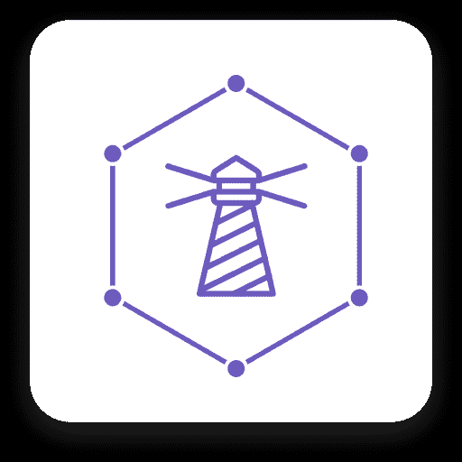
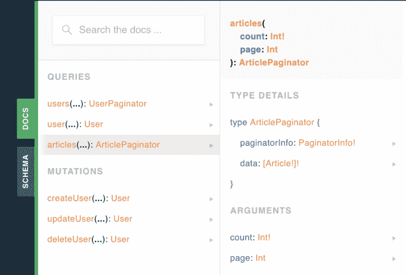
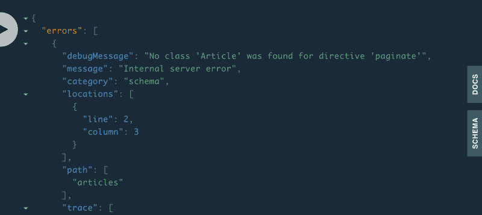
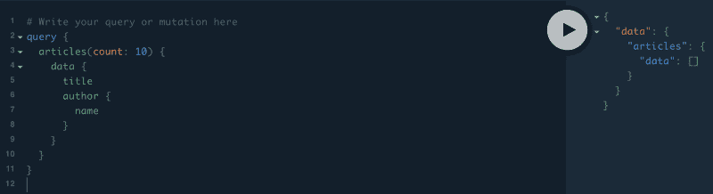
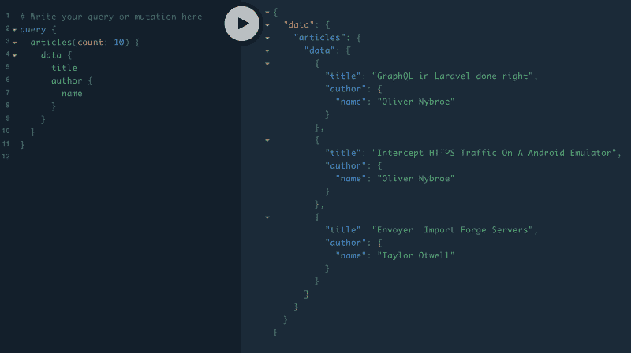
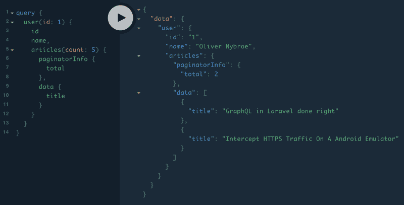
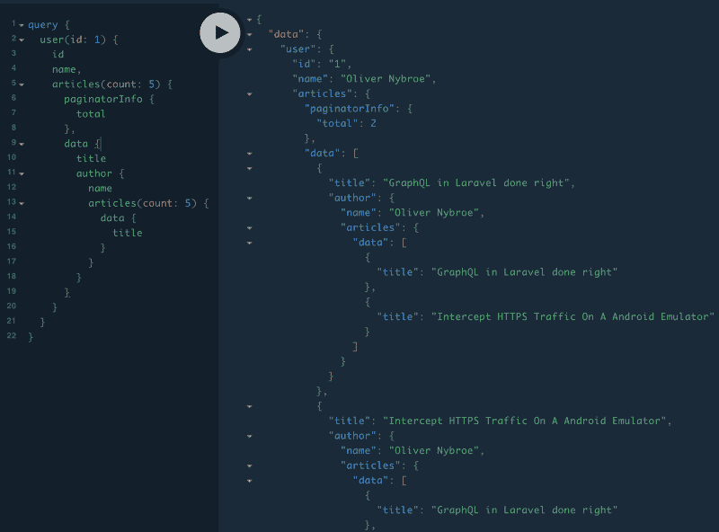
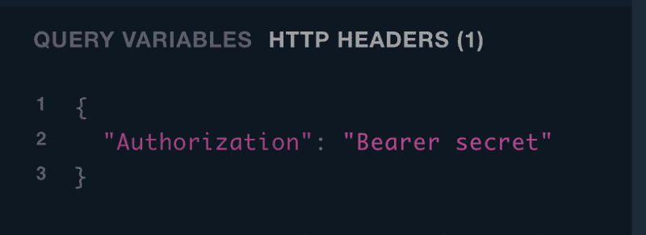
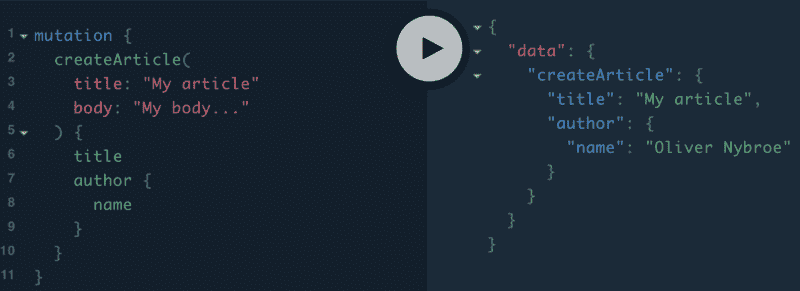

# Laravel 中的 GraphQL 做对了:如何在一个简单的博客中建立灯塔

> 原文：<https://www.freecodecamp.org/news/graphql-in-laravel-done-right-9cf123d5601b/>

作者奥利弗·尼布罗

# Laravel 中的 GraphQL 做对了:如何在一个简单的博客中建立灯塔



[https://lighthouse-php.netlify.com/](https://lighthouse-php.netlify.com/)

最近，一个新的包彻底改变了 Laravel 中 GraphQL API 的创建。这个包使得设置 GraphQL 服务器变得如此简单和容易，以至于它给你第一次使用 Laravel 时的感觉，"*这是多么神奇啊！*”。这个包裹当然是[灯塔](https://lighthouse-php.netlify.com/)。

在本文中，我将通过一个简单的博客示例介绍如何设置 Lighthouse。我假设您已经熟悉了 GraphQL 的基础知识。该示例将让您通过 GraphQL 获取和创建文章。Lighthouse 使用了一种模式方法。通过创建 GraphQL 模式来定义 API，然后使用指令添加与 Laravel 的绑定。

### 部分

首先，只需通过 composer 添加包并发布配置文件。(包`laravel-graphql-playground`是一个 GraphQL 浏览器客户端，是可选的。)

```
$ composer require nuwave/lighthouse$ php artisan vendor:publish --provider="Nuwave\Lighthouse\Providers\LighthouseServiceProvider"$ composer require mll-lab/laravel-graphql-playground$ php artisan vendor:publish --provider="MLL\GraphQLPlayground\GraphQLPlaygroundServiceProvider"
```

### 创建模式

现在是有趣的部分:当设置这个包时，我们只需要创建下面的文件`routes/graphql/schema.graphql`。这个文件包含了 graphql 服务器的整个模式。

首先，我们将添加一个简单的端点来获取数据库中的所有帖子。为此，我们首先需要在模式文件中创建我们的文章类型。

```
...type Article {    id: ID!    title: String!    body: String!    author: User!}
```

#### 定义模式查询

我们现在有两种类型，一种是文章类型，一种是用户类型，所以我们可以得到文章的作者。然而，我们仍然没有文章的任何端点，所以让我们在模式文件中添加一个。

```
type Query {  ...  articles: [Article]! @paginate(type: "paginator" model: "Article")}
```

现在更多的奇迹正在发生。我们正在添加一个名为`paginate`的自定义指令。该指令为提供的给定模型(在本例中为 Article)添加分页。我们还说它应该使用类型`paginator`,这将导致它为我们生成一个分页兼容的类型。

为了浏览端点，让我们转到`your-url.test/graphql-playground`打开我们安装的 GraphQL 客户端。在模式中，我们现在可以看到添加了一个名为`ArticlePaginator`的新类型。端点`articles`正在返回`ArticlePaginator`的一个实例。



Screenshot from graphql-playground

#### 运行查询

因此，让我们创建一个简单的查询来获取 10 篇文章及其标题和作者姓名。

```
query {  articles(count: 10) {    data {      title      author {        name      }    }  }}
```

当我们运行这个查询时，它导致一个错误，说它无法找到一个名为`Article`的类。这是有意义的，因为我们还没有创建模型。此调试消息之所以可见，是因为我们不是在生产环境中运行。



Screenshot from graphql-playground showing error of no Article class

### 创建我们的模型和迁移

因此，让我们创建我们的模型和迁移。默认情况下，Lighthouse 在`app/models`内部寻找模型。为了方便起见，我们将在这里添加文章模型。我们不必像在模式文件中那样移动用户模型，用户的名称空间已经直接键入。

```
$ php artisan make:model Models\\Article -m
```

然后更新迁移和模型:

#### 查询文章

既然我们的模型和迁移已经设置好了，让我们迁移数据库并检查它是否仍然失败。



Screenshot from graphql-playground showing no result

因此，我们现在可以看到端点工作正常，但是数据库中没有数据。我们将手动添加一些，然后通过 GraphQL 解决如何做到这一点。



Screenshot from graphql-playground showing articles

太好了！我们现在能够通过 GraphQL 获取文章。让我们也添加对从用户那里获取文章的支持。为了做到这一点，我们必须改变我们的 GraphQL `user`类型来与文章建立关系。

```
...type User {  id: ID!  name: String!  email: String!  created_at: DateTime!  updated_at: DateTime!  articles: [Article] @hasMany(relation:"articles" type:"paginator")}
```



Screenshot from graphql-playground showing articles from user

因为这是 GraphQL，我们可以继续链接它。因此，我们现在可以从文章中获得作者，然后从该作者处获得文章，以此类推(即使这是毫无意义的)。



Screenshot from graphql-playground showing pointless query

### 创造变异体

现在让我们添加一个用于创建新文章的 mutator。该端点也需要身份验证。当然，我们需要成为系统中的用户，然后才能创建新文章。为此，我们将使用 Laravel 的中间件`auth:api`。删除所有以前的突变，因为我们不需要它们，并添加以下内容:

```
type Mutation @group(middleware: ["auth:api"]) {    createArticle(title: String!, body: String!): Article        @create(model: "Article")        @inject(context: "user.id", name: "author_id")}
```

#### 鉴定变异体

要使用`auth:api`中间件，我们需要设置一个`Guard`。对于这个例子，我们将只使用`TokenGuard`。为了使用 token guard，我们需要向名为`api_token`的用户添加一个字段，然后那里的值就是您的令牌。

```
Schema::create('users', function (Blueprint $table) {    $table->increments('id');    $table->string('name');    $table->string('email')->unique();    $table->timestamp('email_verified_at')->nullable();    $table->string('password');    $table->string('api_token'); // The new API token field    $table->rememberToken();    $table->timestamps();});
```

现在我们在数据库中手动添加令牌并将其设置为`secret`(您可以创建自己的 UI 来设置令牌或使用 [Laravel Passport](https://laravel.com/docs/5.8/passport) )。然后，我们将这个令牌添加到我们的请求中，这样我们就通过了身份验证。



Screenshot from graphql-playground showing headers

#### 使用变异体



Screenshot from graphql-playground showing mutation

我们现在有了一篇新文章，我们可以看到文章的作者是我们的认证用户。所以现在我们有了一个非常简单的 GraphQL API，并且可以运行，但是支持获取和创建我们的文章！

希望你喜欢这篇文章，如果你想知道更多，请访问[灯塔文档](https://lighthouse-php.com/)。你也可以在 [Github](https://github.com/olivernybroe/lighthouse-intro-article) 上找到上面创建的例子。