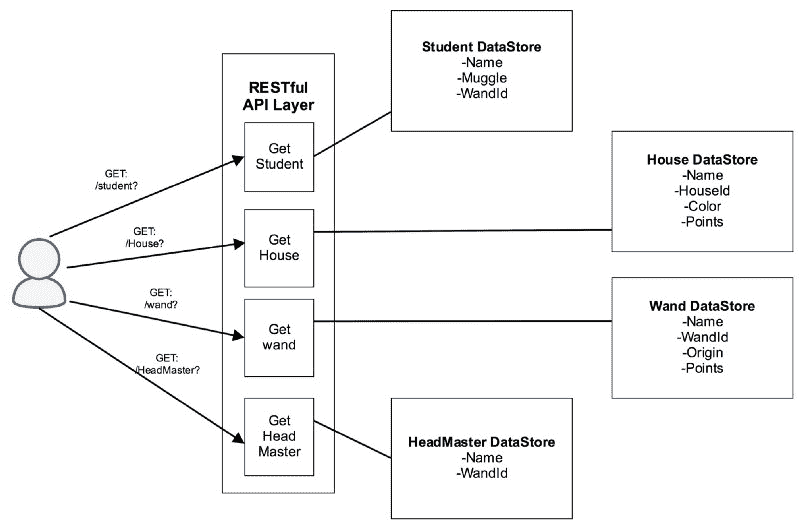
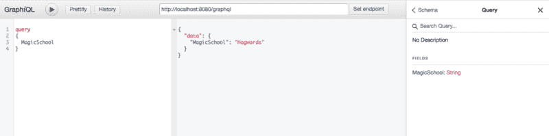
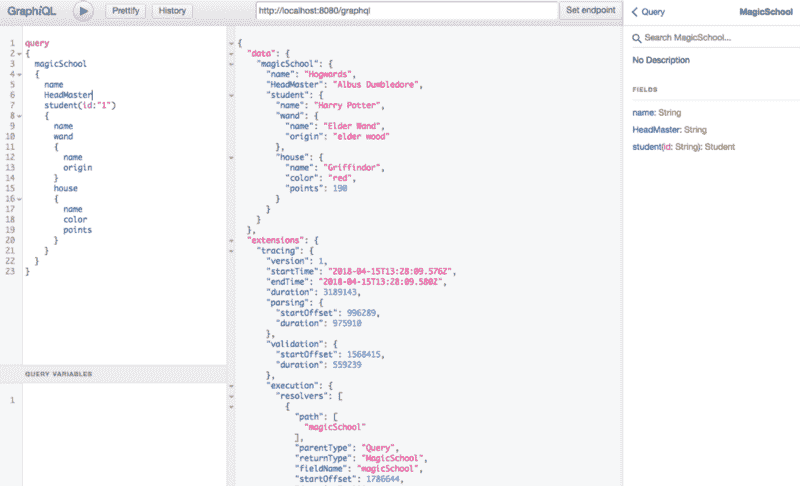

# 如何快速启动并运行您的 GraphQL Java 服务器

> 原文：<https://www.freecodecamp.org/news/graphql-java-development-stack-in-production-21f402c4c37a/>

作者:Prithviraj Pawar

# 如何快速启动并运行您的 GraphQL Java 服务器

GraphQL 是一种通过互联网获取数据的查询语言。自 2015 年脸书公开宣布以来，它已经引发了许多人的兴趣。GraphQL 主要用于 JavaScript。事实上，脸书用 JavaScript ( [graphql-js](https://github.com/graphql/graphql-js) )发布了它的参考实现。

但是这篇博客文章将关注 Java 中 GraphQL 服务器的开发。 [**GraphQL-Java**](https://github.com/graphql-java/graphql-java) 是 Java 中对应的 GraphQL 实现，几乎每个月都会得到更新和版本改进。插装、对后端的异步调用、数据加载器、指令等特性使它成为 Java 中一个非常有趣和强大的存储库。


GraphQL Java

### 如何在 springboot 中构建一个 GraphQL Java 服务器

让我们以《哈利·波特》宇宙中的魔法学校为例。魔法学校的数据如下:



这里的数据存储可以是后端服务器，甚至是数据库。一个 RESTful 抓取将如下所示。

```
GET: /student?{parameters}GET: /House?{parameters}
```

基本上是为服务公开一个接口。因此，如果在上面的模型中添加了**教授**，那么必须打开一个新的端点，并且客户端必须进行多次往返。同样，如果客户端想要嵌套数据，如**哈利的魔杖** **原点** 或**罗恩的房子颜色、** ，那么 API 服务器必须调用后端两次。这也将导致一些不需要房屋和魔杖信息。

**输入 GraphQL** : GraphQL 是一种模式驱动的获取数据的方法。它将数据建模为图形，您必须发出一个查询来获取数据。它像 SQL 一样工作，但是是针对 web 对象的。因此，对**哈利**的 graphQL 查询如下:

```
query{Magic School{Student{namewand{origin}}}}
```

在进入 GraphQL 之前，我们需要设置一个 spring MVC。最简单的方法是 [SpringBootStarter](https://start.spring.io/) 。您可以选择您想要的构建自动化工具。这给出了一个 spring embedded Tomcat 包，可以在端口 8080 上运行。要测试 Tomcat，请运行:

```
$gradle clean build$java -jar ./build/libs/graphql-demo-0.0.1-SNAPSHOT.jar
```

默认情况下，Gradle 将您的 JAR 命名为“project _ name-version-snapshot . JAR”。检查[*http:localhost:8080*](http://localhost:8080/)*查看 Tomcat 运行在 8080 端口。*

*现在让我们在我们的 **build.gradle** *中添加一个 [GraphQL-Java](https://github.com/graphql-java/graphql-java) 依赖项。**

```
*`dependencies {compile('com.graphql-java:graphql-java:{version}')compile group: 'org.json', name: 'json', version: '20170516'}`*
```

*添加在 [mavenCentral](https://mvnrepository.com/artifact/com.graphql-java/graphql-java) 存储库中找到的当前版本。目前最新版本是 8.0。还要添加 **org.json，**，这是一个方便的库，因为 GraphQL 在 json 中处理请求-响应。*

*正如我前面提到的，GraphQL 是一种模式驱动的语言。它要求用户根据模式在查询中选择对象。*

*让我们开始吧:*

*我们为 GraphQL POST 请求*开放了一个 **/graphql** 接口。*我们需要创建一个模式来表示数据。*

*   ***SchemaGenerator** 解析模式并创建一个[抽象语法树](https://en.wikipedia.org/wiki/Abstract_syntax_tree)，以字段名作为子节点。*
*   *然后由 **TypeDefinitionRegistry、**为字段分配类型，例如 Int、String 等等。GraphQL 有一个很好的[类型系统](http://graphql-java.readthedocs.io/en/latest/scalars.html)，其中我们可以在模式中自定义类型，包括枚举、接口、联合、列表等等。*
*   *看一看 **RuntimeWiring()** 步骤，其中字段“MagicSchool”由 **StaticDataFetcher** *映射到“霍格沃茨”。**
*   *每个字段都由**数据提取器**进行备份，数据提取器的工作是解析数据并返回给 GraphQL。*
*   *然后 GraphQL 将它与已定义的模式名称连接起来，无论是列表的嵌套映射还是通用映射。只要您定义了正确的模式，GraphQL 就会做到这一点。*
*   *在将这些数据发送给 **ExecutionInput** 之后，GraphQL 引擎解析- >验证- >获取- >执行查询，并使用 respon **se 返回一个 JSON 输出。toSpeci** 动作()*

*让我们使用 [GraphiQL](https://github.com/graphql/graphiql) 发出一个查询。将此扩展添加到您的浏览器并设置端点。*

**

*看看您的查询的形状如何决定响应的形状。由于 GraphQL 的自省性质，该模式可以清晰地可视化。由于在解析模式时创建了抽象语法树，这使得模式的验证和语法检查能够自动进行。*

*让我们在模式中再添加一些字段。我们将构建一个[模式定义语言](http://graphql-java.readthedocs.io/en/latest/schema.html)。创建一个名为 **magicSchool.graphql.** 的文件*

```
*`type Query{magicSchool:MagicSchool}type MagicSchool{name: StringHeadMaster:Stringstudent:Student}type Student{name:Stringwand:Wandhouse:House}type House{name:Stringcolor:Stringpoints:Int}type Wand{name:Stringorigin:String}`*
```

*修改代码中的模式源，并在 GraphiQL 中检查新的模式*

```
*`File schemaFile = loadSchema("magicSchool.graphql");TypeDefinitionRegistry typeRegistry=schemaParser.parse(schemaFile);`*
```

*模式和获取器的 runtimeWiring 发生了重大变化，包括了其他类型。每种类型都有自己独立的数据提取器。*

*这里我们有 **@Autowired** 所有的获取器来获取数据。每个 GraphQL 类型都由类型解析器(数据提取器)备份。这些解析器相互独立，可以有不同的来源。这里的每个数据提取器都有一个**数据提取环境**，它是 GraphQL 查询执行的接口。它包含了**查询-参数** *，* **上下文** *，* **executionId** *，* **，**等特定字段参数*。**

*看看 StudentFetcher 和我们的查询输出(忽略扩展):*

```
*`public DataFetcher getData() {    return environment -> {        Map<String, Object> student = new HashMap<>();        if ("1".equalsIgnoreCase(environment.getArgument("id"))) {            student.put("name", "Harry Potter");        }        return student;    };}`*
```

*

GraphiQL Output* 

*让你想起了 SQL，不是吗？还要看**欠蚀刻**和**过蚀刻**是怎么被淘汰的，数据的控制权都在客户端手里。现在我们可以通过对服务器的一次调用，干净利落地获得哈利和罗恩的信息！*

### ***GraphQL 执行策略和工具***

*在 graphql-java 中，每个查询执行都是异步的。当您调用**build . execute(execution input)***，*时，它会返回一个 [CompletableFuture](https://docs.oracle.com/javase/8/docs/api/java/util/concurrent/CompletableFuture.html) 对象，该对象会在查询完成其执行流程时完成。*

*此外，由于字段是单独解析的，所以在上面的例子中，并行获取并执行**魔杖**和**房子**信息。默认的 ExecutionStrategy 使用 Java 的 fork-join 池，但是您可以使用 Executor 类添加您的自定义线程池。*

```
*`ExecutorService executorService = new ThreadPoolExecutor(            128, /* core pool size 128 threads */            256, /* max pool size 256 threads */            10, TimeUnit.SECONDS,            new LinkedBlockingQueue<Runnable>(),            new ThreadPoolExecutor.CallerRunsPolicy());    return GraphQL.newGraphQL()            .instrumentation(new TracingInstrumentation ())             .queryExecutionStrategy(new ExecutorServiceExecutionStrategy(executorService))            .build();}`*
```

*graphql-java 允许您在每个点上插装查询执行:执行前***、* **、解析前** *、*和**、提取前** *。*您可以扩展 **Instrumentation** 类，并在每一步提供您自己的操作——例如，记录查询并返回每一步的时间。***

***默认情况下，插装输出以 [Apollo 跟踪格式](https://www.apollographql.com/engine/)提供一个扩展映射。稍后，某个客户端可以使用它来可视化执行数据(例如，使用 elastic-search 和 Grafana)。现在你知道上图中的扩展是什么意思了吧！***

***上面例子的完整代码可以从[这里](https://github.com/prithvi10/GraphQL-Java-Spring)访问。***

### ***包扎***

***graphql-java 中有更多的特性，比如 [**【数据加载器】**](http://graphql-java.readthedocs.io/en/latest/batching.html) (它解决了 N+1 抓取问题)**【指令】**(它使模式编写更容易)，等等。GraphQL 是一项新兴技术，它让客户的生活变得更加轻松，并且可以改变我们在互联网上的行事方式。这就是为什么脸书、Twitter、GitHub 和 Coursera 等许多公司已经采用了它。***

***我很想听听你对 GraphQL 的评价。请分享你的看法。另外，如果你喜欢这篇博文，别忘了鼓掌。***