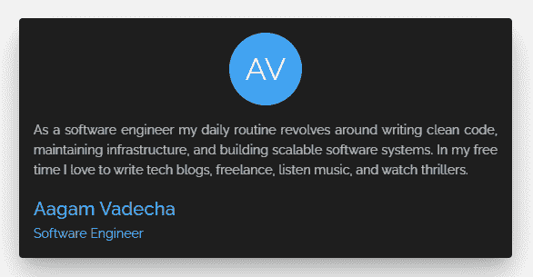
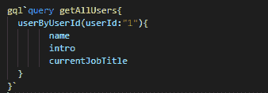
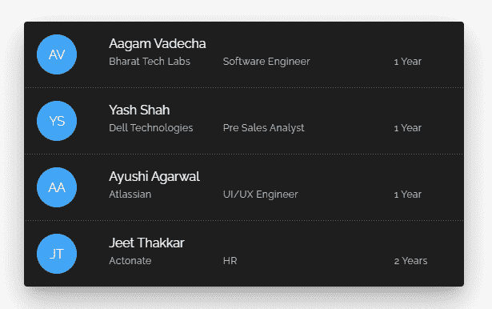
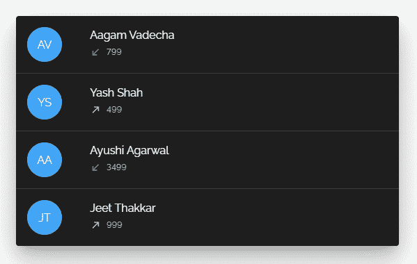
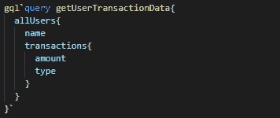

# GraphQL 与 REST API——后端 API 开发应该使用哪个？

> 原文：<https://www.freecodecamp.org/news/graphql-vs-rest-api/>

REST 和 GraphQL 都是开发后端 API 的标准方法。但是在过去的十年里，REST APIs 已经成为开发后端 API 的主流选择。许多公司和开发者在他们的项目中积极地使用它。

但是 REST 有一些限制，还有另外一个替代方案——graph QL。GraphQL 是在大型代码库中开发 API 的绝佳选择。

## GraphQL 是什么？

GraphQL 由脸书于 2012 年开发，供内部使用，并于 2015 年公开。它是 API 的查询语言，也是用现有数据完成这些查询的运行时。许多公司[在生产中使用它](https://graphql.org/users/.)。

官网是这样介绍 GraphQL 的:

> GraphQL 为 API 中的数据提供了完整且易于理解的描述，使客户能够准确地要求他们需要的东西，使 API 更容易随时间发展，并支持强大的开发工具。

我们将在这个博客中看到这一切是如何运作的。

## REST APIs 的问题

*   查询多个端点
*   过度蚀刻
*   蚀刻不足和 n+1 请求问题
*   无法快速应对不断变化的客户端需求
*   后端控制器和前端视图之间的高度耦合

那么，这些问题是什么，GraphQL 是如何解决的呢？嗯，我们会学到更多。但是首先我们需要确保你熟悉 GraphQL 的基本概念，比如类型系统、模式、查询、变异等等。

现在我们将通过一些例子来更好地理解使用 REST APIs 的缺点。

### 过度蚀刻

让我们假设我们需要在 UI 中显示这个用户卡。



有了休息，请求就要有**得到**在 **`/users/1`** 。

这里的问题是服务器返回一个固定的数据结构，就像这样:

```
{
    "_id": "1",
    "name": "Aagam Vadecha",
    "username": "aagam",
    "email": "testemail@gmail.com",
    "currentJobTitle": "Software Engineer",
    "phone": "9876543210",
    "intro": "As a software engineer my daily routine revolves around writing cleancode, maintaining infrastructure, and building scalable softwaresystems. In my free time I love to write tech blogs, freelance, listenmusic, and watch thrillers.",
    "website": "https://www.aagam.tech",
    "gender": "MALE",
    "city": "Surat",
    "state": "Gujarat",
    "country": "India",
    "display_picture": "8ba58af0-1212-4938-8b4a-t3m9c4371952",
    "phone_verified": true,
    "email_verified": true,
    "_created_at": "2021-03-08T14:13:41Z",
    "_updated_at": "2021-03-08T14:13:41Z",
    "_deleted": false
}
```

服务器返回额外的数据(除了姓名、简介和工作名称),这些数据在客户端构建卡片时并不需要，但是响应仍然拥有这些数据。这叫做**过蚀刻**。

过度提取会在每个请求中带来客户不需要的额外数据。这增加了有效负载的大小，最终会影响查询的整体响应时间。

更糟糕的是，当一个查询从多个表中获取数据时，即使客户机当时并不需要，情况也会恶化。所以如果我们能避免它，我们肯定应该

使用 GraphQL，请求主体中的查询如下所示:



它只会根据客户端的要求返回`name`、`intro`、`currentJobTitle`，解决了过蚀刻问题。

### 蚀刻不足和 n+1 请求问题

现在让我们假设这个用户列表需要显示在 UI 中。



对于 REST，考虑到“experience”是一个具有 user_id 外键的表，有三个可能的选项

1.  一种是在 GET /users 请求中从所有外键链接表向 users 表发送一些精确的固定数据结构，许多框架都提供了这种选项。

```
{
    "_id": "1",
    "name": "Aagam Vadecha",
    "username": "aagam",
    "email": "testemail@gmail.com",
    "currentJobTitle": "Software Engineer",
    "phone": "9876543210",
    "intro": "As a software engineer my daily routine revolves around writing cleancode, maintaining infrastructure, and building scalable softwaresystems. In my free time I love to write tech blogs, freelance, listenmusic, and watch thrillers.",
    "website": "https://www.aagam.tech",
    "gender": "MALE",
    "city": "Surat",
    "state": "Gujarat",
    "country": "India",
    "display_picture": "8ba58af0-1212-4938-8b4a-t3m9c4371952",
    "phone_verified": true,
    "email_verified": true,
    "_created_at": "2021-03-08T14:13:41Z",
    "_updated_at": "2021-03-08T14:13:41Z",
    "_deleted": false,
    "experience": [
        {
            "organizationName": "Bharat Tech Labs",
            "jobTitle": "Software Engineer",
            "totalDuration": "1 Year"
        }
    ],
    "address": [
        {
            "street": "Kulas Light",
            "suite": "Apt. 556",
            "city": "Gwenborough",
            "zipcode": "929983874",
            "geo": {
                "lat": "-37,3159",
                "lng": "81.1496"
            }
        }
    ]
}
```

但是这种方法会产生昂贵的查询，也会过度提取所有其他/用户的请求，最终会从所有外部表(地址、经验)中返回大量数据，这在大多数情况下是不需要的。

例如，您希望用户数据在前端的其他地方，您只需要显示用户的网站，因此您发出一个 **GET user/1** 请求。但是它过度提取了经验表和地址表中的数据，这是您根本不需要的。

2.  第二个选项是客户端可以多次访问服务器，如下所示:

```
GET /users 
GET users/1/experience 
```

这是一个蚀刻不足的例子，因为一个端点没有足够的数据。但是多个网络调用会减慢进程并影响用户体验。:(

此外，在这个特定的**列表**的例子中，欠挖升级，我们遇到了 n+1 请求问题。

您需要进行一个 API 调用来获取所有用户，然后针对每个用户进行单独的 API 调用来获取他们的体验，如下所示:

```
GET /users 
GET /users/1/experience 
GET /users/2/experience 
...
GET /users/n/experience. 
```

这就是所谓的 n+1 请求问题。为了解决这个问题，我们通常会采取第三种方法，我们现在就来讨论一下。

3.  另一种选择是在服务器上制作一个定制控制器，它返回在那个时间点满足客户机需求的数据结构。

```
GET /user-experience 
```

这是现实世界中 REST API 的主要情况。

另一方面，一个简单的 GraphQL 请求可以无缝地工作，而不需要在服务器端进行任何开发，它看起来就像这样:


没有过度蚀刻，没有蚀刻不足，也没有服务器上的开发。简直太棒了！

### 前端视图和后端 API 之间的紧密耦合

好的，所以你可能会说你可以只使用 REST，用一次初始开发的努力来制作服务器控制器，并且很开心——对吗？

但是使用定制控制器有一个很大的缺点。

我们已经与前端视图和后端控制器形成了紧密的耦合，所以总体来说它需要更多的努力来应对客户端的变化。这也降低了我们的灵活性。

作为软件工程师，我们知道需求变化的频率。此时的定制控制器 **GET /user-experience** 根据前端视图想要显示的内容(用户名和当前角色)返回数据。所以当需求改变时，我们需要重构客户端和服务器端。

例如，在相当长的一段时间后，需求发生了变化，用户界面需要显示用户最近的交易信息，而不是体验数据。



对于 Rest，我们需要在前端层进行相关的修改。此外，为了从后端返回事务数据而不是体验数据，定制控制器要么需要重构(数据发送、路由等)，要么我们需要制作一个新的控制器，以防我们希望保留旧的控制器。因此，基本上，客户端需求的变化会极大地影响服务器返回的内容——这意味着前端和后端之间的紧密耦合！

最好不要在服务器上做任何改动，只需在前端做改动。

有了 GraphQL，我们不需要在服务器端做任何改变。前端查询中的变化会很小，如下所示:



没有服务器 API 重构、部署、测试–这意味着节省了时间和精力！

## 结论

我希望您能从这篇文章中看到，GraphQL 在许多方面都比 REST 有很多优势。

最初安装 GraphQL 可能需要更多的时间，但是有许多专业人员可以使这项工作变得更容易。即使一开始会花更多的时间，但它会给你带来长期的优势，完全值得。

****感谢阅读**！**
我希望你喜欢这篇文章，它给了你更多的见解，帮助你做出下一个选择。如果你需要帮助，请随时通过 LinkedIn 联系我。