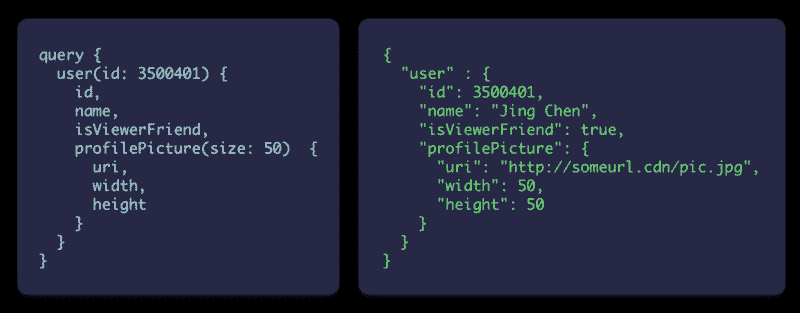
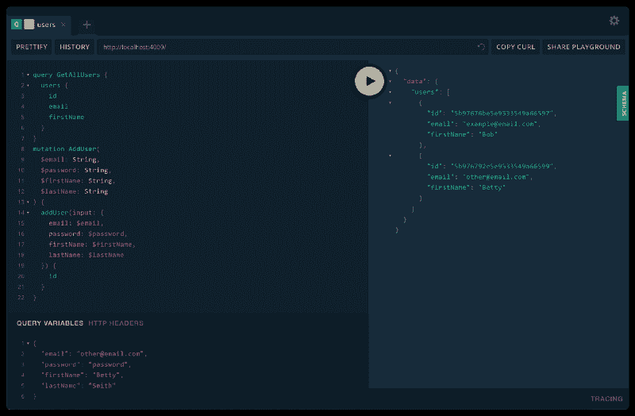
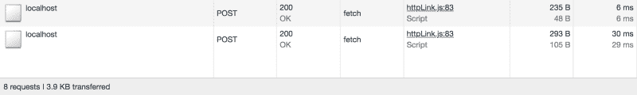
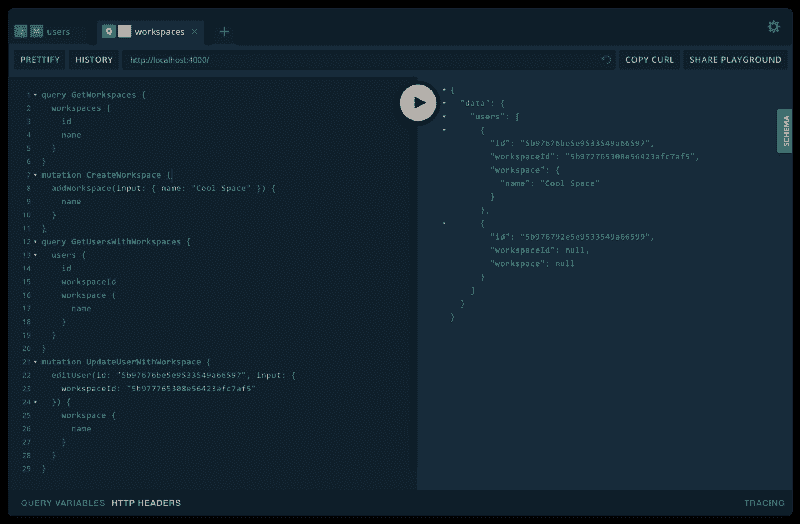

# 如何用 Node.js 构建一个完整的 GraphQL 服务器

> 原文：<https://www.freecodecamp.org/news/graphql-zero-to-production-a7c4f786a57b/>

杰克·r·斯科特

# 如何用 Node.js 构建一个完整的 GraphQL 服务器

所以，你可能会想——这是不是又一个只会说一大堆大话而不会真正帮助我实现任何东西的 hullabaloo GraphQL 教程？

✋:答案是否定的

在阅读了许多关于如何构建 GraphQL 服务器的指南后，我意识到没有一个能完全让我达到我想要的目标。多么令人沮丧。

我花了比预期更长的时间才开始运行。

因此，我*致力于*给你一个超越基础的教程，给你一些如何在现实世界中实现服务器的见解。这样每个人都可以享受使用 GraphQL 的真正美妙感觉。

**？你怎么知道这是合法的？**

这里是本教程中解释的所有代码的工作版本。来吧，克隆它，并尝试它。我还将在本教程的底部包含另一个指向资源库的链接。请随时提出拉动请求或启动回购，以便我们尽可能做得更好！

**？旁注。**

GraphQL 超级灵活。它可以以一百万种不同的方式实现——这就是为什么会有这么多混乱。每个人都有自己的观点和构建应用的方法。这是我的。如果你有建设性的反馈，我可以用来改进本教程，请分享！

好吧，我们开始吧！

### 一点点背景？‍

在我开始之前，给那些还不知道的人介绍一些背景可能是个好主意。GraphQL 是脸书在 2012 年创建的(再次感谢)。它是作为现有的结构化服务器查询 REST 标准的另一种选择而开发的。

**？什么是休息？**

这是你睡觉时得到的东西…明白了吗？

Why does this human think he is funny?

老实说，我希望这篇文章尽可能简洁。为了帮助解释，这里有一个[链接](https://www.codecademy.com/articles/what-is-rest)到一篇解释 REST 概念的文章。脸书创建 GraphQL 作为替代的原因是因为 REST 标准有几个关键问题:

1.  获取复杂对象需要多次调用服务器——滞后。
2.  你得到的比你要求的多。REST 通常指定服务器上数据的形状。因此，你最终会得到一堆你根本用不到的数据。
3.  要准确理解从服务器上获得的信息需要做大量的工作——不太容易预测。

当时，脸书有一大堆热爱测试酷新概念的热情开发人员。所以他们让一些人开始研究一个新概念，这个新概念后来成为 GraphQL。他们想向他们的服务器确切地询问他们想要什么，并且知道他们将确切地得到那个。没有绒毛。？

所以…他们创造了一种专门为服务器查询设计的新语言。这就是为什么 GraphQL 被描述为“[你的 API 的查询语言](https://graphql.org/)”。

上面是一个 GraphQL 查询的例子，以及一个 JSON 响应的例子。我会描述正在发生的事情…但这是不言自明的。

我不打算深入探讨“什么是 GraphQL ”,因为有很多关于这个主题的优秀文章。然而，如果你想了解更多信息，[这里有一篇很棒的文章](https://medium.freecodecamp.org/so-whats-this-graphql-thing-i-keep-hearing-about-baf4d36c20cf)，它给了你 GraphQL 的概念和基础的一个很好的概述。

让我们继续前进！

### 把密码给我！？‍?

好吧，好吧…哎呀，你要求…我得到了代码。但是在我们开始之前，我们需要[创建一个新的 Node.js 库](https://codeburst.io/getting-started-with-node-js-a-beginners-guide-b03e25bca71b)并安装一些 NPM 依赖项。

？热门提示:查看 P [arcel.js](https://parceljs.org/) 获得一个很棒的应用捆绑器，它可以帮助你在几秒钟内整理好你的开发环境(确保将你的目标设置到 n `ode` 环境)。P [arcel](https://parceljs.org/) 被 C [odeSandbox 使用。](https://codesandbox.io/)

附注:我假设你已经知道如何建立 Node.js 存储库。如果没有，那么本文中的概念对您来说可能有点复杂。你还是可以跟着去大致了解一下。

我们的 NPM 属地:

1.  [阿波罗-服务器](https://www.npmjs.com/package/apollo-server)
2.  [猫鼬](https://www.npmjs.com/package/mongoose)
3.  [graphql-tools](https://www.npmjs.com/package/graphql-tools)

坚持住…？阿波罗是谁，我们为什么要他的服务器？

先说清楚，阿波罗不是人。这是一群在 GraphQL 领域取得惊人进展的尖端开发人员。他们已经创建了一套生产就绪的工具和代码，这将使我们的生活超级容易开始设置我们的 GraphQL 服务器。

太棒了，现在我们的依赖项已经安装好了，让我们开始创建一个索引文件作为应用程序的入口点。

？文件:s `rc/index.ts`

我在代码中添加了一些注释，这将有助于解释文件中发生了什么。本质上，我们已经创建了一个服务器，并为服务器提供了一个模式，该模式为我们的查询(`type Query`)保存了一个“空”类型，为我们的变异(`type Mutation`)保存了一个“空”类型。

*   空意味着它还没有属性。

就像我之前说的，我想确保这篇文章尽可能简洁。我假设您对如何编写基本的 GraphQL 模式有点熟悉。但是如果你不知道，[这里有一个基本模式如何工作的链接](http://graphql.github.io/learn/schema/#the-query-and-mutation-types)。

接下来，我们将为使用 mongoose 的用户建立一个数据库表。我们的用户将拥有一些基本的属性，我们可以使用它们在以后进行查询。

？文件:s `rc/common/users/user.model.ts`

在上面的文件中，我们使用 mongoose 创建了一个用户模型。如果你对[mongose](https://mongoosejs.com/)不熟悉，它是一个优雅的包装器，当数据进入数据库时，你可以用它来验证数据。它也给了我们一些强大的功能，比如虚拟属性、简单的数据查询等等。

现在我们有了一个模型，可以用来保存和请求数据库中的数据，还有一个运行空的 GraphQL 服务器的服务器。我们所需要做的就是*将两者*连接在一起！

为此，我们将创建一个包含 2 个内容的文件:

1.  一组 GraphQL 类型——告诉客户端我们拥有“什么”数据
2.  一组匹配的 GraphQL 解析器函数——它告诉服务器“如何”做我们的类型所描述的事情。

我将这两个代码段放在同一个文件中，因为这让我在开发时更加轻松。

？文件:s `rc/common/users/user.schema.ts`

天啊。这需要理解很多…所以让我们分解一下，从我们的类型定义开始:

*   这是一个简单的 GraphQL 类型。这只是告诉我们用户的形状，以便客户端可以正确地查询它。你可以在文档中找到更多的[。](https://graphql.org/learn/schema/)
*   `input UserFilterInput { ... }`:类似于“类型”对象，输入定义了复杂参数的结构，即比`String`、`ID`、`Int`、`FLoat`或`Boolean`更复杂的东西。
*   `extend type Query { ... }`:还记得我们在索引文件中创建了根查询类型的时候吗？嗯，这是指那个。我们正在扩展这个根查询，并定义我们希望向客户公开的功能。**我们为什么要这样做？**呸……这并不是我想要的方式(这有点儿粗鲁)……不幸的是，这是众多糟糕的选择中最好的方式。请随时给我一个更好的建议。
*   以我们扩展根查询的同样方式，我们也扩展了根变异。

现在，让我们总结一下用户解析器中发生的事情:

*   我们的解析器函数名与类型定义中的字段名称匹配。这有助于 Apollo 知道哪些功能做什么。
*   `users: async (_, { filter = {} }) => { ..`。}:嗯，这句台词对于没看过的 devs 来说是不是有点拗口。不要担心，这只是说明对于适当的用户，我们正在给[分配一个匿名函数](https://en.wikibooks.org/wiki/JavaScript/Anonymous_functions)，它使用 [ng async / aw](https://javascript.info/async-await) ait 来查询数据库并返回一些用户。简单？。函数中的参数与 Apollo 服务器文档中的参数相匹配，您可以在这里找到这些文档。
*   这个语法就是我们如何使用 mongoose 来获取或保存数据到数据库的。这非常简单，一旦你明白了，你可以在这里找到猫鼬的[文档。](https://mongoosejs.com/docs/index.html)
*   这是大多数人会感到困惑的地方。这个“toGraph”函数来自于我们的 mongoose 模型文件(在模型文件中找到它说`userSchema.method('toGraph', ...`)。我们需要这个函数的原因是，Mongoose 不返回简单的 JavaScript 对象。相反，它返回一个复杂的对象，带有一些 GraphQL 不喜欢的随机属性。因此，通过使用`toGraph`方法，我们将复杂对象转换为 GraphQL 可以处理的简单对象。

**？哇哦。那是大脑超负荷运转。**

如果您不能马上理解所有代码，也不要担心。一旦你完成了教程，你将能够在你的计算机上克隆和试验[范例库](https://github.com/jackrobertscott/graphql-api-demo)。

好吧。现在让我们把它们全部放回索引文件中…

？文件:s `rc/index.ts`

我们需要做的就是导入我们的类型定义和解析器，然后将它们添加到我们的模式中。如果你去启动你的应用程序(希望你已经配置了一个启动脚本，即`npm start`)，你应该看到你的应用程序将在 [http://localhost:4000](http://localhost:4000) 上打开。

**故障排除:**不要忘记安装并启动您的 MongoDB 数据库。[这里有一篇文章](https://www.codecademy.com/articles/tdd-setup-mongodb-2)的链接，向你展示如何做到这一点，如果你还没有的话。

当我们在浏览器中导航到服务器时，我们会看到 Apollo 给了我们一个有用的小工具，叫做游乐场。我们可以用它来测试我们的 GraphQL 服务器。下面是我在我们的 API 上测试的几个查询的例子。

> 你可能会疑惑；`query GetAllUsers`或者`mutation AddUser`是什么意思？

不要担心，这纯粹是为了帮助您调试应用程序。它们只是名字，通过它们你可以识别你的 GraphQL 请求。它们没有给查询或变异增加额外的功能。你可以在这里找到更多关于[如何编写查询和变异的信息。](https://graphql.org/learn/queries/)

**？‍嘿 J [ack，](https://twitter.com/jacrobsco)还有一件事我还是不确定。问*和答*的区别是什么？****

很棒的问题！我就知道你会问。为了真正理解这一点，我们需要看看在我们的服务器下面发生了什么。许多人认为查询相当于一个`GET`请求。突变适用于所有其他人，即`POST`、`PUT`、`PATCH`和`DELETE`，但这并不完全正确。

让我们看一个例子，从我们的 Apollo GraphQL playground 向我们的 GraphQL 服务器发出两个请求——这是 Apollo Server 直接提供的。

如您所见，`query`和`mutation`请求都是`POST`请求。原因是它们都有能力将变量传递到它们的请求中，例如`users (limit: $maxUsers) { ... }`。

两者的真正区别在于:

1.  查询是并行执行的。
2.  突变是连续执行的。

这样，查询可以快速执行*，而变异可以可靠地执行*。感谢 [Prisma](https://www.prisma.io/blog/experimental-graphql-106b07424435/) 在这一点上的帮助。**

### **⏰是时候升级了！**

**到目前为止，我们做得相当不错，我们知道如何:**

*   **✅创建了一个基本服务器。**
*   **✅创建了一个猫鼬模式来验证我们数据库数据。**
*   **✅使用类型定义在服务器上定义我们的 GraphQL 数据结构。**
*   **✅使用解析器将我们的 mongoose 模式连接到 GraphQL 服务器。**
*   **✅通过阿波罗游乐场进行了一些查询和变异。**

**我要说这是一个公平的酱油瓶——凯文 07。但是仍然缺少一些东西…**

****？当我们有相关的数据库项目时，我们如何处理呢？****

**其实挺简单的，动手吧！**

**首先，我们将假设每个用户都与单个工作区相关/关联。在这种情况下，我们可能希望从与用户相关的工作区中请求信息，同时请求关于该用户的信息。**

**为此，我们首先要定义一个新的 mongoose 模型。我们将使用它从数据库中保存和请求工作区。**

**？文件:s `rc/common/workspace/workspace.model.ts`**

**类似于我们创建用户的方式，我们还将为我们的工作区创建一个模式文件，以便他们也可以自己查询。**

**？文件:s `rc/common/workspace/workspace.schema.ts`**

**很好，现在我们只需要更新索引文件，这样它就可以识别我们的工作区 GraphQL 模式和解析器。注意:要合并解析器，我们需要使用 lodash 的`merge`函数，它将两个对象深度合并在一起。**

**？文件:s `rc/index.ts`**

**一旦您实现了上面的代码，您将能够创建和查询工作空间，就像我们对我们的用户所做的那样！但这并不比以前酷多少。真正酷的是当我们“通过”用户对象查询关于工作区的数据时。**

**要做到这一点，我们可以使用 mongoose 的一个很酷的特性，它允许我们相互引用数据库项(例如，用户的工作空间)。这些引用存储为特殊的`ObjectId`类型。继续更新我们的用户模型，以便它可以为我们的用户保存工作区的 id。**

**？文件:s `rc/common/user/user.model.ts`**

**最后，我们需要更新用户的模式文件，以便 Apollo 知道如何解析对用户工作区的(嵌套)引用。**

**？文件:s `rc/common/user/user.schema.ts`**

**让我们来看看我们刚刚在用户模式文件中所做的两个主要更改:**

1.  **`type User`现在有了两个额外的属性:`workspaceId`(它与 Mongoose 模型相匹配)和`workspace`(当我们查询 workspace 对象时，它将是我们放置它的地方)。**
2.  **我们的解析器中现在有一个名为`User`的属性。这是我个人最喜欢的 GraphQL 部分之一，因为它可以让你解析一个类型的单个属性。在上面的例子中，我们通过获取用户的 workspaceId 来解析`workspace`属性，然后使用 Mongoose 从数据库中获取它。这与我们为常规查询解析器所做的一样，但这次它是一个嵌套对象。**

**现在，我们可以回到操场，开始一起创建和查询用户和工作区。**

****

**太好了。我们涵盖了您可以转变为完全正常工作的服务器的基本要素。**

****？天啊。您已经开始使用 GraphQL 了！****

****

### **授权？️‍**

**所以目前，我们有一个非常好的 GraphQL API。但是仍然有一个问题:对于谁可以访问我们的数据没有限制！要解决这个问题，我们需要添加身份验证和授权。**

****✋挂机……*认证*和*授权*不一样？****

**这是一个常见的误解，但理解它很重要，因为它将帮助您构建更好的 API:**

*   ****认证**指的是识别请求信息的人，即找出是哪个用户向 API 发送请求。**
*   ****授权**是指请求者可获得的权限，即用户拥有哪些角色，以及该角色是否足以允许该请求。**

****？那么，我们如何实现它呢？****

**另一个极好的问题，你真是一个好奇的人！不幸的是，有很多方法可以做到这一点，这取决于你希望你的应用程序如何工作。例如:**

*   **你可能只希望用户用 GitHub auth 注册，而不是用电子邮件和密码注册。**
*   **您可能有 3 个不同的用户角色，而不是 100 个细粒度的用户角色。**
*   **可能根本没有用户，你的整个应用程序可以匿名使用。**

**在任何情况下，实现身份验证和授权的方式取决于您。但是如果你想要一个关于从哪里开始的指南，[这里有一个链接](https://www.prisma.io/blog/graphql-directive-permissions-authorization-made-easy-54c076b5368e/)指向 Prisma 的一篇很棒的文章，它可以帮助你开始向你的 API 添加 auth。**

**为了使它更简单，我还在我们的演示库中添加了一些基本的身份验证，您可以浏览和查看。请随意使用更好的 auth 示例来改进存储库，并提交一个 pull 请求！**

> **~ [这里有一个演示 GraphQL 库的链接](https://github.com/jackrobertscott/graphql-api-demo) ~**

****？该死的。我们成功地制作了一个 GraphQL 服务器！去你的！****

****

**如果你喜欢这篇文章，请给它几个**掌声**(最多可以留 50 个)或者你可以**评论**如果你有任何问题，我会尽力回答！？**

**在 [Twitter](https://twitter.com/jacrobsco) 上关注我。**

**谢谢！**

**杰克·斯科特的更多帖子。**

*   **[我如何在 4 天内创办一家公司](https://medium.com/@jackrobertscott/startup-validation-done-right-6c7c62229e9)**
*   **[获得你的第一批 100 个创业客户](https://medium.com/@jackrobertscott/getting-your-first-100-startup-customers-8cafd0ee8e7d)**
*   **[再见 Redux](https://hackernoon.com/goodbye-redux-26e6a27b3a0b)**