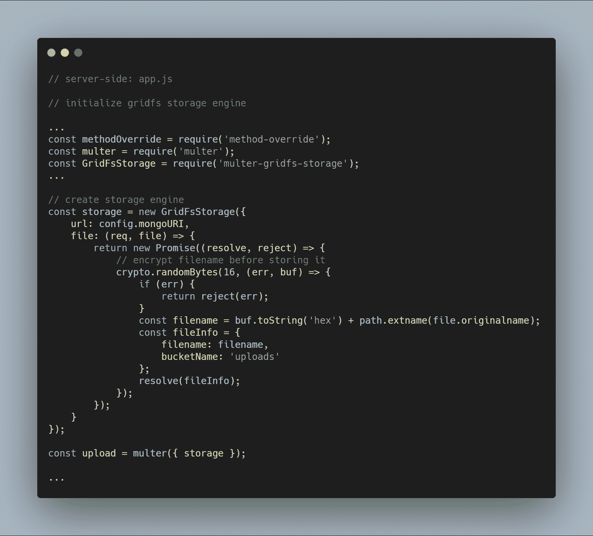
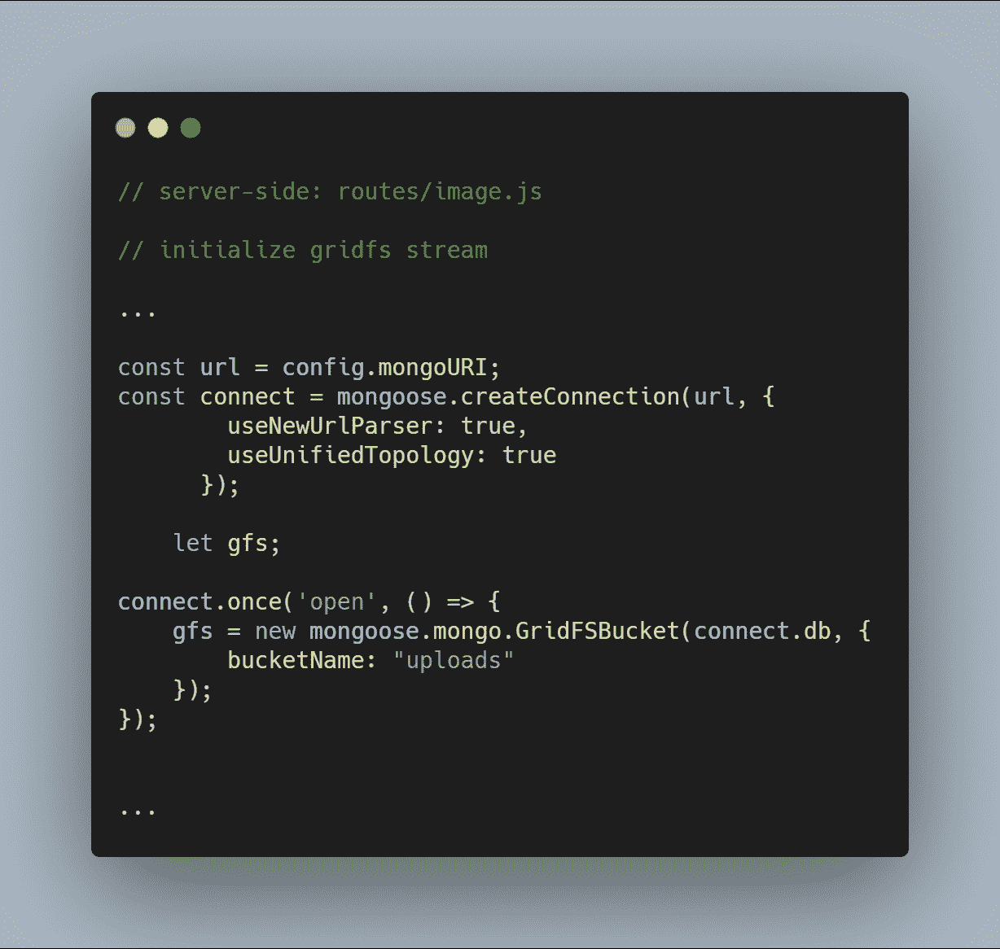
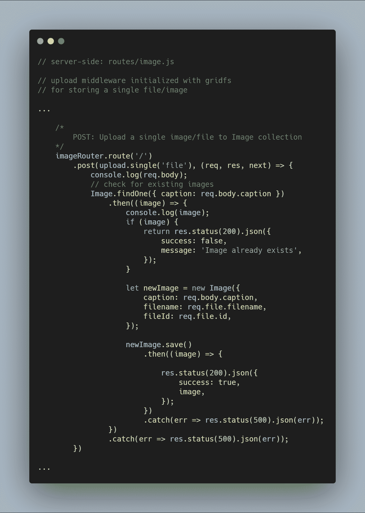
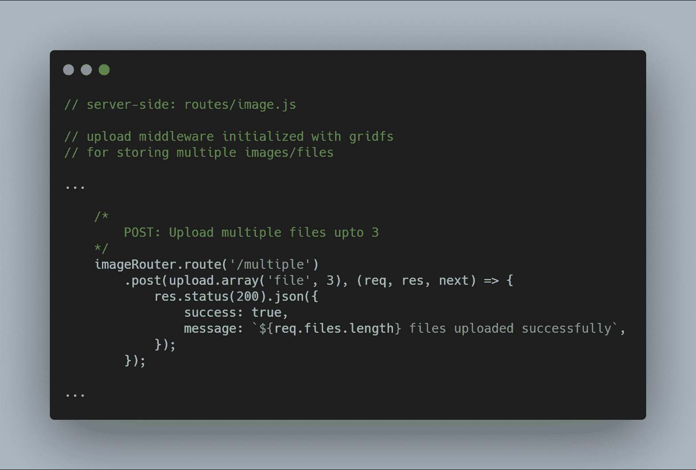
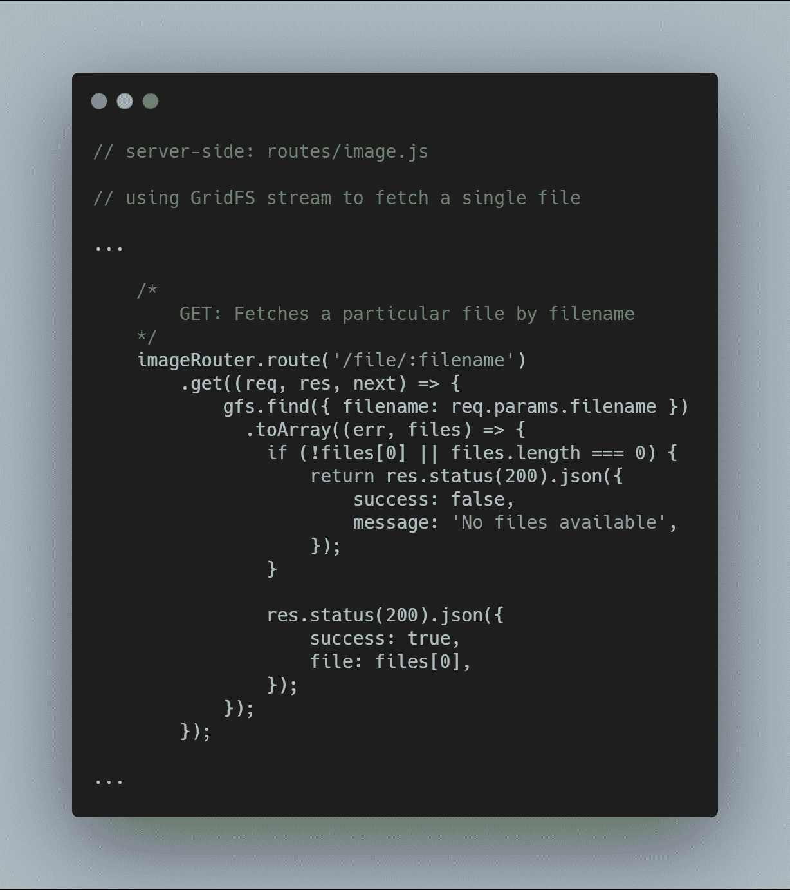
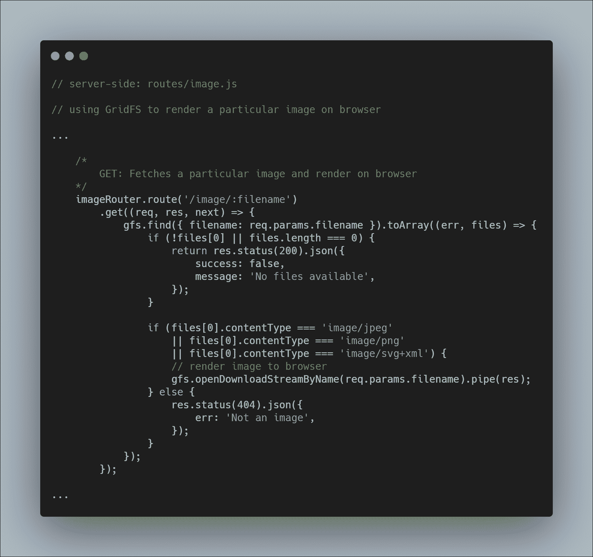
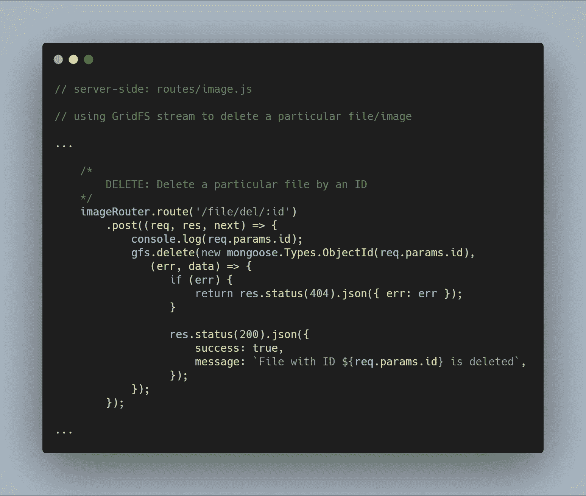

# GridFS 指南:如何使用 Node 轻松地将文件和图像上传到 MongoDB

> 原文：<https://www.freecodecamp.org/news/gridfs-making-file-uploading-to-mongodb/>

文件存储是各种类型的应用程序的多个进程中所需的一项重要功能。像`Content Delivery Networks (CDNs)`这样的进程的存在，通过像 Amazon Web Services 这样的第三方云选项设置，以及本地文件存储选项，使得构建这样一个特性变得更加容易。

然而，通过单个 API 调用将文件直接存储到数据库中的概念吸引了我很长一段时间。这就是 GridFS 对我的影响。

Probably not the best way to go about implementing a file storage system

## GridFS -外行人的理解

MongoDB 有一个名为 [GridFS](https://docs.mongodb.com/manual/core/gridfs/) 的驱动规范来上传和检索文件。GridFS 允许您存储和检索文件，包括超过 BSON 文档大小限制 **16 MB** 的文件。

GridFS 基本上将一个文件分成多个块，作为单独的文档存储在两个集合中:

*   *`chunk`集合*(存储文档部分)，以及
*   *`file`集合*(存储后续的附加元数据)。

每个区块的大小限制为 255 KB。这意味着最后一个区块通常等于或小于 255 KB。听起来很不错。

当您从 GridFS 中读取数据时，驱动程序会根据需要重组所有的数据块。这意味着您可以根据您的查询范围读取文件的各个部分。例如听一段音频文件或获取一段视频文件。

**注意:**最好使用 GridFS 来存储通常超过 16 MB 大小限制的文件。对于较小的文件，建议使用 BinData 格式将文件存储在单个文档中。

这概括了 GridFS 的一般工作方式。是时候深入一些工作代码，看看如何实现这样的系统了。

## 说够了，给我看看代码

在我们的设置中，我们使用 Node.js 访问 MongoDB 的云实例。您可以在这里找到示例应用程序的代码库。

[tarique93102/gridfs-file-storageContribute to tarique93102/gridfs-file-storage development by creating an account on GitHub.tarique93102GitHub](https://github.com/tarique93102/gridfs-file-storage)

我们将完全专注于与 GridFS 功能相关的代码段。我们将学习如何设置它，并使用它来存储文件、检索文件或特定文件，以及删除特定文件。那我们开始吧。

### 初始化存储引擎

初始化引擎需要的包有 [`multer-gridfs-storage`](https://www.npmjs.com/package/multer-gridfs-storage) 和 [`multer`](https://www.npmjs.com/package/multer) 。我们还使用`method-override`中间件来实现文件的删除操作。npm 模块`crypto`用于加密从数据库中存储和读取的文件名。

一旦使用 GridFS 的存储引擎被初始化，您只需使用 multer 中间件调用它。然后，它被传递到执行各种文件存储操作的相应路由。

### 初始化 GridFS 流

我们初始化一个 GridFS 流，如下面的代码所示。需要该流从数据库中读取文件，并在需要时帮助将图像呈现给浏览器。

### 上传单个文件或图像

我们重用了之前创建的上传中间件。

**注意:**名称`file`被用作`upload.single()`中的一个参数，因为我们有一个相似名称的密钥携带着从客户端发送的文件。

### 上传多个文件或图像

我们也可以一次上传多个文件。我们不得不用`upload.multiple(<number of files>)`来代替`upload.single()`。

**注意:**上传的文件数可以少于定义的文件数。

### 从数据库获取所有文件

使用初始化的流，我们可以使用`gfs.find().toArray(...)`获取特定数据库中的所有文件。一旦获得文件，我们就将它映射到一个数组，并发送响应。

### 通过文件名获取单个文件

基于像`filename`这样的特定属性查询单个文件的 GridFS 非常简单。使用 GridFS 流，可以通过函数`gfs.find({<add query here>})`查询数据库。

### 将提取的图像渲染到浏览器

这是一个稍微棘手的部分，因为你不仅要从数据库中获取一个文件，还要在各自的浏览器上以图像的形式呈现它。我们正常取文件。这一过程没有变化。

然后在 gfs stream 上的方法`openDownloadStreamByName()`的帮助下，我们可以很容易地渲染一个图像，因为它返回一个可读的流。完成这些后，我们可以使用 JavaScript 的`pipe()`来传输响应。

### 按 Id 删除特定文件

删除文件同样简单。我们使用带参数`_id`的流方法`delete()`来查询和删除相关文件。

这些是存储引擎设计提供的主要功能。我利用所讨论的 GridFS 特性创建了一个简单的图片上传应用程序。您可以在[库](https://github.com/tarique93102/gridfs-file-storage)中更深入地研究代码。

## 结论

我花了一些时间和相当大的努力来理解如何在个人项目中使用 GridFS。正因为如此，我想确保至少有一个人不必投入同样多的时间。

说到这里，我建议谨慎使用 GridFS。它不是解决您所有文件存储问题的灵丹妙药。尽管如此，这仍然是一个需要了解和意识到的极好的规范。

如果您有任何疑问或关注，可以在帖子中评论或通过 [`LinkedIn`](https://www.linkedin.com/in/tarique-ejaz/) 联系我。

同时，继续编码。