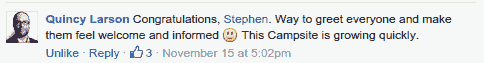
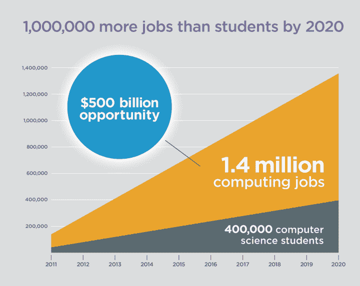
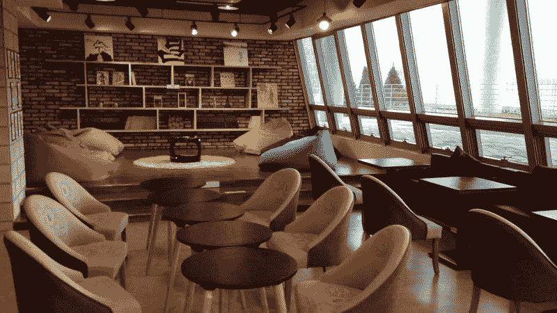

# 增长侵入你城市的露营地

> 原文：<https://www.freecodecamp.org/news/growth-hacking-your-free-code-camp-group-8cf76300a5d1/>

作者斯蒂芬·马约

# 增长侵入你城市的露营地

超过 500 个城市现在有免费的代码营露营地。这些大多是新的，仍然相对不活跃。这篇文章会给你一些建议，让你所在城市的露营地成为结识新朋友和一起编码的好地方。

几周前，我放弃了做一名 ESL 教师，并讲述了我向全栈网络开发职业过渡的故事。绝大多数人的反应都是积极的，这让我感到欣慰。

伙计们。

Free Code Camp Busan, November 2015

我把我的成功和快速进步归功于我周围的其他有抱负的程序员。我主要是利用来自自由代码营开源社区的内容独自学习，而我的“营员”伙伴们是最支持我的。

就连创办自由代码营的昆西·拉森也在百忙之中抽出时间来给予支持和鼓励！

Still has time to write personal messages. Very supportive community!

在自由代码营，你可以在各种各样的 [Gitter 聊天室](https://gitter.im/FreeCodeCamp/FreeCodeCamp)和其他学习者聊天，但是强烈建议你在你的城镇或城市加入或开办一个当地的露营地。从那里可以认识现实生活中的其他编码员，以便结对编码，互相学习。我目前正在韩国釜山完成我的最后一份教学合同，当我发现最近的露营地在首尔有三个小时的路程时，我知道我必须成立自己的团队。

像大多数团体一样， [FCC Busan](https://www.facebook.com/groups/free.code.camp.busan/) 开始时规模很小，主要依靠脸书把消息传出去。但是仅仅三个月后，我们在脸书就有了 100 多名成员，我们的聚会经常有大约 20 名有抱负的程序员……而且这个数字每一次都在增加！

这就把我们带到了这篇文章的主题。这里有一个我的成长黑客技巧的列表，它会让参加你聚会的人增加一倍甚至两倍。所以事不宜迟，让我们开始吧。

#### 分享一个令人信服的理由

简单的脸书公告宣传你的聚会就足够好了，但你也应该重温你的营销技巧，并解释(或更好地展示)为什么学习编码是一项有价值的技能。对于像你我这样的人来说，开始学习的原因是显而易见的，但是必须提醒其他人了解编程语言的机会和好处。

对我来说，从事编码工作的最有说服力的理由之一是开始一份薪水更高的新工作。在过去的七年里，我喜欢做一名教师，但我只是没有足够的收入来感到安全和有保障。拥有一个更光明的未来，而不必决定是为退休存钱还是付房租，这是学习编码的一个非常令人信服的理由！

Share compelling reasons to start coding.

韩国有很多年轻的、受教育过度的千禧一代，他们担心未来，只是觉得…被困住了！韩国人正面临着一个竞争激烈、前景黯淡的就业市场，就像那些来韩国找教师工作的说英语的韩国人一样。

所以我招募更多人的营销角度是学习编程语言=更好的工作=更好的未来。而且很管用！列出学习编码的令人信服的理由，并找出哪些理由能引起你所在社区的人的共鸣。

#### 弄清楚你的入职流程

如果你改进了你的脸书帖子，并在公告中包含了令人信服的信息，那么将会有更多的人加入你当地小组的脸书页面。但是你如何说服他们定期去聚会，并成为 JavaScript 狂热分子呢？

你必须通过启动入职流程给人留下良好的第一印象。

对于每一个加入脸书 FCC Busan group 页面的新成员，我总是会写一封个性化的欢迎邮件，并确切地告诉他们如何开始。为了让这变得更容易，我制作了一个谷歌幻灯片演示来解释什么是自由代码营，还制作了一个在 FCC 网站上播放以及如何使用它的截屏。

要看这可能是什么样子，看看我的:

梅森，欢迎加入我们的团队！你为什么对编码感兴趣？不管是什么原因，我相信你会喜欢这里的！

*首先，我建议你在[www.freecodecamp.com](http://www.freecodecamp.com/)创建一个免费账户。[这个谷歌幻灯片演示](https://docs.google.com/presentation/d/1YJYkJ6UyyxO7nwwZGJ0UPMciFR_CizSKVfYkiJypzig/edit#slide=id.p)将告诉你我们小组的基本情况。*

*本视频将详细介绍如何使用 FCC:*

**freeCodeCampBusan() [欢迎光临！](https://drive.google.com/file/d/0B3KezJtvS9TAbFRhckQxMS1CT2s/view)**
[【drive.google.com】](https://drive.google.com/file/d/0B3KezJtvS9TAbFRhckQxMS1CT2s/view)

*有问题请告诉我，编码快乐！*

#### 上街

想想在脸书时代之前，我们是如何组织俱乐部和聚会的。人们习惯于:

*   在咖啡店、大学和图书馆张贴传单
*   利用口口相传，亲自邀请朋友和熟人
*   在会议、农贸市场和其他特殊活动中设立信息亭

这些方法今天仍然有效，即使不比脸书公告更好，它们也一样成功。釜山有很多面向外籍人士的脸书团体，你可能很难从每天发布的数百个其他公告中听到它们。所以试着偶尔上街，永远不要低估你在脸书之外建立的真实人际关系的价值。

Alex is promoting FCC Busan at the Foreign Culture Market in Gwangon

#### 位置，位置，位置

如果你想让露营者继续回来参加聚会，那么地点必须是最好的！FCC Busan 在早期与这个问题作斗争，但我们最终在 [Content Korea Lab](https://www.ckl.or.kr:446/eng/main/userMain/engMain.do) 找到了我们的家，这是一个由政府资助的组织，为想要制作数字和文化产品的公民和居民提供设施和空间。任何人都可以免费使用(尽管私人会议室需要预订)，有 WiFi，超级便宜的浓缩咖啡(一杯不到一美元)，所谓的媒体室有几把豆袋椅！

FCC Busan’s new home at the Korea Content Lab

FCC 露营车被卖了，大家瞬间就爱上了这个地方。到目前为止，我们已经在那里见了两次面，每次都有 20 多人参加，其中许多人在那里呆了整整四个小时。

你所在的地方可能没有这些设施，但是聚会的地点是一个重要的考虑因素。如果你只是几个小时的小组会议，咖啡店是不错的，但是如果你想发展，你需要找一些更宽敞舒适的地方。

#### 请所有人，请所有人

如果你是自由代码营的当地领导者之一，那么我向你致敬！这意味着你已经认真对待你的编码，并且你想在你的旅程中包含尽可能多的人。

其中一些人会给你一些建议和反馈，告诉你应该如何组织聚会。他们中的大多数人都是善意的，认为他们给你未来聚会的建议是在帮助你。张开你不带偏见的耳朵，倾听你的营员同伴，因为他们会有一些非常好的想法。但是正如你所知道的，古老的格言说，“取悦所有人，你取悦不了任何人。”

我希望这个建议能让你的本地自由代码营的篇章越来越大，但是伴随成长而来的是成长的烦恼。你不可能让每个人都开心，有时候你做的决定会让一些人很不开心。你所能做的就是广撒网，让尽可能多的人开心。

#### 轮到你了

你是自由代码营地的当地领导人吗？请在评论中告诉我你来自哪里，以及你是如何组织聚会的。