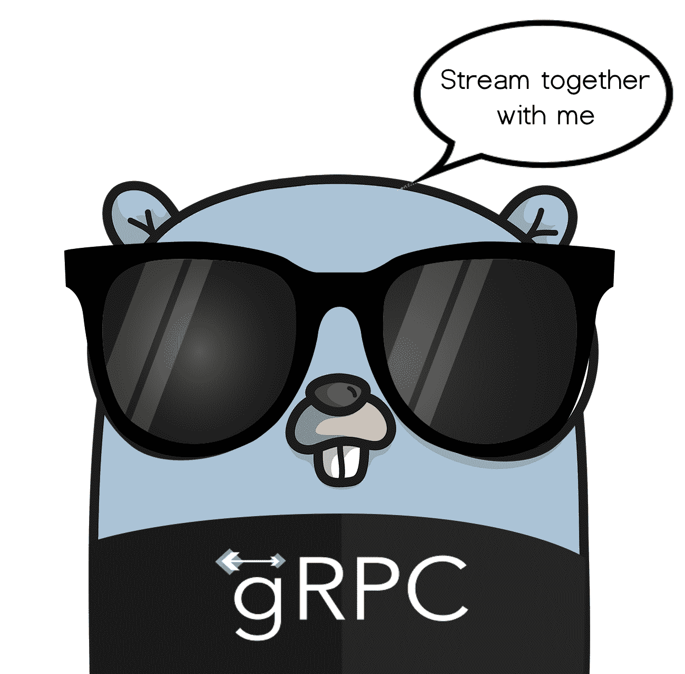

# 如何使用 Go 设置 gRPC 服务器端流

> 原文：<https://www.freecodecamp.org/news/grpc-server-side-streaming-with-go/>

有没有想过只用一个连接返回多个服务器响应？是的，这就是这篇文章的内容。

今天我将向您展示如何使用 Go 实现 gRPC 服务器端流。



It's okay, he won't bite

在我们直接进入实现之前，让我们先了解一下我们将要学习的内容。如果您点击了这篇文章，您可能已经知道 gRPC。但是如果您只是出于好奇而点击了它，请不要担心——我稍后将向您简要介绍 gRPC。

如果你也不太了解服务器端流，那也没关系。我也将在下面谈到这一点。

最后，如果你想知道 Go 是什么，简单的回答是它是一种编程语言。我不会在这里讨论这个问题，但是在继续之前，你可以在这里阅读更多关于 Go 的官方文档。

在本文中，我将从描述 gRPC 和服务器端流开始。如果你已经知道这两者是什么，可以跳过下面的前两节。

## What is gRPC?


你有没有梦想过用函数调用来调用服务器请求？而不是使用带有某个 URL 的 HTTP 调用？嗯，这已经存在很长时间了——我们称之为[远程过程调用](https://www.freecodecamp.org/news/what-is-grpc-protocol-buffers-stream-architecture/)。

2015 年，谷歌推出了名为 gRPC 的东西，这基本上是类固醇上的远程过程调用。

它的工作方式几乎与传统的远程过程调用相同。但是 Google 引入了 HTTP/2 作为通信协议，protobuf 作为服务器和客户端之间的通信契约。

HTTP/2 也是由 Google 创建的，它使得通信更加高效。它还支持多路复用，我稍后会谈到这一点。

Protobuf 基本上是一个契约，用于通过函数调用实现服务器和客户端之间的通信。

好了，这是 gRPC 的基本概述。如果你仍然感兴趣，并想更深入地研究，你可以在这里阅读更多关于它的详细信息。

## 什么是服务器端流？


Photo by [Jon Flobrant](https://unsplash.com/@jonflobrant?utm_source=ghost&utm_medium=referral&utm_campaign=api-credit) / [Unsplash](https://unsplash.com/?utm_source=ghost&utm_medium=referral&utm_campaign=api-credit)

现在，服务器端的流媒体又如何呢？

根据设计，gRPC 使用 HTTP/2 并支持一种叫做多路复用的东西。我不会在这里详细讨论，但是它允许一个请求有多个响应，反之亦然。

这种机制在 gRPC 中实现，它被称为流。

有 3 种类型的流:

*   客户端流:客户端有多个请求，而服务器只返回一个响应。
*   双向流:客户机和服务器都可以在一个连接中有多个请求和响应。
*   服务器端流:客户端发送一个请求，服务器可以一起返回几个响应。这就是我今天将向您展示如何实现的方法。

## 如何实现服务器端流


Photo by [Cam Adams](https://unsplash.com/@camadams?utm_source=ghost&utm_medium=referral&utm_campaign=api-credit) / [Unsplash](https://unsplash.com/?utm_source=ghost&utm_medium=referral&utm_campaign=api-credit)

实施时间到了！如果你正在阅读这一部分，我假设你已经知道这三件事:

*   gRPC
*   服务器端流
*   去

如果您的服务器需要返回一个庞大的有效负载，那么服务器端流尤其有用。

通过使用流，您可以拆分这些响应并逐个返回它们。如果客户端已经有足够的响应，或者等待某些响应的时间太长，那么它将能够删除未使用的响应。

好了，现在让我们直接进入代码。

### 创建原型文件

首先，我们需要定义我们的 protobuf 文件，供客户端和服务器端使用。让我们在这里做一个简单的，像这样:

```
syntax = "proto3";

package protobuf;

service StreamService {
  rpc FetchResponse (Request) returns (stream Response) {}
}

message Request {
  int32 id = 1;
}

message Response {
  string result = 1;
}
```

[data.proto](https://gist.github.com/pramonow/90baa9e9548b87296fb3384a7f61c1c6)

这个原型文件基本上包含一个带有参数`Request`的函数调用，并返回一个流`Response`。

在我们继续之前，我们还需要生成我们的`pb`文件，该文件将被我们的 Go 程序使用。每种编程语言都有不同的生成协议缓冲文件的方式。在 Go 中，我们将使用`protoc`库。

如果你还没有安装它，谷歌在这里提供了安装指南。

让我们通过运行以下命令来生成协议缓冲文件:
`protoc --go_out=plugins=grpc:. *.proto`

现在我们已经准备好使用`data.pb.go`。

### 创建客户端文件

在下一步中，您可以按任意顺序创建客户机文件或服务器文件。但是在这个例子中，我将首先创建客户机文件。

```
package main

import (
	"context"
	"io"
	"log"

	pb "github.com/pramonow/go-grpc-server-streaming-example/src/proto"

	"google.golang.org/grpc"
)

func main() {
	// dial server
	conn, err := grpc.Dial(":50005", grpc.WithInsecure())
	if err != nil {
		log.Fatalf("can not connect with server %v", err)
	}

	// create stream
	client := pb.NewStreamServiceClient(conn)
	in := &pb.Request{Id: 1}
	stream, err := client.FetchResponse(context.Background(), in)
	if err != nil {
		log.Fatalf("open stream error %v", err)
	}

	done := make(chan bool)

	go func() {
		for {
			resp, err := stream.Recv()
			if err == io.EOF {
				done <- true //means stream is finished
				return
			}
			if err != nil {
				log.Fatalf("cannot receive %v", err)
			}
			log.Printf("Resp received: %s", resp.Result)
		}
	}()

	<-done //we will wait until all response is received
	log.Printf("finished")
}
```

[client.go](https://gist.github.com/pramonow/fb95cc7fbba02b1dc4aa10c602ebdc11)

客户端基本上是发送请求的一方。它也将是接收多个响应的那个。

客户端将调用 gRPC 方法`FetchResponse`并等待所有响应。我在这里使用一个`goroutine`来展示并发的可能性。我使用`channel`是为了在退出程序之前等待所有的进程完成。

### 创建服务器文件

对于第三个也是最后一个文件，我们将制作服务器文件。该文件将接收来自客户端的响应，然后将响应流发送回客户端。

```
package main

import (
	"fmt"
	"log"
	"net"
	"sync"
	"time"

	pb "github.com/pramonow/go-grpc-server-streaming-example/src/proto"

	"google.golang.org/grpc"
)

type server struct{}

func (s server) FetchResponse(in *pb.Request, srv pb.StreamService_FetchResponseServer) error {

	log.Printf("fetch response for id : %d", in.Id)

  	//use wait group to allow process to be concurrent
	var wg sync.WaitGroup
	for i := 0; i < 5; i++ {
		wg.Add(1)
		go func(count int64) {
			defer wg.Done()

      			//time sleep to simulate server process time
			time.Sleep(time.Duration(count) * time.Second)
			resp := pb.Response{Result: fmt.Sprintf("Request #%d For Id:%d", count, in.Id)}
			if err := srv.Send(&resp); err != nil {
				log.Printf("send error %v", err)
			}
			log.Printf("finishing request number : %d", count)
		}(int64(i))
	}

	wg.Wait()
	return nil
}

func main() {
	// create listiner
	lis, err := net.Listen("tcp", ":50005")
	if err != nil {
		log.Fatalf("failed to listen: %v", err)
	}

	// create grpc server
	s := grpc.NewServer()
	pb.RegisterStreamServiceServer(s, server{})

	log.Println("start server")
	// and start...
	if err := s.Serve(lis); err != nil {
		log.Fatalf("failed to serve: %v", err)
	}

}
```

[server.go](https://gist.github.com/pramonow/1642f3bed1280c73c5ada4a55d34f3f7)

在服务器文件中，我也使用了一个`goroutine`来模拟一个并发进程。对于每个请求，我将把五个请求流回客户端。每一个都有不同的处理时间，以模拟现实生活中不同的处理时间。

### 输出

现在是激动人心的部分。让我们用`go build`构建我们的客户机和服务器文件，以获得我们的二进制文件。然后，我们将打开两个单独的控制台命令来运行它。

**简单说明一下**:你应该在客户端之前先打开服务器，因为客户端会直接调用服务器方法。

所以让我们进入每个二进制文件的目录，用`/.server`和`./client`运行它们。

您的客户端将输出以下内容:

```
2020/11/10 22:26:11 Resp received: Request #0 For Id:1
2020/11/10 22:26:12 Resp received: Request #1 For Id:1
2020/11/10 22:26:13 Resp received: Request #2 For Id:1
2020/11/10 22:26:14 Resp received: Request #3 For Id:1
2020/11/10 22:26:15 Resp received: Request #4 For Id:1
2020/11/10 22:26:15 finished
```

服务器将会输出:

```
2020/11/10 22:26:09 start server
2020/11/10 22:26:11 fetch response for id : 1
2020/11/10 22:26:11 finishing request number : 0
2020/11/10 22:26:12 finishing request number : 1
2020/11/10 22:26:13 finishing request number : 2
2020/11/10 22:26:14 finishing request number : 3
2020/11/10 22:26:15 finishing request number : 4
```

如果一切顺利，您已经成功地用 Go 为自己构建了一个 gRPC 服务器端流服务！如果你需要整个例子的 GitHub 代码，你可以在这里找到它[。](https://github.com/pramonow/go-grpc-server-streaming-example)

## 包扎

我希望这个用 Go 实现 gRPC 服务器端流的例子能帮助你理解这个过程。

这种实现可能并不常见，您甚至可能不需要在您的项目中实现这种复杂的实现。但是把它当成一个工具来提升你的项目。

如果您想了解更多，请查看这些其他很酷的概念，如客户端流甚至双向流。我发现这里的例子[相当不错。](https://github.com/pahanini/go-grpc-bidirectional-streaming-example)

感谢您通读我的文章！我真心希望你今天学到了新的有用的东西。正如我所说的，你可能真的不需要它，但是为什么不试一试呢？

> 不要坐等改变，采取主动，成为改变的催化剂。