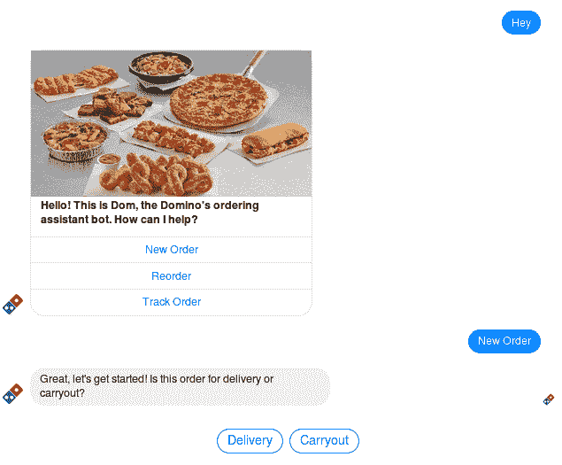
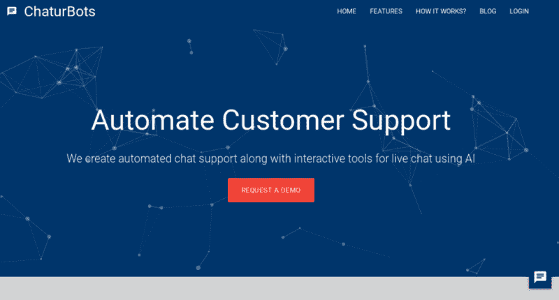
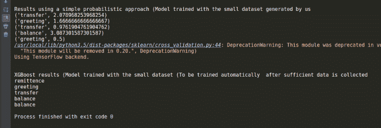

# 黑客马拉松报告:你能在 30 小时内编写出什么？挺多的！

> 原文：<https://www.freecodecamp.org/news/hackathon-report-what-can-you-code-in-30-hours-quite-a-lot-ffd7224c9745/>

作者 Ajay NS

# 黑客马拉松报告:你能在 30 小时内编写出什么？挺多的！

你能在 30 小时内完成什么？作为一群工作越来越多的二年级大学生，我和我的团队想要找到答案。所以我们注册了一个黑客马拉松。

这是由孟买的 DCB 银行举办的金融科技(或“fin tech”)*黑客马拉松。尽管我们对金融科技一无所知，但我们想试一试，希望能提出一个解决一般问题的想法。*

*该活动由 [91 跳板](http://www.91springboard.com/)在美丽舒适的合作空间举办。这是我以前从未经历过的环境。*

*基本上，它为初创公司、自由职业者等出租办公空间，这些人不需要巨大的办公室，只需要一个供团队成员协作的工作空间。91 跳板负责提供有趣、丰富多彩、舒适的工作空间、高速互联网和**无限量咖啡**，让您无忧无虑地工作。在这里过周末真是一件乐事。*

**

### *这个想法*

> *简单地说，我们想要建立一个专门的聊天机器人。*

***为什么？***

*据预测，到 2020 年，很大一部分商业交流将通过聊天机器人完成。*

*用户体验(“UX”)正在快速变化。随着消息应用程序越来越受欢迎，用户更喜欢在一个应用程序下访问所有内容。他们也赞成一对一的交流。*

*电子邮件的时代已经一去不复返了，现在都是实时聊天。利用今天的技术，有可能创造一个聊天机器人，它可以自我学习并自动完成大多数任务，允许个人层面的大规模通信。*

*参见[这里的列表](https://medium.com/the-mission/11-best-uses-of-chatbots-right-now-1c27764b7e62)中的一些聊天机器人目前的最佳用途**。***

### *我们到底建造了什么？*

*当我们参加金融科技黑客马拉松时，我们想到了一个机器人，它可以执行银行应用程序可以执行的所有功能，甚至更多——通过聊天。*

*登录后，您可以向机器人询问您的余额、最近的几次交易，还可以执行诸如资金转账等操作。它利用银行为相同目的提供的所需 API。*

**

*以上是我们的一些 UX 灵感的截图。这个 UX 结合了自然语言和多种选项，直接以链接和按钮的形式提供。回答用户查询、建议下一步措施以及允许采取行动的流程已经计划好了。*

### *该项目*

*

The final product* 

*我们选择的技术栈是 Ruby on Rails。我们选择这个是因为我的队友对它非常熟悉，而我主要专注于包装 API 和 UI。但是这个栈对我来说完全是新的，因为我一直从事 JavaScript 或 Python 栈的工作。我在这里写下了我的学习历程[。](https://hackernoon.com/ruby-on-rails-and-full-stack-javascript-ecadf631707)*

*它使用一个基本的 PostgreSQL 数据库来存储用户消息，并根据需要使用 ActionCable 进行实时数据流传输。整个站点(以及作为小部件的聊天)都是基于物化框架构建的。*

*我们计划使用的一个关键特性是定制的人工智能，而不是像 IBM Watson 或 api.ai 那样的东西。*

*

Intent mapping* 

*最初，当机器人几乎没有训练数据时，需要人工协助来给出响应，并对每个用户查询的意图进行分类，以供机器人学习。一旦它积累了数据，它就可以自动化整个过程，给出适当的响应。*

*这里有一些用于人工智能的脚本。*

### *黑客马拉松*

*我们在超过 30 个小时的时间里只睡了 4 个小时，同时将超过 50，000 行代码投入生产。*

*但是并没有听起来那么糟糕！这个地方本身就有这种激励的氛围，而且有导师帮助你。中间有休息时间与其他团队交流，并结识其他优秀的开发人员。*

*当我的团队成员专注于机器学习部分和 Rails 上的实际聊天应用程序时，我负责服务的 UI。这包括一个管理面板以及聊天部件。相当多的时间花在将 AI 代码包装成 RESTful APIs 以及修复主代码中的 bug 上。*

*最终，我们拥有的是我们着手构建的应用程序的基本 alpha 版本。*

**

### *体验*

> *首先，这是我一生中最有成效的 30 个小时。*

*不断爆发的动力(和咖啡因)驱使着我，我没有时间闲坐或懒散。也有很多有趣和有才华的人可以交流，因为我是那里最年轻的人之一。*

*我在这里学到的一些东西包括:*

*   *去耦应用架构*
*   *从头开始构建应用，然后在尽可能短的时间内投入部署*
*   *实时代码协作*
*   *当然，还有一点金融科技！*

*在这里查看我们工作过的项目:*【chaturbots.com】T2。现在这是作为一项服务提供的，所以请联系我们来定制一个机器人。**

**希望你喜欢这篇文章，并发现它是一个很好的阅读！你可以在 [Github](http://github.com/ajayns/) 上查看我所有的项目，并在 [Twitte](https://twitter.com/ajayns08) r 上联系我！**