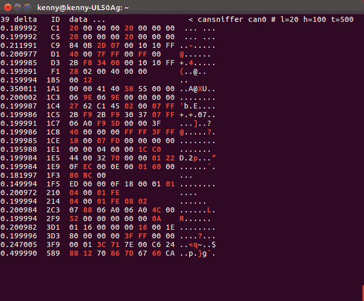
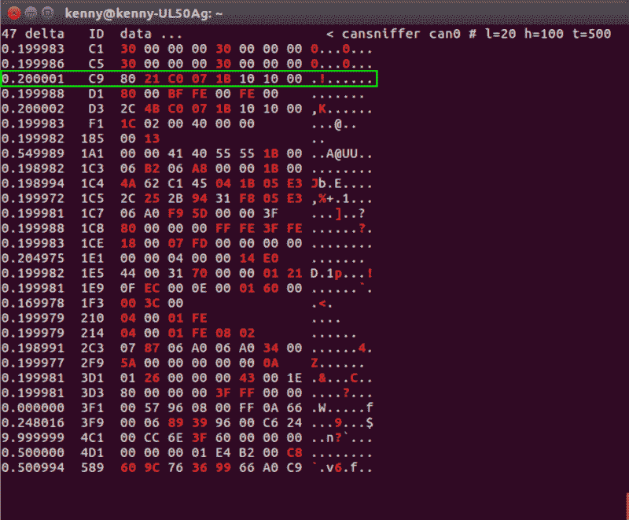
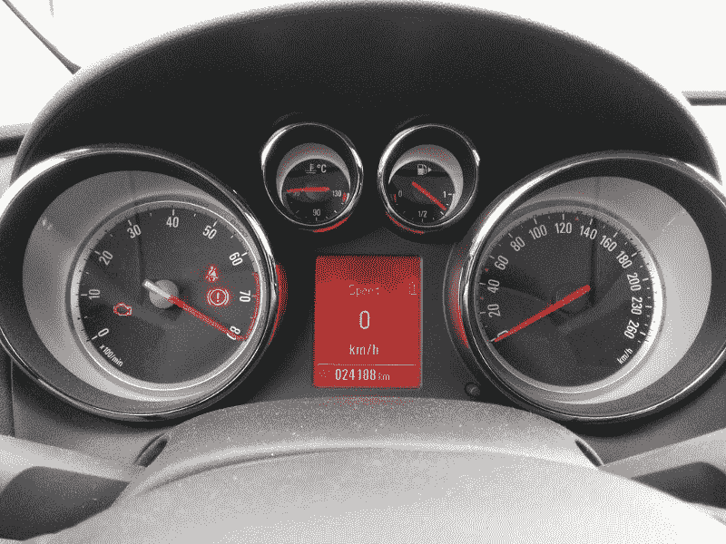

# 如何改装汽车——速成班

> 原文：<https://www.freecodecamp.org/news/hacking-cars-a-guide-tutorial-on-how-to-hack-a-car-5eafcfbbb7ec/>

肯尼·库切拉

# 如何改装汽车——速成班


Spoofed tachometer, the engine isn’t running.

这篇文章的目标是让你开始黑客汽车-快速，便宜，容易。为了做到这一点，我们将模仿 RPM 量表作为一个例子。

以下绝不是详尽的教程。相反，它的目的是提供足够的信息让你开始工作。如果你想深入了解，你可以看看最后的必读书目。

如果您决定在现实生活中执行本教程，您将需要一台 Linux 计算机(或一台虚拟 Linux 机器)和一个 CAN-to-USB 设备(我们将在后面研究)。

### 汽车是一个网络

一辆汽车由多台电脑组成，控制发动机、变速器、车窗、锁、灯光等。这些计算机被称为[电子控制单元](https://en.wikipedia.org/wiki/Electronic_control_unit) (ECU)，并通过网络相互通信。

例如，当您按下方向盘上的按钮来提高收音机的音量时，方向盘电子控制单元向网络发送一个提高音量的命令，然后收音机电子控制单元接收到该命令并采取相应的行动。

一辆车有多个网络，一般至少两个:

*   一个用于关键数据，如发动机和动力系统信息
*   一个用于不太重要的数据，如收音机和门锁

关键网络使用快速可靠的协议，而非关键网络使用较慢、不太可靠但较便宜的协议。网络的数量以及哪些 ECU 联网在一起取决于汽车品牌、型号和年份。ECU 也可以连接到多个网络。

### 连接到网络

一些网络可以通过 OBD-II 端口访问。OBD-II 是 1996 年后美国和 2004 年后欧洲生产的所有轿车和轻型卡车的强制性要求。

该连接器位于驾驶员座椅伸手可及的位置。你可能需要揭开一些塑料盖，但它总是不需要工具就能接触到。


OBD-II connector.

OBD-II 标准允许五种信令协议。用哪种由厂家决定。 [CAN](https://en.wikipedia.org/wiki/CAN_bus) 是最流行的一种，也是我们将要讨论的。它可以通过 OBD-II 连接器的第 6 和第 14 针接触到。如果你的车有 CAN 总线，你会看到引脚上的金属导线，如上图所示。

CAN 总线是一种可靠的高速总线，用于发送关键数据。不幸的是，总线上的数据包不是标准化的，所以你需要把它们反过来才能知道它们的意思。OBD-II 标准还为供应商特定的引脚留出了空间，这些引脚可用于供应商特定的协议。这使得代理商更容易诊断问题。

在我的汽车(GM)上，我在引脚 6 和 14 上有一个标准 CAN 总线，在引脚 1 上有一个供应商特定的单线 CAN 总线。标准 CAN 总线是一种可靠的高速(500 kbps)协议，也称为高速 CAN (HS-CAN)。它用于关键数据。单线 CAN 总线(SW-CAN)或 GMLAN 速度较慢(33.3 kbps)，可靠性较低，但价格较低，因为它仅使用一根线。该总线用于非关键数据。

如果你看到一个供应商特定的引脚，但不知道使用的是哪种协议，谷歌“ <make>OBD 引脚”。还有低速 CAN (LS-CAN)和中速 CAN (MS-CAN)。MS-CAN 通常位于 3 号和 11 号引脚上，在福特和沃尔沃汽车上运行速度为 125 kbps。</make>

### 工具

您将需要能够解释 CAN 数据的设备以及分析数据的软件

#### 五金器具

为了接收和发送 CAN 数据包，您需要一个具有此功能的设备。您会经常遇到基于 ELM327 的器件。虽然这些有它们的用处，但对于黑客来说却很糟糕。他们太慢了，无法监控 CAN 总线。

还有像 Kvaser，Peak 或者 EMS Wünsche 这样的高端设备。这些将完成工作，但矫枉过正，相当昂贵。

一些高端设备还要求您购买软件。USB2CAN 是 Linux 的本地 CAN 接口，物超所值。

你也可以使用[can act](http://linklayer.github.io/cantact/)或者 [CANUSB](http://www.can232.com/?page_id=16) 。然而，这些不是 Linux 中的本地 CAN 设备，并且使用基于 ASCII 的协议。这意味着它们的设置稍微复杂一些，并且性能较低。另一方面，它们在多个操作系统中都得到了很好的支持。

我使用我为自己的需求设计的 [CANalyze](https://kkuchera.github.io/canalyze/) 。它类似于 USB2CAN，因为它是一个价格合理的本地 CAN 接口，但它使用较新的微控制器，是开源的，可以使用开源工具构建。本教程的其余部分假设您使用的是本地 CAN 接口。

#### 软件

要与设备通信，您需要在 Linux 机器上安装 can-utils 包。您可以通过在 Linux 提示符下键入以下命令来完成此操作:

```
sudo apt-get install can-utils
```

Can-utils 使发送、接收和分析 Can 数据包变得极其容易。这些是我们将使用的命令。

*   cansniffer 仅显示正在变化的数据包
*   **candump** 转储所有收到的数据包
*   发送一个包

Linux 已经可以通过 [SocketCAN](https://www.kernel.org/doc/Documentation/networking/can.txt) 支持内置到内核中。这使得编写自己的附加程序变得容易。您可以像与任何其他网络交互一样与 can 总线交互，即通过套接字。

### CAN 总线

在开始倒车之前，您应该对 CAN 总线的工作原理有所了解。它由 2 根导线组成，使用差分信号。因为是总线，所以这两条线可以连接多个设备。当 CAN 帧在总线上发送时，它会被所有 ECU 接收，但只有对 ECU 有用时才会被处理。如果同时发送多个 CAN 帧，优先级最高的帧胜出。CAN 框架有 3 个与我们相关的部分。

*   **仲裁标识符**报文的标识符。ECU 使用它来决定是处理还是忽略接收到的帧。它还代表消息的优先级。数字越小，优先级越高。例如，如果你是一名设计网络的工程师，你会给安全气囊展开的帧一个非常高的优先级或一个低的仲裁 ID。另一方面，你可以给门锁的数据一个较低的优先级或较高的仲裁 ID。
*   **数据长度码(DLC)** 以字节表示数据字段的长度。一个 CAN 帧最多可以有 8 个字节的数据。
*   **数据字段**包含多达 8 个字节的数据。

### 反转 CAN 总线

反转 CAN 总线的一般方法是产生您想要模仿的行为，并找到导致该行为的消息。例如，假设你车上的车道保持辅助系统(LKAS)是垃圾，你自己做了。

为了让它控制方向，你需要知道发送什么信息。解决这一问题的方法是打开原始 LKAS，监控 CAN 总线并识别负责转动方向盘的数据包。一旦识别出这些数据包，您就可以让您自己的 LKAS 将这些数据包发送到 can 总线上来控制方向盘。

在我们的例子中，我们想要欺骗转速表，所以我们需要在汽车开着并处于空档的情况下通过踩油门来改变 RPM，然后试图找到负责改变 RPM 的包。

#### 设置

将 CAN 设备插入汽车的 OBD-II 端口和计算机的 USB 端口。在 Linux 提示符下运行以下命令，调出 CAN 接口:

```
sudo ip link set can0 up type can bitrate 500000
```

它以标准的 500 kbps 的比特率调出`can0`接口(如果只连接了一个设备，则总是`can0`)。

#### 识别

当汽车关闭时，ECU 通常处于睡眠状态，所以你需要打开汽车或将其置于附件模式。您可以通过在 Linux 提示符下运行以下命令来查看原始 can 数据:

```
candump can0
```

一旦接收到 CAN 数据，就会将其打印到屏幕上。然而，这是非常无序的，并且很难看出什么分组对应于某个事件。你可以按 ctrl+c 来停止程序。为了使数据更具可读性，我们使用 cansniffer，它按仲裁 ID 对数据包进行分组，并且只显示发生变化的数据包。要启动它，请在 Linux 提示符下运行命令:

```
cansniffer -c can0
```

其中`-c`为变化的字节着色，而`can0`是要嗅探的接口。需要几秒钟的时间来删除不变的数据包。

您应该会看到类似下图的内容，尽管数字可能会完全不同。



Cansniffer with engine idle.

第一列(增量)显示了接收具有该仲裁 ID 的数据包的速率(秒)。第二列(ID)包含仲裁 ID。剩余的字母数字列(数据…)包含数据字节。如果数据有 ASCII 表示，可以看到它在右边，否则就是一个点。

当您在发动机运转的情况下踩下油门以提高转速时，屏幕上可能会出现新的 CAN 消息和/或现有消息发生变化。

我们需要找到一条 CAN 消息，其中变化的字节与 RPM 的变化相关。我们大概可以预计，该值将随着 RPM 的增加/减少而增加/减少。

cansniffer 中第一个随 RPM 变化的 CAN 帧是仲裁 id 为`C9`的帧。可能有多个随 RPM 变化的潜在数据包，这只是第一个。



Detected packet correlating to RPM.

该信息中有 4 个字节在变化(红色)，但并非所有字节都必须指示 RPM。第三个字节`07`的变化似乎与变化的 RPM 无关。最后一个字节`1B`会。

然而，一旦我们把脚从油门上拿开，它就会转到`00`。这表明它代表节气门位置，而不是转速。

最后，有两个字节`21 C0`似乎确实对应于 RPM 的变化。更有甚者，它以 16 字节整数的形式变化，即当第二个字节`C0`溢出时，第一个字节`21`增加 1。此外，似乎`21`对应于大约 2000 RPM。当您重播消息时，这是值得注意的。

#### 重播

一旦有了候选对象，在 Linux 提示符下使用以下命令将它发送到 CAN 总线上:

```
cansend can0 0C9#8021C0071B101000
```

其中，帧的格式为`<arb_id>#` {data},必须替换为您自己的 CAN 消息。

为此，您的汽车可以运行或处于附件模式。请确保使用您在引擎非空闲时获得的数据包，否则当您的引擎空闲时重放它时，您不会看到任何变化。

如果您只发送一次数据包，您可能不会在组合仪表上看到任何变化。这是因为原始信息仍由 ECU 以 0.2 秒的间隔在总线上连续发送，所以您的信息将被忽略。

回想一下，cansniffer 的第一列中给出了该比率。除了断开产生这些信息的 ECU 之外，还有两种方法可以解决这个问题。一种选择是以比当前发送的频率高得多的频率发送分组。您可以通过在 Linux 提示符下运行以下命令来实现这一点:

```
while true; do cansend can0 0C9#8021C0071B101000; sleep 0.002; done
```

用你已经确认的信息替换掉 CAN 信息。按 ctrl+c 停止。

另一个选择是监视总线，每当您检测到想要欺骗的数据包时，立即发送您自己的数据包。这可以通过在 Linux 提示符下运行:

```
candump can0 | grep " 0C9 " | while read line; do cansend can0 0C9#8021C0071B101000; done
```

其中，您需要分别用您识别的 CAN 消息及其仲裁 id 替换 CAN 消息和`0C9`。您可以尝试这两种方法，看看哪种效果更好。

如果转速表变了，干得好，你找到了！如果不是，识别与 RPM 相关的下一条消息并重放它。

#### 起毛

现在，您已经有了在组合仪表上设置 RPM 的 CAN 帧，您可以处理您发送的数据，看看会发生什么。我们已经注意到，对应于 RPM 的两个字节表现为 16 位整数，因此为了将转速表设置为 8k RPM，我们在 Linux 提示符下运行以下命令:

```
while true; do cansend can0 0C9#0080000000101000; sleep 0.002; done
```

结果是…



Spoofed RPM with engine turned off.

就是这样！你现在可以试着控制车速表、收音机、灯、门锁等。使用同样的方法。

### 可能的问题

*   虽然 CAN 总线是最流行的网络，但它不是唯一的网络。如果在 can 总线上找不到您要找的信息，请尝试不同的网络。尤其是不重要的消息，如收音机、灯和门锁，可能会在不同的网络上。
*   如上所述，通过 CAN 传输的确切数据取决于汽车的品牌、型号和年份。一些汽车在 CAN 消息中使用计数器，以确保相同的消息不会被处理多次。这稍微有点困难，但是你应该能够用提供的信息做到。一些汽车还使用校验和来确保数据的完整性。计算这个校验和可能很困难。如果你有一辆丰田车，那就去看看[汽车网络和控制单元冒险](http://illmatics.com/car_hacking.pdf)，p10，Checksum-Toyota。每个人都应该认真阅读整篇论文。
*   当在总线上重放识别的数据包时，您的 CAN 转 USB 设备可能会进入“总线关闭”状态。这是 CAN 标准的一部分，当设备出现过多错误时会发生。这通常发生在公共汽车上交通拥挤的时候。为了避免这种情况，你可以玩延迟和计时，也许可以在将汽车置于附件模式后立即尝试重放信息，尝试等待一段时间，在汽车启动时尝试等等。如果你已经确定了什么 ECU 连接到总线上，你也可以拔掉它们的保险丝来阻止它们发送信息，降低总线上的流量。

### 必读

*   [汽车黑客手册](http://opengarages.org/handbook/)
*   查理·米勒和克里斯·瓦拉塞克的[研究](http://illmatics.com/carhacking.html)，是的，全部
*   加州大学圣地亚哥分校和华盛顿大学的研究。

一定要去看看[露天车库](https://opengarages.org)和他们的[视频](https://www.youtube.com/playlist?list=PLBqtCp9s_lnEOtf6I1DDMEANIzJJLXRhe)。