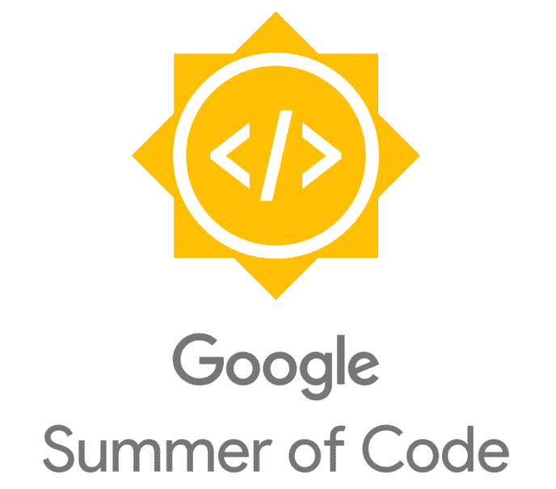
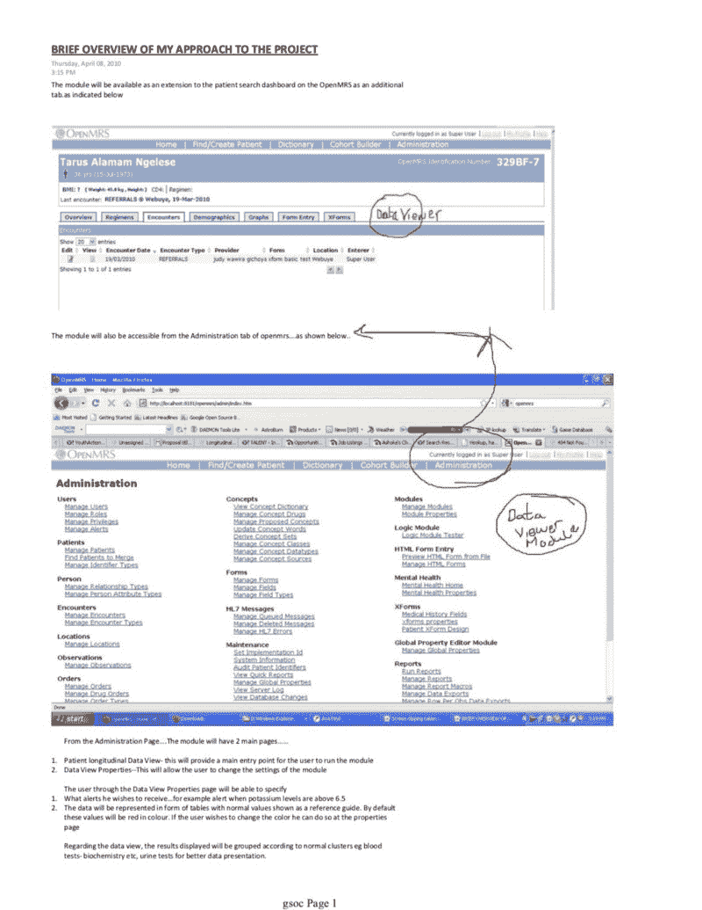
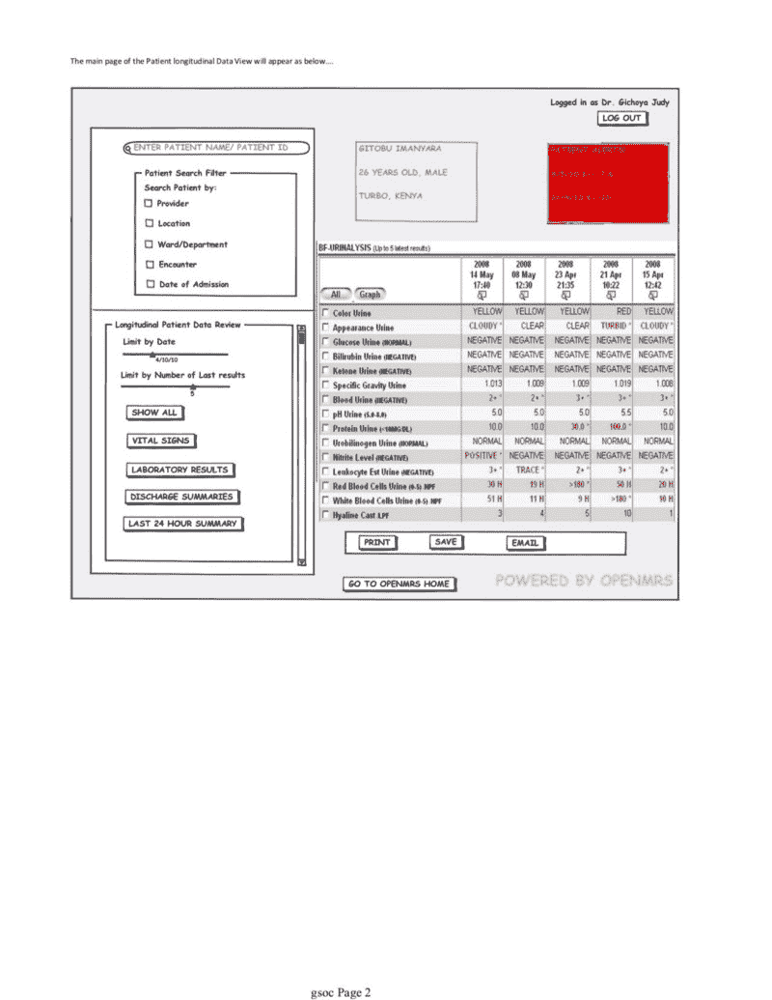
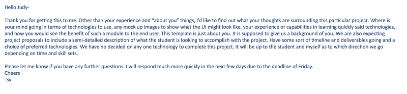
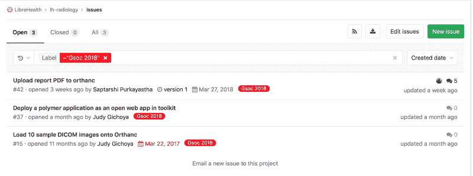
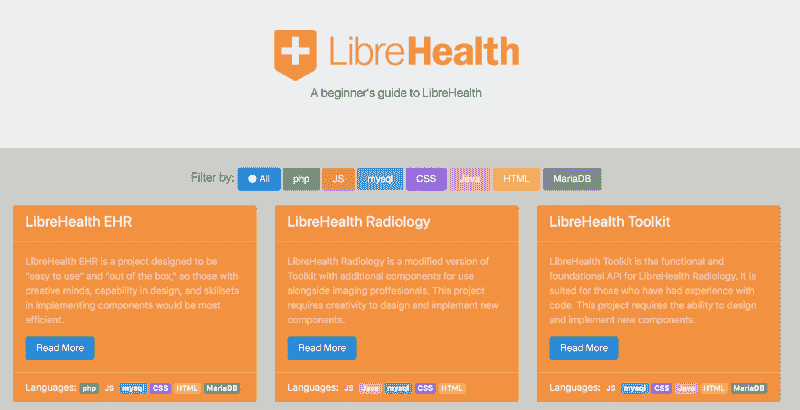

# 黑客#GSOC:如何获得真实生活经验并支持开源

> 原文：<https://www.freecodecamp.org/news/hacking-gsoc-how-to-gain-real-life-experience-and-support-open-source-b1e6a664f6e4/>

医学博士朱迪·吉乔亚

# 黑客#GSOC:如何获得真实生活经验并支持开源

Image [source](https://opensource.googleblog.com/2018/02/gsoc-2018-organizations.html)

当前就业市场中的简历/CV 货币正在发生变化。不管有没有大学文凭，潜在雇主都会要求一个像你的 [GitHub 简介](https://github.com/judywawira)这样的代码库来展示你的投资组合。除了代码之外，开发人员越来越多地被期望担任领导角色，并能够与团队合作。

有可能在网上派生和克隆数百万个知识库，你如何在你的个人资料上展示的作品中获得一个与众不同的因素？此外，如果你是一名自学成才的程序员，正在利用众多付费和免费的 MOOC 课程，你如何向你的潜在雇主展示你的能力，帮助你获得梦想中的工作？

学生们通常利用暑期实习来获得真实世界的经验。谷歌的开源办公室通过他们的[谷歌代码之夏项目](https://summerofcode.withgoogle.com) (GSOC)提供了一个这样的机会，该项目对 18 岁或以上的大学生开放。该项目于 2005 年 5 月启动，我从 2011 年开始担任导师。

### 首先，拒绝…

我在 2010 年申请了 GSOC 大学。我刚从医学院毕业，作为一名开发人员加入了 OpenMRS 开源社区。我们推迟了开始医学实习的时间，为了填补我的时间，我在寻找几种选择来提高我的技能。我决定和 OpenMRS 一起参加 GSOC，因为我可以在为我喜欢的组织做贡献的同时赚一些钱。

我设法从电子邮件档案中取出了我的提案的一部分——附在下面。简而言之，我将致力于纵向患者模块，该模块将显示患者详细信息的时间线，使医生可以轻松浏览患者数据的快照。

我花了一些时间和我潜在的导师聊天，他想要更多关于我的提议的细节。

mentor communication excerpt

然而，尽管我与导师们进行了交流，成为了社区的一员，并尝试着写一份 GSOC 提案，但我的努力还是不够。

在 2010 年夏天的最后 15 名学生中没有看到我的名字，这让我非常沮丧。我记得我在搜索我的名字时通读了入选学生的名单，重读了名单，然后意识到我还不够好，尽管我在 OpenMRS 上花了这么多志愿者时间。

Umashanthi 是被选中在 2010 年夏天参与这个项目的学生，下面是她整个夏天的[提议](https://wiki.openmrs.org/display/projects/Longitudinal+Data+Viewer+Student+Proposal)和[博客帖子](http://umashanthi.blogspot.com/search/label/GSoC2010)来说明她为什么是赢家。

### 回归基础

尽管我一次尝试都失败了，也从未试图再次成为 GSOC 大学的学生，但我还是花时间做了一名导师——也许是为了拥有不被拒绝的安全网。我很喜欢在健康开源项目中工作，目前是图书馆健康放射学项目的志愿者维护者。LibreHealth 是今年 GSOC 的一个组织，在这篇文章中，我总结了我作为导师的经验，帮助你写出一份成功的提案。我希望你可以用同样的建议申请其他的暑期项目。以下是我的三大建议！

#### **1。沟通**

#### **2。沟通**

#### **3。沟通**

在选择了一个夏天要合作的组织后，花点时间搞清楚大多数对话发生在哪里。大多数开源组织都有一种 wiki 形式、一个问题跟踪平台、一个聊天平台和一个静态网页。

例如，LibreHealth 有一个社区论坛，在那里你可以在加入社区时介绍自己，还有一个专门的 T2 GSOC 聊天频道，可以与导师和其他学生互动。滚动浏览对话历史记录，了解被问到的问题以及组织对哪些项目感兴趣。

一旦你掌握了沟通的步骤，帮助别人！

怎么会？欢迎新成员，帮助他们建立开发环境，并回答他们的问题。

记住，组织想要有潜力成为长期贡献者的学生。

#### **4。投稿**

你申请的是“代码之夏”,所以很自然地会对你的编程能力进行评估。因此，下一个要弄清楚的资源是代码在组织中的位置。如果你正在评估几个组织，可能很难缩小最终组织的范围，然后确定你要申请的项目。

缩短学习曲线的一个方法是查看托管最终应用程序的演示站点。查看技术堆栈并进行自我评估，以确定您是否拥有所需的技能，或者是否能够在项目开始前及时学习这些技能。

选择初级水平或标记为`#gsoc`的门票，就像我们为 LibreHealth 所做的那样。弄清楚被录取的学生将需要的编码的强制性先决条件。

总之，深入研究代码。在 LibreHealth 的例子中，你的搜索会引导你到我们的 [gitlab 代码库](https://gitlab.com/librehealth/lh-radiology)或者我们应用的[演示](https://radiology.librehealth.io/lh-toolkit/)。

您可以通过检查问题和相关标签来过滤您可以轻松处理的票证。

#GSOC tagged issues

感谢我们的一位谷歌代码学生 Jake Du 的出色工作，我们有了一个[登录页面](https://jdew192837.github.io)，它可以帮助您确定您是否具备参与我们项目所需的技能。

What skills do you need?

既然你已经对你的潜在组织有了一定的了解，并且已经参与了一项初级任务或先决任务，那么就深入研究一下为 GSOC 提出的项目吧。我们在我们的社区论坛上发布带有 [#gsoc 标签](https://forums.librehealth.io/c/community/gsoc)的项目。

通读每一个提议的项目，检查它是否让你感兴趣。在激励你的项目中，你更有可能成功，所以要明智地选择。

此时，与项目的潜在导师交流。提问。澄清你不明白的地方。也要利用这样一个事实:作为一个局外人，你会给一个开源项目带来一套新的视角。因此，您可以帮助建议新的文档和想法，并帮助发展开源。

记得检查暑期项目的资格标准，确保你符合要求！此时，您已经准备好开始起草您的提案。

#### **5。提前开始**

每个学生最多可以提交三份提案。我看到许多学生试图通过提交多份提案来玩游戏，以最大限度地增加获胜的机会。记住**质量胜于数量**。

熟悉 GSOC 的时间表——它们不太可能改变。当你在最后一分钟提交你的提案时，你很少有机会收到对你提案的反馈并做出有意义的改变。

#### **6。吸取过去的教训**

如果你申请的组织是以前的 GSOC 参与者，那么你可以享受以前提交的好处。查阅以前的提案以及学生记录他们进展的**强制性博客帖子**。

你可以对自己是否适合某个组织有更多的了解，你也可以得到关于这个夏天可能完成的事情的反馈。

#### **7。提前计划**

大多数获奖提案表明，学生对要完成的任务有所了解，并且可以全职参与项目。你每周至少要花 40 个小时在这个项目上，所以要明智地计划这个夏天。

清楚地记录你认为应该达到的目标，并在你的时间表上反映出来。请记住，你可能会失败#GSOC，失去你的津贴和声誉。所以在评估你的能力和时间表时要现实一些。

**不要过度承诺！**

#### **8。玩得开心**

GSOC 和其他暑期项目，如[outreach](https://www.outreachy.org)和 [Rails Summer of Code](https://railsgirlssummerofcode.org) ，为你个人参与开源提供了丰厚的回报。我过去两年的学员 [ivange larry](https://www.freecodecamp.org/news/hacking-gsoc-how-to-gain-real-life-experience-and-support-open-source-b1e6a664f6e4/undefined) 一直是开源领域的一个现象，现在在喀麦隆经营一个 Java 用户组，帮助其他学生像他一样进入开源领域。

我在成功的学生身上投资，帮助他们找到自己热爱的职业。我的一个好朋友和合作者 Saptarshi Purkayastha 最初是一名 GSOC 学生，现在是一名信息学教授，培训未来的学生，并在我们的[信息学创新实验室](https://www.iupui.edu/~plhi/)工作，利用技术做有意义的工作和拯救生命。

在这篇文章的最后，我想分享一下埃隆·马斯克上周的评论，我觉得这段评论很有启发性:

> 生活不能只是解决一个又一个悲惨的问题。这不可能是唯一的事情。需要一些事情来激励你，让你早上醒来时感到高兴，成为人类的一部分。

如果你喜欢这篇文章或者觉得它有用，请考虑分享它。

**做出的修正**

1.  2018 年 3 月 18 日— Umashanthi 被称为 He……更新并更正为 s He，因为她是女性