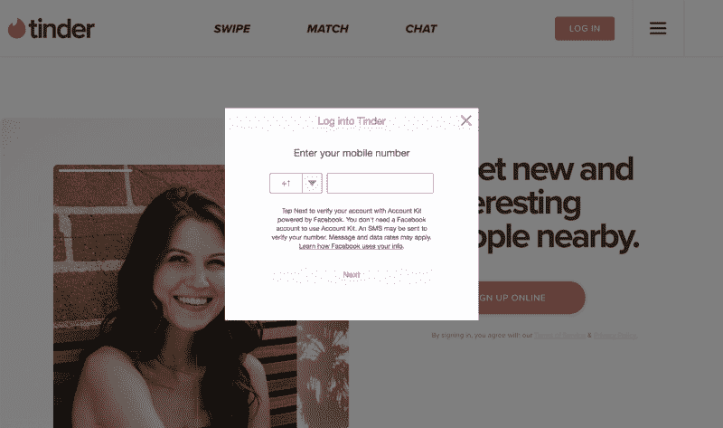
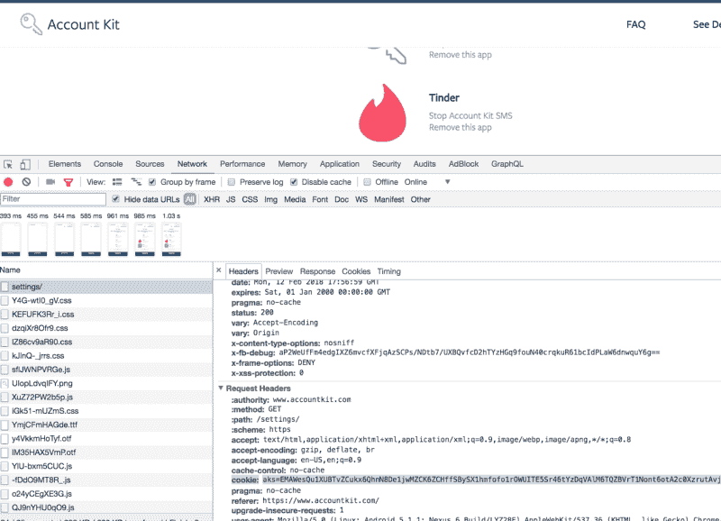

# 我是如何利用脸书的账户工具包入侵 Tinder 账户并赢得 6250 美元奖金的

> 原文：<https://www.freecodecamp.org/news/hacking-tinder-accounts-using-facebook-accountkit-d5cc813340d1/>

通过 AppSecure

# 我是如何利用脸书的账户工具包入侵 Tinder 账户并赢得 6250 美元奖金的

根据负责任的披露政策，这是在脸书的许可下出版的。

这篇博文中提到的漏洞很快被脸书和 Tinder 的工程团队堵住了。

这篇文章是关于我在 Tinder 的应用程序中发现的一个帐户接管漏洞。通过利用这一点，攻击者可以访问受害者的 Tinder 帐户，受害者必须使用他们的电话号码登录。

这可能是通过脸书账户工具包中的一个漏洞被利用的，脸书最近已经解决了这个问题。

Tinder 的网络和移动应用程序都允许用户使用他们的手机号码登录服务。此登录服务由 Account Kit(脸书)提供。

Login Service Powered by Facebook’s Accountkit on Tinder

用户在 tinder.com[的](http://tinder.com/)上用电话号码点击**登录，然后被重定向到 Accountkit.com 登录。如果身份验证成功，Account Kit 会将访问令牌传递给 Tinder 进行登录。**

有趣的是，Tinder API 并没有检查 Account Kit 提供的令牌上的**客户端 ID** 。

这使得攻击者能够使用 Account Kit 提供的任何其他应用程序的访问令牌来接管其他用户的真实 Tinder 帐户。

### **漏洞描述**

[Account Kit](http://accountkit.com) 是脸书的一款产品，让人们只需使用他们的电话号码或电子邮件地址就可以快速注册并登录一些注册的应用程序，而不需要密码。它可靠、易用，并让用户可以选择如何注册应用程序。

Tinder 是一款基于地理位置的手机应用，用于搜索和结识新朋友。它允许用户喜欢或不喜欢其他用户，然后如果双方都刷对了，就可以继续聊天。

Account Kit 中存在一个漏洞，攻击者可以通过使用任何用户的电话号码来访问他们的 Account Kit 帐户。一旦进入，攻击者就可以获得用户 cookie(aks)中的帐户工具包访问令牌。

之后，攻击者可以使用易受攻击的 API，使用访问令牌(aks)登录用户的 Tinder 帐户。

### **我的漏洞如何一步一步地发挥作用**

#### 第一步

首先，攻击者将通过在下面所示的 API 请求中的“ **new_phone_number** ”中输入受害者的电话号码来登录受害者的 Account Kit 帐户。

请注意，Account Kit 没有验证电话号码与其一次性密码的映射。攻击者可以输入任何人的电话号码，然后简单地登录受害者的 Account Kit 帐户。

然后，攻击者可以从 cookies 中复制受害者的 Account Kit 应用程序的“aks”访问令牌。

**易受攻击的帐户套件 API:**

> *发布/更新/异步/电话/确认/？dpr=2 HTTP/1.1*

> *主持人:[www.accountkit.com](http://www.accountkit.com)*

> *new _ phone _ number =【vctim 的电话号码】&update _ request _ code = C1 FB 2e 919 bb 33 a 076 a 7 c 6 Fe 4 a 9 fbfa 97【攻击者的请求代码】& confirmation_code=258822【攻击者的代码】&_ _ user = 0&_ _ a = 1&_ _ dyn =&_ _ req = 6&_ _ be =-1&_ _ PC = PHASED % 3a*

Image showing “aks” cookie on accountkit.com

### 第二步

现在，攻击者只需将受害者的访问令牌“aks”复制到下面的 Tinder API 中，就可以重放下面的请求。

它们会被登录到受害者的 Tinder 账户。攻击者基本上可以完全控制受害者的账户。他们可以阅读私人聊天，完整的个人信息，左右滑动其他用户的个人资料，等等。

**易受攻击的 Tinder API:**

> *POST/v2/auth/log in/account kit？locale=en HTTP/1.1*
> *主机:【api.gotinder.com】*
> *连接:关闭*
> *内容-长度:185*
> *出处:[https://tinder.com](https://tinder.com)*
> *app-版本:1000000*
> *平台:web*
> *用户-代理:Mozilla/5.0q = 0.9*
> *{ " token ":" XXX "，" id ":" }*

### **视频概念验证**

### **时间线**

Tinder 和脸书很快修复了这两个漏洞。脸书奖励了我 5000 美元，Tinder 奖励了我 1250 美元。

我是 AppSecure 的创始人，这是一家专业的网络安全公司，拥有多年的经验和细致的专业知识。我们在这里保护您的业务和关键数据免受在线和离线威胁或漏洞。

您可以通过的 anand.prakash@appsecure.in 或的 [sales@appsecure.in 联系我们。](mailto:sales@appsecure.in)