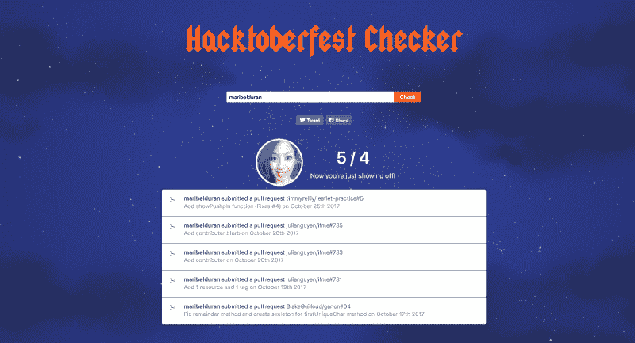

# Hacktoberfest:我通向开源的大门

> 原文：<https://www.freecodecamp.org/news/hacktoberfest-my-gateway-to-open-source-f44c8778b022/>

> “就个人而言，我们是一滴水。合在一起，我们就是一片海洋。”—龙之介·萨多罗

上个月，我表达了开始为开源做贡献的意愿。感谢一年一度的 [Hacktoberfest](https://hacktoberfest.digitalocean.com/) 挑战赛，我提交了 5 个拉请求。我还发现了一个非常酷的项目，我仍在积极参与其中。

我写了这篇文章来分享我是如何发现初学者友好的开源项目的。在社交媒体上分享这个我很紧张，但它实际上给了我动力去寻找开始的方法。

起初，为开源做贡献可能是非常令人生畏的。但是能够在帮助社区的项目上与其他人合作本身就是一种奖励。更不用说从阅读其他开发人员的代码中获得的所有技能以及一路上遇到的所有牛逼的人。

### 我开始贡献的动机

作为一名开发人员，我的使命是为赋予生活力量和动力的应用程序做出贡献。我决定采取行动，寻找方法开始实现我的梦想，而不是等待一家公司雇用我，因为我在努力加强我的发展技能。

*“If you want to lift yourself up, lift up someone else.” — Booker T. Washington*

每个月我都会把“为开源做贡献”列为我的职业目标之一，但总是把它往后推。

我曾经认为为开源做贡献是我力所不及的，我必须是一个有经验的开发者才能有所贡献。

但是我不断听到许多经验丰富的开发人员说，为开源做贡献是获得技能的一个很好的方式。他们告诉我，它提供了许多人经常使用并从中受益的机会。

### 我寻找开源项目的步骤

我做出贡献的第一步是阅读一些关于开源和如何开始的博客文章。

下面是一些帖子和资源，我希望对你也有帮助。

#### 帮助初学者找到友好的开源项目的资源

*   [https://dev . to/bhilburn/building-your-portfolio-with-open-source-777](https://dev.to/bhilburn/building-your-portfolio-with-open-source-777)
*   [https://dev.to/jess/open-source-resources-for-beginners](https://dev.to/jess/open-source-resources-for-beginners)
*   [https://github.com/collections/choosing-projects](https://github.com/collections/choosing-projects)
*   [https://www.codetriage.com/](https://www.codetriage.com/)
*   [https://github.com/search?utf8=%E2%9C%93&q = label % 3a 仅限首次使用+is % 3a 开放&type = Issues&ref = search results](https://github.com/search?utf8=%E2%9C%93&q=label%3Afirst-timers-only+is%3Aopen&type=Issues&ref=searchresults)

#### **啤酒节**

我也很幸运地偶然发现了 [Hacktoberfest](https://hacktoberfest.digitalocean.com/) ，这是一个虚拟的活动，其中 [DigitalOcean](https://www.freecodecamp.org/news/hacktoberfest-my-gateway-to-open-source-f44c8778b022/undefined) 和 [GitHub](https://www.freecodecamp.org/news/hacktoberfest-my-gateway-to-open-source-f44c8778b022/undefined) 提供奖品以鼓励对开源软件的贡献。目标是在任何 GitHub 托管的回购或项目中发出 4 个拉请求(10 月的任何时候)。如果你做到了，他们会给你寄一件免费的 t 恤！

这个事件最有帮助的部分是许多开源维护者将“Hacktoberfest”的标签应用到他们的 GitHub 项目中的问题上，这些问题已经准备好供新手贡献者处理了。

即使十月已经结束，仍然有大量适合初学者的问题你可以贡献出来！来看看:GitHub 上的 [Hacktoberfest 标签](https://github.com/search?q=label:hacktoberfest+state:open+type:issue)

#### **聚会**

在这段旅程中，我迈出的最重要的一步是参加聚会，在那里我可以找到帮助社区的本地开源项目。

我注册了三藩市每周公民黑客之夜的代码和 T2 写/说/写开源时间的代码。

[Code for America Brigade 的](https://www.meetup.com/pro/brigade/)是志愿者组织，致力于解决当地问题，帮助政府更好地为所有人服务。浏览他们的网站找到离你最近的一个旅:【https://www.codeforamerica.org/join-us/volunteer-with-us】T2。

遇到了 [If-Me](https://www.if-me.org/) 的维护者。我还发现了一个开源项目，我从 10 月中旬开始和一个志同道合的团队一起工作，试图帮助 SF 社区。很酷的东西！

### 获得的技能和价值

起初，我被所有可用的问题弄得不知所措，但我意识到我应该从某个地方开始——即使只是更新一个关于自述文件。

当我发现我的第一个潜在问题时，我既紧张又兴奋！我与维护者沟通以解决这个问题，分叉回购，更新我的节点版本，安装 Yarn 和 Jest(两个我以前从未使用过的工具)，进行修复，并提交 pull 请求！没几个小时，我的 PR 就合并了！

我差点忘了提到 [Git-it 指南](http://jlord.us/git-it/)在试图记住如何使用命令进行分叉、克隆、创建分支和提交拉请求时是多么有用！我现在更爱 Github 了，❤

通过参与他人的项目，我获得了一些我无法独自完成的技能:

1.  从阅读别人的源代码中学到的
2.  与开源维护者交流
3.  创建 git 分支(以前没有必要，因为我总是努力掌握自己的项目)
4.  打开了我的第一期 git
5.  了解了好的自述文件的重要性(并促使我开始为我的项目编写更多描述性的自述文件)。
6.  我和一个团队一起工作，他们对我参与的项目感到兴奋，因为我正在为社区赋权。
7.  扩大了我的网络

### 下一步是什么？

我目前正在积极参与一个长期的开源项目:一个复原地图，它将帮助旧金山市为自然灾害做准备。

我也很高兴能继续为我在整个旅程中发现的开源项目做出贡献:)

> “走到一起是开始，在一起是进步，在一起是成功。”—亨利·福特

走出去，开始贡献吧！你会上瘾的:)

如果你有任何关于如何开始为开源项目做贡献的问题，请通过 [twitter](https://twitter.com/maribeldotduran) 联系我！

> 如果你喜欢这篇文章，请点击？所以其他人会在这里看到它。

> 让我们在推特上成为朋友吧。快乐编码:)

