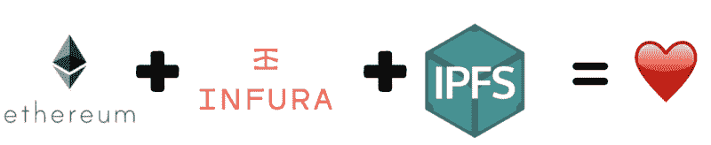
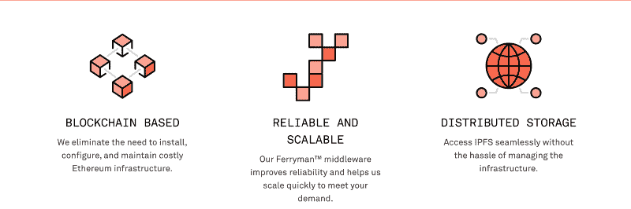
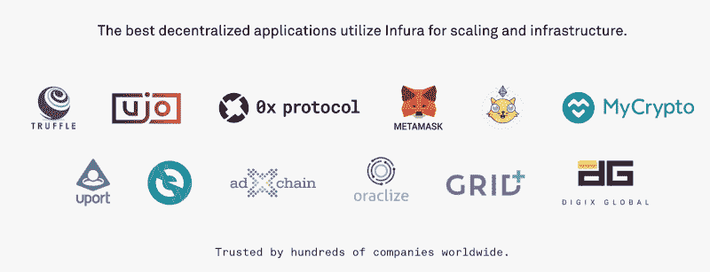
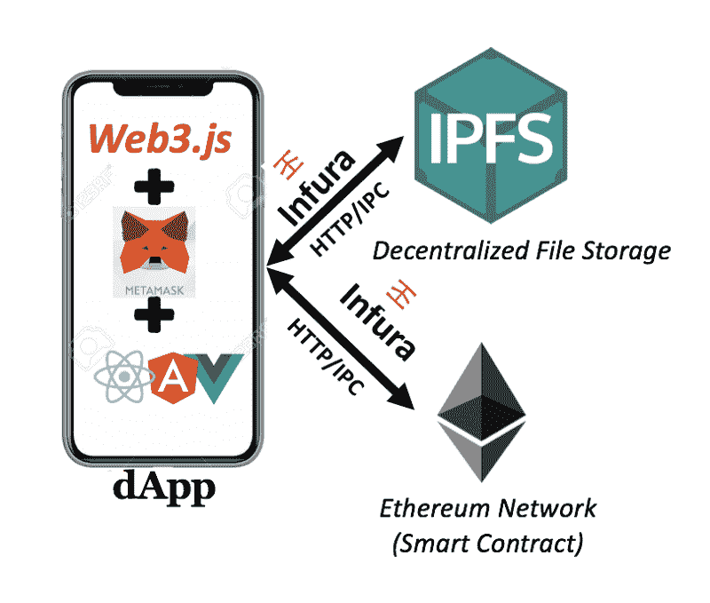
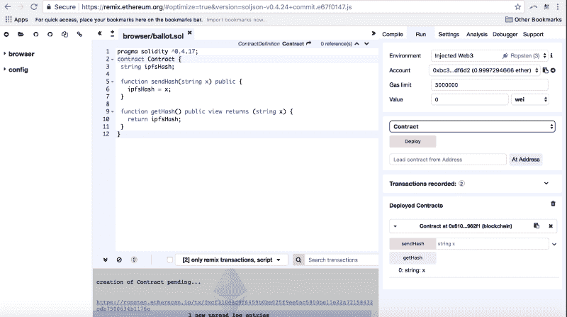
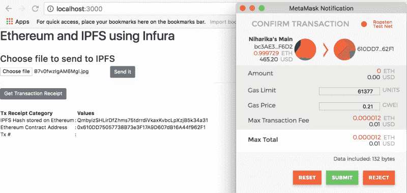
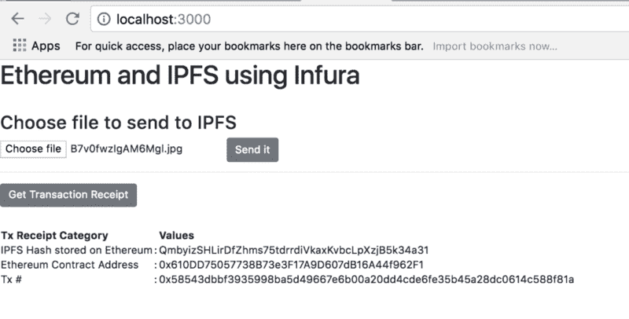

# 动手:以太坊上的 Infura 和 IPFS 入门

> 原文：<https://www.freecodecamp.org/news/hands-on-get-started-with-infura-and-ipfs-on-ethereum-b63635142af0/>

作者:尼哈里卡·辛格

# 动手:以太坊上的 Infura 和 IPFS 入门



### 为什么是 Infura？

区块链面临着许多棘手的问题，在某种程度上可以通过 Infura 和/或星际文件系统(IPFS)来解决。这些是主要的挑战:

1.  在以太坊区块链上存储数据非常昂贵
2.  配置以太坊 geth 客户端很难
3.  很难扩展基础设施

如果你使用 Infura，进入以太网和 IPFS 会变得更快。它不再需要几个小时来同步 geth 客户端，而下载整个区块链会占用大量的内存和带宽。

以下是使用 Infura 带来的一些其他优势:

*   大量的数据可以存储在 IPFS 上，而仅仅是文件的哈希就可以存储在以太坊上。
*   Infura 提供安全、可靠、可伸缩且易于使用的 API 来访问以太坊网络和 IPFS。开发人员不必担心以太坊节点或 IPFS 节点的基础设施。由 Infura 负责。
*   Infura 提供支持 TLS 的公共端点。
*   使用 JSON RPC，Web3，代码在以太坊的接口上是可移植的。
*   Infura 实际上是开发人员的瑞士军刀，也将部署团队从可伸缩性问题的地狱中拯救出来。



*   最后，Infura 值得信赖:



### dApp 描述

我们的 dApp 将从用户那里获取一个文件作为输入，并通过调用以太坊契约将它上传到 IPFS。文件的哈希将存储在以太坊上。

这是我们将经历的过程:

1.  将文件作为输入
2.  将文件转换为缓冲区
3.  将缓冲区上传到 IPFS
4.  存储 IPFS 返回的文件的哈希
5.  获取用户的元掩码以太坊地址
6.  用户通过元掩码向以太坊确认交易
7.  IPFS 哈希写在以太坊上



dApp Architecture

### 涉及的技术堆栈

*   [反应](https://reactjs.org/) —前端库
*   [可靠性](https://solidity.readthedocs.io/en/develop/) —用于构建运行在以太坊上的智能合约的语言
*   [IPFS](https://ipfs.io/) —分散存储
*   [Infura](https://infura.io) —API 访问以太坊网络和 IPFS

### 我们来编码吧！

> 确保您已经下载了元掩码。如果没有，从[这里](https://metamask.io/)下载。

> 另外，保持你的节点和 NPM 是最新的。

#### **安装以下依赖项:**

```
$ npm i -g create-react-app$ npm install react-bootstrap$ npm install fs-extra$ npm install ipfs-api$ npm install web3
```

完成后，在 CLI 上运行以下命令来创建一个示例 React 项目。我将把我的项目命名为 **ipfs** 。

```
$ create-react-app ipfs
```

#### **在 Ropsten Testnet 上部署智能合约**

。确保你在 metamask 的 Ropsten testnet 上。

要部署智能合约，我们需要以太网。要获取 Ropsten testnet 的乙醚，请前往[https://faucet.metamask.io/](https://faucet.metamask.io/)。

要部署智能合同，请转到[https://remix.ethereum.org](https://remix.ethereum.org)。

```
pragma solidity ^0.4.17;
```

```
contract Contract { string ipfsHash;  function setHash(string x) public {   ipfsHash = x; } function getHash() public view returns (string x) {   return ipfsHash; }
```

```
}
```



保存智能合同的地址。我的是:0x 610 DD 75057738 b 73 E3 f 17 a9 d 607 db 16 a 44 f 962 f 1

另外，将应用程序二进制接口(ABI)保存在 JSON 中。它可以在“详细信息”下的“编译”选项卡中找到。

我的如下:

```
[ {  "constant": false,  "inputs": [   {    "name": "x",    "type": "string"   }  ],  "name": "sendHash",  "outputs": [],  "payable": false,  "stateMutability": "nonpayable",  "type": "function" }, {  "constant": true,  "inputs": [],  "name": "getHash",  "outputs": [   {    "name": "x",    "type": "string"   }  ],  "payable": false,  "stateMutability": "view",  "type": "function" }]
```

在“ipfs/src”目录下，创建以下文件: **web3.js** 、 **ipfs.js** 和 **storehash.js** 。

#### 文件 1 — Web3.js

```
import Web3 from 'web3';
```

```
const web3 = new Web3(window.web3.currentProvider);
```

```
export default web3;
```

#### 文件 2 — Storehash.js

```
import web3 from './web3';
```

```
//Your contract addressconst address = '0x610dd75057738b73e3f17a9d607db16a44f962f1';
```

```
//Your contract ABIconst abi = [ {  "constant": false,  "inputs": [   {    "name": "x",    "type": "string"   }  ],  "name": "sendHash",  "outputs": [],  "payable": false,  "stateMutability": "nonpayable",  "type": "function" }, {  "constant": true,  "inputs": [],  "name": "getHash",  "outputs": [   {    "name": "x",    "type": "string"   }  ],  "payable": false,  "stateMutability": "view",  "type": "function" }]
```

```
export default new web3.eth.Contract(abi, address);
```

#### 文件 3-ipfs . js

```
const IPFS = require('ipfs-api');const ipfs = new IPFS({ host: 'ipfs.infura.io', port: 5001, protocol: 'https' });
```

```
export default ipfs;
```

#### 编辑— Index.js

```
import React from 'react';import ReactDOM from 'react-dom';import './index.css';import App from './App';import registerServiceWorker from './registerServiceWorker';import 'bootstrap/dist/css/bootstrap.min.css';
```

```
ReactDOM.render(<App />, document.getElementById('root'));registerServiceWorker();
```

#### 文件 4 — App.js

```
import React, { Component } from 'react';import web3 from './web3';import ipfs from './ipfs';import storehash from './storehash';import { Button } from 'reactstrap';
```

```
class App extends Component {
```

```
state = {      ipfsHash:null,      buffer:'',      ethAddress:'',      transactionHash:'',      txReceipt: ''    };
```

```
//Take file input from usercaptureFile =(event) => {        event.stopPropagation()        event.preventDefault()        const file = event.target.files[0]        let reader = new window.FileReader()        reader.readAsArrayBuffer(file)        reader.onloadend = () => this.convertToBuffer(reader)      };
```

```
//Convert the file to buffer to store on IPFS convertToBuffer = async(reader) => {      //file is converted to a buffer for upload to IPFS        const buffer = await Buffer.from(reader.result);      //set this buffer-using es6 syntax        this.setState({buffer});    };
```

```
//ES6 async functiononClick = async () => {try{        this.setState({blockNumber:"waiting.."});        this.setState({gasUsed:"waiting..."});
```

```
await web3.eth.getTransactionReceipt(this.state.transactionHash, (err, txReceipt)=>{          console.log(err,txReceipt);          this.setState({txReceipt});        });      }catch(error){      console.log(error);    }}
```

```
onSubmit = async (event) => {      event.preventDefault();
```

```
//bring in user's metamask account address      const accounts = await web3.eth.getAccounts();    //obtain contract address from storehash.js      const ethAddress= await storehash.options.address;      this.setState({ethAddress});    //save document to IPFS,return its hash#, and set hash# to state      await ipfs.add(this.state.buffer, (err, ipfsHash) => {        console.log(err,ipfsHash);        //setState by setting ipfsHash to ipfsHash[0].hash        this.setState({ ipfsHash:ipfsHash[0].hash });        // call Ethereum contract method "sendHash" and .send IPFS hash to etheruem contract        //return the transaction hash from the ethereum contract        storehash.methods.sendHash(this.state.ipfsHash).send({          from: accounts[0]        }, (error, transactionHash) => {          console.log(transactionHash);          this.setState({transactionHash});        });      })    };
```

```
render() {
```

```
return (        <div className="App">          <header className="App-header">            <h1>Ethereum and IPFS using Infura</h1>          </header>
```

```
<hr/><grid>          <h3> Choose file to send to IPFS </h3>          <form onSubmit={this.onSubmit}>            <input              type = "file"              onChange = {this.captureFile}            />             <Button             bsStyle="primary"             type="submit">             Send it             </Button>          </form><hr/> <Button onClick = {this.onClick}> Get Transaction Receipt </Button> <hr/>  <table bordered responsive>                <thead>                  <tr>                    <th>Tx Receipt Category</th>                    <th> </th>                    <th>Values</th>                  </tr>                </thead>
```

```
<tbody>                  <tr>                    <td>IPFS Hash stored on Ethereum</td>                    <td> : </td>                    <td>{this.state.ipfsHash}</td>                  </tr>                  <tr>                    <td>Ethereum Contract Address</td>                    <td> : </td>                    <td>{this.state.ethAddress}</td>                  </tr>                  <tr>                    <td>Tx # </td>                    <td> : </td>                    <td>{this.state.transactionHash}</td>                  </tr>                </tbody>            </table>        </grid>     </div>      );    }}export default App;
```

**仅此而已！**

在 localhost:3000 访问您的 dApp。上传一个文件，你会看到一个哈希生成。为确保您的文件已上传，请通过 IPFS 网关访问它。确保您接受元掩码请求。



访问您的文件在:https://gateway.ipfs.io/ipfs/your IPFS 哈希

地雷是 at:【https://gateway . IPF . io/IPF/qmbyizshlirdfzhms 75 tdrrdivkaxvbclpx JB 5k34 至 31】

要了解更多关于 IPFS 的信息，请参阅我的其他文章:

[**边做边学:简单易懂的行星间文件系统入门**](https://medium.freecodecamp.org/ipfs-101-understand-by-doing-it-9f5622c4d4ed)
[*IPFS 入门*medium.freecodecamp.org](https://medium.freecodecamp.org/ipfs-101-understand-by-doing-it-9f5622c4d4ed)[**IPFS？默克森林呢？**](https://hackernoon.com/ipfs-and-merkle-forest-a6b7f15f3537)
[**W**h*at 是 IPFS 吗？哈*ckernoon.com](https://hackernoon.com/ipfs-and-merkle-forest-a6b7f15f3537)

#### 感谢您的阅读。如果你喜欢这个，请鼓掌！在 Twitter 上关注我 [@](https://www.freecodecamp.org/news/hands-on-get-started-with-infura-and-ipfs-on-ethereum-b63635142af0/undefined) Niharika3297