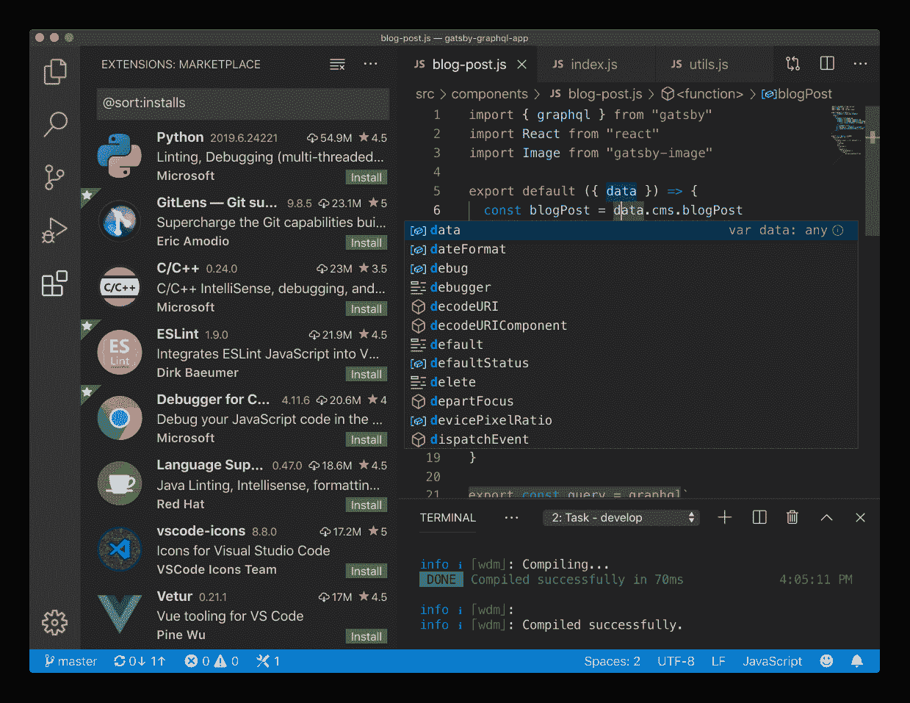

# 每个程序员都应该知道的 10 个流行的 Web 开发工具

> 原文：<https://www.freecodecamp.org/news/handy-web-development-toolkit/>

你打算从事网络开发吗？带上工具，外面很恐怖。让我们来看看一些常见的 web 开发工具，它们将帮助您加快工作流程，成为更好的 web 开发人员。

请注意，您的里程可能会有很大差异。这篇文章只是列出了最流行的解决方案。您仍然需要将它们集成到您的项目中，并对它们有更多的了解。

也就是说，这里列出了我经常在工作流程中使用的最常用的工具/包。

## #1 VSCode？

VSCode 无需介绍。这是一个漂亮而强大的代码编辑器，支持扩展、集成终端、代码片段、主题、快捷方式、远程 SSH 等等——根据您的需要。

它运行在 electronic 之上，兼容跨操作系统，并作为一个开源项目不断被微软改进。VSCode 附带了一套丰富的工具，通过语言服务器协议的智能感知，以及全年的快速修复/补丁。

立即从官方 [VSCode 网站](https://code.visualstudio.com/)获取 VSCode。

## #2 网络包？

Webpack 将自己标榜为一个模块捆绑器，但实际上，它比模块捆绑器更具可扩展性。你可以附加过多的插件，调整它的配置，使它更健壮，更符合你的需要。

Webpack 4 是作为**零配置模块捆绑包**而来的——这意味着你几乎可以立即开始使用 Webpack！您只需使用`npm i webpack`下载模块，然后在您的目录中运行`npx webpack`。以下是如何使用 webpack 设置零配置:

[https://www.youtube.com/embed/g9_91gUHy6k?feature=oembed](https://www.youtube.com/embed/g9_91gUHy6k?feature=oembed)

## #3 柏树？

Cypress 是一个伟大的 e2e 测试工具，它实际上可以旋转一个无头或者全 chrome 窗口来运行你的代码的实际测试。它可以以非常直观的方式与异步代码进行交互。例如，它等待资源加载/变得可用，这与 Selenium 不同，Selenium 是一种非常古老的技术，主要用于静态站点的自动化测试。让我们通过一个快速视频来看看 Cypress 是如何工作的:

[https://player.vimeo.com/video/237527670?app_id=122963](https://player.vimeo.com/video/237527670?app_id=122963)

Cypress 测试非常简单且易于编写，它完成了开箱即用的所有繁重工作(比如启动 chrome 实例、适当的键盘事件、可信事件发射器，等等)。获取柏树[这里](https://www.cypress.io/)。

## #4 打字稿？

写纯 JavaScript？如果没有适当的林挺，找到细微的错误是非常痛苦的。为了通过更好的类型检查和模块自动完成使它更加强大，请随身携带 TypeScript。

TypeScript 是 JavaScript 的超集，它在执行之前向下转换为 JavaScript。这意味着您可以像以前一样运行 JavaScript，但是以“更严格”的方式编码 JS 带来了额外的开发好处。

如果说 TypeScript 真正实现了有益的 JavaScript 代码库维护，并使重构变得轻而易举，这并没有错。可以通过他们的[官方文档](https://www.typescriptlang.org/docs/handbook/typescript-in-5-minutes.html)开始学习 TypeScript。

## #5 哨兵？

Sentry 是一个用于生产的错误报告服务。很多时候，尤其是在前端，您的用户可能会面临崩溃或意想不到的错误。

我个人使用 Sentry 进行 [codedamn](https://codedamn.com) ，我已经修复了相当多的令人讨厌的错误和崩溃原因，这些错误和原因很少发生在平台上非常特定的用户在非常特定的操作期间。

另外，Sentry 存在于许多平台上，并不仅限于 JavaScript 运行时。这意味着 Sentry 可以用于几乎任何流行的技术栈。

Sentry 将关于 bug 的完整堆栈跟踪/信息直接发送到您的仪表板中，这样您就可以在下一个发布周期修复那个讨厌的 bug。在这里阅读关于[哨兵](https://sentry.io)。

[https://player.vimeo.com/video/340759078?app_id=122963](https://player.vimeo.com/video/340759078?app_id=122963)

## #6 Git？

Git 是任何大型项目的魔棒。Git 是一个版本控制系统(VCS ),允许你增量地构建你的软件，同时保持与先前构建的完全不同。这意味着您不会丢失任何历史，并且可以轻松地恢复到上一个工作点。

不仅如此，你还可以分支做一些完全不同的事情，而不会影响到原来的项目。这个概念在 git 中叫做分支。关于 git，您可以学习的还有很多。我喜欢 git 上 newboston 的这个系列。看一看:

[https://www.youtube.com/embed/videoseries?list=PL6gx4Cwl9DGAKWClAD_iKpNC0bGHxGhcx](https://www.youtube.com/embed/videoseries?list=PL6gx4Cwl9DGAKWClAD_iKpNC0bGHxGhcx)

托管 git repos 最流行的解决方案是 GitHub。它提供免费的公共和私人知识库。你可以在这里了解更多关于 git [的信息。](https://git-scm.com/)

## #7 巴别塔？

Babel 允许你编写最前沿的 JavaScript 特性，然后将它们以一种浏览器知道并已经实现了很久的标准移植到浏览器上。

将 babel 与 webpack 结合使用是一个非常强大的组合，允许您使用前沿功能，然后将它们捆绑/缩小在一起。这为开发人员提供了开发应用程序的最佳体验，也为用户提供了速度和性能方面的最佳体验。

例如，您可以用 babel 编写 ES2020 代码，并让它将其向下转换到 ES2015 版本，以便发布到浏览器。它让编写 JavaScript 变得非常有趣和方便，因为它允许你在未来使用 JavaScript！点击了解巴别塔[。](https://babeljs.io/)

## #8 材料用户界面⭐️

Material UI 是 Google 关于如何创建布局的规范。在 Material UI 之上，有许多组件库可用于许多框架，如 Angular、React 或 React Native。一些组件库包括:

1.  [材料 UI -反应](https://material-ui.com/)
2.  [React 原生纸](https://callstack.github.io/react-native-paper/)
3.  [消失](https://github.com/vuetifyjs/vuetify)
4.  [角状材料](https://github.com/angular/components)

这简化了开发人员手动构建大量组件的过程。与此同时，它为他们提供了快速和精心设计的组件。点击了解素材 UI [。](https://material-ui.com/)

## #9 Joi？

数据验证是任何应用程序的重要组成部分。这是因为你永远不能相信来自用户的数据。对于有多个端点连接到后端服务器的大规模应用程序，处理所有的边缘情况会变得非常棘手。

Joi 是一个非常方便的库，它通过严格的预定义模式帮助您验证所有输入的数据。Joi 允许你为数组、对象甚至它们应该接受的值构造模式。

如果输入失败，它还允许您定制错误消息。在你的代码中不再有`obj && typeof obj === 'string'`的麻烦！使用 Joi 的模式不仅安全，而且使您的代码对其他开发人员来说可读性更好。点击了解更多关于 Joi [的信息。](https://github.com/hapijs/joi)

## #10 Docker？

建立 docker for development 本身也有一些挑战(从经验上来说)。但一旦完成，投资是值得的。部分是因为你去掉了“它在我的机器上工作”的错误。

但是，运行沙盒代码还有另一个好处。万一您的 web 应用程序被黑客攻击或关闭，docker 容器将确保攻击仅限于该特定的容器，其他服务不会受到影响(当然，除非您的容器有不符合标准的安全规则)。

今天就可以开始使用 Docker！从这个播放列表开始:

[https://www.youtube.com/embed/videoseries?list=PLYxzS__5yYQlzv9_z1eZmZY8dzMlQFbaH](https://www.youtube.com/embed/videoseries?list=PLYxzS__5yYQlzv9_z1eZmZY8dzMlQFbaH)

# 结论

网络是巨大的，如果你刚刚开始，它可能会让人不知所措！从曾经和你一样的开发人员那里获得一些帮助。你甚至可以在[Twitter](https://twitter.com/mehulmpt)/[insta gram](https://instagram.com/mehulmpt)上联系我，并建立联系。我很乐意帮忙。

你希望以一种全新的方式学习 web 开发和其他编程语言吗？前往一个[面向开发者的新平台](https://codedamn.com)我今天正在尝试它！