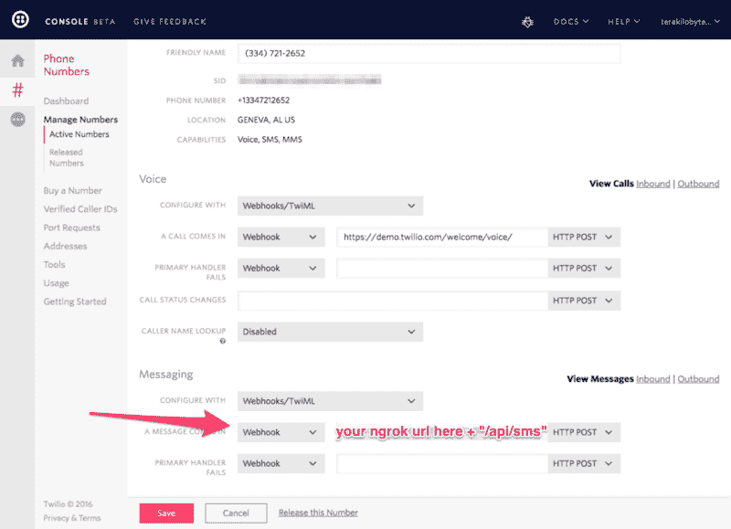

# 快乐的小项目:Elixir、Phoenix、Twilio 和 Spotify API

> 原文：<https://www.freecodecamp.org/news/happy-little-projects-ef8cd157287/>

作者内森

# 快乐的小项目:Elixir、Phoenix、Twilio 和 Spotify API


开始一个编程项目最困难的一个方面是首先提出一个项目想法。没有灵感就意味着没有编程！

幸运的是，我最近发现了一个不错的项目创意:一个使用 Spotify 的 API 和 Twilio 的基本 Node.js 和 Express.js 应用程序。

如果你想跟随 JavaScript 版本，看看这个[视频](https://youtu.be/EKb8XD_V32o)。如果你想在 Gradle 和 Spark 中建立它，这里是 Twilio 的[原帖](https://www.twilio.com/blog/2015/09/getting-started-with-gradle-and-the-spark-framework-3.html)。

在本文中，我们将使用 Elixir 和 Phoenix 构建这个应用程序。让我们开始吧。

这是应用程序的一般流程:

*   你把歌名发短信给 Twilio 号码
*   Twilio 向预先配置的 url 发送一个 HTTP POST，其中包含一些信息，包括歌曲标题和请求者的信息
*   该应用程序在 Spotify API 中搜索歌曲，并解析出一个预览 url
*   应用程序向 Twilio API 发送一条消息。这包括要调用的号码和获取一些 TwiML(Twilio 标记语言)的 url
*   Twilio 从我们的应用程序中获取 TwiML，调用接收者，并向他们播放歌曲预览。

我已经完成了自由代码营的大部分课程。我帮助设计和构建了自由代码营背后的大部分核心系统，所以我对 JavaScript 非常熟悉。跟随演示很容易，我很快就重新创建了它。问题是，我能否用一种我没有扎实经验的语言和框架来做这件事？

如果你想知道成品*看起来*是什么样子，发一首歌的标题到+1(334)721–2652。别担心，我们不会保存您的电话号码或歌曲。求所有你想要的 ABBA！

注意:我已经在这上面投入了一些资金来维持一段时间。我把它放在 Heroku 上，所以可能需要一点时间来清醒和回应。如果完全没有反应，那我加的资金已经用完了。

这里有一个简短的视频，我用谷歌语音与我的应用程序互动。

我想挑战自己，尝试一种我听说后就着迷的语言。药剂是一种华丽的语言，具有 Ruby 风格的语法。Elixir 运行在 BEAM (Erlang VM)上，可以与 Erlang 互操作。是的， [WhatsApp 成名](http://www.wired.com/2015/09/whatsapp-serves-900-million-users-50-engineers/)的二郎。我喜欢能够利用这种能力和可靠性的想法。我也**热爱**函数式编程。

除了 Elixir，我还是凤凰网框架的粉丝。它很容易上手，也很容易完成。错误消息非常好，并且会准确地告诉您如何修复它们。相信我，我已经看够了。

第一个任务是生成新的 Phoenix 应用程序。我打电话给我的 Philter，所以我输入:

```
mix phoenix.new philter --no-ecto --no-brunch 
```

这样，我们就创建了一个名为 Philter 的新的 phoenix 应用程序，没有数据库层，也没有 JavaScript 构建系统。我们不会在这个项目中使用任何 JavaScript！

按照屏幕上的说明完成应用程序的设置。我们现在准备完成我们的任务列表。

#### **Twilio**

Twilio 使得建立账户变得非常容易。另外，他们的文档和控制台都是一流的。这是我最喜欢使用的网络服务之一。

在此报名参加 Twilio [。如果你想跟随这个教程，你必须增加一些资金。5 美元足够你玩几天了。如果你决定跟随，买一个电话号码，并保持你的浏览器标签打开。](https://www.twilio.com/try-twilio)

#### Ngrok

你想使用的下一个服务是 [ngrok](https://ngrok.com/) 。这个方便的小服务进入你电脑的指定端口，给你一个公共网址。这项服务是完全免费的，但我注册了 5 美元/月的计划，这样我就可以有一个保留的子域。我告诉你，这是小事。

打开一个新的终端选项卡，并通过 npm 安装 ngrok。然后使用 ngrok 指定您想要创建一个到您的计算机上的端口 4000 的 http 隧道。

```
# is a comment for your information# ~ represents your terminal prompt~ npm i -g ngrok
```

```
...~ ngrok http 4000ngrok by @inconshreveable                           (Ctrl+C to quit) 
```

```
Tunnel Status             onlineVersion                   2.1.1Region                    United States (us)Web Interface             http://127.0.0.1:4040Forwarding                http://someurl.ngrok.io -> localhost:4000Forwarding                https://someurl.ngrok.io -> localhost:4000
```

现在切换回你原来的终端标签，启动你的凤凰应用。

```
~ iex -S mix phoenix.server      # <or>~ mix phoenix.server
```

第一个选项在一个交互式 shell 中启动服务器，让您可以与之交互。不管您启动它的方法是什么，您都会看到它注销它正在本地机器的端口 4000 上侦听。


现在打开一个新的浏览器标签并访问 *localhost:4000* 以确认它正在工作。然后，在我上面加粗的 ngrok 终端中粘贴来自*转发* http 行的 url。你也会在那里看到你的应用。神奇！

回到你打开 Twilio 控制台的标签页，找到你的电话号码。单击它，您应该会看到一些配置信息。在“消息”部分，“当有消息进来时”，输入来自 ngrok 的 url，后跟“api/sms”。确保 HTTP 方法设置为 POST。作为参考，在构建这个应用程序时，我的设置是*http://tkb.ngrok.com/api/sms*



当我们打开 Twilio 控制台时，获取您的帐户 SID 和 AUTH TOKEN 凭据。您可以通过点击窗口右上角的您的帐户名称并查看“API 凭证”部分来找到它们。创建两个环境变量 TWILIO_ACCOUNT_SID 和 TWILIO_AUTH_TOKEN。我在 Mac 上使用了一个名为 [EnvPane](https://github.com/hschmidt/EnvPane) 的首选项面板扩展。如果你需要帮助设置你的，你也可以搜索谷歌，得到大量的结果。

手头有了所有这些信息，我们差不多准备好把它们联系起来了。我们还有最后一件事要配置。我们将使用 [ExTwilio](https://github.com/danielberkompas/ex_twilio) ，一个库来帮助我们的 phoenix 应用程序与 Twilio 对话。

打开 *config/config.exs* 并在最后的*导入*语句上添加以下内容:

```
config :ex_twilio,  account_sid: System.get_env(“TWILIO_ACCOUNT_SID”),  auth_token: System.get_env(“TWILIO_AUTH_TOKEN”)
```

在这里，我们告诉我们的应用程序读入这两个环境变量，这样我们就可以通过 Twilio 的 API 发送消息和打电话。

在你最喜欢的编辑器中(我的是 [Spacemacs](http://spacemacs.org) ，打开你的 Phoenix 应用程序目录。让我们言归正传。

打开 *web/router.ex* ，去掉你看到的任何**范围**的东西。替换为:

```
scope “/”, Philter do  pipe_through :browser
```

```
 post “/twiml”, TwimlController, :indexend
```

```
scope “/api”, Philter do  pipe_through :api
```

```
 post “/sms”, SmsController, :indexend
```

用你在申请中给的名字来代替任何提到菲尔特的地方。

上面的代码做了几件事。我们已经创建了一个路由，将帖子匹配到*http://yourngrokurl/twiml*并路由到 *TwimlController* 的索引函数。我们也为*http://yourngrokurl/API/SMS*路由做了同样的事情，传递给 *SmsController* 的索引函数。查看优秀的[文档](http://www.phoenixframework.org/docs/routing)，了解更多关于凤凰城路由的信息。

现在在 *web/controllers/* 目录下创建两个文件， *sms_controller.ex* 和 *twiml_controller.ex* 。让你的 *sms_controller.ex* 看起来像:

```
defmodule Philter.SmsController do  use Philter.Web, :controller
```

```
 alias Philter.Sms
```

```
 def index(conn, %{"Body" => song, "From" => from, "To" => to}) do
```

```
 Task.start_link(fn -> search_spotify(song, %{from: from, to:     to}) end)    send_resp(conn, 200, “”)   end
```

```
 defp search_spotify(song, twilio_data) do    Philter.Spotify.search(song, twilio_data)  endend
```

对于那些读到这里的精英主义者，请记住我还在学习。先不说免责声明，接下来简单解释一下。

Twilio 会将请求者的电话号码张贴在“发件人”字段的“T0”中，将我们的 Twilio 号码张贴在“T2”到“T3”字段中，并将他们的文本正文张贴在“T4”正文字段中。我们把它们捞出来，然后产生一个搜索 Spotify API 的任务。


生成一个任务在一个超轻量级的 BEAM 进程中执行一些长时间运行的函数。如果进程发生了一些事情，比如崩溃、着火或者被宇宙射线击中，我们的应用程序会很高兴地继续接受连接，防止开发人员恐慌。

对任务和 OTP 的全面讨论远远超出了本文的范围。如果你想了解更多关于这种神奇动物的信息，请参考本帖中的灵药链接。

现在参考这个项目的 [GitHub 库](https://github.com/terakilobyte/Philter)。你想要复制的文件是 *lib/philter/spotify.ex* 和整个 *lib/philter/spotify/* 目录。确保你浏览了所有的文件，把所有提到 Philter 的地方都改成你自己的名字。在 *spotify.ex* ，[第 55 行](https://github.com/terakilobyte/Philter/blob/master/lib/philter/spotify.ex#L55)，将 url 中的“tkb”替换为你的 ngrok url。

现在让你的 *twiml_controller.ex* 看起来如下:

```
defmodule Philter.TwimlController do  use Philter.Web, :controller
```

```
 alias Philter.Twiml
```

```
 def index(conn, %{"song" => song) do    render(conn, “index.html”, song: song)  endend
```

我们在这里所做的就是把这首歌找出来，然后把它作为一个变量传递给我们的模板。

打开 *web/templates/* 目录下的 *app.html.eex* ，删除除了:

```
 <%= render @view_module, @view_template, assigns %>
```

我们不需要任何其他的标记！

接下来，在 *web/views/* 目录下创建一个名为 *twiml_view.ex* 的文件。我们可以把帮助函数放在这里，但是我们不需要任何帮助函数，所以它只是作为一个 shell 文件存在。内容应该是:

```
defmodule Philter.TwimlView do  use Philter.Web, :viewend
```

现在在 *web/templates/* 下创建一个名为 *twiml/* 的新目录，并在其中创建一个名为 *index.html.eex* 的文件。内容很简单:

```
 <?xml version=”1.0" encoding=”UTF-8" ?> <Response>   <Say>Please enjoy the clip!&lt;/Say>   <Play><%= @song %></Play>   <Say>I hope you enjoyed your song clip</Say> </Response>
```

这是当 Twilio 向我们请求 TwiML 来响应我们在任务中的 API 交互时，我们将发送给他们的响应。请随意使用，并参考伟大的 TwiML 文档。

随着凤凰城的重新启动，你应该能够短信你的 Twilio 电话号码，并通过歌曲预览获得电话！

#### -什么

我从用 Elixir 实现这个小应用程序中获得了很多乐趣。就像我学习 JavaScript 时一样，我不得不考虑如何做事情，如何正确地使用函数(甚至找到正确的函数来使用！)，并确保应用程序逻辑是正确的。

当我更深入地钻研长生不老药的时候，我皱起了眉头，参考了大量的文档和在线教程。不过，我非常惊喜地发现 Phoenix 只需要很少的特定代码。在我看来，这是一个很好的框架。

最终，最终产品让暂时的挫折变得值得。让我的妻子和朋友做出反应，比如“太酷了！”或者“你做的？”绝对值得努力。这也有助于巩固我对事物如何运作的模式和概念。也许在我退伍后，我真的能够过渡到编程领域。

我得向特维里奥大声呼喊。他们做了一个出色的项目。我需要执行的每个交互都有很好的文档记录，他们的管理控制台本身使我很容易找到我需要的东西，并在那端配置操作。

如果你有兴趣了解更多关于仙丹和凤凰的知识，我强烈推荐[编程仙丹](https://pragprog.com/book/elixir12/programming-elixir-1-2)、[仙丹行动](https://www.manning.com/books/elixir-in-action)和[编程凤凰](https://pragprog.com/book/phoenix/programming-phoenix)。这三样我都有，而且都很棒！在线文档远高于标准，越来越多的教程和文章不断涌现。总的来说，Elixir 社区是最好的社区之一。

我们很高兴在 FreeCodeCamp 的后端语言中加入 Elixir。

学习编码很难。我强烈推荐报名参加[免费代码营](http://www.freecodecamp.com)，并遵循我们已经建立的非常结构化和自定进度的学习路线。成千上万的人正在寻找成功，在我们的 Gitter room 里有一个**大规模的**乐于助人的社区——从初学者到专业人士。

记住，不要让像今天任务中的挫折这样短暂的事情阻止你实现明天的目标。编码快乐！