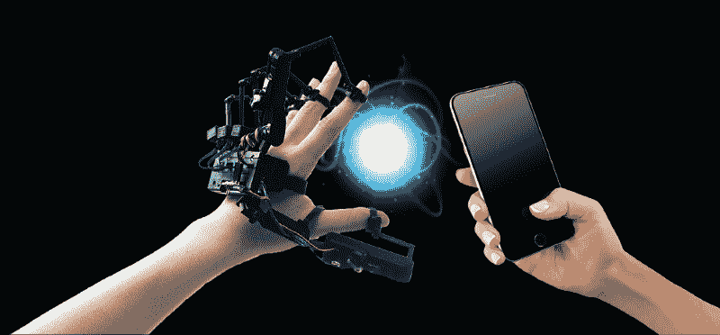
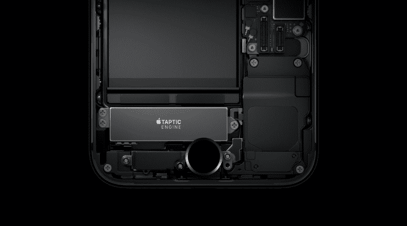
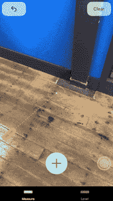
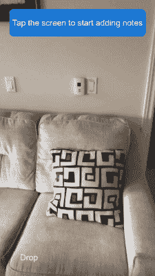
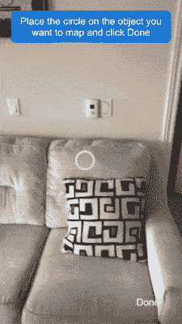
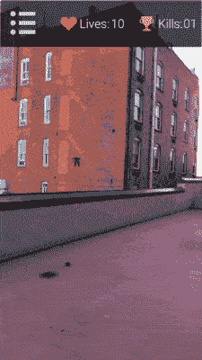
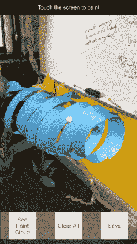
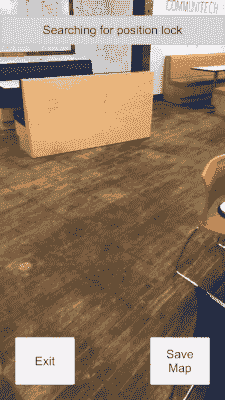

# 移动 AR 的触觉:如何增强 ARKit 应用的“触觉”

> 原文：<https://www.freecodecamp.org/news/haptics-for-mobile-ar-how-to-enhance-arkit-apps-with-a-sense-of-touch-151d9e9c9950/>

尼尔·马修

# 移动 AR 的触觉:如何增强 ARKit 应用的“触觉”



对于 AR 和 VR 的触觉学的未来，我真的很兴奋。感觉就像是我的 HTC Vive 和[带着 Parzival 和 Art3mis](https://en.wikipedia.org/wiki/Ready_Player_One_(film)) 跳进绿洲之间缺失的一环。因此，毫不奇怪，haptics 可能是目前 XR 社区中最受期待的技术。像微软和 HTC 这样的几家公司，以及像 [SenseGlove](https://www.senseglove.com/) 和 [HaptX](https://haptx.com/) 这样的初创公司，已经展示了越来越有前景的触觉手套版本，我很想尝试一下。

不幸的是，像今天大多数 AR 开发者一样，我们在 [**Placenote**](https://placenote.com) 的工作几乎完全集中在移动 AR 平台上，如 **ARKit** 和 **ARCore** 。很自然地，这让我们开始思考，**“触觉技术能为移动增强现实做些什么吗？**”

从模拟触觉按钮点击到无声通知，触觉已经成为触摸屏的一个令人敬畏的附加功能。但是，在疯狂地搜索了一番之后，我们意识到，到目前为止，实际上还没有关于移动 AR 应用的触觉的真正讨论……接受挑战？？

### **移动 AR 的挑战**

我们决定探究为什么 haptics 没有进入移动 AR 领域，不难看出为什么。移动 ar 是迄今为止最没有沉浸感的 AR 媒介。社区中的共识是，它只是终极 AR 平台——智能眼镜的一个权宜之计。

但是心态并不是唯一的障碍。我们发现，移动外形给 AR 体验设计师带来了一些独特的挑战:

*   与耳机不同，电话屏幕既是显示器又是控制器
*   因为你拿着电话，所以不可能把手伸进去体验。
*   我们仍然依赖维度模糊的触摸屏交互——2D 还是 3D 触摸？

然而，现实是，在未来几年甚至更长的时间里，移动增强现实将会一直存在。现在消费者口袋里有 10 亿个移动设备，但他们头上只有少数几个 AR 耳机。作为一名开发者，你的应用程序的分发比其他大多数因素都重要。事实上，在室内导航和游戏等应用中，移动设备已经证明了自己是部署 AR 体验的可行介质。

这就把我们带到了移动 AR 的触觉这个话题。起初，似乎没有什么希望让触觉技术增强移动 AR 体验，但最近的研究实际上表明了相反的情况。

### **在触觉学中，少即是多**

有无数种方法可以实现触觉反馈。一般来说，它们分为两大类——**动觉触觉**(力反馈)和**皮肤触觉**(皮肤感觉)。

动觉触觉被广泛认为是更真实的触觉技术。它涉及物理致动器，接地或不接地。这些东西推拉我们的手指和其他肢体，以响应与虚拟物体的交互。直觉上，真实的力反馈应该比简单的旧振动表现得好得多。但是今年发表在《科学机器人学》上的一项名为“触觉的神秘山谷”的研究挑战了这些假设。

研究人员发现，增加触觉的真实感不一定会提高 AR 体验的质量。由于模拟中不可思议的现实主义山谷，它经常产生负面影响。他们发现，皮肤触觉，本质上是轻触和振动的结合，在欺骗大脑更深入幻觉方面做得更好。奇怪的结果，但他们基本上意识到，我们低估了我们的大脑在填补我们对现实的感知的差距方面有多好。

> 我们的大脑填补空白的情况是我发现我们对触觉感知最有趣的地方。—奥索虚拟现实公司首席执行官贾斯汀·布拉德

### **将触觉技术引入移动增强现实**

鉴于这些发现，为什么不测试一下皮肤触觉可以为移动 AR 做些什么呢？毕竟，手机上的触觉不再仅仅是振动铃声。

移动设备上的微机电系统(MEMS)已经变得更加复杂，能够实现一些非常微妙的行为。自 iPhone 7 以来，苹果已经将旧的基本隆隆震动升级为他们现在所谓的 **Taptic 引擎。**这要微妙得多，由**七种不同类型的触觉反馈**组成，具有不同的模式和强度。

可用的触觉反馈模式有:

*   选择变更
*   冲击灯
*   冲击介质
*   冲击大
*   通知成功
*   通知警告
*   通知失败



The new iOS Taptic Engine (iPhone 7 onwards) has 7 different kinds of Haptic Feedback

要了解有关 iOS 反馈生成器的更多信息，[请查看苹果文档](https://developer.apple.com/documentation/uikit/uifeedbackgenerator)。在这篇文章的最后，我将分享一些代码，你可以使用这些代码快速地将这些反馈类型添加到你的 ARKit 应用程序中。

我们**决定在我们的 AR 应用程序中试验**这些触觉反馈模式，我非常兴奋地说，结果对我们的团队来说是一个惊喜。以下是我们移动 AR 应用中触觉实现的一些例子。

### **触觉在移动 AR 中的使用示例**

在我们迄今为止的实验中，我们发现移动 ar 的触觉反馈在五种不同的场景中工作良好。下面是对每一个的描述。

#### 1.磁性指针(即吸附到网格)

沿着平面锁定指针是许多 ARKit 应用程序中常用的功能，特别是在测量工具中，如 [Air Measure](http://armeasure.com/) 和 [Magic Plan](https://www.magic-plan.com/) 。由于你的手机在移动 AR 中充当控制器，测量应用程序中的标准 UX 涉及沿着表面拖动指针来绘制线条或多边形，以测量现实世界中的事物。当然，说到画线，吸附到线条端点和边缘的磁性指针随处可见——从 PowerPoint 到 Photoshop。

我们发现，指示指针位置“突然移动”的微妙触觉反馈是一个很大的增强。感觉就像你的手机(也就是你的控制器)正在移动到位。

我真的很高兴看到苹果的新应用“Measure”在他们的 UX 中使用了触觉反馈。这是一个非常微妙的实现，你可以在下面看到它的 GIF 图片。当指针捕捉到平面的边缘时，会触发一个“影响媒介”。



Apple’s Measure App

#### 2.点击测试(感受真实世界的表面)

ARKit 应用程序的另一个常见功能是点击测试。这实现为从屏幕上的一个点——接触点或中心——到真实世界中的一个表面的光线投射。它通常用于在接触点添加 3D 对象。轻微的触觉可以帮助用户理解表面被“击中”。我们发现两种方法在这里效果很好:

**锁定**
在这个例子中，一个标记被添加到场景中的点击点。“撞击光”有助于用户感知 3D 空间中标记的“锁定”。当然，这样做的缺点是你不能完全感觉到击中点的“深度”——换句话说，针离用户有多远。



放牧
钉扎的替代方法是点击测试的放牧法。在这种情况下，不断更新的标记预览标记可能会添加到场景中。我们发现，基于预览标记在每一帧的位移幅度，一系列触觉脉冲会产生指针在 3D 表面上刮擦的感觉，让您“感受”3D 表面。



这里有一个在 Unity 放牧的代码示例:

```
if (distanceChange >= 0.1 && distanceChange < 0.2) 
{
    iOSHapticFeedback.Instance.Trigger(Impact_Light);
}
else if (distanceChange >= 0.2 && distanceChange < 0.4) 
{
    iOSHapticFeedback.Instance.Trigger(Impact_Medium);
}
else if (distanceChange >= 0.4)
{
    iOSHapticFeedback.Instance.Trigger(Impact_Heavy);
}
```

#### 3.FPS 枪后座力或爆炸

这是迄今为止触觉反馈最有趣的例子。当在 AR 中构建第一人称射击游戏时，你的手机既是武器又是显示器。模拟枪击的一个很好的方法是简单的“撞击重物”，它产生单次撞击或“通知失败”，这产生了两次撞击，感觉很像枪的后坐力。当然，下面的例子是激光武器，但是，嘿，这并不意味着太现实，记得吗？



#### 4.与控制器尖端碰撞

在像 [Oculus Medium](https://www.oculus.com/medium/) 或 [Tilt Brush](https://www.tiltbrush.com/) 这样的 VR 应用中，其中一个手持控制器充当画笔笔尖，用户可以四处移动以在 3D 空间中进行绘制。我花了几个小时用倾斜画笔绘画，所以很自然地，我非常努力地用 ARKit 来模仿这种体验。

麻烦在于，在移动设备上创建精确的绘画体验变得非常困难。当你的手机既是显示器又是控制器时，你就失去了深度感。在手机上的 3D 绘图应用程序中，最困难的事情之一是知道你的画笔笔尖相对于场景中其他 3D 对象的位置。

答案还是触觉学。我们发现给用户深度感的一种方法是想象画笔实际上是一根手杖，你可以用它来击打场景中已经存在的 3D 对象。提供触觉反馈，让用户知道画笔笔尖是否与场景中的任何现有对象接触，让用户在 3D 空间中准确地锁定他们的画笔。



Sensing brush tip collisions

#### 5.持久 AR 应用中的重新本地化快照。

在 [Placenote](https://placenote.com) ，我们主要构建持久的 AR 或 AR 云应用。这些应用的核心功能是能够在物理位置永久保存 AR 内容**。用户每次都可以将它加载到相同的位置。**

**这种行为被称为场景的**再定位。****

**

Localization snapping into place** 

**为了重新定位 AR 场景，用户必须首先将手机的摄像头指向现实世界，然后等待摄像头检测到它的位置。**

**使用 Placenote，重新本地化几乎是瞬间发生的，但都是在内部发生的。因此，我们需要设计一种方法来通知用户成功的重新定位。视觉线索可能就足够了，正如上面的 GIF 图所示。但是一个更微妙的指示是提供一个触觉“冲击光”来暗示你已经在现实世界中就位。**

### ****如何给你的 ARKit 项目添加 haptics****

**如果你正在使用 **Swift** 进行原生 iOS ARKit 开发，[看看这篇关于在原生应用中实现触觉反馈的教程](https://www.appcoda.com/haptic-feedback/)。**

**如果你正在使用 **Unity，**我目前最喜欢的包是 **Unity 资产商店**上的 [**iOS 触觉反馈包**](https://assetstore.unity.com/packages/tools/integration/ios-haptic-feedback-73225) 。这是 5 美元，但非常值得，因为 Unity 的内置功能[手持。震动()](https://docs.unity3d.com/ScriptReference/Handheld.Vibrate.html)其实并没有曝光新的 iOS Taptic 引擎功能！**

**iOS 触觉反馈包提供了一个简单的预置和脚本，将所有 7 种类型的触觉反馈添加到您的应用程序中。您可以从以下资产商店链接获得:**

### ****需要注意的事情****

**与任何设计工具一样，在移动 AR 应用程序中加入触觉时，有一些事情需要注意。**

#### ****过多使用触觉技术会搞乱 ARKit 跟踪****

**测试触觉对你的 AR 会话的影响。由于 ARKit 依靠惯性感应来跟踪手机的运动，因此在 ARKit 会话期间添加过多的振动可能会稍微偏离跟踪。**

#### ****过多使用触觉会使设备过热****

**毕竟，触觉是移动设备的物理运动，自然会消耗更多的能量。谨慎使用，以确保你的手机不会过热或电池太快耗尽。**

#### ****过多的触觉反馈可能会让你的用户感到困惑和麻木****

**对于任何触觉机构来说都是如此。不要过度。具体来说，不要在不清楚为什么触觉反馈对于用户正在执行的动作是必要的情况下使用它。过度使用的危险是你的用户会被它弄糊涂，因此对你的反馈变得不敏感。**

**就是这样！我希望这篇文章给了你一些有用的设计思路，并说服你进入移动 AR 触觉世界。我们真的很喜欢探索我们可以在移动 AR 中模拟触觉的不同方式，如果你有更多的想法，我们很乐意与你讨论。如果你有兴趣尝试我们的任何移动 AR 触觉代码示例，请给我发电子邮件，地址是**尼尔【at】placenote.com**。**

**如果你对持续 AR 应用或我们在 Placenote 做的事情感兴趣，请在 twitter 上给我们发消息，或查看[**Placenote.com**](https://placenote.com)**

****