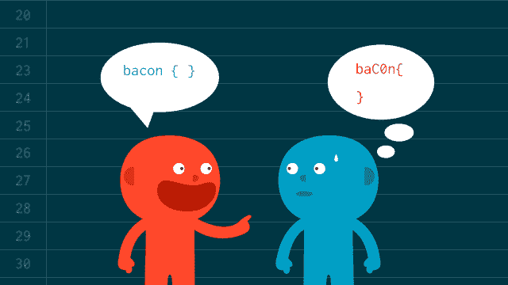
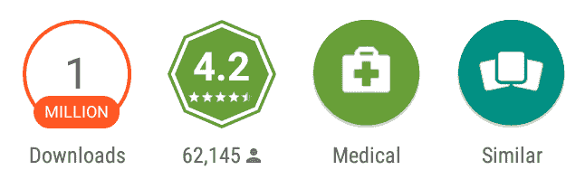
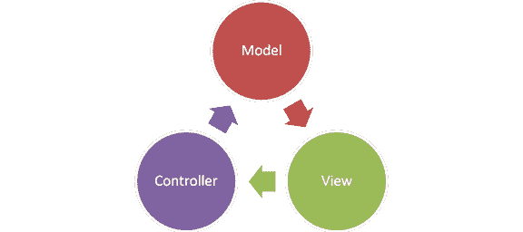

# 来之不易的 Android 编程体验

> 原文：<https://www.freecodecamp.org/news/hard-earned-android-programming-experiences-361fbaaecd07/>

作者 Arun(现为 voidmain.dev)

# 来之不易的 Android 编程体验

这篇文章，就像 Kent Beck 在他的书**实现模式** *中说的那样，“……基于一个相当脆弱的前提，即好代码很重要……”。*但是我们都知道干净的代码很重要，因为我们长期以来一直不得不应对代码缺乏的问题。肯特也是。

Kent Beck

#### 拥有一个烂摊子的总成本

几年前，就像每一个在印度初创企业工作的天真的安卓开发者一样，我试图“*破解”*现实世界的问题，“*颠覆行业”*以及*在宇宙中留下“凹痕”*。在不关心好的软件设计或架构的情况下，我开始编写代码来构建一个 Android 应用程序，这个应用程序有一天会成为印度最大的消费者医疗保健应用程序之一。

一次又一次的冲刺，一次又一次的破解，功能被疯狂地建立起来。*建造。测量。学习*。*上市时间*很重要，每天都很重要。时光飞逝，我们以每 6 个月就有一名团队成员的速度增长，应用程序的下载量达到了百万大关。

Our app’s Google Play store downloads and rating.

到这个时候，这个应用已经不再琐碎，它已经成为一个多租户客户端，如果这是一件事情的话。我们开始时需要几个小时的功能现在需要几天，有时几周。每个活动都有 1000 多行代码，因为 Android 天生不太担心关注点的分离。**拥有一个烂摊子的总成本大大降低了我们的速度。**

#### 安卓难题

代码看起来很难看， *Activities* 管理一切:

*   *穿线*
*   *输入/输出*
*   *计算*
*   *Layouts*
*   *配置变更*
*   *什么不是*

毕竟*活动*都是*控制者*吧？还是他们的*观点*？我再也不知道了。

MVC

#### 天空中的大重新设计

我们需要以这样的方式设计应用程序，即在某处更改一行代码不会破坏其他地方的某些东西。正如鲍勃大叔所说，这个应用必须是“健壮但不僵硬，灵活但不脆弱”。

Robert “Uncle Bob” Martin

这时，我的导师兼朋友 Kashif Razzaqui 加入了这个团队，帮助我们缓解混乱的局面。重大的重新设计从未发生，但我们彻底重构了我们的代码:

*   我们添加了一个“*服务”*层，并将所有非 UI 代码移入其中，一次一个服务。
*   我们抛弃了 *AsyncTasks* ，用*的番石榴*搬到了*的 ListenableFutures* 。
*   我们为 *OkHttp 抛弃了*异步客户端*。*
*   但更重要的是，我们开始大量阅读:《干净的代码》、《干净的架构》、《坚实的、干燥的》、《实用程序员》、《实践中的 Java 并发性》、《领域驱动设计》等等。

很快我们开始看到我们努力的好处。生产力提高了，我们写东西更快了，每个人都很开心。

这是直到我们统一了我们的应用程序，一切都完了。仅仅有一个额外的*服务*层并不能解决问题。

#### 干净代码的艺术

在多次观看 Bob 大叔关于 [Clean Architecture](https://www.youtube.com/results?search_query=clean+architecture&page=&utm_source=opensearch) 的视频和大量阅读 Android 应用架构之后，我决定尝试一下 [MVP 设计模式和 RxJava](https://github.com/esoxjem/MovieGuide) 。

实验开始几天后，我们决定切换到 *RxJava* 并使用干净的架构实现 *MVP。我们确保我们封装了接口后面的所有层，并且很好地分离了关注点。*

*   *视图*通常由一个片段实现，它包含对展示者的引用。视图唯一要做的事情就是在每次有界面动作的时候从演示者那里调用一个方法。
*   *主持人*负责充当*视图*和*模型*之间的中间人。它从模型中检索数据，并将其格式化后返回给视图。但是与典型的 MVC 不同，它还决定了当您与视图交互时会发生什么。
*   *模型*只是*域* *层*或*业务逻辑的门户。*
*   *交互器*处理 I/O，并提供将在*视图*中显示的数据。

现在，用一个全新的实现来切换一个层要容易得多。作为 Android 应用开发的一部分，重新设计 UI 变得更加容易。东西终于可以快速移动而不会断裂。

#### 童子军规则

仅仅写好代码是不够的，随着时间的推移，代码必须保持干净。生活的事实是，软件有一种*熵*的趋势。随着时间的推移，我们都看到了代码的腐烂和退化，所以我们借用了简单的童子军规则:“*让露营地比你发现时更干净。”*

如果我们签入代码时比签出时干净一点，代码就不会腐烂。清理工作不一定要做得很大。将一个变量名改得更好，分解一个有点太大的函数，消除一点重复，清理一个复合 if 语句。

#### 结论

我们构建可扩展应用程序的方式可能不“*正确*”，你可能不同意这篇文章。毕竟，并不是所有的武术家都认同最好的武术，或一种武术中最好的技术；)

有许多不同的 MVP 方法和许多有趣的解决方案来适应 Android。我们不能否认的一个事实是*干净的代码*很重要，你不能掩盖它。

这个帖子大量借用了鲍勃大叔的**干净代码**，并从 2011 年的 [*Kashif 的 Droidcon talk*](https://www.youtube.com/watch?v=dauMw_Bns0w) 那里偷了标题。

如果*清理代码*对你很重要，我们来聊聊:)
*Twitter:[@ _ arunassi](http://twitter.com/_arunsasi)*
*LinkedIn:*[https://www.linkedin.com/in/arunsasidharan](https://www.linkedin.com/in/arunsasidharan)

### 如果你喜欢这个帖子，请点击小心脏！❤