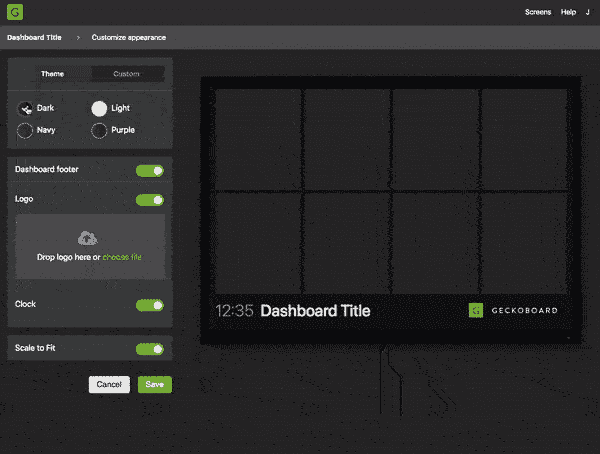
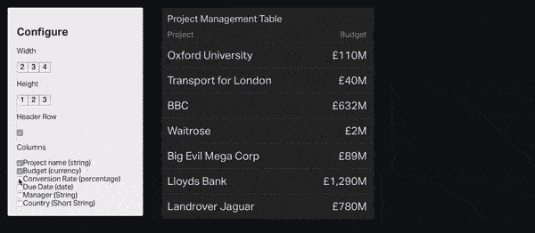
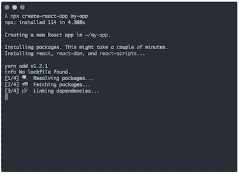

# 在设计原型中利用 React 的力量

> 原文：<https://www.freecodecamp.org/news/harnessing-the-power-of-react-in-design-prototyping-4a74e70db5f5/>

林顿·叶

# 在设计原型中利用 React 的力量

#### 对使用 React 的设计师杰克·哈拉汉的采访

在当今设计原型工具的海洋中，React 可能不是一个直观的选择。

创建原型的过程应该是快速和可视化的。毕竟，创建原型的目的是在做出决定之前，花尽可能少的时间测试不同的设计方案。按照惯例，编码(因此反应)作为原型工具被认为是缓慢和困难的。

杰克·哈拉汉是英国伦敦的一名产品设计师。他是知道如何利用代码的力量来简化设计过程的设计师之一。

杰克鼓舞人心的帖子引起了我的兴趣，我给他发了电子邮件，想知道更多。杰克很友好地和我聊天，我迫不及待地想和你分享！

以下是我们讨论的内容:

*   Jack learn 作为一个设计师是如何反应的？他最大的挣扎是什么？
*   什么时候是使用 React 进行设计原型制作的好时机？
*   为什么 React 是合适的工具？它与可视化原型工具相比如何？
*   他在设计过程中使用了哪些 React 相关工具？
*   杰克对设计师如何学习反应的建议

有兴趣听一个同行设计师的故事吗？继续读？！我的问题被简化了。杰克的回答是有规律的。

### 使用 React 作为设计原型工具

#### 寻找合适的原型制作工具

***林顿:*** *你如何在工作流程中使用 React？使用 React 作为原型工具的背后有什么故事？*

**Jack:** 我们公司一直在努力为我们正在做的工作寻找合适的原型制作工具。

许多用户体验或多或少是一个线性的用户旅程。一个例子是入职流程、结帐或帐户注册。在这个过程中可能会有一些小的决定，但是它们可以通过构建一个“快乐路径”的原型来处理，然后考虑边缘情况。我们可以使用像漫威这样的工具，让它相当高保真，并与用户测试。

然而，我需要的原型不是一个线性的用户旅程。

#### 建立非线性用户旅程的原型

我们的产品是一个商业工具，允许客户从他们的业务中获取数据，例如他们的销售团队绩效数据。然后，它会创建一个可视的仪表板，放在办公室的电视上，这样每个人都可以随时看到数据。

人们用它来设计数据可视化和设计仪表板。为了获得他们需要的数据并以正确的方式对其进行配置以供查看，用户可能需要经历许多选项。它还必须处理数据。数据有不同的形状和大小。如果我们设计一个新的数据可视化，它必须足够健壮，能够处理不同类型的数据、不同的模式、从一位数到六位数的不同数字。

配置数据可视化是非线性路径的一个例子。选项很多，都可以选择不同的组合。每种组合都会产生不同的视觉效果。看到图表变化的预览是对用户的决定具有预期效果的视觉确认。因为结果是非常直观的，较低的保真度将无法彻底验证。

没有一个真正的工具可以让我们原型化一个完整的用户旅程。我过去也尝试过用 Axure RP 进行原型设计，这允许一些条件逻辑，但是很快就失控了。

我把其他工具放在一边，投入时间在 React 中构建一些东西，它真的有了回报。

对我来说，React 的优势在于它填补了我们原型开发工具包中的一个空白。这个缺口就是允许你以非线性方式配置的接口，以及处理数据的接口。

#### 示例原型

你能给我们举一些非线性用户日志的例子吗？

第一个原型用于测试与用户的交互设计，以及验证用户可用的选项:他们能创建适合自己品牌的主题吗？

配置一个主题不是一个线性的旅程。它需要非常直观。它是高保真的，因为它引入了一些我们需要确信的新的交互模式。因为结果是非常直观的，较低的保真度将无法彻底验证。

另一个例子是这个表格小部件原型。它只在表格可视化中是高保真的。左边的形式或多或少有些不自然。事实上，该表与我们在生产代码中创建相同内容时使用的标记和样式非常相似。创建原型是为了解决这些细节问题——对齐、填充、悬停状态、字体大小、截断等等。

#### 为什么 React 是合适的工具？

管理多条路径和处理数据是代码的天然力量。

因为 React 是 JavaScript，如果你想改变数据显示的方式，比如做一些舍入或者如果你想排序，你可以这样做。你不能在简单的可视化工具中做到这一点。

[使用可视化工具]如果你想创建一个原型来测试做一些事情的体验，比如对表格进行排序，你必须创建几个看起来像用户流的屏幕，并希望用户点击正确的按钮。如果他们没有，你不得不说，哎呀，对不起，我们没有设计这一点，让我们回到正确的道路上来。

相比之下，React 允许我创建更健壮的原型来处理完整用户旅程中的数据。用户可以探索不同的选项，而不仅仅是每次都必须点击正确按钮的在线体验。

其中之一就是组件有状态的概念。应用程序知道它所处的当前状态，你可以对界面做一些事情来更新状态。然后这种状态可以遗传给孩子。你可以很容易地通过点击那里的东西来更新这里的组件。然后，您可以返回并撤销它，它不会影响后续的事情。

**默认高保真原型**

保真是用代码进行原型设计时默认得到的东西。当然，在添加 CSS 之前，你的按钮可能不会被样式化，但是即使一个没有样式化的按钮元素看起来和工作起来也像浏览器中的一个按钮。看起来很真实，效果也如预期，因为它是真实的。您可以获得光标之类的东西:指针、悬停和活动状态、高亮显示和复制文本的能力、真正的表单元素，如可以输入的字段和可以切换的单选按钮，所有这些都不需要以任何方式绘制它们或设置它们的样式。

最后，我们有了一些接近完成的体验。我们有所有的逻辑来处理有人改变颜色或上传一个标志。并且该接口能够在任何时间处于任何状态并且不会被破坏。所以我可以和用户一起测试它，而不用担心会进入某种崩溃状态并试图从中恢复。

#### 与可视化原型工具的比较

您使用其他原型制作工具吗？你什么时候使用它们？

是的，在做出反应之前，我会先画一些低保真度的静态草图。通常我会在纸上画草图，还会用草图制作一些快速的图像，甚至可能用像漫威这样的工具把它们串起来。我可以在这些工具中探索更多的想法并更快地做出改变——它们更适合“发散”设计，而 React 最适合“收敛”设计——不再探索，而是决定、验证和迭代。

与可视化原型工具相比，React 中创建原型的速度如何？

React 有一个相当陡峭的学习曲线，但是一旦你掌握了它，它会出奇的快。然而，对于许多原型来说，这简直是大材小用，对于其他工具可以做得很好的事情，我不推荐使用它。我发现花一个下午的时间来编码和考虑上面那些原型的保真度和“健壮性”是一件令人愉快的事情。我觉得挺快的！

#### 工作流程

在您创建的原型获得批准后，开发人员如何进行交接？

我们这里没有交接的概念。我们的工作流程是敏捷的，设计和开发紧密结合。我们的工程师习惯于处理许多不同格式的设计概念，有时是静态模型、详细的原型或只是草图。这真的取决于工作。我们在计划中分解设计，以发现任何需要进一步探索的东西，并且我们经常“配对”来实现一个设计。

开发人员是直接使用你的组件，还是从头开始写代码，还是介于两者之间？

不，我的代码没有一个用在我们的生产应用程序中。在构建原型时，我不需要担心可维护性、可重用性或可伸缩性。基本上，代码是糟糕的，但是它完成了我需要它做的工作。我们的前端应用程序是复杂的 Redux，测试，组件 API 等。不值得尝试使用我的代码来做那项工作。

#### React 相关工具

在您的设计过程中，您使用了哪些与 React 相关的工具？

[**创建-反应-应用**](https://github.com/facebook/create-react-app)

帮助我开始使用 React 的头号工具是脸书的 create-react-app。启动样板应用程序是现成的，预配置的，内置了很多很棒的功能。

在此之前，很难在 Github 上找到一个好的模板项目来开始。我不知道什么是好的，我需要什么，我不需要什么。像 Webpack 这样的东西对我来说完全是个谜，现在也是。所以创建-反应-应用是如此简单。它内置了很多很棒的东西，而且现在变得越来越好。

create-react-app 附带的另一个功能是快速分享到 GitHub 页面。因为它是免费托管的，我可以很容易地获得一个 URL，发送给我的同事，他们可以访问它或发送给可能在世界另一端的用户。

除此之外，我还在我的代码编辑器中安装了 Lint 和更漂亮的东西，这有助于保持整洁，易于查找错误，以及 React Chrome 扩展工具。

[**超光速粒子**](http://tachyons.io/) **用于造型**

超光速粒子是一种不同于大多数人所习惯的处理 CSS 的方法。它被称为功能 CSS 或原子 CSS。基本上它是一个类库，有一个非常明确的目的，比如应用一个单一的样式。

它创造了这种随用随设计的思维模式。你或多或少在写内联样式——说“我希望字体大，角要圆。我希望它有阴影，背景是绿色的。”你不必去给它一个语义名称，然后去写一堆符合那个元素的样式。如果你对 CSS 的工作方式有信心，它只是减少了你为得到某种样式而必须做的杂耍的数量。

[**反应故事书**](https://github.com/storybooks/storybook)

我们使用 React Storybook 作为组件库。这是设计和开发之间的共享资源。我们正在继续改进它，但我已经可以看到 Storybook 如何成为设计者和开发 React 应用程序的前端人员的桥梁。

目前，当我们设计了一个想要重用的组件时，它会被工程师添加到 Storybook 中。我们可以在设计新界面时参考故事书。我们可以检查哪些组件可以使用，哪些组件可能需要更改，并发现我们是否需要设计和构建新的组件。

在未来，Storybook 作为设计师和前端团队的真实来源将是一件非常棒的事情。我们可以使用 React-Sketchapp 为每个组件创建一个版本，供设计师在 Sketch 中使用。我还没有机会正确地尝试 React-Sketchapp。Airbnb 设计团队正在做一些惊人的工作，但我们还没有达到这一点变得至关重要的规模。

### 作为一名设计师如何学习反应

*你是怎么学会反应的？你以前有编程经验吗？*

我从事数字设计已经有一段时间了。很明显，我已经非常熟悉 HTML 和 CSS 了。我做网站和基础的东西已经很久了。JavaScript 是我经常尝试的东西，但是我从来没有深入过。我使用过一点 jQuery，但大部分时候它还是个谜。

我们每两周有一个创新日。产品和工程团队中的任何人都可以利用这段时间从事个人项目，而不是通常的项目工作。所以，这是一个提升和拓展我技能的好机会。

我开始在 Codecademy 上做了几个 JavaScript 教程，以便了解一些基础知识。我看 React 的原因更多的是好奇。工程师们正在使用它。我一直在学习一些核心概念，比如组件和状态。我去搜索了一些教程，并按照博客帖子中的说明完成了几个小项目。最终我开始明白它是如何工作的。

一旦我有了这些非常基本的概念，我就试图用它们来构建真正的项目。这让我学到了更多，也变得更加自信。

你在学习 React 时遇到的最大困难是什么，你是如何克服的？

React 生态系统是出了名的复杂。对于初学者来说，如果不经常与构建工具斗争，就很难创建一个安全的地方来进行实验。我花了很长时间试图找到合适的启动项目，但我真的不知道我在寻找什么。一位同事在 create-react-app 获得一些关注时向我推荐了它，从那时起，我在所有的 react 项目中都依赖它。

我认为大多数人会不时地被 JSX 绊倒，如果我在不同的项目中在 React 和 html 之间切换，我仍然会这样。我在这里没有发现任何窍门——你只需要记住其中的区别，但幸运的是没有太多的区别。

我花了一段时间来建立正确的心理模型，了解 React 是如何工作和配合的。事实上，我几乎是一个完全的 JavaScript 初学者，这并没有帮助。这就好像小的部分变得清晰，但仍然有太多的差距，看不到大的画面。我记得，为了让一个子组件更新其父组件的状态，我挣扎了很长时间。

即使是现在，我仍然认为自己是一个初学者——我必须用谷歌搜索哪怕是最基本的东西。但是我更擅长知道去谷歌搜索什么来找到答案，以及新知识如何与我更熟悉的东西相适应。

当学习一项新技术时，一个重要的里程碑是知道搜索什么和问什么问题。从那时起，学习倾向于自我强化。你在这个过程中学到的一切都将为你学习下一个概念打下新的基础。但是要达到这一点，你需要学习足够的基本知识。

这很像学习一门新的(人类)语言，你需要知道字母表并积累足够的词汇。然后，你可以开始在字典里查单词，阅读和与人交谈，从中你会学到新单词和新表达。

最初的努力可能看起来很乏味，但这是必须的。好消息是当你到达那里的时候你会知道的，就像杰克一样。在 [learnreact.design](https://learnreact.design/?utm_source=medium&utm_campaign=jack-interview&utm_content=middle) 为设计师创建 React 课程时，帮助你克服最初的障碍也是我的主要目标。

在学习 React 或学习编码方面，对其他设计师有什么建议吗？

想看多少教程都可以。你可以去上一堂课或者看一段视频，但是除非你真的试着自己动手做点什么，否则你不会真的在脑海中把这些碎片拼凑起来。所以当我开始构建教程之外的东西时，它开始为我所用。

把你在辅导课或课堂上学过的东西拿来，加入一些东西。或者想一些与你刚刚学到的东西有相似之处的东西。如果这个例子是一个电子商务网站上的产品简介，那么你可以尝试在一个社交网络上创建一个用户简介。你可以在 React 中这样做，并考虑需要进入该界面的内容。从头开始，自己打造就好了。那是你意识到自己知道什么和不知道什么的地方。

随着你变得更好，学得更多，你也将学会如何更容易地解决你将要遇到的问题。

因此，当你第一次开始时，你会看到控制台错误，你不知道它们是什么意思，也不知道如何修复它们，这非常可怕，你需要有人牵着你的手。但是在某些时候，你不再被错误吓到，你会想，“好吧，我现在不知道这是什么，但是我知道去谷歌搜索什么来找出如何修复它”。或者，“我大概知道它在应用程序中的什么地方发生了，所以我会去试着调试它”。

你学习如何修正你的错误，如果你想做一些新的事情，你学习你可能采取的路径。一开始，我很挣扎。但是通过建造真实的东西，我到达了这样一个点，在解决我自己的问题和学习下一件事情时，我更加能够自力更生。

### 最后说明(来自我，不是杰克)

Jack 探索和使用他所拥有的任何工具来解决手边的设计问题的动力给我留下了深刻的印象和启发。有了这种心态，他就不怕进入新的领域，并在前进的道路上学会新的工具。

我个人觉得每个设计师都应该有这种对待新技术的态度。无论是 React、区块链还是基于语音的界面。我们应该开放地尝试它们，并准备在我们的设计过程中接受它们。

你怎么想呢?请在评论中告诉我！

我要感谢 Jack 抽出时间和我聊天，并为我没完没了的后续问题提供了高质量的回答(这样我就可以复制粘贴了？)!

别忘了看看我为设计师量身定制的 React 课程: [learnreact.design](https://learnreact.design/?utm_source=medium&utm_campaign=jack-interview&utm_content=bottom) 。？