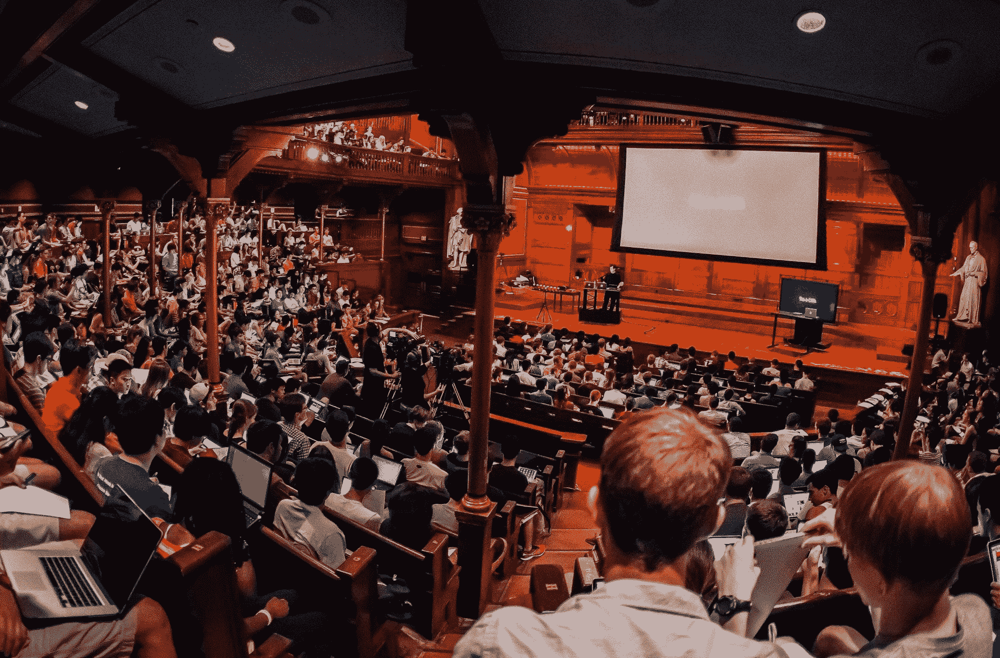
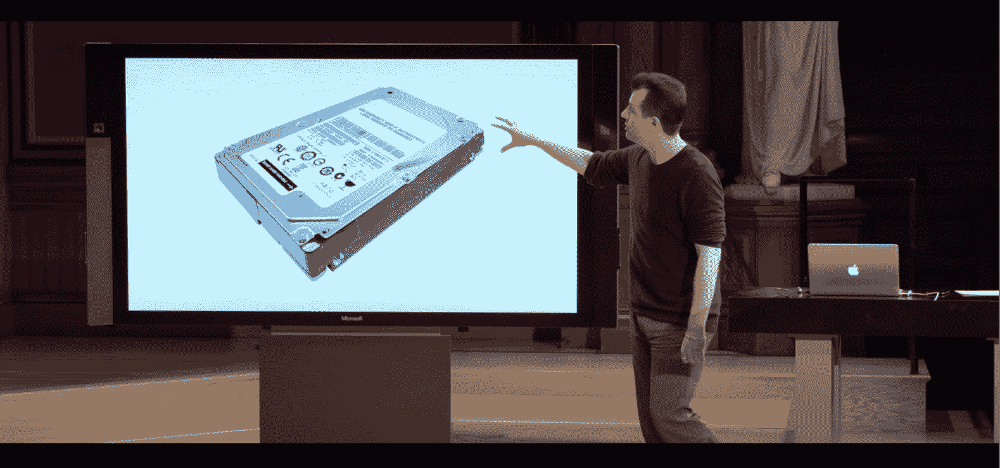
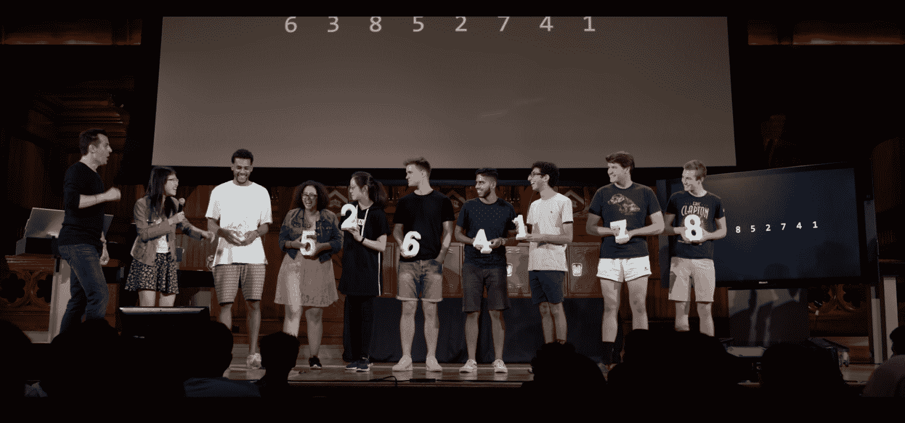
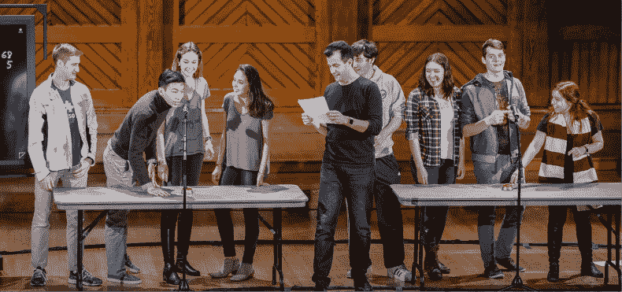
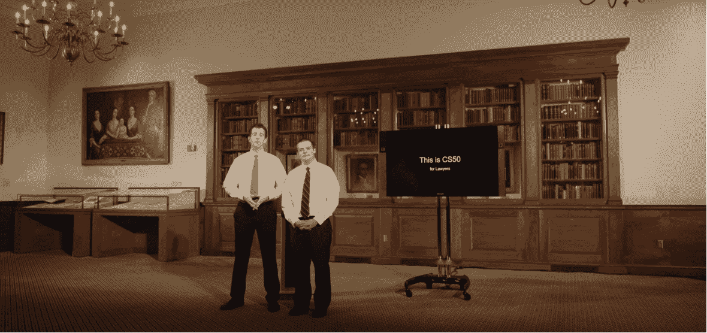
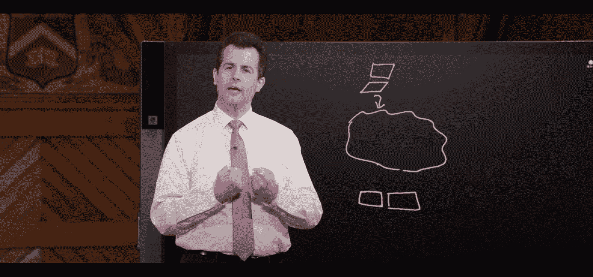
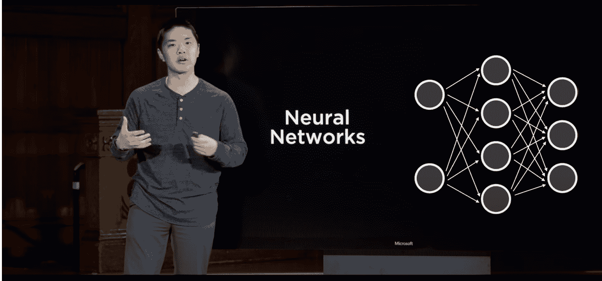
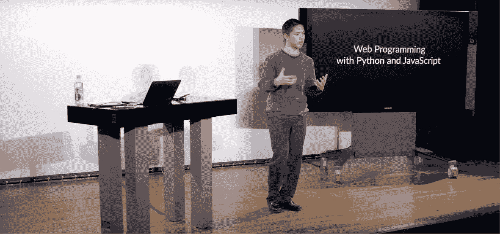
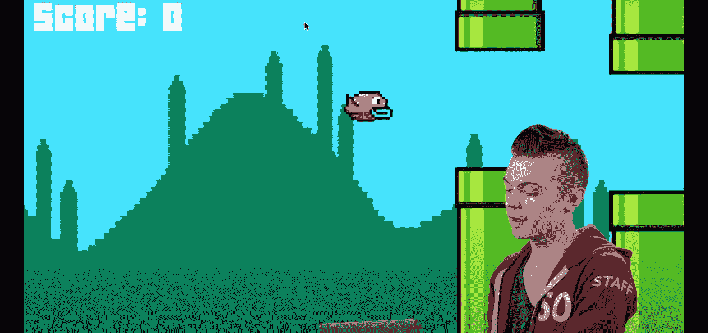
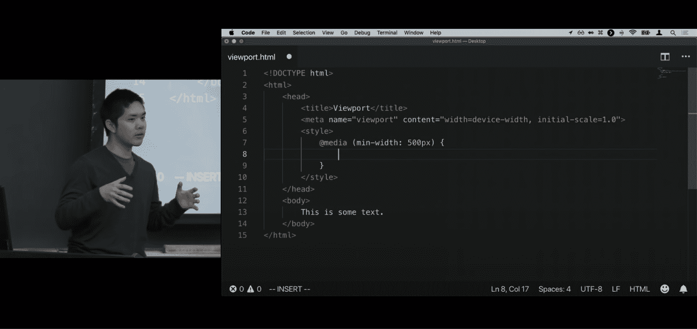

# 哈佛 CS50 指南:如何选择适合你的课程(带免费证书)

> 原文：<https://www.freecodecamp.org/news/harvard-cs50-guide/>

一月份，我在 Class Central 上写了一篇关于哈佛计算机科学入门课程的 [CS50 的](https://www.classcentral.com/course/edx-cs50-s-introduction-to-computer-science-442)[文章](https://www.classcentral.com/report/cs50-free-certificate/)，该课程提供免费证书。在本文中，我将介绍 CS50 的全部 10 门课程，其中 7 门还提供免费证书。

## CS50:最初的课程

CS50 由哈佛教授[大卫·j·马兰](https://en.wikipedia.org/wiki/David_J._Malan)教授。早在 2015 年，当班级中心撰稿人查理·索利曼[回顾课程](https://www.classcentral.com/report/review-david-malan-cs50-introduction-to-cs/)时，他这样评价马兰教授:

> 冒着说出陈词滥调的风险，他的教学方法与我见过的任何方法都不一样，很容易被贴上革命性的标签。人们可以察觉到他在每次讲课中投入的快乐和努力。

我自己上过这门课，我可以说这句话在今天和在当时一样适用。事实上，自从课程每年更新后，它变得更好了。

CS50 in Harvard’s Sanders Theater

CS50 自 2007 年开始在[哈佛开设，自 2012 年](https://www.thecrimson.com/article/2014/9/18/this-is-cs50/)开始在 [edX 开设，现已发展成为哈佛](https://harvardmagazine.com/2012/11/classroom-in-the-cloud)[最大的校内课程](https://sites.duke.edu/csedpodcast/2019/12/23/episode-1-david-malan/)，每学期有 800 多名学生。这也是有史以来世界上评分最高的[和最受欢迎的](https://www.classcentral.com/report/top-moocs-2019-edition/)[mooc 之一，共有 2M+学员。](https://www.classcentral.com/report/most-popular-online-courses/)

“CS50”已经从一个指定[单一课程](https://www.classcentral.com/course/edx-cs50-s-introduction-to-computer-science-442)的代码演变为一个包含[多门课程](https://www.classcentral.com/report/harvard-cs50-new-courses/)的品牌，探索不同的主题，面向不同的受众，并进入不同的学习路径。

为了理解 CS50 的课程，我部分旁听了每门课程，探索了他们的在线社区，并联系了他们的课程工作人员。我发现马兰教授经常自己回复邮件——考虑到这门课程有 100 多名教职员工，这是一个很好的接触。

## CS50:扩展的产品

CS50 的全部课程目前包括十门课程，可分为三个级别，如下表所示。如你所见，七门课程提供免费证书。

点击课程或级别，跳转到相应的部分。

| **级别** | **课程** | **工作量** | **证书** |
| --- | --- | --- | --- |
| [基本](#basic-course)(可选) | [CS50 技术](#cs50-understanding-technology-cs50t) | 4 小时/ 6 周 | 

*   [Go to Harvard OCW for free](https://cs50.harvard.edu/technology/)
*   [[90 USD on EDX](https://www.classcentral.com/course/edx-cs50-s-understanding-technology-10142)

 |
| [核心](#core-courses)(挑一个:通常足够) | [CS50](#cs50-introduction-to-computer-science) | 12 小时/ 12 周 | 

*   [Go to Harvard OCW for free](https://cs50.harvard.edu/x)
*   [[90 USD on EDX](https://www.classcentral.com/course/edx-cs50-s-introduction-to-computer-science-442)

 |
| [CS50 AP](#cs50-ap-computer-science-principles-cs50ap) | 5 小时/ 32 周 | 

*   No free certificate
*   [[90 USD on EDX](https://www.classcentral.com/course/edx-cs50-s-ap-computer-science-principles-7017)

 |
| [CS50 定律](#cs50-computer-science-for-lawyers-cs50l) | 4 小时/ 10 周 | 

*   [Go to Harvard OCW for free](https://cs50.harvard.edu/law/)
*   [[$99 on EDX](https://www.classcentral.com/course/edx-cs50-for-lawyers-16857)

 |
| [CS50 业务](#cs50-computer-science-for-business-professionals-cs50b) | 4 小时/ 6 周 | 

*   [Go to Harvard OCW for free](https://cs50.harvard.edu/business/)
*   [[90 USD on EDX](https://www.classcentral.com/course/edx-cs50-s-computer-science-for-business-professionals-10143)

 |
| [跟进](#follow-up-courses)(选择一个或几个) | [CS50 AI](#cs50-introduction-to-artificial-intelligence-with-python-cs50ai) | 20 小时/ 7 周 | 

*   [Attend Harvard OpenCourseWare for free](https://cs50.harvard.edu/ai/)
*   [$199 on EDX](https://www.classcentral.com/course/edx-cs50-s-introduction-to-artificial-intelligence-with-python-18122)

 |
| [CS50 网页](#cs50-web-programming-with-python-and-javascript-cs50w) | 8 小时/ 12 周 | 

*   [Go to Harvard OCW for free](https://cs50.harvard.edu/web/)
*   [[$149 on EDX](https://www.classcentral.com/course/edx-cs50-s-web-programming-with-python-and-javascript-11506)

 |
| [CS50 游戏](#cs50-introduction-to-game-development-cs50g) | 8 小时/ 12 周 | 

*   [Go to Harvard OCW for free](https://cs50.harvard.edu/games/)
*   [[$149 on EDX](https://www.classcentral.com/course/edx-cs50-s-introduction-to-game-development-11504)

 |
| [CS50 手机](#cs50-mobile-app-development-with-react-native-cs50m) | 8 小时/ 13 周 | 

*   No papers.

 |
| [CS50 超越](#cs50-beyond) | 5 小时/ 12 周 | 

*   No papers.

 |

## 基础课

目前，CS50 只提供一门基础课程。它可以被视为 CS50 核心课程的一个可选入口。如果你觉得还没有准备好正式介绍计算机科学，这是一个很好的起点。

### CS50 了解技术— CS50T

CS50T 是对计算世界的温和介绍。它从硬件级别开始，并从那里向上发展。它探讨了互联网是如何工作的，网站是如何创建的，如何确保安全性，并以编码基础知识结束。

这门课由大卫·j·马兰教授。它包括超过 6 周的每周 4 小时的学习。本课程提供以下证书选项:

*   [哈佛开放课程免费证书](https://cs50.harvard.edu/technology/)
*   [通过 edX 支付验证证书](https://www.classcentral.com/course/edx-cs50-s-understanding-technology-10142)
*   [通过哈佛扩展学校支付的成绩单和学分](https://www.extension.harvard.edu/course-catalog/courses/understanding-technology/15513)

## 核心课程

目前，CS50 提供四门核心课程。其中包括最初的 CS50 以及针对不同类型学习者的变体。这是大多数学习者想要开始的地方。

一道菜应该足够了。但是，采用变体的学习者可能也想采用原始的 CS50——特别是如果他们计划继续后续课程的话。

### CS50 计算机科学导论

CS50 是哈佛的计算机科学入门。它从二进制开始，沿着抽象的阶梯从机器代码到低级语言再到高级语言。它探索了算法、数据结构和内存管理。它以三个专业化轨道中的一个结束:web、游戏或移动开发。

这门课由大卫·j·马兰教授。它包括 12 周内每周 12 小时的学习。它提供以下证书选项:

*   [哈佛开放课程免费证书](https://cs50.harvard.edu/x)
*   [通过 edX 支付验证证书](https://www.classcentral.com/course/edx-cs50-s-introduction-to-computer-science-442)
*   [通过哈佛扩展学校支付的成绩单和学分](https://www.extension.harvard.edu/course-catalog/courses/intensive-introduction-to-computer-science/24107)

### 计算机科学原理

CS50AP 是 CS50 的变体，允许参与学校的学生获得 AP 学分。在美国，AP 学分可以帮助大学申请人增加被录取的机会，并验证学分。

本课程涵盖与 CS50 相同的内容，但包括更多的材料、两份额外的作业和一次监考考试。

这门课由大卫·j·马兰教授。它包括超过 32 周的每周 5 小时的学习。而且它只通过 edX 提供一个[付费验证证书](https://www.classcentral.com/course/edx-cs50-s-ap-computer-science-principles-7017)。

### CS50 律师计算机科学— CS50L

CS50L 是 CS50 的变体，面向律师和法律专业学生。部分课程探索相似的内容，但强调对底层细节的宏观理解。另一部分探索全新的内容，考虑法律和计算机科学如何互动——例如，在网络安全、数据隐私和互联网监管方面。

这门课由大卫·j·马兰和道格·劳埃德教授。它涉及 10 周内每周约 4 小时的学习，并提供以下证书选项:

*   [哈佛开放课程免费证书](https://cs50.harvard.edu/law/)
*   [通过 edX 支付验证证书](https://www.classcentral.com/course/edx-cs50-for-lawyers-16857)
*   [哈佛法学院高管教育付费证书](https://execed.law.harvard.edu/computerscience/)

### CS50 面向商业专业人士的计算机科学— CS50B

CS50B 是 CS50 的变体，面向商务人士。课程的大部分探索相似的内容，但强调对底层细节的宏观理解。一小部分探索与商业相关的全新内容，例如云计算。

这门课由大卫·j·马兰教授。它涉及 6 周内每周约 4 小时的学习，并提供以下证书选项:

*   [哈佛开放课程免费证书](https://cs50.harvard.edu/business/)
*   [通过 edX 支付验证证书](https://www.classcentral.com/course/edx-cs50-s-computer-science-for-business-professionals-10143)
*   [付费证书和学术学分](https://www.extension.harvard.edu/course-catalog/courses/computer-science-for-business-professionals/25393)通过哈佛扩展学校

## 后续课程

目前，CS50 提供五个后续课程。这些从 CS50 停止的地方开始，探索一个特定的主题。它们是通过钻研专业来建立你的计算机科学基础的极好方法。

### CS50 Python 人工智能简介— CS50AI

CS50AI 利用 Python 编程语言探索现代人工智能。它涵盖了基本的人工智能概念，如搜索算法和知识模型，并在此基础上讨论更高级的概念，如优化和机器学习。

这门课是由余腾渤教授的。它涉及 7 周内每周约 20 小时的学习，并提供以下证书选项:

*   [哈佛开放课程免费证书](https://cs50.harvard.edu/ai/)
*   [通过 edX 支付验证证书](https://www.classcentral.com/course/edx-cs50-s-introduction-to-artificial-intelligence-with-python-18122)
*   [通过哈佛扩展学校支付的成绩单和学分](https://www.extension.harvard.edu/course-catalog/courses/introduction-to-artificial-intelligence-with-python/25793)

这些课程也是 edX 的人工智能计算机科学专业证书的一部分。

### 使用 Python 和 JavaScript 的 CS50 Web 编程— CS50W

CS50W 探索支撑现代 web 应用程序开发的语言、工具和过程。它涵盖了 Python 和 JavaScript 等语言，Flask 和 Django 等框架，以及 GitHub 和 Heroku 等服务。

这门课是由余腾渤教授的。它包括超过 12 周的每周 8 小时的学习。本课程提供以下证书选项:

*   [哈佛开放课程免费证书](https://cs50.harvard.edu/web/)
*   [通过 edX 支付验证证书](https://www.classcentral.com/course/edx-cs50-s-web-programming-with-python-and-javascript-11506)
*   [通过哈佛扩展学校支付的成绩单和学分](https://www.extension.harvard.edu/course-catalog/courses/web-programming-with-python-and-javascript/25184)

这些课程也是 edX 网站编程计算机科学专业证书的一部分。

### CS50 游戏开发简介— CS50G

CS50G 探索了支撑现代游戏开发的语言、工具和过程。它利用 C#等语言和 Unity 等框架来创建 2D 和 3D 体验，并从 Pong、Mario 和 Portal 等视频游戏中汲取示例。

这门课由科尔顿·奥格登教授。它包括 12 周内每周约 8 小时的学习，并提供以下证书选项:

*   [哈佛开放课程免费证书](https://cs50.harvard.edu/games/)
*   [通过 edX 支付验证证书](https://www.classcentral.com/course/edx-cs50-s-introduction-to-game-development-11504)
*   [通过哈佛扩展学校支付的成绩单和学分](https://www.extension.harvard.edu/course-catalog/courses/crn/25183)

这些课程也是 edX 的[游戏开发计算机科学专业证书](https://www.classcentral.com/course/harvardx-computer-science-for-game-development-18456)的一部分。

### 使用 React Native 开发 CS50 移动应用程序— CS50M

CS50M 探索如何使用 React 原生框架开发移动应用。它涵盖了状态和组件等概念，测试和部署等流程，以及 Redux 和 JSX 等工具。

该课程由[乔丹·林](https://prod.jordanhayashi.com/about)教授。它包括 13 周内每周 8 小时的学习。该课程通过[哈佛开放课件](https://cs50.harvard.edu/mobile/)提供，但没有证书。

这些课程也是 edX 的计算机科学和移动应用专业证书的一部分。

### CS50 超越

CS50 Beyond 是 CS50W 的前身。它探索了相同的主题，web 开发，但是在一个更紧凑的时间框架内进行。大多数主题保持不变，但许多项目有所不同。

这门课是由余腾渤教授的。它包括超过 12 周的每周 5 小时的学习。该课程通过[哈佛开放课件](https://cs50.harvard.edu/beyond/)提供，但没有证书。