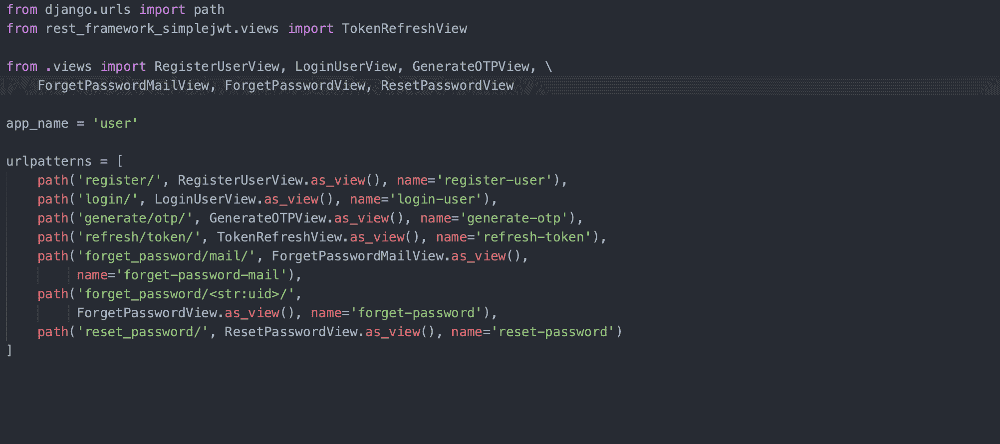
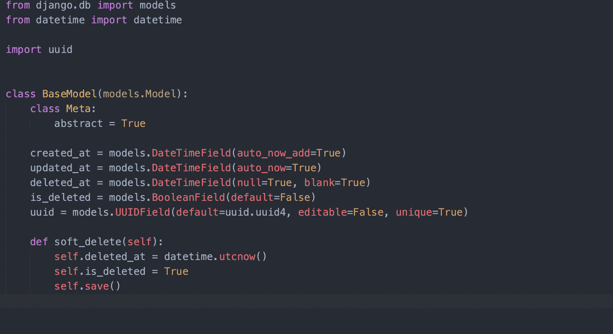
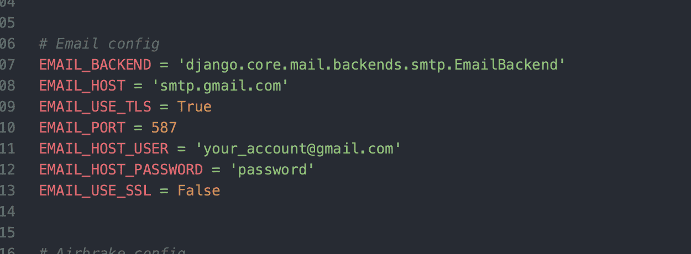
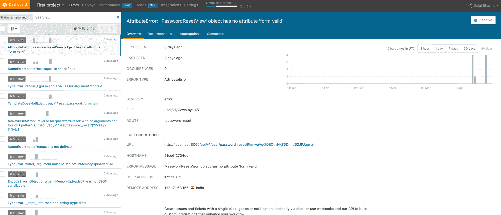
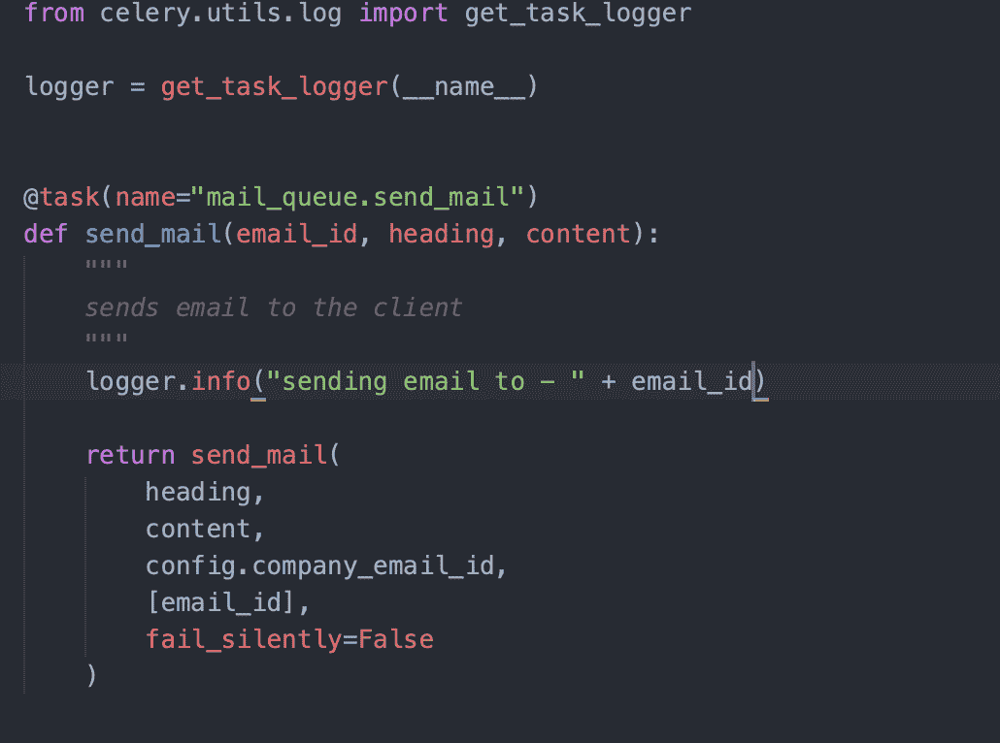
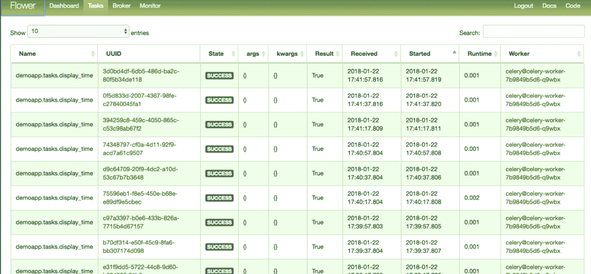
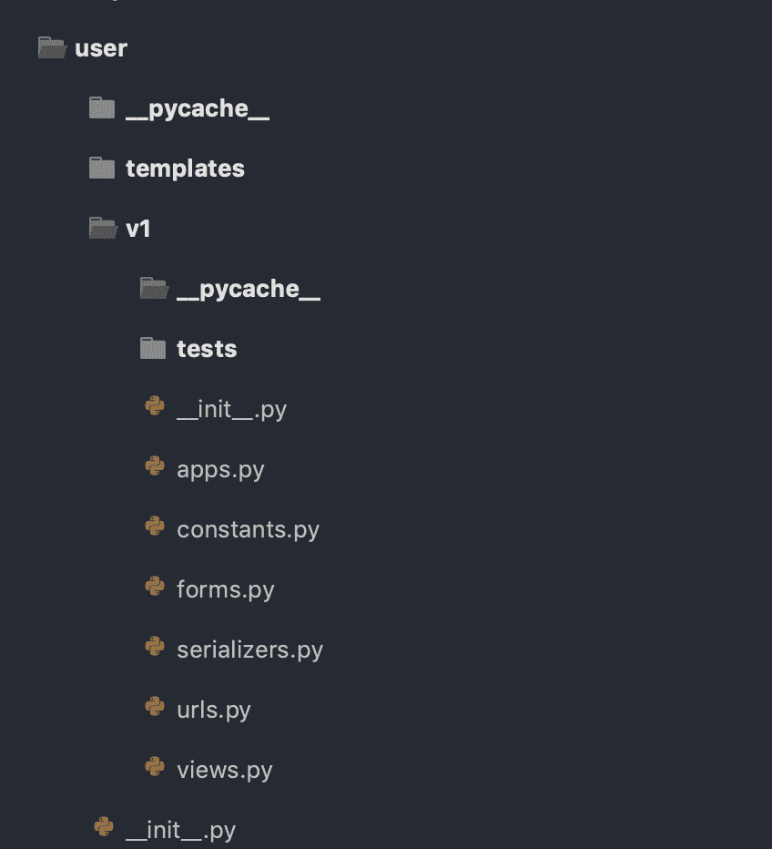
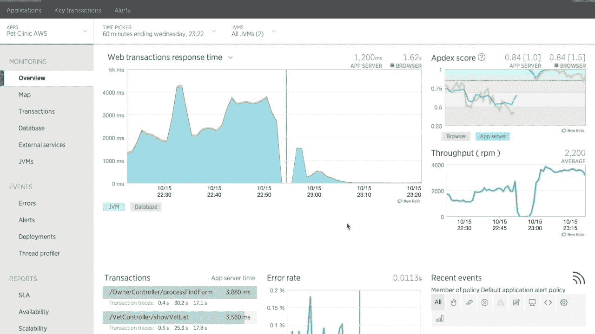

# 后端软件架构清单:如何从头开始构建产品

> 原文：<https://www.freecodecamp.org/news/have-an-idea-want-to-build-a-product-from-scratch-heres-a-checklist-of-things-you-should-go-through-in-your-backend-software-architecture/>

某天早上，你醒来喝了杯咖啡，瞧，灵光一现。你终于找到了自己的商业模式，一切都水到渠成了。你知道投资者会喜欢它，你只是迫不及待地开始构建产品。先行者的优势是你的。

这种时刻很少见，但当它们发生时，你需要在正确的时间启动。你所需要的只是一个正确的向导来帮助你弄清楚你应该做什么和不应该做什么。现在不是实验的时候，而是执行的时候。现在是你的时候了！

**注意**——以下是关于从零开始构建软件架构。因此，如果您有兴趣了解相关技术的本质，那么就继续吧。否则，请分享给那些肯定会喜欢这个的人:P

### 这本指南从何而来

我自己也参与过一些早期产品的开发，老实说，我确实犯过错误。我总是希望在从头开始构建产品时有一个清单可以遵循。

从头开始构建一个架构涉及到太多的事情，以至于你会完全忘记某些部分。它们会在产品周期的后期反咬你一口。

我最终决定在第一次点击部署按钮之前，创建一个你应该考虑的事情的清单。

因此，如果没有进一步的构建，这里有一个清单，你应该从头开始构建一个产品的后端架构。

## (为您的项目)选择正确的语言和框架

为你的产品选择正确的语言和框架是一件棘手的事情，在这方面没有什么特别的灵丹妙药。我的建议是选择一门你最熟悉的语言，并且了解 in 和 out 的错综复杂。

话虽如此，但这很少见，因为很少有人是 Javascript 忍者，或者 Python 黑豹，或者其他什么时髦的名字。

因此，选择一种在业界有很好支持的语言，比如 Javascript、Python、Java 或 Go 等等。你可以选择任何一种语言，挑一种最适合你的就行了。

请记住，您正在构建一个 MVP(最小可行产品),并将处于创建 POC(概念验证)的过程中。所以尽快把你的产品拿出来。你不需要纠结于可能来自镇上新语言的问题。为了避免这些问题，请选择一种使用更广泛、文档更完善的语言。

最后，您可以在以后扩展。如果您正处于进行概念验证的阶段，只需构建并完成它。但是如果你正在构建一些非常具体的东西，并且有专门为此构建的语言和框架，那么你绝对应该选择这种技术。

但是大多数时候，我们试图解决的问题可以很容易地用上面提到的任何语言和它们各自的框架来解决。所以只要选择一个，启动你的产品。

一个很好的资源来帮助你决定-

[https://content . tech gig . com/top-5-programming-languages-for-back end-web-development/articleshow/67337449 . CMS](https://content.techgig.com/top-5-programming-languages-for-backend-web-development/articleshow/67337449.cms)

## 实施认证和授权微服务

有很多方法可以对用户进行认证和授权。您可以尝试会话令牌、JWT (JSON Web 令牌)或 OAuth 等等。每一种选择都有其利弊。所以让我们更仔细地看看其中的一些。

### JSON Web 令牌

jwt 实现起来既快又容易。这是因为令牌从未存储在系统的任何地方。它们只是被编码、加密，然后发送给用户。因此验证 JWT 比其他任何方法都要快。

但是，由于它们没有存储在系统中，您实际上无法让令牌在其实际到期时间之前到期，这在某些情况下可能会成为一个问题。

因此，找出每个身份验证系统的优缺点，并选择最适合您需求的系统。我个人比较喜欢 JWTs(但那是我自己的选择)。

### 批准

永远不要忘记对用户进行授权。您不希望已登录的用户 1 更改用户 2 的详细信息。这会在你的系统中引起纯粹的混乱。

识别需要授权的终端，并立即实施。您不希望数据库的状态像这样被破坏。记住 401 和 403 的区别。

以下是在创建身份验证系统时应该考虑的一些端点(我在 Django 用 JWT 创建了一个)。您的用例可能会有某些添加/删除，但是这些是您应该考虑构建的。

许多框架都提供了现成的，但是在你自己构建它们之前一定要考虑它们。查看 Django Rest 框架中的**authentic ation _ classes**和**permission _ classes**以便进一步参考。

看看这个 Django REST 框架资源

[https://www . django-rest-framework . org/tutorial/4-authentic ation-and-permissions/](https://www.django-rest-framework.org/tutorial/4-authentication-and-permissions/)

## 创建一个抽象基础模型，供数据库中的所有其他模型继承

记住干原则——不要重复自己？在软件工程中应该遵循这一原则。

基于上面的思考过程，在你的数据库中会有某些列出现在每个表中。因此，最好为它们创建一个抽象类，以便其他模型类可以继承它们。

让我们看一下这段代码及其含义:

*   **id**——这里虽然没有写，但是是 Django 框架自动创建的。但是如果你的没有，在课堂上写下来。它只是一个自动递增的字段，可以用作数据库关系中的主键。
*   **created _ at**——这意味着当字段/行被插入到你的表中时，它由框架本身填充。不需要显式设置。
*   **updated _ at**——这意味着字段/行最后一次在表中被修改/更新的时间，它再次由框架本身填充。
*   **deleted _ at+is _ deleted**——所以这是一个有争议的领域。至于它是否应该在那里，我没有确切的答案——因为老实说，互联网上没有任何东西会被删除。如果填写此字段，则表示该行已从系统中删除(尽管数据仍保留在系统中以供将来参考，并且可以从数据库中取出并存储在备份中)
*   **uuid**——这取决于你是否想把这个放到你的桌子里。如果需要向外部系统公开表的主键，最好公开这个主键，而不是自动递增的整数字段。你可能想知道为什么...？那么，为什么要告诉外部系统您的表中有 10378 个订单呢？但这还是个人的选择。

## 设置通知微服务

每个产品都需要向用户发送提醒和通知，用于互动和交易目的。所以每个产品都会需要这个。

您肯定应该考虑构建一个微服务，为您的最终用户提供通知服务(如推送通知、电子邮件和短信)。

这应该是一个完全独立的微服务。不要在您的身份验证微服务或应用服务(实际的业务逻辑)中构建这一点。

有许多第三方库/服务可以用来为您的应用程序构建它。利用它们并在此基础上进行构建。

记住构建所有 3 个功能:

*   推送通知(APNS + FCM)，
*   电子邮件(只需集成一个 SMTP 客户端即可启动)
*   和短信

**注意**——有两个发送短信的渠道，*和 **促销。永远不要在交易渠道上发送促销短信，因为有可能你会被一个见多识广、积极主动的用户起诉。***

*在应用程序中配置 SMTP 客户端的一个简单方法是在设置中使用它:*

**

*我在 Django 中这样做了，但是你也可以在你选择的语言和框架中这样做。*

## *设置错误日志记录*

*使用中间件来记录生产系统中发生的错误。您的生产系统将不会受到坐在那里全天候查看应用程序日志的人的监控。因此，您需要一个系统，在一个中心位置记录这些内部服务器错误。然后你可以每天去查看它们，或者创建一个网络钩子，这样你就可以在适当的时候得到提醒并照顾它们。*

*市场上有很多第三方错误记录工具。随便选一个符合你要求的就行了。我通常使用哨兵/空气制动。*

**

*考虑配置 webhooks，正如我上面提到的。它们会通知您的用户有关错误的信息，例如，您可以在某些空闲频道出现错误时发布这些错误。然后，您可以定期检查这些渠道，并根据其严重性进行纠正。*

*Airbrake 的官方主页-[https://airbrake.io/](https://airbrake.io/)*

*哨兵的官方主页-[https://sentry.io/welcome/](https://sentry.io/welcome/)*

## *实现请求响应和应用程序日志记录*

 ***场景**——一个用户找到你的支持，说他们还没有收到在你的网站上购买的交易收据。你会怎么做？*

*如果您已经在系统中加入了应用程序日志，那么不必担心。我这么说是什么意思？举个例子总比试图用文字解释好。这就是:*

**

 *我已登录，我将向上述电子邮件 id 发送电子邮件。我可以检查应用程序日志，通过检查系统中是否存在这样的日志来查看电子邮件是否实际发送给了客户端。确保在您的系统中放入全面的日志，以便您可以跟踪请求的过程。*

*此外，放置一个异步系统是一个好主意，它将从您的系统中挑选出这样的请求-响应和应用程序日志，并将它们转储到一个中心位置。在那里，它们可以被处理以便更容易解释。*

*ELK stack 是一个很好的选择:ElasticSearch - Logstash - Kibana。*

*更多关于麋鹿栈-[https://www.elastic.co/what-is/elk-stack](https://www.elastic.co/what-is/elk-stack)*

***注意** -在记录请求和响应时，注意以下事项:*

*   *不要记录密码。*
*   *不记录令牌(用于身份验证的访问令牌)*
*   *不记录 OTP*

## *在 API 中引入节流，在应用服务器上引入速率限制*

 ***场景**——你刚刚推出你的服务，并在社交媒体平台上推广产品。一个黑帽黑客发现了，就想玩你的系统。所以他们计划对你的系统进行拒绝服务攻击。*

*为了解决这个问题，您可以在应用服务器的负载平衡器上基于各种因素设置速率限制。这将处理 DOS 攻击，并防止恶意用户攻击您的服务器。*

***场景**-API 端点/otp/validate 使用 4 位数的 otp 对用户进行身份验证，并返回令牌用于已验证的 API。一个恶意用户获取了您的一个客户端的 mobile_number，并开始通过暴力攻击改变 IPs 来攻击 API 端点，这是一种 DDOS(分布式拒绝服务)攻击。速率限制器不能阻止用户，因为 IP 随着每个请求不断变化。*

*为了避免这种情况，您也可以基于用户对 API 进行限制。您可以配置特定用户可以向 API 端点发出多少个请求。对于 OTP 验证，一个比较好的数字是每 10 分钟 5 个请求。这将阻止恶意用户对上述 API 进行暴力 DDOS 攻击。*

*Django 的 REST 框架中的节流*

*[https://www.django-rest-framework.org/api-guide/throttling/](https://www.django-rest-framework.org/api-guide/throttling/)*

## *从第一天开始建立和配置异步通信*

 ***场景-** 当用户在你的应用程序上注册时，你需要给他们发送一封欢迎邮件。前端客户端点击注册 API，您在验证后在后端创建用户，这将启动发送欢迎电子邮件的过程。*

*发送这封欢迎电子邮件需要时间，可能需要几秒钟。但是为什么你会希望移动客户端因为这样的进程而停滞不前呢？这可以在后台发生，用户不会无缘无故地停留在注册页面上。每一秒都是宝贵的，你不希望用户失去这些宝贵的时间。*

*所以只需通过异步任务发送电子邮件。使用工人、任务、消息代理和结果后端来执行此操作。*

*Python 世界中的一个很好的例子是芹菜工人。只需将需要执行的任务放在一个消息代理中(兔子 MQ/SQS 等)。芹菜会听这个，会把任务发给指定的工人。然后，该工作者将处理该请求，并将结果放入结果后端，该后端可以是缓存系统/数据库系统。(例如 Redis/PostgreSQL)。*

*您可以使用许多第三方库来监控这些任务和队列。芹菜花就是一个很好的例子，它监控着所有这一切。*

**

*你可以在这里阅读更多关于 RabbitMQ 的内容-[https://www.rabbitmq.com/](https://www.rabbitmq.com/)*

*还有芹菜-[https://docs . Celery project . org/en/stable/django/first-steps-with-django . html](https://docs.celeryproject.org/en/stable/django/first-steps-with-django.html)*

*最后，芹菜花-[https://flower.readthedocs.io/en/latest/](https://flower.readthedocs.io/en/latest/)*

## *设置 cron 作业*

***场景-** 您刚刚推出您的产品，您需要向您的用户推荐您平台上的新产品。您将根据他们每个周末的购买历史发送这些邮件。*

*使用 cron 作业可以轻松执行上述任务。它很容易在每个框架中配置。需要记住的重要一点是，不应该将 cron 作业直接放在服务器的 crontab 文件中。您应该让框架来处理它。*

*这是因为出于安全原因，部署工程师/Devops 工程师应该是唯一能够像这样访问系统的人。虽然你不一定要这样实现它，但是从一开始就拥有它是一件好事。*

*在 Django 世界中，您可以使用 celerybeat 通过芹菜工人配置您的 crons。*

*点击此处了解更多关于 Celery Beat 的信息-[https://docs . Celery project . org/en/latest/user guide/periodic-tasks . html](https://docs.celeryproject.org/en/latest/userguide/periodic-tasks.html)*

## *正确管理您的秘密(参数文件)*

 *在您的生产服务器中，有很多方法可以管理参数机密。其中一些是:*

*   *创建一个秘密文件并将其存储在一个私有的 s3 存储桶中，并在应用程序部署期间提取该文件。*
*   *在应用程序部署期间设置环境变量中的参数(再次将它们存储在 s3 中)*
*   *将秘密放在某个秘密管理服务中(例如[https://aws.amazon.com/secrets-manager/](https://aws.amazon.com/secrets-manager/))，并使用它们来获取应用程序中的秘密。*

*您可以根据自己的喜好和使用情况选择这些方法中的任何一种。(您也可以选择为本地、暂存和生产环境保留不同的机密文件。)*

## *从第一天开始就给你的 API 版本化*

*这是你从第一天起就应该考虑的事情。您永远不知道您的业务模型会多频繁地改变，并且您需要在您的应用程序中具有向前向后的兼容性。因此，您应该对您的 API 进行版本化，以确保每个人都能顺利运行。*

*你可以有不同版本的不同应用，让 nginx 为你的应用处理。或者您可以在应用程序本身中进行版本控制，并让应用程序服务器中的路由来处理它。您可以选择任何方法来实现它——要点是从一开始就启用版本控制。*

**

## *为您的前端客户端决定硬更新版本检查和软更新版本检查*

*那么硬更新和软更新有什么区别呢？*

***硬更新**指用户被迫将客户端版本更新到比手机上安装的版本号更高的版本号。*

***软更新**指的是当用户看到一个新版本可用的提示时，他们可以将他们的应用程序更新到新版本。*

*不鼓励硬更新，但是有时候你需要强制更新。无论是哪种情况，你都应该明确地考虑如何在你的应用程序中实现这一点。*

*您可以通过在 Play Store 或 App Store 中实现或配置它来实现这一点。另一种方法是在你的后端应用程序中创建一个 API，它将在每次移动应用程序启动时被点击。这将发送两个密钥:hard_update -> true/false 和 soft_update -> true/false，这取决于用户的版本以及后端系统中设置的硬更新和软更新版本。*

*存储这些版本的一个好地方是您的缓存(Redis/Memcache)，您可以动态地更改它，而无需部署您的应用程序。*

## *从第一天开始引入持续集成(CI)*

 ***场景—**在你的项目中工作的一个实习生不够熟练，无法编写产品级代码。他们可能已经改变了一些东西，这些东西可能会破坏你的项目中的一些关键组件。在这种情况下，你如何确保一切正常？*

*引入持续集成。它将在每次提交时运行 linters 和测试用例，如果违反了任何规则，就会中断。这将依次阻止拉请求合并，直到所有林挺规则和测试用例通过。拥有它是件好事，而且从长远来看，它确实有所帮助，所以请记住这一点。*

*市场上有很多选择。您可以选择自己实现一个(Jenkins CI/CD)，也可以使用 TravisCI、CircleCI 等来实现。*

*在这里阅读特拉维斯奇-[https://travis-ci.org/](https://travis-ci.org/)*

*还有 circle ci-[https://circleci.com/](https://circleci.com/)*

## *启用 Docker 支持(个人偏好)*

*为你的应用程序创建一个 dockerfile 和 docker-compose.yml，这样每个人都可以从一开始就使用 Docker 运行应用程序。使用这种方法的一个主要原因是为了在您的本地/暂存/生产环境中保持一致性，这样开发人员就不会再说这样的话了:*

> *但是它在我的机器上运行。*

*从第一天开始使用它并不困难。在开始的时候，只需要在你的本地环境中使用 Docker，这样你的应用程序的设置就可以非常流畅。但是请记住，在生产环境中，无论有没有 Docker，您都可以运行它。*

*这里有更多关于 Docker Hub 的信息-[https://hub.docker.com/](https://hub.docker.com/)*

## *使用 APM 工具*

*如果你想监控你的应用的 API、事务、数据库连接等等，一个应用监控工具是必须的。*

***场景** -您的 cron 服务器硬盘几乎已满，无法运行 cron 作业。因为它在磁盘上找不到空间，所以你的 crons 没有运行。那么，当这种情况发生时，您如何得到通知呢？*

*有很多 APM 工具可以用来监控这一点。您可以根据需要通知的时间来配置它们。当这样的混乱发生在你的系统上时，你会在你选择的媒介上得到通知——相信我，这种事情一直在发生。所以最好做好准备。新遗迹是个不错的选择。*

**

*在这里阅读更多关于新遗迹的信息-[https://newrelic.com/](https://newrelic.com/)*

## *使用 ElasticSearch 在您的客户端应用程序中支持应用程序范围的搜索*

 *根据维基百科，*

> ***Elasticsearch 是基于 Lucene 库的搜索引擎。它提供了一个分布式的、支持多租户的全文搜索引擎，带有 HTTP web 接口和无模式的 JSON 文档。Elasticsearch 是用 Java 开发的。***

*一开始，您可能会尝试使用传统的数据库查询在客户端应用程序的搜索栏中获得结果。为什么？因为很简单。*

*但是传统的数据库不适合这种高性能的查询。找出一个好时机将你的搜索迁移到 ElasticSearch，并在你的系统中引入一个数据管道。它为 ElasticSearch 提供数据，然后将来自 elastic search 的搜索连接到应用服务器。*

*这里有一个关于 Elasticsearch 的很好的[概述，可以帮助你开始。](https://www.freecodecamp.org/news/go-elasticsearch/)*

*和弹性搜索博士们-[https://www.elastic.co/guide/index.html](https://www.elastic.co/guide/index.html)*

## *在您的生产服务器中安装防火墙*

*你绝对应该这么做——这是必须的。在您的生产服务器中安装一个防火墙，并关闭除了用于 API(https 连接)的端口之外的所有端口。使用反向代理 web 服务器路由 API 端点，比如 NGiNX 或 Apache。除了 NGiNX 允许的端口之外，任何端口都不应该对外界开放。*

*为什么应该使用 NGiNX:*

*   *[https://www.nginx.com/resources/wiki/community/why_use_it/](https://www.nginx.com/resources/wiki/community/why_use_it/)*
*   *[https://blog.serverdensity.com/why-we-use-nginx/](https://blog.serverdensity.com/why-we-use-nginx/)*
*   *[https://www . freecodecamp . org/news/an-introduction-to-nginx-for-developers-62179 b6a 458 f/](https://www.freecodecamp.org/news/an-introduction-to-nginx-for-developers-62179b6a458f/)*

## *包扎*

*上面提到的几点是基于我自己的喜好，我已经发展了多年。这里和那里会有细微的差别，但是概念是相同的。*

*最后，我们所做的一切都是为了在你有了想法后，尽快在生产中运行一个从零开始构建的平稳系统。*

***我试着写下我多年来获得的所有知识，*我可能*在少数地方*错了**。如果你认为你能提供更好的信息，请不吝赐教。和往常一样，如果你认为这是有帮助的，请分享。**