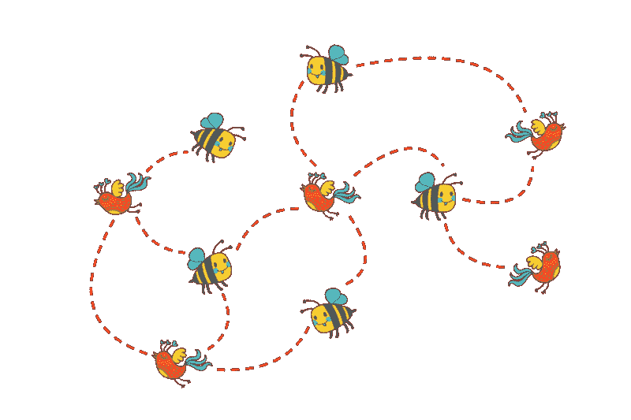
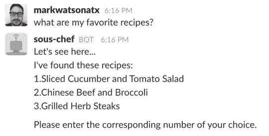
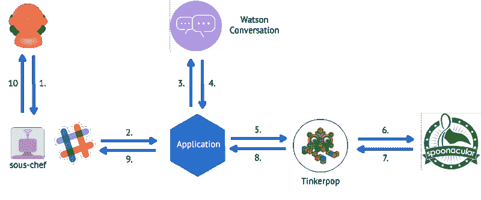
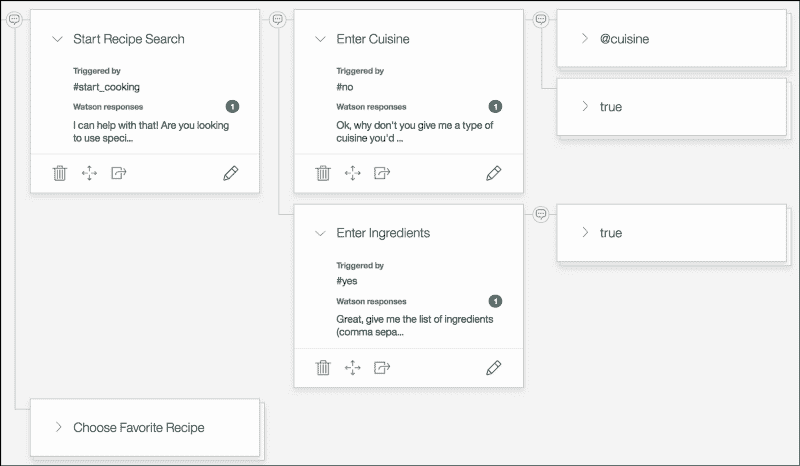
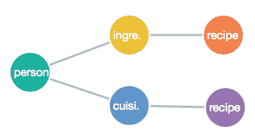
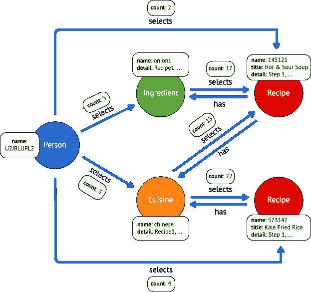
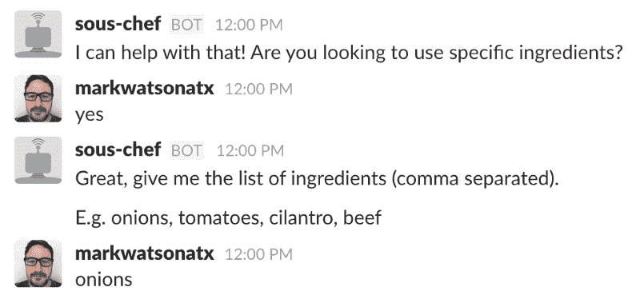
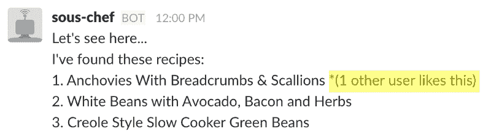

# 你和你的聊天机器人讨论过图形数据结构吗？

> 原文：<https://www.freecodecamp.org/news/have-you-had-the-talk-with-your-chatbot-about-graph-data-structures-3aaf5c3ae52c/>

马克·沃森

# 你和你的聊天机器人讨论过图形数据结构吗？

#### 您的数据库模型的成熟故事



Image credit: [Charlotte Parent](http://www.charlotteparent.com/CLT/Health-Development/More-Than-the-Birds-and-the-Bees-Teaching-Your-Child-About-Healthy-Sexuality/)

图形数据库是存储对话数据的好方法。一个简单的[对话框](https://hackernoon.com/chatbot-architecture-496f5bf820ed#320b) [树](https://en.wikipedia.org/wiki/Dialog_tree)可以增加视频游戏中角色互动的深度。一个[知识](https://gigaom.com/2013/05/15/how-google-is-setting-the-new-search-standard-with-voice-and-knowledge-graph/) [图](http://www.aclweb.org/anthology/N15-1086)可以从对话中提取更多的含义，以更好地理解用户意图如何与应用程序的数据相关联。

在本文中，我将向您展示一个捕获聊天机器人交互的基本图模型，以及如何使用 [Apache TinkerPop](https://tinkerpop.apache.org/) 框架来持久化它们。我还将向您展示一些为聊天机器人添加推荐功能的[小精灵](http://tinkerpop.apache.org/gremlin.html)查询。我的例子“食谱机器人”的源代码和安装说明在 GitHub 上的[。](https://github.com/ibm-cds-labs/watson-recipe-bot-nodejs-graph)

### 评论:食谱机器人

Recipe Bot 是一个 [Slack Bot 用户](https://api.slack.com/bot-users)，它允许人们根据指定的配料或烹饪要求菜谱。之前我向您展示了如何添加对用户请求他们喜欢的食谱的支持，如下所示:



该机器人的图形版本具有我在我的前一篇关于用 JSON 持久化元数据的文章[中讨论的所有相同特性，但是对于图形版本，您将添加一些建议。](https://medium.com/ibm-watson-data-lab/persisting-data-for-a-smarter-chatbot-be599480f7b2#.jvmry69xz)

### 它是如何与 TinkerPop 一起工作的

这是一个机器人如何工作的架构图:



My Recipe Bot. Hey! The diagram is actually an [undirected graph](https://en.wikipedia.org/wiki/Graph_theory). Who knew?

您会看到我正在使用 Watson 对话服务。Watson Conversation 让我通过使用对话框来描述对话的流程，它帮助我从聊天消息中提取信息和用户意图。您可以编写自己的对话树并执行自己的消息解析，也可以使用 Watson Conversation 或 Botkit 等工具来提供帮助。以下是制作配方机器人的对话树的模型:



The Watson Conversation UI. Graphs are everywhere.

您可以通过对话树跟踪对话，类似于跟踪图中的顶点和边(毕竟，[树也是图](https://en.wikipedia.org/wiki/Tree_(graph_theory))):



It’s not much of a tree, but I’m keeping it simple, y’all.

在上面的简化图中，Recipe Bot 只关心 Bot 的主要实体之间的进展:

1.  人
2.  佐料
3.  烹饪
4.  方法

### 数据模型和访问模式

随着对话的进行，您使用 TinkerPop API 存储以下顶点和边:

1.  **人物顶点:**对于每一个与机器人交互的人，将那个人作为顶点存储在图中。

```
{  "label": "person",  "type": "vertex",  "properties": {    "name": "U2JBLUPL2"  }}
```

**2。配料或菜肴顶点:**当一个人请求一种特定的配料或菜肴时，你将这种配料或菜肴——连同从[spona cular](https://spoonacular.com/food-api)检索到的食谱列表——存储为一个顶点。

```
{  "label": "cuisine",  "type": "vertex",  "properties": {    "name": "chinese",    "detail": "[{\"id\": 573147, \"title\": \"Kale Fried Rice\"..."  }}
```

**3。选择边缘，人→(配料|菜肴):**你在人和配料或菜肴之间创建一个标记为`"selects"`的边缘(即“人选择菜肴”)。此外，在边缘存储一个`"count"`属性，并在用户每次请求相同的配料或菜肴时增加其值。

```
{  "label": "selects",  "type": "edge",  "inV": 4152,  "outV": 4224,  "properties": {    "count": 3  }}
```

4.**配方顶点:**当用户请求配方时，将配方存储为顶点。

```
{  "label": "recipe",  "type": "vertex",  "properties": {    "name": "573147",    "detail": "Ok, it takes *45* minutes to make...*",    "title": "Kale Fried Rice"  }}
```

5.**选边，(食材|菜系)→菜谱:**你在食材或菜系和菜谱之间创建了另一个`"selects"`边(即“菜系选菜谱”)。此外，在 edge 上存储一个`"count"`属性，并在每次配料或烹饪选择相同的食谱时递增。

```
{  "label": "selects",  "type": "edge",  "inV": 4320,  "outV": 4152,  "properties": {    "count": 22  }}
```

**6。选择边，人→配方:**您直接在人和配方之间创建另一个`"selects"`边(即“人选择配方”)。在 edge 上存储一个`"count"`属性，并在每次有人请求相同的食谱时递增。

```
{  "label": "selects",  "type": "edge",  "inV": 4320,  "outV": 4224,  "properties": {    "count": 4  }}
```

**7。Has edge，recipe →( ingredient | cuisine):**最后，在配方和配料或菜肴之间创建一个边缘，标记为`"has"`(即“配方有 cuisine”)。这种关系可以让你找到一份食谱中用到的所有配料和烹饪方法。此边上没有计数字段。

```
{  "label": "has",  "type": "edge",  "inV": 4152,  "outV": 4320}
```

单个用户的图表如下所示:



This graph has it going on. It’s a [(weakly) connected graph](https://en.wikipedia.org/wiki/Connectivity_%28graph_theory%29#Definitions_of_components.2C_cuts_and_connectivity). There are all kinds of graphs.

到目前为止，通过使用图形数据库，您获得了以下好处:

1.  通过缓存实体减少第三方 API 调用。
2.  通过利用用户交互中的元数据，为用户提供更加个性化的体验。

Recipe Bot 的“更个性化的体验”意味着允许用户请求他们喜欢的食谱。为了找到用户喜欢的食谱，你使用 Gremlin [图遍历](http://tinkerpop.apache.org/docs/current/reference/#traversal)语言。以下 Gremlin 查询将给出用户最喜欢的五种食谱，按数量排序:

### 添加建议

因为你以图表的形式跟踪每一个用户与机器人的交互，你可以找到所有用户要求的受欢迎的配料、烹饪或食谱。您可以使用 Gremlin 来查找基于某种配料或菜肴的流行食谱。它是这样工作的:

比方说，一个用户正在寻找使用洋葱的食谱:



您可以通过发出以下查询找到使用洋葱的流行食谱。(我将在下面进一步展开——别担心！):

这个查询说，“给我任何人，不包括呼叫用户，他不止一次地要求有洋葱的食谱。”它是这样分解的:

1.从`"onions"`开始:

```
g.V().hasLabel("ingredient").has("name","onions")
```

2.获取有`"onions"`的食谱。这个 API 调用使用从配方顶点到配料顶点的`"has"`边。使用`.in()`跳过边，只返回配方顶点。(你不需要 edge 对象的任何属性，所以没有理由在这里返回它。)

```
.in("has")
```

3.获取多次请求这些食谱的用户。这个调用使用了从人到配方的`"selects"`边缘:

```
.inE().has("count",gt(1)).order().by("count", decr)
```

4.获取用户，不包括当前用户:

```
.outV().hasLabel("person").has("name",neq("CURRENT_USER"))
```

5.获取完整路径:

```
.path()
```

此调用返回一个匹配路径的数组，如下所示:

> 配料←配方←边←人

你可以在索引 1 中找到这些推荐的食谱。

当您将此食谱列表返回给用户时，应用程序会将推荐的食谱放在顶部，并突出显示之前使用过哪个食谱的用户数量:



### 下一步是什么？

为自己尝试一个部署。[项目的自述文件](https://github.com/ibm-cds-labs/watson-recipe-bot-nodejs-graph#watson-recipe-bot--ibm-graph)提供了在 IBM Bluemix 上完成首次部署的逐步说明。示例应用程序还有一个 [Java 端口](https://github.com/ibm-cds-labs/watson-recipe-bot-java-graph)。

如果您已经在应用程序中使用了对话框树，并且希望使用图形数据库来持久化交互的元数据，我希望上面 repo 中的源代码能够为您提供一些想法，为您的用户提供更加个性化的体验。

如果你喜欢这篇文章，请点击“老♥”,这样其他媒体用户也可能会发现并理解它。编码快乐！