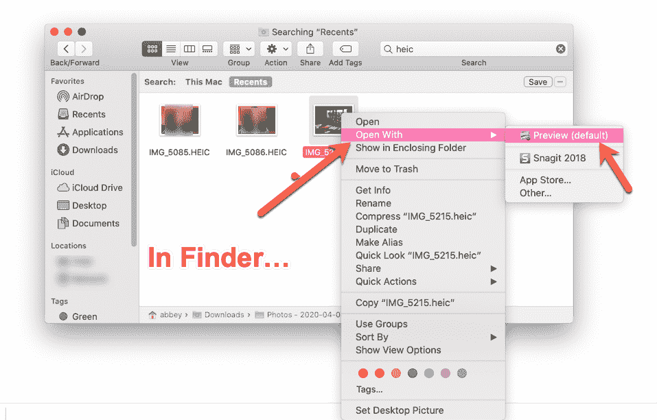
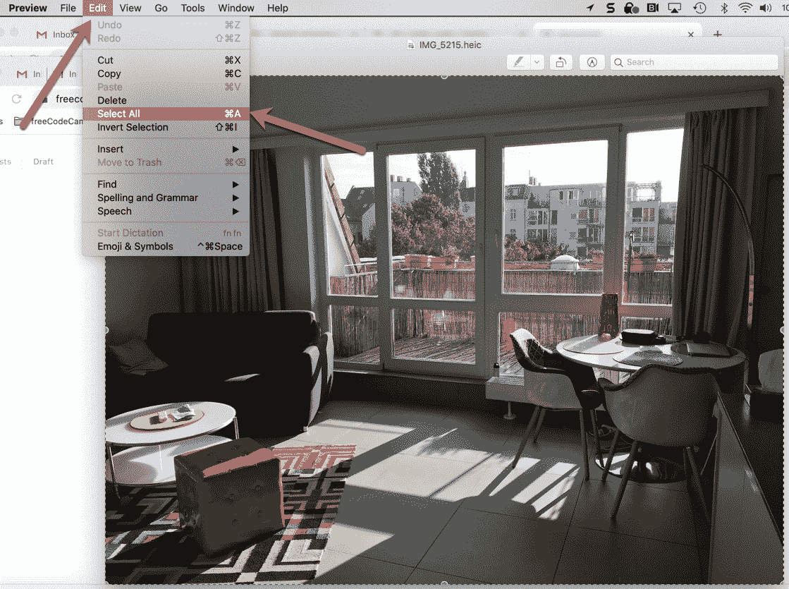
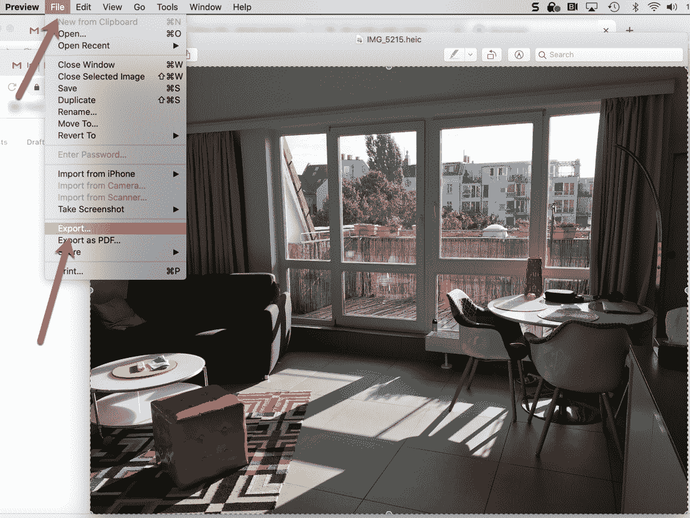
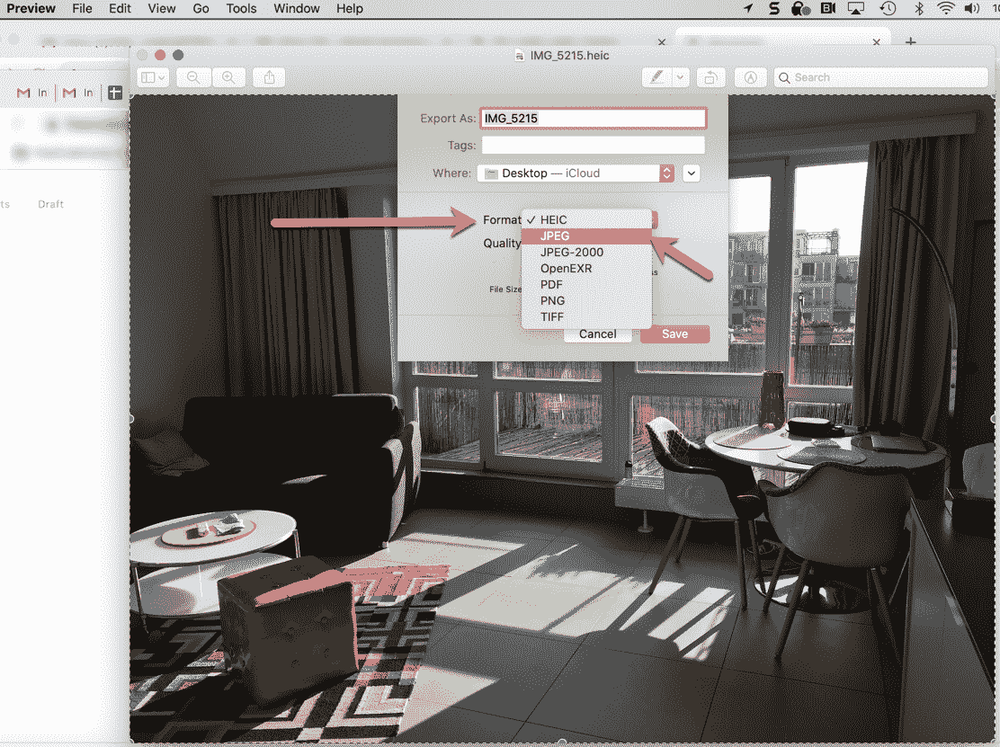

# 从 HEIC 到 JPG——如何在 Mac 上转换图像

> 原文：<https://www.freecodecamp.org/news/heic-to-jpg-how-to-convert-images-on-a-mac/>

如果你是苹果用户，你可能已经看过。你的照片的文件扩展名。你可能会想——这是什么照片格式，苹果为什么要用它？

在本文中，我们将讨论什么是 HEIC，它与 JPG 格式有何不同，为什么苹果公司使用它，如何从 HEIC 转换到 JPG，等等。

## 什么是 HEIC 文件格式？

嗯，首先，。heic 是出现在 HEIF 文件/图像上的文件扩展名。HEIF 代表高效图像格式，它于 2017 年被苹果公司采用。

你可能从它的名字就能猜到，以这种方式存储的照片“效率更高”。也就是说，它们在保持质量的同时变小了。

HEIF 本质上并不是一种格式。相反，它是一个存储照片的容器，使用先进的压缩技术将照片压缩到 JPG 的一半大小。

如果你想知道:HEIF 是标准，HEIC 是苹果给它起的格式名:)所以为了简单起见，我在本文中称它为 HEIC。

## HEIC 和 JPG 的区别

HEIC 文件和 JPG 文件有几个重要的区别。你可能更熟悉 JPG，因为它存在的时间更长，每个人(在任何设备上)都可以很容易地使用和查看它们。

因此，让我们来分析一下这两种格式的主要区别:

### 对 HEIC 与 JPG 的操作系统支持

HEIC 的一个限制因素是，它只受苹果操作系统(iOS 11 及更高版本，以及 MacOS High Sierra 及更高版本)的原生支持。

但是不要担心——即使你的 iPhone 在 HEIC 中拍照，如果你有 iOS 11 或 MacOS Sierra 和更高版本，你可以很容易地将这些照片转换为 JPG(下文将详细介绍)。

这样你就可以和任何人分享它们，而不用担心你的好友是否能在他们的安卓手机上打开它们。

如果你是 Windows 或 Android 用户，当你发现自己拥有一个 HEIF 时，你不能简单地打开它。你需要下载一个扩展或程序来帮助你处理它。

### HEIC 与 JPG 照片的大小和质量

另一个主要区别是照片的大小，如上所述。基本上，HEIC 的照片是额外压缩的，所以它们最终只有 JPG 的一半大小。

此外，尽管进行了额外的压缩，HEIC 照片仍然保持了它们的质量(实际上将比相同大小的 JPG 质量更高)。所以你实际上可以得到一张更好、分辨率更高的 HEIF 照片，它的大小和一张质量不那么高的 JPG 照片一样。相当整洁。

### HEIC 与 JPG 的兼容性

正如你现在已经知道的，如果你没有 Mac 或 iPhone，你不能随便打开一个 HEIC 文件。这是它的一个主要缺点，也是当你下载或分享照片时，苹果操作系统将 HEIC 照片转换成 JPG 的原因。

另一方面，JPG 文件与所有操作系统和浏览器兼容。所以你可以在任何地方开 JPG。

在世界其他地方采用 HEIC 格式之前，如果你想要一个简单的照片打开/查看体验，你必须转换到 JPG。

### 格式详细信息

HEIC 和 JPG 之间还有一些其他有趣的区别。

首先，HEIC 照片有 16 位“深颜色”，而 JPG 只有 8 位。所以你的 HEIC 照片可以比 JPG 更好地捕捉所有美丽的日落细节。

其次，HEIC 文件可以存储多个图像或连拍或现场照片(在一个文件中)，而 JPG 每个文件只能存储一个图像。这给了 HEIC 更多的灵活性，允许它存储更多类型的照片(每个文件不止一张照片)。

## 如何在 Mac 上将 HEIC 转换为 JPG

如果您的 Mac 运行的是 High Sierra 或更高版本，您可以在照片预览应用程序中将 HEIC 图像转换为 JPG 图像。

注意:如果你没有更新你的操作系统，你需要使用在线转换器。

但是回到我们的过程——下面是如何通过几个简单的步骤来转换这些图像。

### 第一步:选择你要转换成 JPG 的照片

首先你需要打开 Finder，找到你的图片。我刚刚在搜索栏中搜索了“heic ”,但是如果你有保存它们的文件夹，你可以去那里。

接下来，选择您想要转换的照片，然后右键单击它(在笔记本电脑的触控板上用两个手指单击)。这将弹出一个小菜单，如下所示:

Right click on the image you want to convert

### 第二步:用预览应用打开照片

你将选择“打开方式”(我的第二个选择)，然后默认选择“预览”，如上图所示。

一旦你做出这些选择，它会带你到预览应用程序中的照片。

### 步骤 3:选择并导出照片

接下来，你需要从预览的菜单栏中选择“编辑”，然后“全选”。

Edit, then Select All

你会在照片的外面看到一条移动的虚线——这告诉你你的“全选”操作起作用了。

现在，回到预览的菜单栏，选择“文件”，然后选择“导出”，就像这样:

You'll need to export your image - which then gives you the option to change formats.

### 步骤 4:从 HEIC 格式转换到 JPG 格式

选择“导出”后，您会看到弹出以下对话框:

Just change from HEIC to JPG and save and you're set!

您将看到“格式”当前设置为 HEIC。只需点击 HEIC，一个小下拉菜单会显示所有其他格式供您选择(如上图所示)。

只需选择“JPG”并点击“保存”。然后你的照片将被转换成 JPG！你可以放心地分享。

简单说明一下:你也可以更新照片的保存位置。你可以在上面的图片中看到，我选择了桌面，但是你可以随意保存到你喜欢的任何位置。

## 如果你想关掉 HEIC 怎么办？

那么，如果你不想处理这些步骤，只是想让你的手机拍摄 JPG 的照片，而不是 HEIC 呢？

您可以通过以下步骤实现这一点:

1.  进入你的 iPhone 设置，向下滚动直到你看到“相机”——选择它
2.  你会看到各种设置，顶部是“格式”——选择它
3.  你会看到两个选项，“高效率”和“最兼容”。默认情况下，它可能设置为“高效”(HEIC ),所以只需将其更改为“最兼容”,这样就会将其更改为 JPG。

瞧，你现在拍的照片将会是 JPG 格式的。