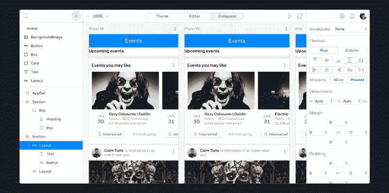
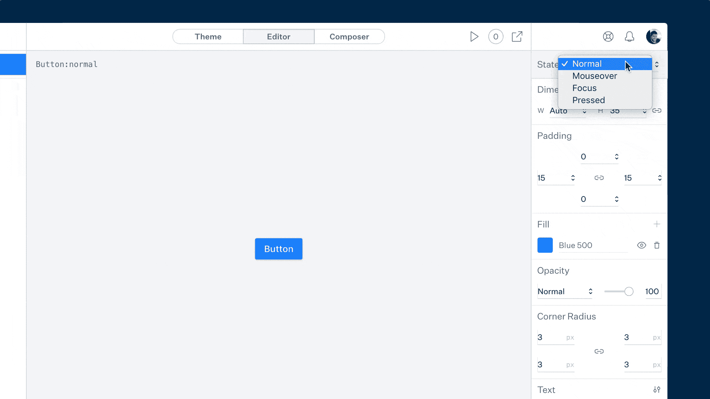
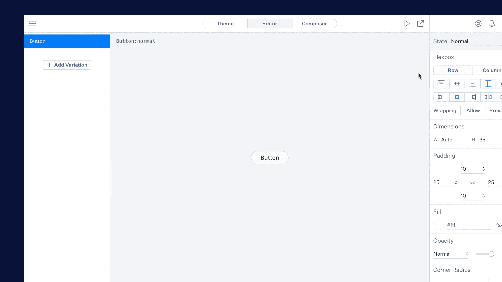
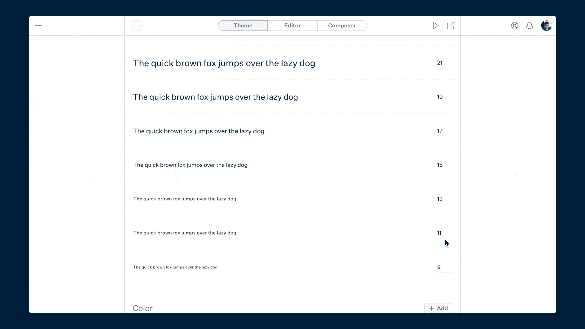
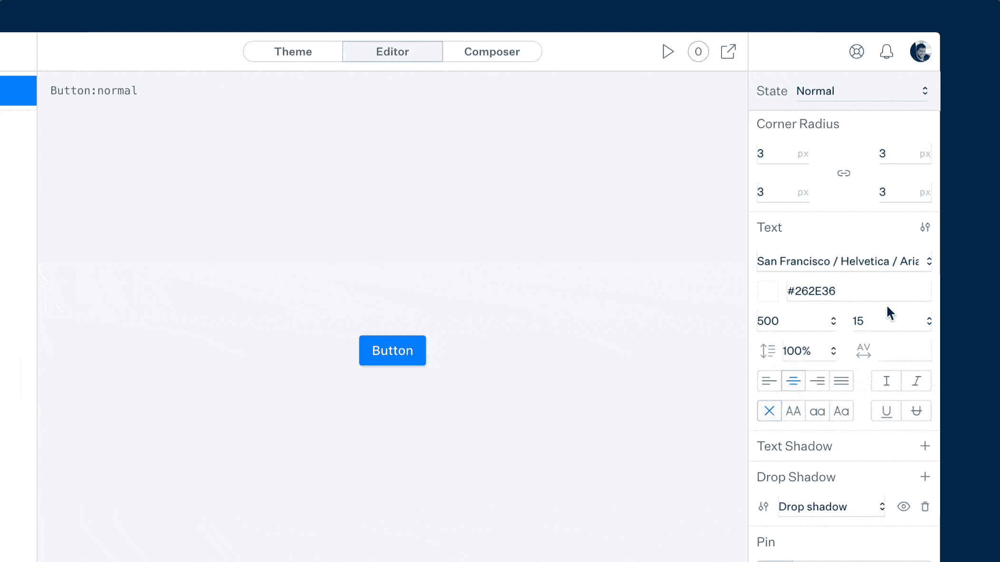

# 介绍 Modulz:视觉编码的下一步

> 原文：<https://www.freecodecamp.org/news/help-us-kickstart-modulz-5751775ed435/>

科尔姆·图伊特

# 引入 Modulz:视觉编码的下一步

Modulz Composer

Modulz 是用于设计和构建数字产品的可视化代码编辑器，无需编写代码。上周，我们启动了 Kickstarter 活动。

在[设计工具困境](https://medium.freecodecamp.org/the-design-tool-dilemma-225541c4ad1d)、[设计工具正在脱离轨道](https://medium.freecodecamp.org/design-tools-are-running-out-of-track-94f21b6ae939)和[如何构建设计系统](https://medium.freecodecamp.org/how-to-construct-a-design-system-864adbf2a117)中，我写了大量关于我们当前的设计工具如何不太适合 UI 设计的文章。

对这些帖子的惊人回应激发了 [Modulz](https://www.modulz.app/) 的灵感:一种新型的设计工具，可以输出生产就绪的组件。

### 什么是 Modulz，它有什么用处？

表面上，Modulz 看起来很熟悉。你在左边栏组织你的图层，应用右边栏的样式，看着你的设计在画布上组合起来。但是 Modulz 远比那更强大。

#### 交互状态

您不是在绘制静态形状，而是在使用交互式组件。分别设置每个状态的样式。添加组件变量。

Styling a mouseover state in Modulz

#### 代码导出

您可以导出生产就绪的组件。我们从 React 和样式组件开始。很快，我们将添加对其他 CSS-in-JS 库的支持，如 emotion 和 styled-jsx。然后，顺风和香草 HTML/CSS。未来，我们希望增加对 Vue、Preact 和其他基于组件的库的支持。

The code export UI in Modulz

#### 设计系统

Modulz 比色板走得更远。定义一个完整的设计系统，包括字体大小、间距、颜色、阴影等，然后重复使用它们来设计你的组件。在你的主题中调整一个样式，它会在你的整个项目中更新。

Modulz Theme screen for defining your design system.

#### 设计林挺

您可以使用 Modulz 设计林挺功能自动完成设计任务。Modulz 可以以编程的方式对颜色对比、行长度和跨浏览器性能等问题提出改进建议。

Design linting in Modulz

以下是迄今为止人们对 Modulz 的评价:

> “在 UI 设计中，状态(几乎)就是一切。然而，我所见过的设计应用程序中没有这一点。我们都在为一个该死的盘旋状态而努力！为了全世界设计师的精神健康，回到 Modulz。”— [埃里克·皮特科克](https://twitter.com/ericpitcock/status/1054867293878931456)

> “我画❤草图，但是没有一个伟大的工具可以将产品设计转化为代码。Modulz 的方法很有意思:这款应用创造出的不是完美的像素，而是响应性的、交互式的设计，可以输出以做出反应。——[符晓薇·巴瑟斯特](https://twitter.com/leannewdesign/status/1053695747709784065)

> “这确实有些开创性的想法！”亨利克·朱尔

> “我喜欢 Modulz #CloseTheGap 口号。当你可以一起摆脱隔阂的时候，为什么还要弥合隔阂呢？填补这个空白！”— [纪娜·安妮](https://twitter.com/jina/status/1054429034942091264)

> “这看起来非常有希望，很期待看到结果。”— [黛安·阿龙萨奇](https://twitter.com/diannealonsagay/status/1053102155995918336)

> “内置设计系统——太棒了！这可能最终成为我们期待已久的设计工具。很高兴成为支持者！”— [阿帕拉吉塔渔民](https://twitter.com/aparajita1327/status/1053031871183912960)

> “很高兴成为这个项目的主要支持者。希望看到这些人在他们所做的事情上取得成功。看一看。”— [布里斯·格拉姆](https://twitter.com/bricegramm/status/1053046033087901697)

> “这个新的可视化编码工具看起来很棒。它填补了一个我从未见过的空白。”道格拉斯·博纳维尔

> “现在放下一切，回到 Kickstarter 上的 Modulz。一个在 React 中导出生产就绪组件的工具是我一直追逐的梦想。”— [阿卜杜勒·萨拉姆](https://twitter.com/mrabdussalam/status/1052870962931257344)

> “今天早上看了你的视频，我的世界被炸了。我肯定会支持”——阿曼达·卢卡斯

> “终于有人解决了 UI 设计中最大的问题”——Ugur Akdemir

> “停下你正在做的一切，回到 Modulz”——史蒂夫·肖格

> “支持！这需要发生！”— [弗拉德·马格达林](https://twitter.com/callmevlad/status/1052665080641245184)

### 未来的计划

我们对 Modulz 有着巨大的野心。我们在这里强调的特性只是第一步。

明年晚些时候，我们计划引入团队特性，包括组件导入，这样产品团队就可以用他们现有的组件库进行设计。

随着平台的成熟，最终目标是支持 Modulz 和文本编辑器之间代码的无缝传输。开发人员在文本编辑器中手动编辑代码。设计者在 Modulz 内部可视化地编辑相同的代码。

除此之外，更多通用功能的计划包括:

*   支持更多的 CSS-in-JS 库，如 emotion、styled-jsx 等。
*   支持导出到普通 HTML/CSS
*   将组件数据导出到 JSON
*   将你的主题导出到像 Tailwind 这样的实用 CSS 框架中
*   更广泛的代码库支持(Vue.js、Preact、React Native 等)。)
*   远程设备预览/镜像
*   离线模式(Modulz 是一个渐进式 web 应用程序)
*   原型——基于状态的交互、屏幕转换等。
*   组件，模板，图标，插图等庞大的图书馆。

最终，我们希望解决产品团队之间的脱节。帮助设计人员与开发人员更好地协作，无需代码。

通过自动化可访问性来鼓励更具包容性的数字产品。

通过构建现代工具来减少瓶颈，使整个团队能够致力于他们的最终产品。

让每个人都致力于相同的产品。一起。

### 接缝

Our faces

#### 科尔姆·图伊特

Colm 总部位于都柏林，负责产品设计和前端开发。在过去的四年里，Colm 一直致力于设计工具。他之前创建了另一个设计工具 [Plexi](http://www.plexi.io/) 。你可以在[推特](https://twitter.com/colmtuite)、[微博](https://dribbble.com/ColmTuite)和他的[网站](https://www.colmtuite.com/)上找到他。

#### 斯蒂芬·甜心

Stephen 在西雅图工作，负责后端开发和 JavaScript 工程。Stephen 在许多财富 500 强公司有超过 15 年的工作经验，并且写了两本关于游戏开发的书。在 [Twitter](https://twitter.com/sdothaney) 和 [Github](https://github.com/StephenHaney) 上找到他。

### 你能提供什么帮助

我们已经在 Modulz 上全职工作了四个月。我们已经完成了很多核心产品。但是 Modulz 是一个复杂的产品，我们对此有很大的计划。

我们得到了来自 InVision 和 Adobe 的一些支持。但是我们需要所有能得到的帮助。

为了感谢您的支持，我们将在 Kickstarter 上提供[无限制、终身访问 Modulz 的权限。还有一个很酷的礼包，里面装满了高质量的图标、模板和资产！如果你能考虑支持我们的工作，这对我们来说将是非常重要的*。*](https://www.kickstarter.com/projects/stephenhaney/modulzthe-next-step-in-visual-coding?ref=user_menu)

更多信息，请查看 Modulz [网站](https://www.modulz.app/)、[推特](https://twitter.com/Modulz)和[频谱](https://spectrum.chat/modulz)。

谢谢大家❤️