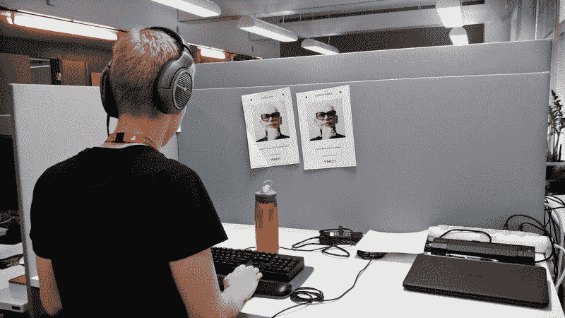

# 帮助盲人学习编码

> 原文：<https://www.freecodecamp.org/news/helping-blind-people-learn-to-code-c47c68d4a237/>

每 100 个软件开发者中就有 1 个是盲人。

我们知道这一点是因为 Stack Overflow [最近询问了 64，000 名开发人员他们是否有残疾](https://fcc.im/2qp6ddh)。

问题是:盲人开发者看不到屏幕怎么编码？

freeCodeCamp 贡献者 [Florian Beijers](https://www.freecodecamp.org/news/helping-blind-people-learn-to-code-c47c68d4a237/undefined) 天生失明。他可以用标准配置的笔记本电脑编写代码。他使用一款叫做**屏幕阅读器**的软件。有了它，他可以选择一行文本或代码，并听到它的内容以每分钟数百个单词的速度读给他听。

Florian [写了一篇文章解释他是如何做到这一切的。](https://fcc.im/2pS32rM)

> “一个屏幕阅读器基本上，在最基本的层面上——等等——阅读屏幕。它用合成的文本到语音转换 Siri 一样的声音告诉你屏幕的文本内容。屏幕阅读器还允许使用盲文显示器，这种设备由一排可刷新的盲文细胞组成，可以根据屏幕上突出显示的内容形成字母。”—弗洛里安·贝杰斯

Tuukka Ojala codes in his cubicle, with no need for a monitor.

你可能认为失明会限制你能做的编码种类，但事实并非如此，[正如一位盲人开发者解释的那样](https://www.vincit.fi/en/blog/software-development-450-words-per-minute/):

> 你可能会认为前端开发本质上是可视化的，它不适合盲目的开发人员，这在很大程度上是正确的。你不会发现我自己在做一个基本的概念验证，因为那些项目往往主要是获得正确的外观，然后添加真正的功能。
> 
> *“然而，我也有过棱角分明、反应迟钝的工作。击球手出局了吗今天的许多网络应用程序都在浏览器中运行。例如，我曾经花了几周时间为一个有点复杂的 Angular 应用程序添加国际化支持。我根本不需要做任何视觉上的改变。*
> 
> *“我发现像 Bootstrap 这样的库对我这样的人来说是天赐之物。因为网格系统，我可以自己设计一个粗略的用户界面。尽管如此，我所做的所有与界面相关的更改在交付给客户之前都要经过仔细检查。”*
> 
> *—图克卡·奥贾拉*

一些盲人开发者甚至可能选择不透露他们的残疾。他们可以完成工作，而他们的客户甚至没有意识到他们是在不用视觉的情况下编码。

> “从我自由职业生涯的一开始，我就养成了不暴露自己残疾的习惯。我一直认为，如果我做得很好，就没有理由暴露我的盲目。事实上，在我看来，这会让我处于不利地位，因为互联网上的工作关系很大程度上是由印象驱动的——展示你的技能和能力。
> 
> *“在 grace 的帮助下，这种方式运行得很好，我目前在美国一家价值数十亿美元的金融公司的一个项目中担任安全/解决方案架构师顾问，与世界各地的客户合作。*
> 
> *“目前我个人月收入 1 万美元，这在印度相当不错了，这让我可能再也不用回去工作了。”*
> 
> *—黑客新闻用户 [TriNetra](https://news.ycombinator.com/item?id=11887301)*

我希望这能激励你坚持编码，不管你面临什么样的挫折，并鼓励其他人也这样做。

在 freeCodeCamp.org 社区中有许多盲人开发者。以下是他们在几周前的一个邮件组的讨论中对 freeCodeCamp 课程的一些评论(感谢 [Florian](https://www.freecodecamp.org/news/helping-blind-people-learn-to-code-c47c68d4a237/undefined) 与我分享这些评论):

> “我接受挑战。我喜欢这个网站。我要求他们做一些可访问性调整，他们反应非常积极。”
> 
> “感谢这么棒的网站！我喜欢它。我是一名学生，我只是在寻找这样的东西来学习 JavaScript。你来救我了！谢谢！”
> 
> “是的，免费代码营很棒，我已经用了一个月左右了。视觉设计部分对一个盲人来说相当难，但我已经掌握了基本知识。”

freeCodeCamp 社区将继续我们的使命，让每个人都能获得世界级的技术教育，无论他们的身体能力如何。

你也可以尽自己的一份力量，支持全世界数百万正在学习编码的人。向 freeCodeCamp.org 进行免税捐赠。

我们可以一起创建更多的免费教育资源，让学习编程的残疾人更容易获得这些资源。