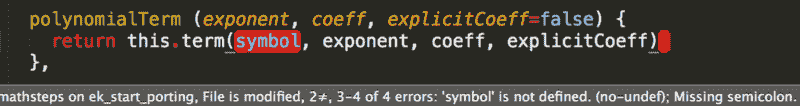
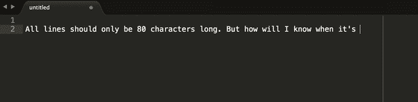
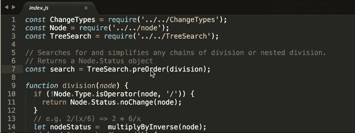
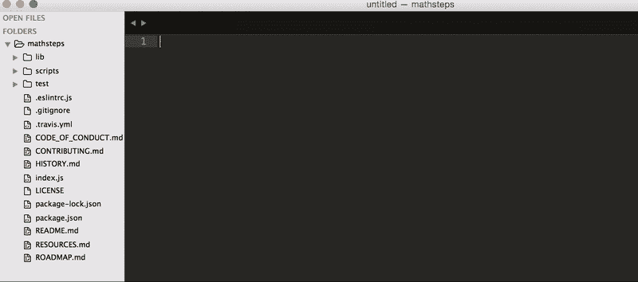
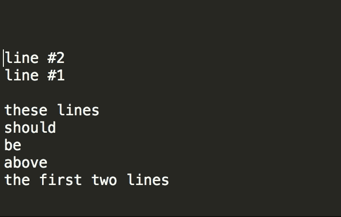
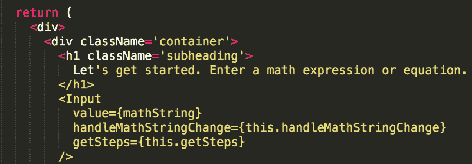
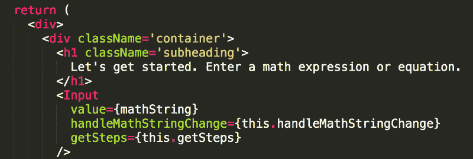
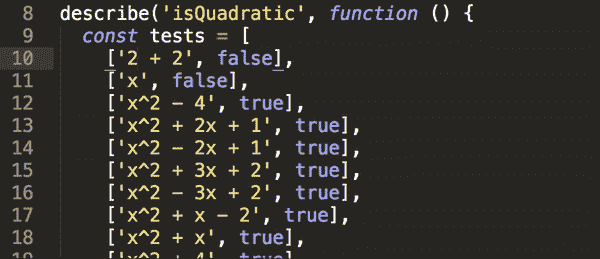

# 如何帮助你的文本编辑器帮助你

> 原文：<https://www.freecodecamp.org/news/helping-your-text-editor-help-you-24ea08adc6a6/>

作者:伊菲

# 如何帮助你的文本编辑器帮助你

#### 编写更高效、更有趣的代码的技巧和窍门

在六次实习中，我有很多可爱的导师，他们看着我写代码，也让我看着他们写代码。(我？p [空中编程！多亏了他们，我在工作中学会了很多东西，让我的工作变得更有效率、更愉快。](https://content.pivotal.io/blog/pair-programming-considered-extremely-beneficial)

其中一些是文本编辑器提示和技巧，我想和你分享一些我学到的东西！

这不是一篇关于你应该使用哪种文本编辑器的博文。我将在我最近使用的编辑器中分享一些例子(Mac 上的 Sublime Text)——但是许多文本编辑器是可定制的。这意味着许多这些提示&技巧可以在你的编辑器中设置好(我很乐意看到解释如何设置的评论！)让我们摆脱“这个工具是最好的”的话语，只是学习如何帮助我们的工具更好地帮助我们。✨

### 自动 lint 您的代码

Linters 可以使代码更干净、更易读，并且可以捕捉错误。有时我在完成一组更改后运行一个 linter，或者在 GitHub 上打开一个 pull 请求后让一个 linter 在线运行。但是当 linter 运行时，我写 linter-passing 代码的速度要快得多……就像我写代码一样！我不仅在提交代码前几分钟停止了无聊的调整。我现在也在训练自己在问题发生之前解决问题。

The [linter](http://www.sublimelinter.com/en/latest/index.html) tells me right away: a variable is undefined, and I’m missing a semicolon

### 80 字符标尺

说到任意的规则，许多样式指南都喜欢每行最多 80 个字符(或者 100 个，或者其他)。大多数文本编辑器都有办法添加一个小行来提醒你什么时候到了极限，不管它是什么。

In Sublime Text, you can turn this on from View > Ruler

### 自动遵循一些空白约定

许多样式指南更喜欢文件没有尾随空白，并且在每个文件的末尾正好有一个新行。可能很难记住这样做，所以当我的文本编辑器为我这样做的时候感觉很好！Sublime 的用户设置里有这个:`“ensure_newline_at_eof_on_save”`和`“trim_trailing_white_space_on_save”`。

### 搜索(并替换)整个代码库

当我处理一个包含许多文件的代码库时，在其中搜索以查看某个东西被使用或引用的所有地方是很好的。能够选择在特定的文件夹或文件类型中进行搜索真是太棒了。有时我发现打开/关闭区分大小写或使用正则表达式很有帮助——尽管我不经常使用这些特性。

### 快速查找函数定义

当然，我可以在代码库中搜索函数名，找到它的定义，然后*再*弄清楚它是如何工作的。但是如果有一种更快到达那里的方法不是很好吗？

*right click, goto definition, and …aha! **that’s** what that does*

### 快速查找文件

我经常想找到并打开一个文件，但不记得它在代码库中的确切位置。我喜欢能够在搜索栏中输入文件名，并看到我正在寻找的所有可能的文件，这让我可以快速打开新文件。我喜欢非常灵活的搜索输入带来的额外好处。我可以打一大堆错别字，或者去掉文件名的一部分，Sublime 仍然可以知道我想要什么！(我敢打赌，这种搜索算法背后的技术，通常被称为“[模糊搜索](https://github.com/junegunn/fzf)”，非常有趣！)

In Sublime Text, you can bring up this search bar with ⌘P

### 上下移动线条

为了将一行代码(或整个函数)移动到另一行之下，我过去常常使用大量的 select + copy + paste。从那以后，我知道了如何用快捷方式上下移动行。这是一个很小的变化，但是我发现感觉*更好了*(有点像[三指拖动](https://support.apple.com/en-us/HT204609)的感觉)。

control+ ⌘ + up/down (on MacOS) in Sublime Text

### 语法突出显示

语法突出显示使得阅读和扫描代码更加容易。但它也有助于在打字时发现错误——如果它看起来颜色不对，那可能是个错误。

有时默认情况下会突出显示语法。有时，只有某些语言/技术在您的默认设置中。我有了一台新的工作笔记本电脑，知道我需要[安装一个包](http://gunnariauvinen.com/getting-es6-syntax-highlighting-in-sublime-text/)来突出显示`jsx`。然而我*仍然*在处理许多`jsx`文件的时候拖延了几个月。在我花了一分钟安装它之后，事情变得好多了。

Before and after adding syntax highlighting for React .jsx files

### 饭桶

最后，如果您在工作流中使用 git，您可以向文本编辑器添加一些支持，告诉您与 git 相关的事情。我想看到的一件事是，自从我上次提交以来，添加/删除/修改了哪些行(一个轻量级的`git diff`)。我有时还会使用一个工具(围绕名为 `[git blame](https://git-scm.com/docs/git-blame)`的[构建)来查看谁最后修改了文件中的一行。](https://gitlab.com/gitlab-org/gitlab-ce/issues/34469)

the markers in the left margins are thanks to the [GitGutter](https://github.com/jisaacks/GitGutter) package

### 还有更多！

你的文本编辑器可以为你做很多很酷的事情！我确信我会继续学习那些能帮助我提高效率和让我的工作更愉快的工具。我不打算马上开始使用它们——随着时间的推移，当我对它们感到兴奋或发现需要它们时，我会挑选工具。

希望这些提示和技巧对你有所启发或帮助！我很想在评论中听到你喜欢使用什么样的文本编辑器功能。？