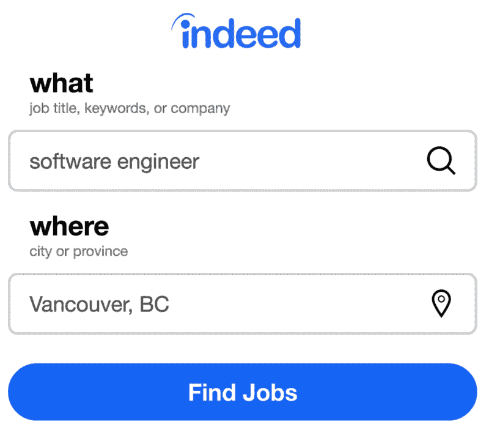
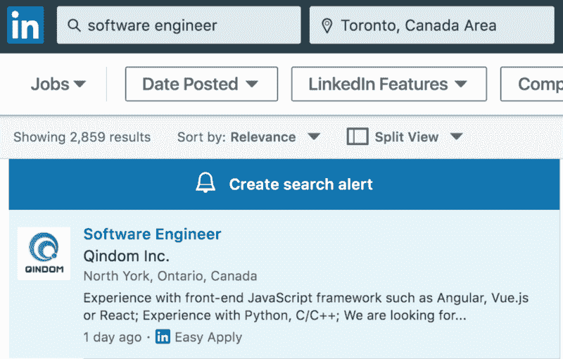
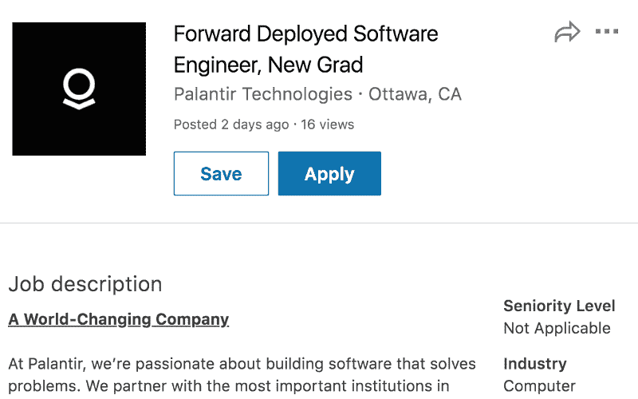
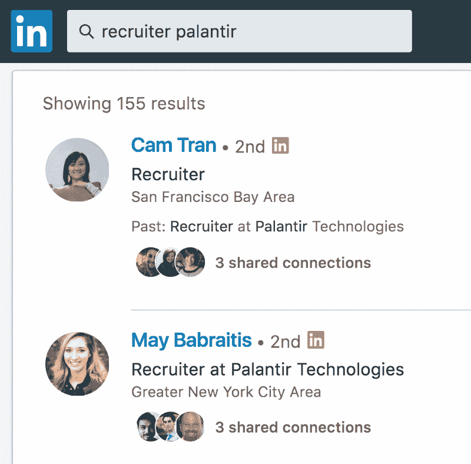
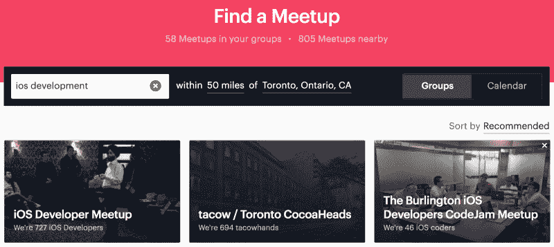

# 这里有 4 种申请软件工程师工作的最佳方式，以及如何使用它们。

> 原文：<https://www.freecodecamp.org/news/here-are-4-best-ways-to-apply-for-software-engineer-jobs-and-exactly-how-to-use-them-a644a88b2241/>

作者 YK·杉

# 以下是申请软件工程师工作的最佳方法——以及如何使用它们。

当人们想到求职时，他们通常会想到简单的网上申请。

然而，这并不总是最好的策略，因为其他人几乎都是这么做的。

取而代之的是另外四种特别有效的求职方式。当应用于软件工程工作时，我会推荐这些策略，但我认为它们对其他类型的工作也是有效的。它们是:

1.  使用 LinkedIn
2.  面对面交流
3.  获得推荐
4.  招聘会/招聘活动

我个人使用了这些策略的组合来获得各种技术公司的工作面试，包括脸书、Yelp 和 Evernote。

我还用它们获得了多家软件公司的工作邀请，包括微软和谷歌。

在这篇文章中，我将带你了解如何使用这些策略。我还会给你一些提示和技巧。

#### 但是首先……有一件事要记住。

正如我在[上一篇关于找软件工程师工作的文章](https://medium.freecodecamp.org/how-to-get-a-software-engineer-job-at-google-and-other-top-tech-companies-efa235a33a6d)中提到的，最佳策略因你申请的公司规模而异。

如果你申请的是**中小型**公司，我建议你关注 **LinkedIn** 和**面对面交流**。

另一方面，如果你申请的是更大、更受欢迎的公司，比如谷歌和脸书，那么除了简单的网上申请之外，T2 还可以通过推荐和 T4 招聘会更有效。

现在，记住这一点，让我们来看看所有四个策略。

### 1.商务化人际关系网

在我看来，使用 LinkedIn 是申请中小型公司软件工程师工作的最佳方式。

我会这样使用它。

#### 第一步:寻找工作机会

首先，在公司网站上或通过使用像 Indeed 和 LinkedIn 这样的网站找到你感兴趣的职位空缺。

在你想工作的地方使用“软件工程师”这样的关键词。

使用这个策略，假设你已经找到了至少一个你感兴趣的职位空缺。

假设你对 Palantir 的软件工程师工作感兴趣。

#### 第二步:寻找招聘人员

然后，我会先找到这家公司的招聘人员，而不是简单地在网上申请。你可以在 LinkedIn 上很容易地做到这一点。只需搜索“招聘人员<company name="">”这样的关键词。</company>

理想情况下，你应该能从这家公司找到 6-10 名招聘人员。

如果公司很小(< 10 人左右)，你可能也想把非招聘人员作为目标。如果你申请的是一家小公司，可以试试工程师、首席技术官甚至首席执行官。

#### 第三步:在 LinkedIn 上添加招聘人员

下一步是向你在 LinkedIn 上找到的招聘人员发送联系请求，或者在那里给他们发信息。

添加它们更容易，而且是免费的。然而，如果你在短时间内添加了太多的人，LinkedIn 可能会阻止你添加人。在这种情况下，你可能需要切换到 LinkedIn 消息，这可能会花一点钱。

无论如何，一旦你从你感兴趣的公司找到 6-10 名招聘人员，我会同时向他们发送联系请求。为了使这个过程尽可能简单，我不会在这里添加任何自定义消息。

如果你发送 6-10 个连接请求，大约有 2-5 个会在一周内接受你的请求。

#### **第四步:发送自定义消息**

完成上一步后，假设有 2-5 个人接受了您的连接请求。这是一个好迹象，因为这意味着他们至少在一定程度上积极使用 LinkedIn。

然后，向他们发送如下消息:

> 嗨<first name="">，</first>

> 感谢您接受我的连接请求。

> 我在考虑申请我在你们网站上找到的这个职位:

> 我即将从为期 6 个月的编码训练营项目毕业，该项目涵盖了 JavaScript 的全栈开发。

> 我在想，我能胜任这个职位吗？如果没有，我能做些什么来更好地准备自己吗？

> 问候，
> <你的名字>

在本示例消息中，您询问了以下两点:

*   我能胜任这个职位吗？
*   如果我还不合格，怎么办？

通过问这些问题，你会更好地了解自己在就业市场中的地位，以及如何提高自己的地位。

同时，这也是开始与业内关键人物建立联系的好方法。

当然，定制这条消息，使它更适合你的特殊情况和你的声音。

#### 第五步:发送跟进信息

一旦你把这条信息发给 2-5 个把你加回 LinkedIn 的人，你应该能收到 1-2 个回复。

如果他们说你够资格，那就太好了。在网上申请这个职位。然后，如果两周内你没有收到他们的回复，给他们发一条这样的信息:

> 嗨<first name="">，</first>

> 按照你的建议，我在两周前申请了这个职位。

> 我只是想知道我的申请情况如何？

> 问候，
> <你的名字>

在最初的信息之后，如果他们说你不合格，那也没关系。如果你还没有做好准备，问问他们你能做些什么来更好地准备自己。然后，如果你愿意，遵循他们的建议来增加你下次的机会。

如果你遵循他们的建议，你可以在几个月后再次给他们发信息，让他们知道你取得的进步。然后，再问他们你够不够资格。

完成所有这些步骤后，你就有机会开始面试了。如果没有，至少你应该能够开始建立有意义的联系，并获得更好的关于哪些技能需要改进的想法。

#### 概述

以下是我通过 LinkedIn 获得工作面试的 5 步策略。

*   第一步:寻找工作机会
*   第二步:寻找招聘人员
*   第三步:在 LinkedIn 上添加招聘人员
*   步骤 4:发送自定义消息
*   第五步:发送跟进信息

我喜欢把这些步骤想象成一个销售漏斗。你从每家公司的 6-10 名招聘人员开始。然后，只有 2-5 个会接受你的连接请求。在这些人中，只有 0-2 人会回复你的信息。

请注意，您可以同时对多家公司采用这种策略。

所以，对于第一步(找到一个职位空缺)，你应该同时找到 5-6 个职位。如果你对所有的 5-6 个职位同时遵循其余的步骤，你应该能够得到至少一个好的线索。

然后，只需重复第 1 步(找到一个职位空缺)到第 5 步(后续消息)。同时，通过兼职构建有趣的项目来不断提高你的编程技能。

### 2.面对面交流

面对面的交流对于找工作也非常有效，尤其是对于中小型公司。

为此，用你的兴趣作为指导。

比如说你喜欢 iOS 开发。然后，在 Meetup.com 和脸书活动等服务上寻找你附近的 iOS 相关活动。

你可以在这些网站上搜索类似于 **iOS** 、**移动开发**和 **React Native** 的术语。

然后，去你附近的一个活动。

一旦你参加了其中一个活动，你的重点应该是尽可能多的学习。如果那里有介绍，看看你是否能从中学到什么。如果那里有业内人士，看看能不能从他们身上学到什么。

此外，确保与人单独交谈。如果你不确定在这些活动中该说些什么，你可以用下面的例子:

> 首先，向不跟任何人说话的人挥手，以引起他们的注意。然后，说:
> 嗨！你好吗很好，你呢？
> 好。那么，你叫什么名字？或者——那么，什么风把你吹来了？

然后，用你的好奇心作为谈话的指南。如果你觉得和你开始交谈的人在一起不舒服，那就找别人吧。

在某些时候，他们可能会问你这样的问题，“什么风把你吹来了？”

在这一点上，你可以解释你去那里是为了学习更多关于行业/技术的知识，并且你也在找工作。

如果他们知道当地的机会，他们会告诉你的。

我的建议是，不仅要寻求帮助，而且要在力所能及的时候提供帮助。例如，为当地组织做志愿者是了解你所在地区业内人士的好方法。

### 3.获得推荐

无论你申请的是小公司还是大公司，得到朋友的推荐也是获得工作面试的好方法。

如果你有朋友在你想去的公司工作，那很好。看看他们能否介绍你去那里。

如果没有，仍然有机会使用这个策略。

在《拒绝证明》中有一个有趣的故事，这是一本关于克服被拒绝的恐惧的书。

在这篇文章中，作者的妻子尝试了不同的策略来获得谷歌的一份工作。

她尝试的最有效的策略之一是使用 LinkedIn 建立联系。通过 LinkedIn，她向许多在谷歌工作的人寻求帮助。他们中的一些人对她的主动性印象深刻，最终把她推荐给了这家公司。最终，她就这样得到了这份工作。

现在，如果你觉得你准备好了，我建议你尝试同样的策略。

首先，找到你所在行业的关键人物——例如，你想为之工作的公司的软件工程师。

然后，使用与我之前在 LinkedIn 部分提到的策略相似的策略。首先，在 LinkedIn 上添加他们。然后，向添加您的人发送自定义消息。

你可能想给他们发这样的信息:

> 嗨<first name="">，</first>

> 感谢您接受我的连接请求。

> 我正在为自己在<company name="">的软件工程师职位做准备。</company>

> 自从你参加了基于 JavaScript 的编码训练营后，我感觉你的处境和我差不多。

> 你能告诉我一些关于毕业后你是如何为你的职位做准备的吗？

> 如果你很忙，请不要担心回复。不管怎样，感谢你阅读这条信息！

> 问候，
> <你的名字>

这里需要注意一些事情:

*   如果你的目标是一家受欢迎的大公司，我会联系非招聘人员。大型热门公司的招聘人员通常不会回复，可能只是因为他们在 LinkedIn 上收到了太多消息。
*   在我上面的信息中，有相当多的定制——例如，“我看到你也去了一个基于 JavaScript 的编码训练营。”这会让他们觉得你也关心他们。
*   你应该问一个具体的问题，而不是仅仅让他们“集思广益”
*   在这样一条信息的结尾，我喜欢说这样的话，“如果你很忙，请不要担心回复。”这将使他们对这一信息感到更放心。如果你联系的不是招聘人员，这一点尤其重要，因为回复你的信息不是他们的工作。

一旦你以这种方式进行了第一次接触，再征求一条建议。感谢他们的建议，照着做，过几个月再跟进。

然后，展示你根据他们的建议取得的进步。最后，如果你觉得你已经建立了足够稳固的关系，请求推荐。

### 4.招聘会/招聘活动

利用你附近大学的招聘会/招聘活动也是一个有效的策略，无论是对小公司还是大公司。

即使你目前没有去大学，你仍然可以参加其中的一个。有时他们在公共场所举行。

此外，如果你找到一个在你不是学生的大学举行的聚会，你仍然可以试着去。

通常，这些活动不会检查学生 ID。所以，试着去参加活动，和那里的公司谈谈。然后，向他们解释你不是学生，但你仍在找工作。

如果你是第一次参加这些活动，你可能不知道该说些什么。如果是这种情况，您可以使用以下脚本:

> 嗨！你们有入门级软件工程师的空缺职位吗？是的。我们有这个和这个位置。嗯，我想申请这个职位，但是我不确定我是否够资格...你能看看我的简历吗？
> -当然。好吧，我觉得你可能有资格。让我把这个交给我们的招聘人员。
> 谢谢。根据我目前的技能水平，你对如何更好地为这个职位做准备有什么建议吗？

如果你对你想谈的公司一无所知，你可以一开始就说下面的话:

> 嗨！我只是在想，你能解释一下你的公司是做什么的吗？嗨，我们公司做 X 和 y。

在这些活动中，你的目标应该是分发至少 7-15 份简历。带 20 份拷贝以防万一。

然后，和一家又一家的公司谈，不要在任何一家上花太多时间。如果你给 15 家公司发简历，只要你有扎实的编程基础，你应该至少能得到 2-3 次面试机会。

顺便说一下，如果你需要一些关于如何准备简历的建议，我这里有一篇关于它的文章。

### 概述

现在，让我们快速回顾一下本文中讨论的内容。

申请软件工程师工作的四种最佳方式是:

1.  使用 LinkedIn
2.  面对面交流
3.  获得推荐
4.  招聘会/招聘活动

如果你申请的是中小型公司，关注 LinkedIn 和面对面交流。

如果你申请的是更大、更受欢迎的公司，除了简单的网上申请之外，重点要放在获得推荐和利用招聘活动上。

使用所有四种策略，并专注于对你最有效的策略。

#### 其他资源:

*   [我关于准备你的软件工程师简历的文章](https://medium.freecodecamp.org/heres-the-resume-i-used-to-get-a-job-at-google-as-a-software-engineer-26516526f29a)
*   如何在顶级科技公司找到一份软件工程师的工作

好吧，祝你好运，一如既往地感谢你阅读我的文章！

如果你对这个或其他任何事情有任何问题，请随时在下面的评论中或在 [Instagram](https://www.instagram.com/ykdojo/) 或 [Twitter](https://twitter.com/ykdojo) (两者都是@ykdojo)上告诉我。