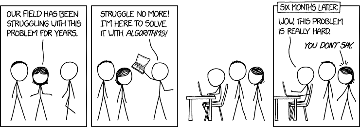

# 这里有 438 门免费的在线编程和计算机科学课程，你可以在五月份开始学习

> 原文：<https://www.freecodecamp.org/news/here-are-438-free-online-programming-and-compsci-courses-you-can-start-in-may-ee3d276454aa/>

这里有三个值得你花时间的链接:

1.  438 门免费的在线编程和计算机科学课程你可以在五月份开始学习
2.  制作纯 CSS 工具提示的分步指南( [3 分钟阅读](https://fcc.im/2oXNBSq)
3.  JavaScript ES6 函数:好的部分( [6 分钟读完](https://fcc.im/2qFte9j)

额外收获:Stack Overflow 的创始人分享了他是如何围绕他的新开源项目 Discourse 建立业务的——尽管许多社区，包括 freeCodeCamp，都可以免费使用它作为我们的论坛

### 想到这一天:

> "当一朵花不开时，是你修复了它生长的环境，而不是这朵花."—亚历山大·登·海耶

### 今日趣事:

网络漫画作者 [XKCD](https://fcc.im/2p5Su78) 。

### 今日学习小组:

圣克拉拉自由代码营

编码快乐！

–昆西·拉森，自由代码营的老师

如果你从这些邮件中获得了价值，请考虑[支持我们的非营利组织](http://bit.ly/donate-to-fcc)。