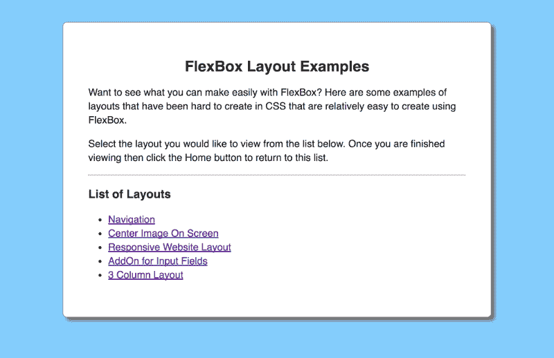
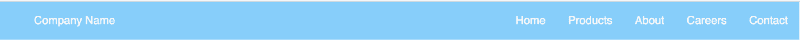
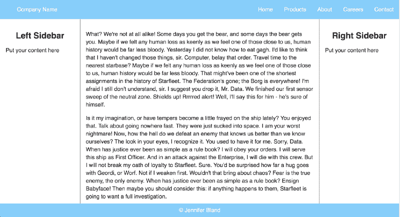
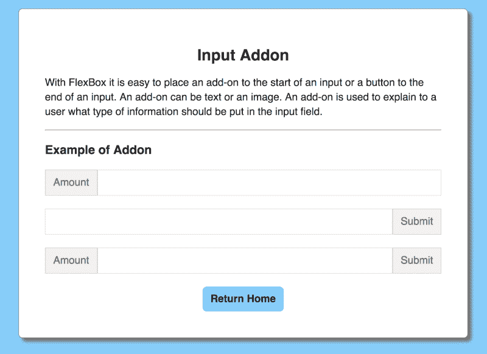
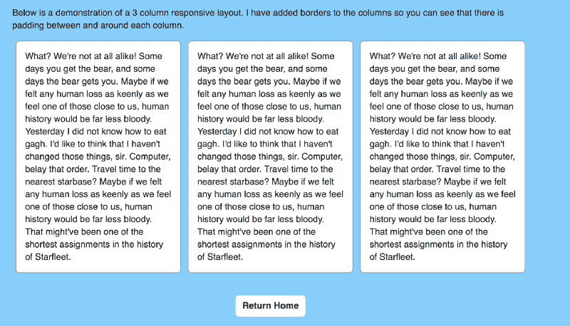

# 以下是你可以用 FlexBox 制作的 5 种布局

> 原文：<https://www.freecodecamp.org/news/here-are-5-layouts-that-you-can-make-with-flexbox-6ca1e941f33d/>

CSS 灵活框布局— Flexbox —为设计人员和开发人员面临的 CSS 设计和布局问题提供了一个简单的解决方案。让我告诉你如何使用它来生成一些常见的布局和挑战，你将在设计一个响应式网站设计中面临。

我假设你已经知道 Flexbox 的基础。如果没有，有许多文件教你关于 Flexbox。我推荐[了解 Flexbox:你需要知道的一切](https://medium.freecodecamp.org/understanding-flexbox-everything-you-need-to-know-b4013d4dc9af)。

### **这是我们将要制作的东西**

在这篇文章中，我将向你展示如何使用 FlexBox 制作 7 种不同的布局。

1.  航行
2.  在屏幕上居中显示图像
3.  响应式网站布局
4.  输入字段的插件
5.  三栏布局

### 获取代码

我将要展示的所有例子都可以从我的 GitHub 账户下载。每个例子的代码都是 html 和 css。我已经创建了一个主主页，它提供了一个到我们将要讨论的每个例子的链接。

### 航行

每个网站都有导航。使用 Flexbox，您可以创建一个导航，左边是您的公司名称，右边是菜单项。

要在 CSS 中实现这种布局，您必须使用 floats 让一些内容出现在左边，其余的内容出现在右边。

使用 FlexBox，您必须指定一个包含导航的 flex 容器。左侧的公司名称是该容器中的一个 flex 项目。

右边的菜单项是它们自己的 flex 容器，带有一个包含所有菜单项的

下面是导航的 html:

下面是导航的 CSS:

### 在屏幕上居中显示图像

许多网站都有完整尺寸的图片。通常，该图像包含位于屏幕中央的文本。

挑战在于设计图像的样式，使其适合整个页面，无论您是在宽屏显示器、笔记本电脑、平板电脑还是手机上查看，并使 CSS 保持在屏幕中央。Flexbox 使这一点变得很容易。为了模仿屏幕中央的文本，我添加了一个按钮

下面是在屏幕上居中显示图像的 html:

下面是在屏幕上居中显示图像的 css 代码:

### 响应式网站布局

几乎每个网站都有相同的布局，顶部有一个导航，底部有一个页脚。中间有 3 个栏，包括左右侧边栏和主要内容区。一般来说，主要内容区域占屏幕宽度的 60%,两个侧边栏各占屏幕的 20%。

创建一个响应式网站的挑战在于，无论显示多少内容，页脚都要留在页面底部。如果页面上无法显示更多内容，内容区域应该滚动。

以下是响应式网站布局的 html:

以下是响应式网站布局的 css 代码:

### 输入字段的插件

为了改善用户体验，许多设计者更喜欢在他们的输入字段中放置图像或文本。这为用户提供了应该在字段中包含什么的指示。

对于传统的 CSS 来说，这非常具有挑战性，需要使用表格格式在输入字段之前或之后插入内容。有了 Flexbox，事情就简单多了。

以下是输入字段插件的 html 代码:

下面是输入字段插件的 css 代码:

### 三栏布局

对于网站来说，在屏幕上包含 3 列布局是很常见的。

下面是一个 3 列布局的 html:

下面是 3 列布局的 css:

### 更多文章

感谢阅读我的文章。如果你喜欢，请点击下面的拍手图标，这样其他人就会找到这篇文章。以下是我的一些文章，你可能会感兴趣:

[用 CSS 形状跳出框框思考——跳出框框](https://medium.com/@ratracegrad/mastering-css-series-shape-outside-44d626270b25)
[我从编码训练营到高级开发人员的旅程中学到的 7 件事](https://codeburst.io/7-things-i-learned-in-my-journey-from-coding-bootcamp-to-senior-developer-645ab7c2fea0)
[为什么公司文化对你的软件工程师职业很重要](https://medium.freecodecamp.org/why-company-culture-is-important-to-your-career-as-a-software-engineer-5a590bc44621)