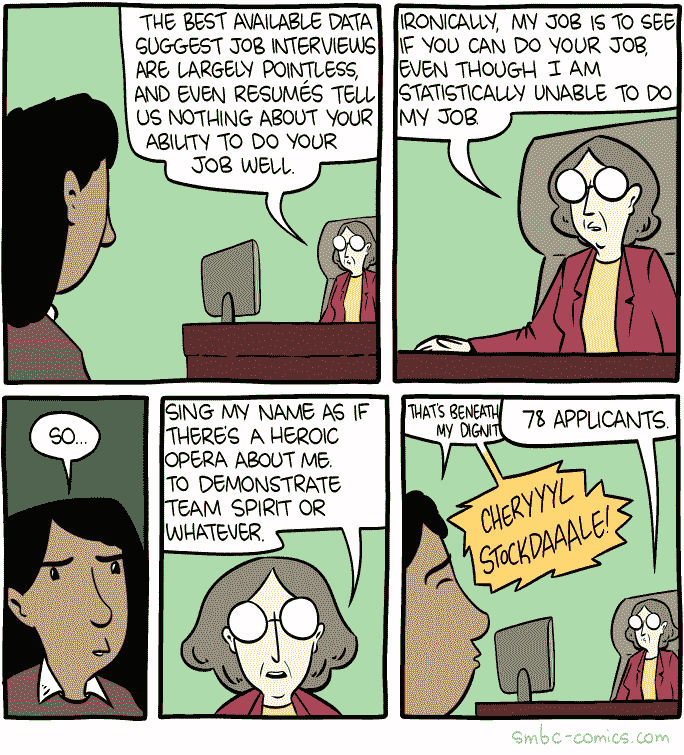
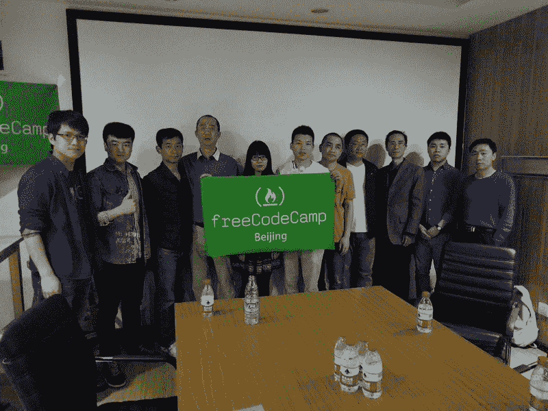

# 以下是本月开始的 515 门免费在线编程课程

> 原文：<https://www.freecodecamp.org/news/here-are-515-free-online-programming-courses-that-start-this-month-50aa7b948bef/>

这里有三个值得你花时间的链接:

1.  以下是本月开始的 515 门免费在线编程课程
2.  我需要一个吉他老师。所以我把我的 Alexa 变成了一个( [5 分钟阅读](http://bit.ly/2oD01hW))
3.  我的开源 Instagram 机器人为我带来了 2500 名真正的粉丝，服务器成本为 5 美元( [12 分钟阅读](http://bit.ly/2oa3y6u))

额外收获:“this”关键字是 JavaScript 最令人困惑的方面之一。在这里，博详细解释了“这个”是如何工作的

### 想到这一天:

> 有时候当我在写 JavaScript 时，我想举起双手说“这简直是胡扯！”！"但我总是记不起“这个”指的是什么。"本·哈尔彭

### 今日趣事:

网络漫画作者[周六早餐麦片](http://bit.ly/2nb33Kg)

### 今日学习小组:

北京自由代码营

编码快乐！

–昆西·拉森，自由代码营的老师

如果你从这封邮件中获得了价值，考虑一下[支持我们的非营利组织](http://bit.ly/donate-to-fcc)。