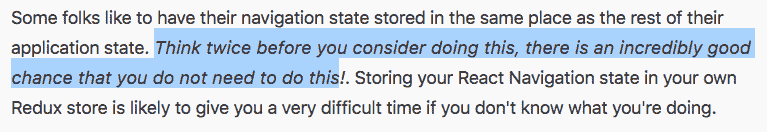

# 以下是我最喜欢的用 React Native 创建生产级应用的技巧

> 原文：<https://www.freecodecamp.org/news/here-are-my-favorite-hacks-for-creating-production-level-apps-with-react-native-6f0369d879b2/>

相信我，当我这么说的时候，反应本土是很难的。这并不是我们通常认为的困难。总的来说，这是很难相处的。在这篇博文中，我将回顾一些技巧和诀窍，并最终总结我为 React Native 中的一个应用程序部署的最佳实践: [codedamn Android](http://play.google.com/store/apps/details?id=com.codedamn) (或 [codedamn iOS](https://itunes.apple.com/us/app/codedamn/id1426709377) )。

嗨！我叫梅胡尔。我是一名学生， [youtuber](https://youtube.com/c/codedamn) ， [fullstack 开发者](https://stackoverflow.com/users/2513722/mehulmpt)，应用开发者，也可以部署服务器。最近，我决定推出一个以开发者为中心的平台(你猜对了，codedamn)。为了让它在移动设备上快速启动，我选择了 React Native。部分原因是我现在不太喜欢 Swift 和 Xcode。但是我一点也不知道，我与本机代码的互动比我想象的要多。无论如何，让我们从我要提到的信息开始。

*注:写这篇文章的时候，React Native 是 v0.57-rc4。检查最近的 React 原生版本中是否已经提供/修复了一些东西！*

### #0:知道自己在做什么

意识到现在的反应原生世界是一个孤独的世界。你可能会让自己陷入一个到目前为止还没有人面对的问题(或者你不能正确地谷歌它)。始终让 VCS 跟上您的本地项目，并定期提交您的更改(所有酷孩子都称之为 CI)。它可以帮助你很快恢复到上一个工作副本，而不会丢失很多代码。

知道自己在做什么同样重要。如果你没有意识到，你可能会彻底破坏你的项目。如果你没有使用 VCS，那么你就有麻烦了。

### #1:升级您的 JSC

JSC (JavaScriptCore)是一个基于 webkit 的 JavaScript 引擎，由 Android 平台上的 React Native 用来评估您的 JavaScript 代码。别告诉我你以为 React Native 会把 JavaScript 转换成本机代码。它没有！；-)

无论你写什么 JS，仍然只有 JSC 在 Android 上以 JavaScript 的形式执行。问题是反应本地船只与一个非常旧版本的 JSC。这意味着你必须广泛使用巴别塔变换。有时，由于老版本的 JSC，有如此讨厌的 bug，以至于每次你坐着写代码的时候都会揪你的头发。

在浪费了一天的调试时间后，我艰难地学会了这一点。在应用程序执行期间出现未知的随机致命错误。在研究了一段时间的日志后，我得出一个结论，这个应用程序在 babel 的 transpiled JS 代码中使用[Symbol.iterator]的地方崩溃了。

现在，符号是一个 ES6 的东西。巴别塔没能飞得更远，而 JSC 太老了，它连这样简单的东西都支撑不住，坠毁了。我浪费了将近一天的时间才发现 JSC 升级是比其他补丁更好的解决方案。

升级您的 JSC 非常简单。按照这个 [github repo](https://github.com/react-community/jsc-android-buildscripts) 操作，您应该很快就可以开始运行了。

### #2:正确设置 Redux

Redux 可能是一个痛苦的正确设置。通过正确设置，我的意思是将其与您的应用程序深度集成。不管是你自己的减速器还是反应导航。从长远来看，用 Redux 设置 react 导航是一个很好的决定，尽管 React 导航页面对此给出了警告:

当然不是。我们在这里谈论的是企业和生产级别的应用程序。继续将您的导航状态存储在 Redux 中，并获得对您的状态的非常精细的控制。

但是请记住，权力越大，责任越大。对你的导航有如此好的控制，确保你设置正确。否则你的应用会随机崩溃。一开始设置它会很痛苦，但是相信我，这是值得的。

在这里阅读 Redux 及其与 [react 导航的集成](https://reactnavigation.org/docs/en/redux-integration.html)。

### #3:使用可用的自动化工具，如 fastlane

浪子是一个很棒的命令行工具，可以自动完成你会遇到的许多常见任务。它更像是时间优化，而不是代码优化。我认为它值得在这里，因为它节省了大量的时间一旦设置正确。

结账快车道在这里:[https://fastlane.tools/](https://fastlane.tools/)

### #4:正确处理错误

不要指望你的用户会问你应用程序是如何崩溃的。对于更复杂的应用程序，很难找到导致应用程序崩溃的具体步骤。我用 sentry.io 在我的应用程序上进行错误处理，我个人非常喜欢它。它可以在您的构建步骤中挂钩，甚至将 sourcemap 上传到他们的服务器，这样您就可以看到实际的代码，而不是崩溃跟踪中的随机垃圾。

在[https://sentry.io/](https://sentry.io/)有岗哨

### #5:以正确的方式进行调试！

你还在用那个花哨的 chrome inspect 控制台调试你的 React 原生应用吗？还有 Redux 怎么样？另一个标签？如果你想清除你的应用程序的异步存储怎么办？强制停止应用并清除数据？似乎太单调乏味了，尤其是当你正在积极开发应用程序的时候。相反，使用 react native 的独立专用调试器。最棒的部分？免费的！

这是你的 React 本地调试器:[https://github.com/jhen0409/react-native-debugger](https://github.com/jhen0409/react-native-debugger)

### 5 个快速提示:

*   保持你的文件结构有条理。扩展您的应用程序非常重要。
*   避免在你的应用中使用 expo。请不要。即使你使用它，你会意识到你必须在某个时候弹出，然后祝你好运解决所有的混乱。这不是不可能的，它会消耗你很多时间。记住，expo 是好的，但我们谈论的是长期业务/创业相关的应用程序，而不是猫时代的应用程序(对于猫时代的应用程序，expo 将是好的)。
*   确保创建一个 package-lock.json 文件(如果使用 npm)。当您不小心删除了 node_modules 文件夹并意识到 npm 上没有任何包关心语义版本时，您将会后悔很久。
*   不要对 React Native 使用非常繁重的 UI 库。即使在生产中，它也会降低性能。到目前为止，我不推荐 [NativeBase](https://nativebase.io/) ,即使它在 UI 方面看起来非常花哨。性能上贵。有更好的选择，如[反应原生纸](https://github.com/callstack/react-native-paper)。
    感谢 [Andre Biel](https://www.freecodecamp.org/news/here-are-my-favorite-hacks-for-creating-production-level-apps-with-react-native-6f0369d879b2/undefined) 的评论，如果你厌倦了缓慢的注册护士应用程序和/或对它们进行评测，请务必仔细阅读这个文档页面。它是一座金矿:[https://Facebook . github . io/react-native/docs/performance . html](https://facebook.github.io/react-native/docs/performance.html)
*   利用 React Native 的即时替换 JS 包，而无需使用 [CodePush](https://microsoft.github.io/code-push/) 等技术将应用重新提交到应用商店。
*   至少熟悉两个平台上的基本本机代码。尤其是 Android 上的 build 文件和 iOS 上的 pod 文件。这些文件是你将花费大量时间在本地的。

我会继续在 React Native 上写博文，作为一个系列的帖子，也许，我们拭目以待吧！

### 有问题吗？

请在下面的评论中提问！我很乐意帮忙。

***快不要脸塞:*** *如果你正在入门 React Native，下面是我 95%的入门课程: **[React Native —第一步](http://bit.ly/rn-basics-medium)***