# 这里有一些超级秘密 VS 代码黑客来提高你的生产力

> 原文：<https://www.freecodecamp.org/news/here-are-some-super-secret-vs-code-hacks-to-boost-your-productivity-20d30197ac76/>

迪伦坚持

# 这里有一些超级秘密 VS 代码黑客来提高你的生产力


作为一名编程爱好者、专业人士，甚至是一个月一次的开发人员，你必须知道，对于任何愿意在工作时投入最大生产时间的人来说，拥有智能和锐利的工具是至关重要的。

我收集了一些提示、技巧和扩展，并对它们进行了过滤，只保留了对现代 web 开发人员来说最罕见和最有用的内容。众所周知，JavaScript 生态系统非常庞大，并且还在不断壮大。为此，我会尽量做到不偏不倚。

下面的 Visual Studio 代码提示将帮助您像这样走出所有的编码会话:

### 让它变得美丽和友好

> 如果它真的看起来很好，很友好，你会喜欢和它一起度过的时光。

#### [1。素材主题](https://marketplace.visualstudio.com/items?itemName=Equinusocio.vsc-material-theme) & [图标](https://marketplace.visualstudio.com/items?itemName=PKief.material-icon-theme)

这就是 VS 代码主题中的野兽。我认为素材主题是编辑器内最接近用笔和纸写作的东西(尤其是使用**无对比变体**主题的时候)。从集成工具到文本编辑器，您的编辑器看起来几乎是扁平无缝的。

想象一个史诗主题加上史诗图标。 [**材质主题图标**](https://marketplace.visualstudio.com/items?itemName=PKief.material-icon-theme) 只是替代默认 VSCode 图标的一个很棒的选择。设计的大图标目录与主题很好地融合在一起，使其更加美观。这将有助于您在资源管理器中轻松找到您的文件。

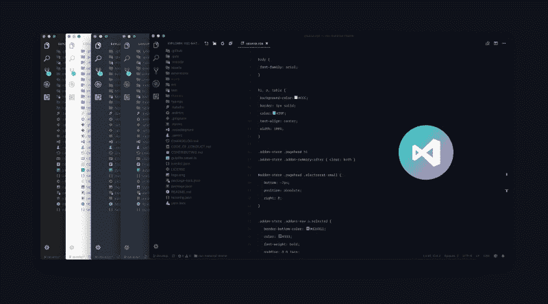

[https://marketplace.visualstudio.com/items?itemName=Equinusocio.vsc-material-theme](https://marketplace.visualstudio.com/items?itemName=Equinusocio.vsc-material-theme)

#### 2.居中布局的禅模式

你可能已经知道 Zen 模式视图，也称为“不受干扰视图”(对于那些来自崇高文本的人来说),在这里所有的东西(除了代码)都被删除，让你与代码编辑器真正亲密接触。您是否知道可以将布局居中以帮助您阅读代码，就像在 PDF 查看器中一样？这将真正帮助你专注于一个功能或研究别人的代码。

**禅模式** : *【查看>外观>切换禅*模式】

**居中布局:** *【查看>外观>切换居中 L* ayout】

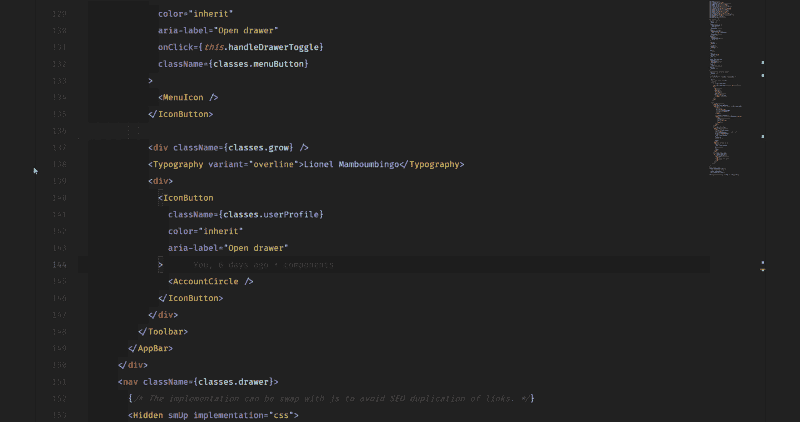

#### **3。带连字的字体**

写作风格让阅读变得简单方便。你可以用漂亮的字体和[连字](https://en.wikipedia.org/wiki/Typographic_ligature)让你的编辑器看起来更好。以下是支持连字的最好字体(根据【www.slant.co】的[的](http://www.slant.co/))的 [6 种](https://www.slant.co/topics/5611/~monospace-programming-fonts-with-ligatures)

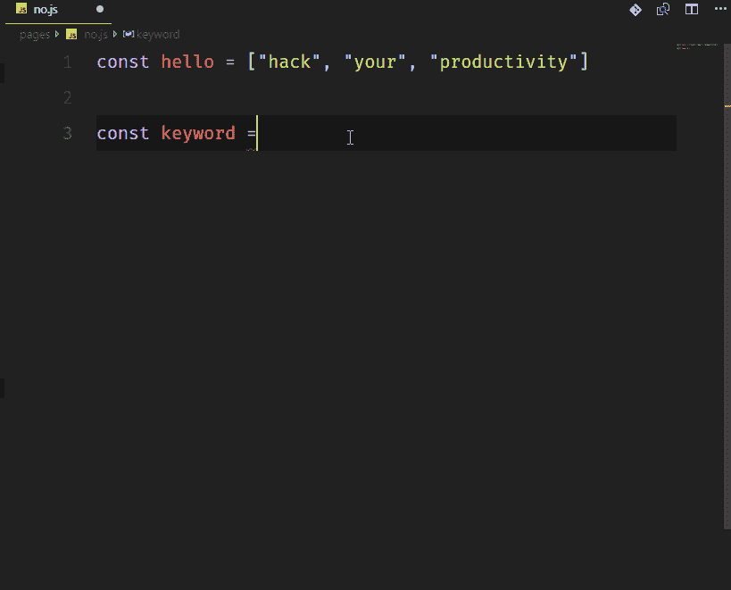

Coding with Ligatures

可以试试 [Fira 代码](https://github.com/tonsky/FiraCode)，简直牛逼开源。这是在安装后如何在 VSCode 中更改字体。

```
"editor.fontFamily": "Fira Code","editor.fontLigatures": true
```

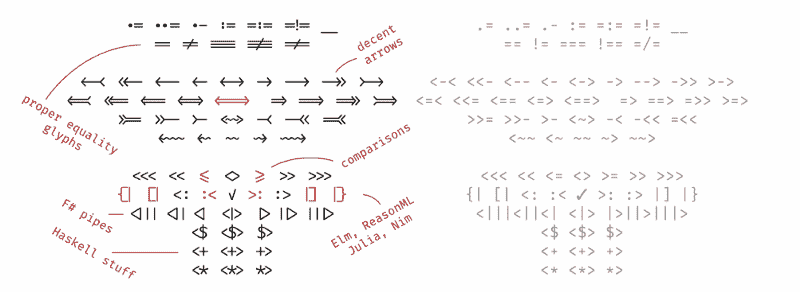

Source: [https://github.com/tonsky/FiraCode/blob/master/showcases/all_ligatures.png](https://github.com/tonsky/FiraCode/blob/master/showcases/all_ligatures.png)

众所周知的字体操作符 Mono 并没有自带对连字的支持。然而，如果你是连字的忠实粉丝，你可以使用[这个库](https://github.com/kiliman/operator-mono-lig)添加它们。

#### 4.[彩虹缩进](https://marketplace.visualstudio.com/items?itemName=oderwat.indent-rainbow)

带样式缩进。这个扩展为文本前面的缩进着色，在每一步交替四种不同的颜色。

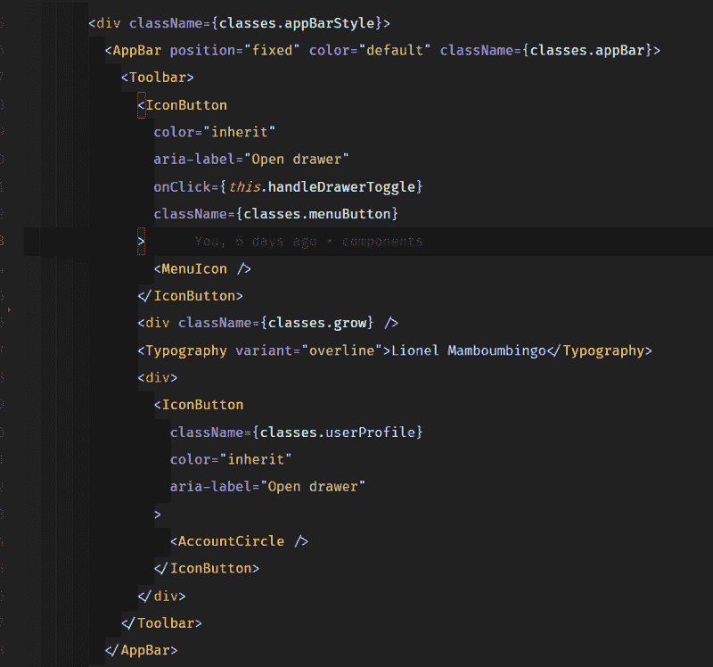

**Rainbow Indent:** [https://marketplace.visualstudio.com/items?itemName=oderwat.indent-rainbow](https://marketplace.visualstudio.com/items?itemName=oderwat.indent-rainbow)

默认缩进设置按照彩虹方案对缩进进行着色。然而，我定制了我自己的，以遵循不同的灰色阴影。如果你希望你的看起来像这个例子，复制并粘贴下面的代码片段到你的`settings.json`

```
"indentRainbow.colors": [
```

```
"rgba(16,16,16,0.1)",
```

```
"rgba(16,16,16,0.2)",
```

```
"rgba(16,16,16,0.3)",
```

```
"rgba(16,16,16,0.4)",
```

```
"rgba(16,16,16,0.5)",
```

```
"rgba(16,16,16,0.6)",
```

```
"rgba(16,16,16,0.7)",
```

```
"rgba(16,16,16,0.8)",
```

```
"rgba(16,16,16,0.9)",
```

```
"rgba(16,16,16,1.0)"
```

```
],
```

#### 5.标题栏自定义

这是一个伟大的视觉调整。我从韦斯·博斯在他的《T2 的反应》【T4 的图表】中抄来的。基本上，他在不同的项目上切换标题栏的颜色，以方便识别，并帮助观众区分它们。如果您使用可能具有相同代码或文件名的应用程序，例如 react-native 移动应用程序和 react web 应用程序，这将非常有用。

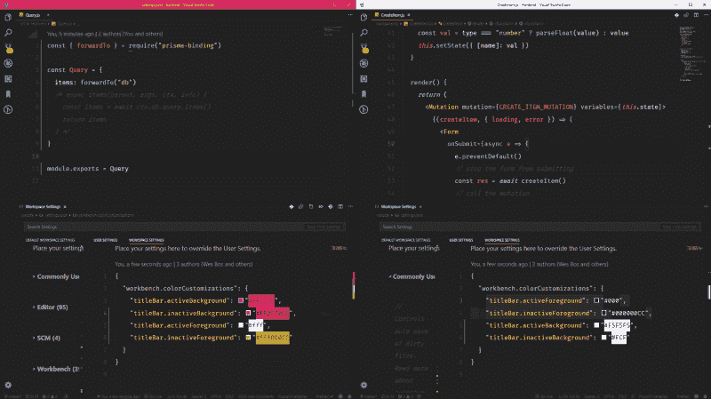

这可以通过在**工作区设置**中编辑标题栏设置来实现，每个项目都需要不同的标题栏颜色。

### 更快的编码

> *及时完成任务的本质*

#### 1.标签包装

如果你不知道[埃米特](https://emmet.io/)，那么你可能是一个喜欢打字的人。Emmet 使您能够键入缩写代码并获得返回的相应标签。这是通过选择一堆代码并键入命令**Wrap with abstract**来完成的，我把这个缩写键绑定到了`shift+alt+.`

下面看。

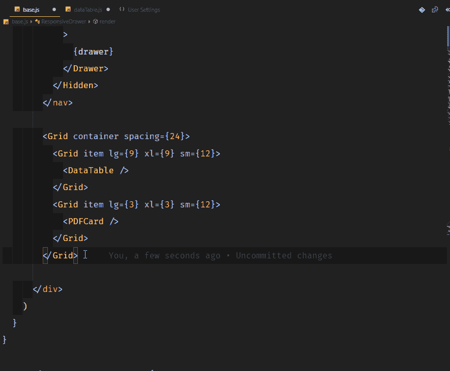

Wrap it up with Emmet

假设你想把所有这些都包装起来，但是作为单独的行。你可以用 ***换行*** 然后在缩写后面插入*例如`div*`

如果你想直接进入埃米特，这就是埃米特备忘单

#### 2.内外平衡

这条建议摘自我真心推荐的 https://vscodecandothat.com/。

您可以使用`balance inward`和`balance outward` Emmet 命令在 VS 代码中选择整个标签。将这些命令绑定到键盘快捷键会很有帮助，比如`Ctrl + Shift + Up Arrow`用于向外平衡，而`Ctrl + Shift + Down Arrow`用于向内平衡。

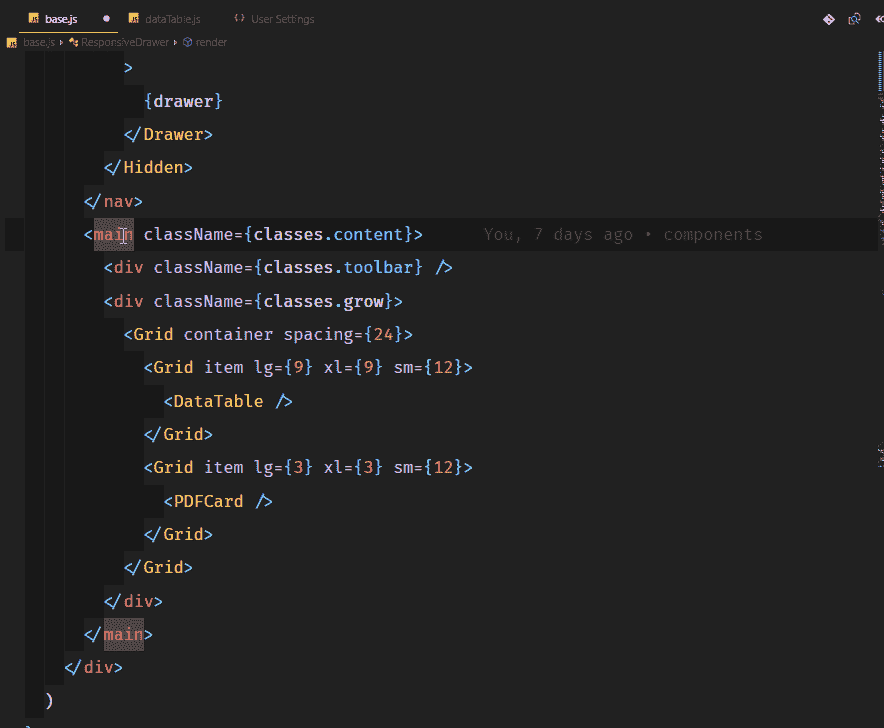

Balance Inwards/Outwards

#### 3. [Turbo Console.log()](https://marketplace.visualstudio.com/items?itemName=ChakrounAnas.turbo-console-log)

没有人喜欢输入像 console.log()这样非常长的语句。这真的很烦人，尤其是当你只想快速输出一些东西，查看它的值，然后继续编码的时候。如果我告诉你你可以像幸运卢克一样快速地登录任何东西呢？

这是通过一个名为[涡轮控制台日志](https://marketplace.visualstudio.com/items?itemName=ChakrounAnas.turbo-console-log)的扩展来完成的。它可以记录下一行中的任何变量，并在代码结构后自动加上前缀。您还可以取消注释/注释由该扩展添加的所有 console.log()。

而且，你也可以用`alt+shift+d`全部删除:

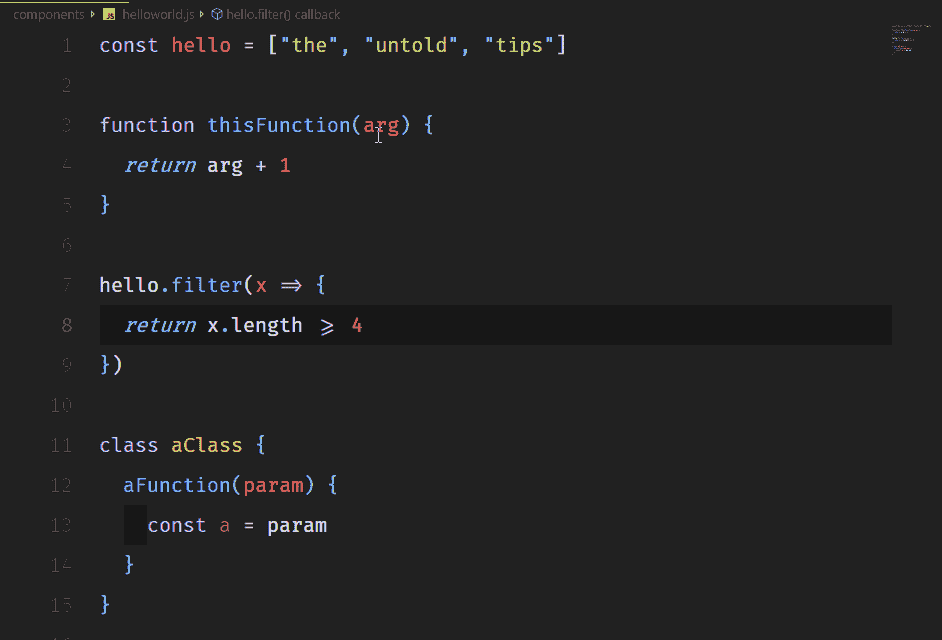

Console logging like Lucky Luke

#### 4.[直播服务器](https://marketplace.visualstudio.com/items?itemName=ritwickdey.LiveServer)

这是一个很棒的扩展，它可以帮助您启动一个本地开发服务器，为静态和动态页面提供实时重载功能。它有很大的支持，如主要功能:HTTPS，CORS，自定义本地主机地址和端口。

[在这里下载](https://marketplace.visualstudio.com/items?itemName=ritwickdey.LiveServer)

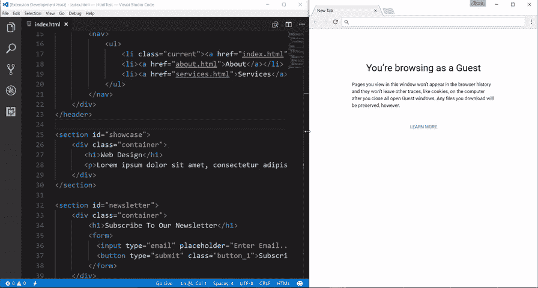

Source ([https://marketplace.visualstudio.com/items?itemName=ritwickdey.LiveServer](https://marketplace.visualstudio.com/items?itemName=ritwickdey.LiveServer))

如果与 [VSCode LiveShare](https://marketplace.visualstudio.com/items?itemName=MS-vsliveshare.vsliveshare) 一起使用，它甚至可以让您共享您的本地主机。

#### 5.使用多个光标复制/粘贴

我在使用 VS 代码时尖叫的第一个*发生在我通过在不同行上添加光标来编辑多行时。很久以后，我发现这个功能很好用。您可以复制和粘贴由这些光标选择的内容，它们将完全按照复制的顺序进行粘贴。*

*看看下面。*

*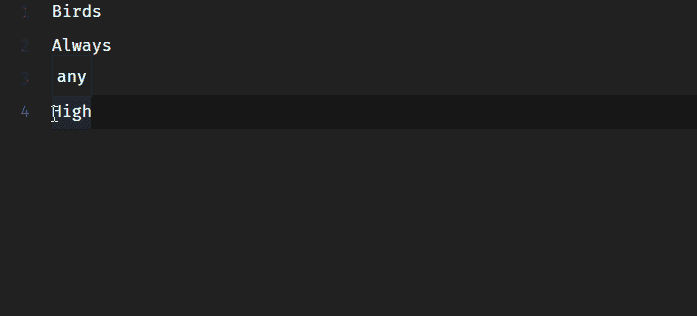

Copy and Paste with different cursors* 

#### *6.面包屑和轮廓*

*面包屑显示当前位置，并允许您在符号和文件之间快速导航。要开始使用面包屑，请使用“查看”>“切换面包屑”命令或通过 t `he breadcrumbs.enab` led 设置启用它。*

*Outline 视图是文件资源管理器树底部的一个独立部分。展开后，它将显示当前活动编辑器的符号树。*

*大纲视图有不同的排序方式，可选的光标跟踪。它还包括一个输入框，可以在您键入时过滤符号。错误和警告也显示在 Outline 视图中，让您一目了然地看到问题的位置。*

*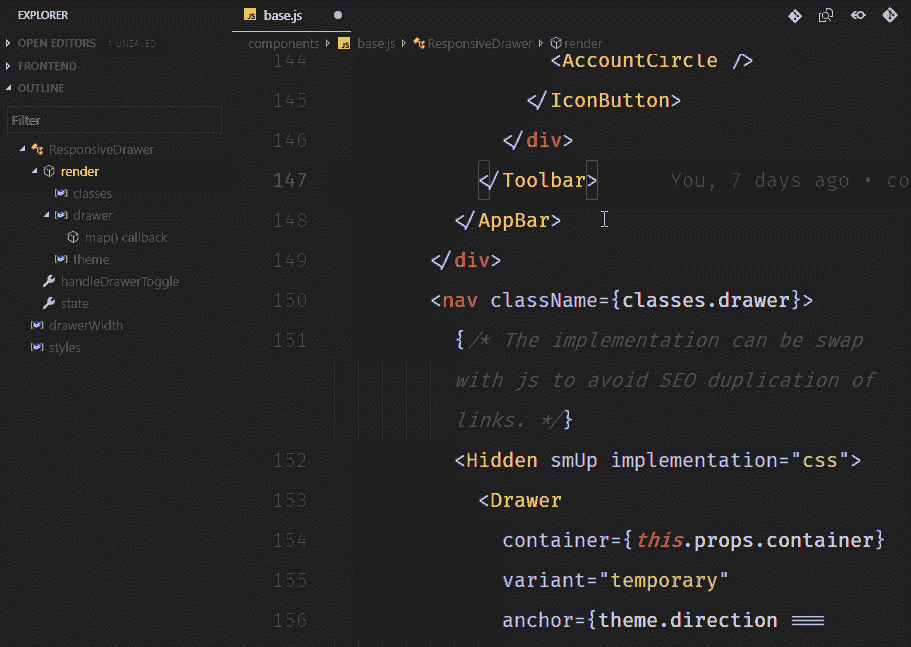

Breadcrumb and Outline Relation* 

### *多方面的*

> **那些改变一切的小调整**

#### *1.代码 CLI*

*VS 代码有一个强大的命令行界面，允许您控制如何启动编辑器。您可以通过命令行选项(开关)打开文件、安装扩展、更改显示语言和输出诊断信息。*

*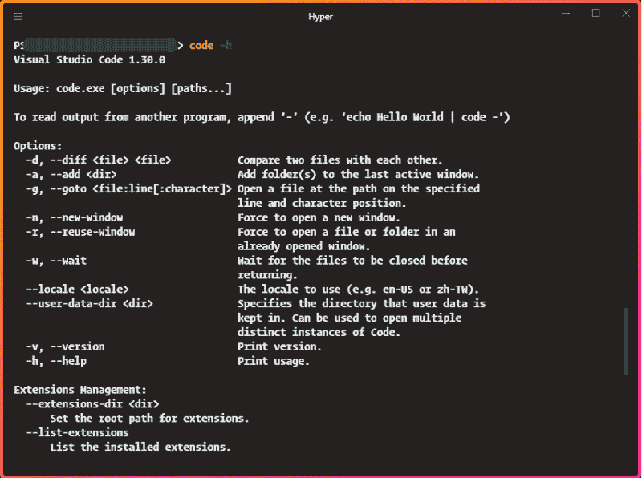*

*想象一下，你刚刚`git clone <repo-u` rl >了一个库，你想替换当前的 VS 代码实例，你不需要离开客户端界面就可以做到。*

#### *2.[波兰语](https://github.com/octref/polacode)*

*你经常会遇到一些吸引人的代码截图，带有自定义字体和主题，如下图所示。这是在带有 [Polacode 扩展](https://github.com/octref/polacode)的 VS 代码中获取的*

*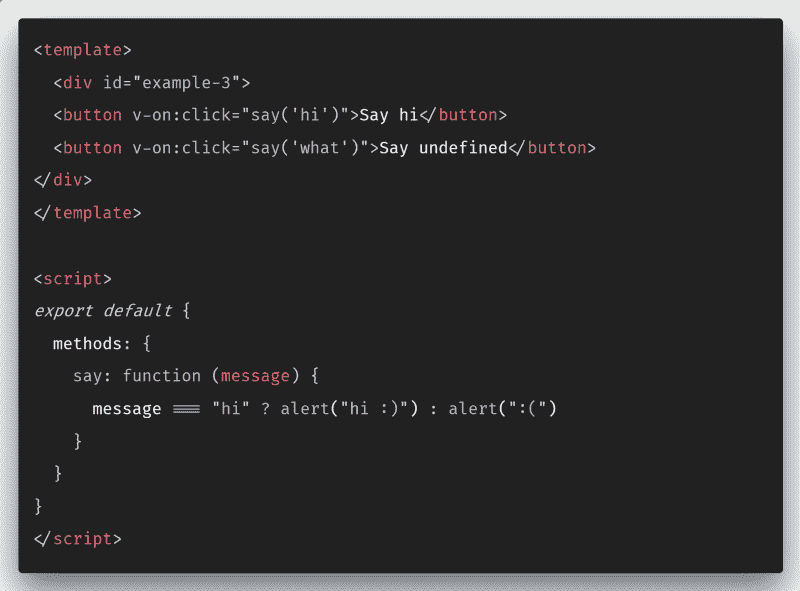*

*我知道 [Carbon](https://carbon.now.sh/) 也是一个很好的、更加可定制的替代品。然而，Polacode 可以让你留在你的代码编辑器中，使用你可能已经购买的在 Carbon 中无法使用的任何专有字体。*

#### *3. [Quokka (JS/TS 草稿栏)](https://quokkajs.com/)*

*Quokka 是 JavaScript 和 TypeScript 的快速原型开发平台。它会在您键入代码时立即运行您的代码，并在代码编辑器中显示各种执行结果和控制台日志。*

*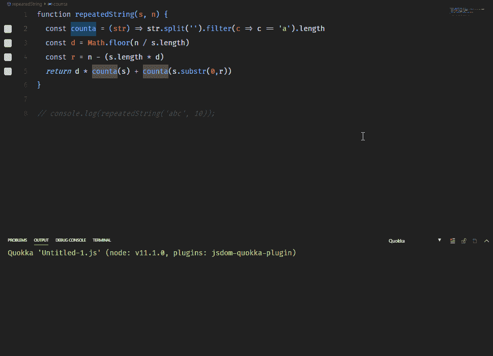*

*Quokka 的一个很棒的用例是，当你在为技术面试而学习时，你能够输出每一步，而没有在调试器中设置断点的压力。*

*它还可以帮助您在实际使用之前研究像 Lodash 或 MomentJS 这样的库函数。它甚至适用于异步调用。*

#### *5\. [WakaTime](https://wakatime.com/)*

*你的朋友认为你花太多时间编码吗？记录下来，告诉他们每天 10 小时并不算多。WakaTime 是一个扩展，帮助记录和存储关于你的编程活动的度量和分析。*

*你可以设定目标，查看你经常使用的编码语言，你甚至可以将自己与世界上的其他忍者进行比较。*

*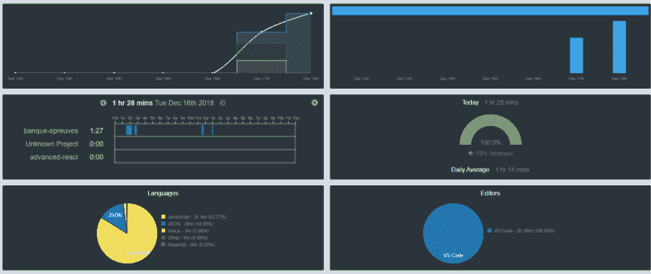**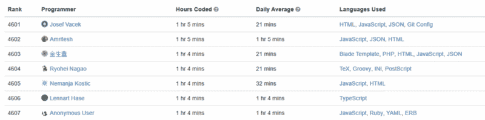

WakaTime Dashboard and Leaderboards* 

#### *6. [VSCode 黑客打字器](https://marketplace.visualstudio.com/items?itemName=jevakallio.vscode-hacker-typer)*

*你曾经在众人面前敲过代码吗？你经常胡乱打字，边打字边说话，这让你有点困惑。想象一下，一个预先输入的代码只有在你模拟打字时才会出现，比如在 [geektyper](http://geektyper.com/tegnio/) 中。*

*[Jani evkallio](https://www.freecodecamp.org/news/here-are-some-super-secret-vs-code-hacks-to-boost-your-productivity-20d30197ac76/undefined)带到 VS 代码[T3 这个扩展](https://marketplace.visualstudio.com/items?itemName=jevakallio.vscode-hacker-typer)。它将帮助您记录和重放宏(在您的编辑器中编写的代码)，使您在向观众打字时 100%地集中注意力。*

#### *7.排除文件夹*

*我在 StackOverFlow 帖子中学到了这个技巧[。这是从浏览器树中排除 node_modules 或任何其他文件夹的一个快速调整，以帮助您只关注重要的内容。对于我来说，我真的很讨厌在我的编辑器中打开繁琐的 node_module 文件夹，所以我决定隐藏它。](https://stackoverflow.com/questions/33258543/how-can-i-exclude-a-directory-from-visual-studio-code-explore-tab/33277809#33277809)*

*例如，要隐藏 node_modules，您可以这样做:*

1.  *进入**文件>首选项> Se** ttings(或 o **n Mac 码>首选项&gt；设置)***
2.  *在设置中搜索`files.exclude`*
3.  *选择添加模式并输入`**/node_modules`*
4.  *瞧啊。node_modules 从浏览器树中消失了*

#### *8.[您的建议]*

*您可以随时在 VSCode 上评论您的一些最秘密的技巧，我很乐意将它们添加到列表中以帮助他人。:)*

*我希望这些技巧真的能提高你使用 VS 代码的效率。如果你喜欢这个帖子，请鼓掌并分享，如果我错过了任何扩展，请评论。*

*[**迪伦·天丘(@DylanTientcheu) |推特**](http://twitter.com/dylantientcheu)
[*迪伦·天丘(@DylanTientcheu)。java 描述语言熱狂者* #开发者&#设计师*技术作家*……*twitter.com](http://twitter.com/dylantientcheu)*