# 这是我们在 2018 年推出的所有免费编码课程

> 原文：<https://www.freecodecamp.org/news/here-are-the-all-the-free-coding-courses-we-launched-in-2018-ae621a74255e/>

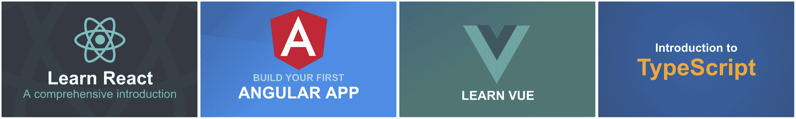

2018 年标志着[Scrimba.com](http://scrimba.com?utm_source=freecodecamp.org&utm_medium=referral&utm_campaign=2018_summary_article)作为课程平台的开始。全年我们总共推出了 16 门免费课程。对我们来说幸运的是，他们似乎在开发社区中引起了共鸣，因为我们现在每月有超过 10 万的访问者访问该网站。

随着一年即将结束，我想给你一个挑战。新的一年是花些时间提高技能的好机会。所以我希望你在 2019 年的前几周学习一项新技术。

我要求你选择下面的课程，并把它作为新年决心，在一月份完成它！

无论您是想学习一个全新的前端框架(例如， [React](https://scrimba.com/g/glearnreact?utm_source=freecodecamp.org&utm_medium=referral&utm_campaign=2018_summary_article) 、 [Vue](https://scrimba.com/g/glearnvue?utm_source=freecodecamp.org&utm_medium=referral&utm_campaign=2018_summary_article) 、 [Angular](https://scrimba.com/g/gyourfirstangularapp?utm_source=freecodecamp.org&utm_medium=referral&utm_campaign=2018_summary_article) )、温习您的 CSS 技能(例如，[变量](https://scrimba.com/g/gcssvariables?utm_source=freecodecamp.org&utm_medium=referral&utm_campaign=2018_summary_article)或 [Flexbox](https://scrimba.com/g/gflexbox?utm_source=freecodecamp.org&utm_medium=referral&utm_campaign=2018_summary_article) )，还是简单地获得一个[神经网络简介](https://scrimba.com/g/gneuralnetworks?utm_source=freecodecamp.org&utm_medium=referral&utm_campaign=2018_summary_article)，我们都能满足您的需求。

如果你真的很认真，也发微博告诉我你打算学哪门课程！

这是你可以选择的:

#### [学习 CSS Flexbox](https://scrimba.com/g/gflexbox?utm_source=freecodecamp.org&utm_medium=referral&utm_campaign=2018_summary_article)

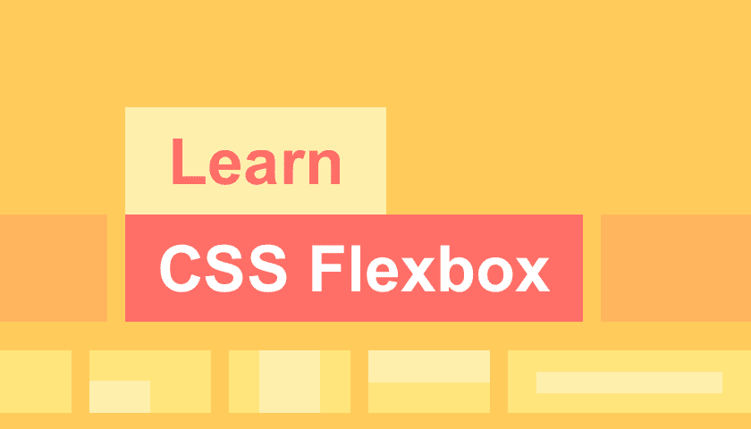

这是我们创建的第二个 Scrimba 课程。第一个是关于 [CSS Grid](https://scrimba.com/g/gR8PTE?utm_source=freecodecamp.org&utm_medium=referral&utm_campaign=2018_summary_article) 的，并取得了巨大的成功，所以我们想在 Flexbox 上跟进一个，因为这两种技术可以很好地互补。在这本书里，我教你关于 Flexbox 你需要知道的最重要的事情。

#### [学习 CSS 变量](https://scrimba.com/g/gcssvariables?utm_source=freecodecamp.org&utm_medium=referral&utm_campaign=2018_summary_article)

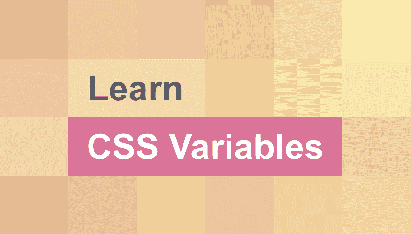

CSS 自定义属性(又名变量)对于前端开发人员来说是一个巨大的胜利。它为 CSS 带来了变量的力量，从而减少了重复，提高了可读性和灵活性。另外，与 CSS 预处理程序中的变量不同，它们实际上是 DOM 的一部分，这有很多好处。

本课程包含八个互动的截屏。都是短小精悍。在大多数游戏的结尾，指导者(你真正的指导者)会直接在截屏窗口中要求你解决一个挑战。这是确保知识牢固的好方法，你可以检查你的解决方案是否与老师(我的)的相匹配。

#### [学习自举 4](https://scrimba.com/g/gbootstrap4?utm_source=freecodecamp.org&utm_medium=referral&utm_campaign=2018_summary_article)

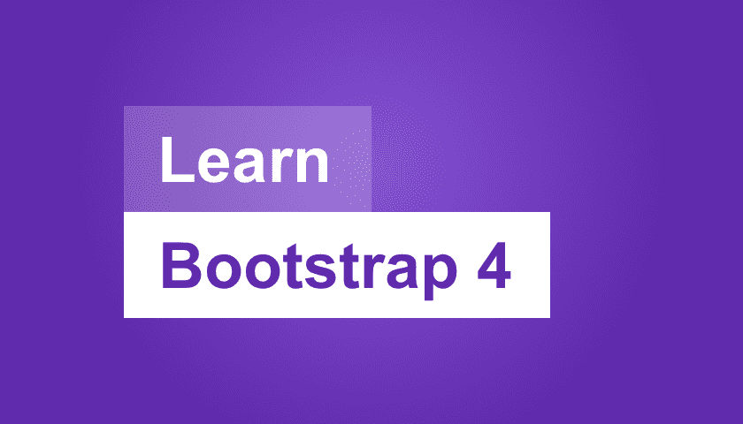

Bootstrap 长期以来一直是 web 上最流行的组件库，版本 4 代表了对该库的重大重写。不仅在引擎盖下有很多变化，而且还有几个新概念需要你去思考。

本课程将带您了解使用 Bootstrap 4 创建成熟网站所需的一切知识。无论您以前是否使用过 Bootstrap，或者对该框架完全陌生，本课程都将帮助您快速了解最新版本。

#### [html 5 简介](https://scrimba.com/g/ghtml?utm_source=freecodecamp.org&utm_medium=referral&utm_campaign=2018_summary_article)

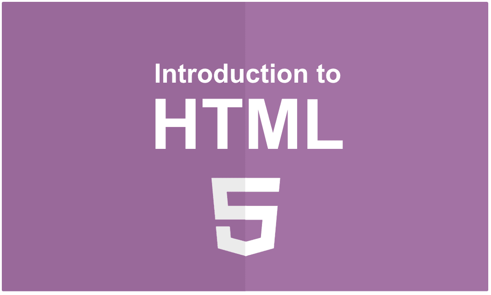

HTML 是网络的核心组成部分之一，因为它保存了你访问的所有网站的内容。因此，HTML 是所有 web 开发人员的必备技能。

虽然 HTML 是一门大学科，但基础知识可以很快学会。本课程旨在让你在不到一个小时的时间内从完全的初学者变成精通 HTML。在整个讲座过程中，你将和杰出的讲师埃里克·提拉多一起从头开始构建一个外观整洁的网站。

#### [学习 D3.js](https://scrimba.com/g/gd3js?utm_source=freecodecamp.org&utm_medium=referral&utm_campaign=2018_summary_article)

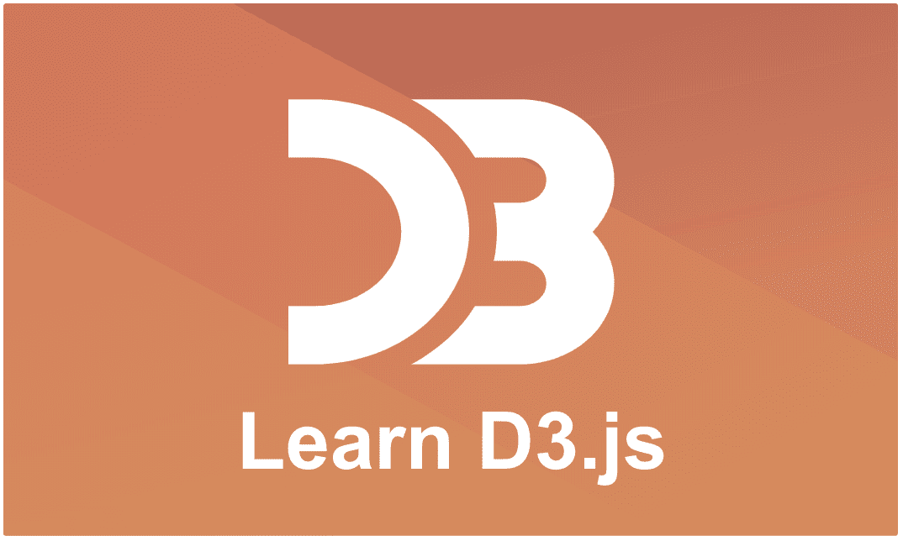

D3.js 是最流行的 web 数据可视化库。它允许你通过强大的 API 方法来理解你的数据。

在整个课程中，您将学习该库最重要的功能，同时构建四种不同的可视化效果。你可以在任何时候随意摆弄代码，这样你就可以确信你会理解它是如何工作的。

#### [如何建立一个漂亮的博客](https://scrimba.com/g/gbuildablog?utm_source=freecodecamp.org&utm_medium=referral&utm_campaign=2018_summary_article)

如果你曾经对学习 HTML 和 CSS 很好奇，但是发现自己在学习过程中很沮丧，那么这个课程就是为你准备的。

在这本书里，我们的导师 Zaydek 将为你提供一系列的步骤和观点，帮助你建立自己的网站而不会迷路。他教你如何从零开始，设计出对你和他人都有意义的东西。

#### [JavaScript 简介](https://scrimba.com/g/gintrotojavascript?utm_source=freecodecamp.org&utm_medium=referral&utm_campaign=2018_summary_article)

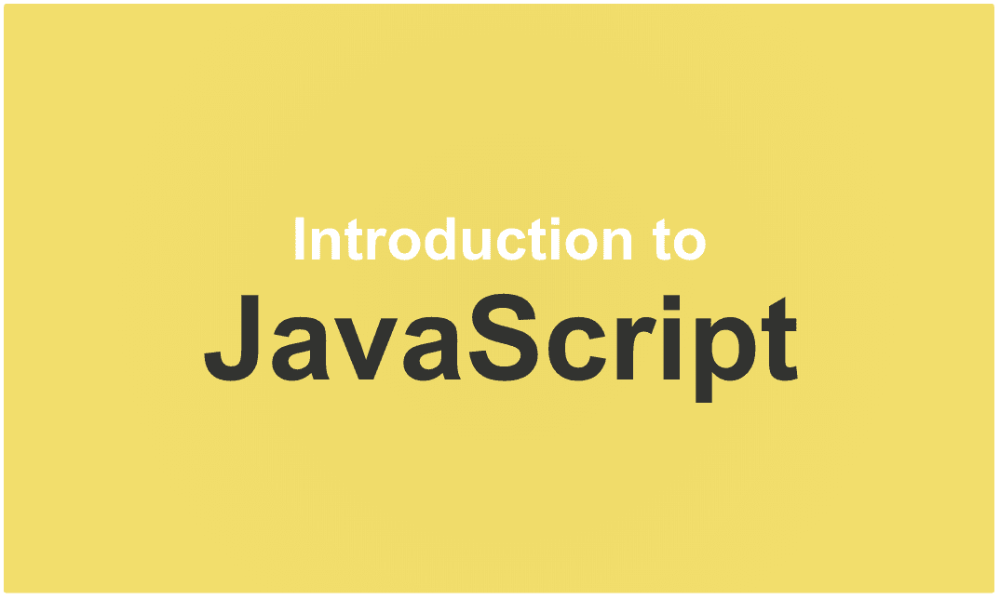

这门课程教你 JavaScript 的基础知识，JavaScript 是网络上最流行的编程语言。JavaScript 可以用来创建网站、游戏、服务器和原生应用！这是一项非常有价值的学习技能，本课程将为你提供起步所需的动力。讲师 Dylan Israel 经营着非常受欢迎的 YouTube 频道，360 编码教程，所以你可以放心，你会得到很好的指导。

该课程包含 14 节课和 7 个挑战。在挑战中，你将被鼓励投入到代码中，并亲自动手。这既有趣又有助于巩固知识。

#### [ES6+](https://scrimba.com/g/gintrotoes6?utm_source=freecodecamp.org&utm_medium=referral&utm_campaign=2018_summary_article)简介

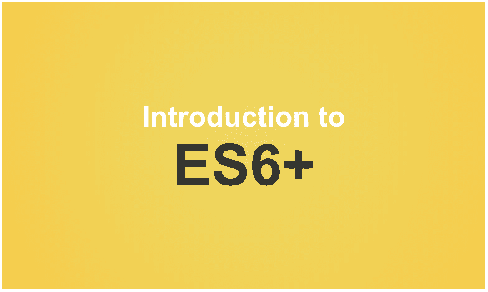

本课程将教你 JavaScript 最现代的特性，也被称为 ES6+。JavaScript 是世界上最流行的编程语言之一。它几乎无处不在:从大规模 web 应用程序到复杂的服务器，再到移动和物联网设备。

和[JavaScript](https://scrimba.com/g/gintrotojavascript?utm_source=freecodecamp.org&utm_medium=referral&utm_campaign=2018_summary_article)入门一样，这门课也是由 YouTube 频道[编码教程 360 的牛逼 Dylan Israel 教授的。](https://www.youtube.com/channel/UC5Wi_NYysX-LfcqT3Hq9Faw)

#### [CSS 简介](https://scrimba.com/g/gintrotocss?utm_source=freecodecamp.org&utm_medium=referral&utm_campaign=2018_summary_article)

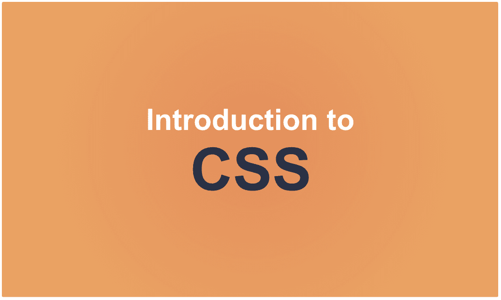

CSS 是让网站看起来漂亮的东西，所以它是任何网页设计师或开发者的必备技能。这门课会在不到一个小时的时间里教会你它的基础知识。因此，请坐下来，享受精彩的 Scrimba 讲师 [Eric Tirado](https://scrimba.com/@iamtirado) 的有趣和迷人的解释吧！在课程快结束时，为了确保你已经理解了这些概念，你还会面临一个挑战。

在注册这门课程之前，你应该对 HTML 的工作原理有基本的了解。如果你没有，我们建议你先学习 Eric 的 HTML 入门课程。

#### [学习布尔玛 CSS](https://scrimba.com/g/gbulma?utm_source=freecodecamp.org&utm_medium=referral&utm_campaign=2018_summary_article)

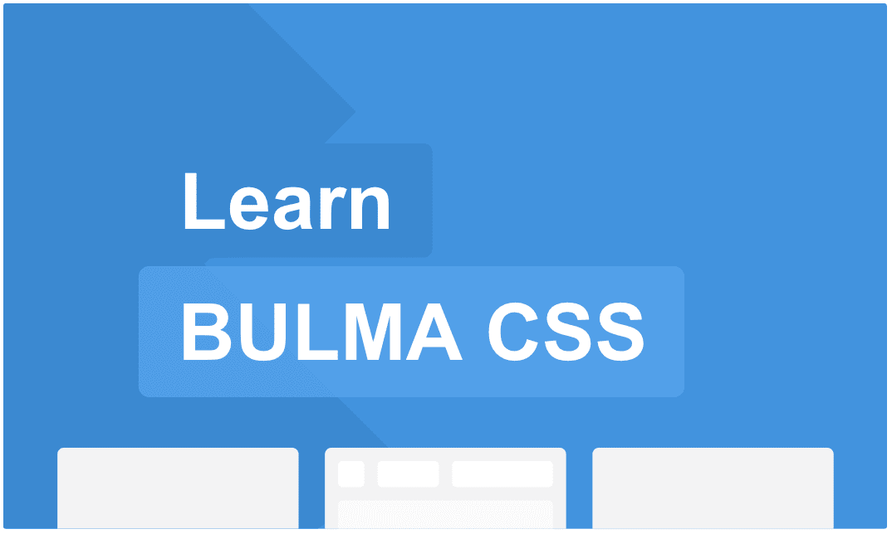

布尔玛是 CSS 大师杰瑞米·托马斯的创意。这是一个基于 Flexbox 的现代 CSS 框架。该框架通过一流的文档和设计良好、直观的组件和修改器，使搭建和设计网站变得轻而易举。✨

布尔玛不仅在构建方面很棒，在学习最佳 HTML 和 CSS 实践方面也很棒！就好像一直有 [@jgthms](https://jgthms.com/) 在那里。

在这个课程中，你将学会用布尔玛在不到一个小时的时间里创建不是一个，不是两个，而是*三个*漂亮、响应迅速的网站。该课程由我们杰出的导师[扎德克](https://twitter.com/username_ZAYDEK/)教授。

#### [用 React 和 Chatkit 构建聊天应用](https://scrimba.com/g/greactchatkit?utm_source=freecodecamp.org&utm_medium=referral&utm_campaign=2018_summary_article)

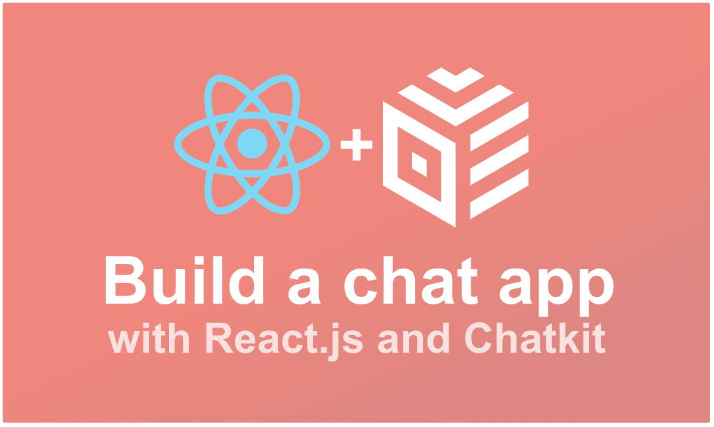

聊天是吃天下的，React 是吃前端开发的，那为什么不通过搭建一个聊天 app 来学习 React 呢？

这正是本课程将帮助您做到的:在课程结束时，您将对 React.js *和*您自己的个性化聊天应用程序有一个坚实的理解。聊天将使用[聊天工具 API](https://pusher.com/chatkit?utm_source=scrimba&utm_medium=email&utm_campaign=course-page) 构建，这意味着你不用担心做任何后端编码。

本课程总共包含 19 个屏幕截图。其中一些包括挑战，鼓励你跳入代码并修改它。你真诚的教导。

#### [打字稿简介](https://scrimba.com/g/gintrototypescript?utm_source=freecodecamp.org&utm_medium=referral&utm_campaign=2018_summary_article)

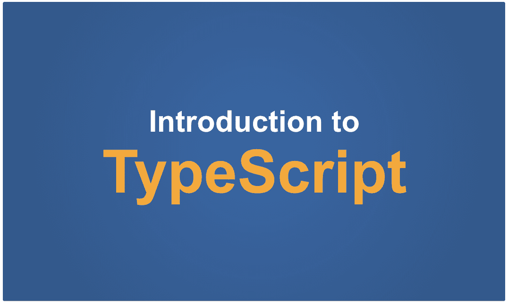

TypeScript 是 JavaScript 的类型化超集，旨在使该语言更具可伸缩性和可靠性。本课程将教你入门 TypeScript 所需要知道的一切。它包含 22 个互动截屏，在其中几个截屏中，你将面临解决互动任务的挑战，因此我们确信你已经理解了这些概念。

在学习本课程之前，对 JavaScript 有一个基本的了解是很重要的。如果你需要复习，请点击这里查看我们的[JavaScript 入门课程。](https://scrimba.com/g/gintrotojavascript?utm_source=freecodecamp.org&utm_medium=referral&utm_campaign=2018_summary_article)

#### [学习 vista . js](https://scrimba.com/g/glearnvue?utm_source=freecodecamp.org&utm_medium=referral&utm_campaign=2018_summary_article)

Vue 是一个更新的、令人耳目一新的框架，与编写普通的 HTML、CSS 和 JavaScript 相比，它至少要简单一个数量级。Vue 将您的数据从 DOM 中解放出来，并提供了一个编程 JavaScript 的惯用指南，使得开发更快更有趣。

这个库非常适合于构建静态网站和动态 web 应用程序，因此学习它是构建现代产品和服务的核心。

本课程涵盖了开始使用 Vue 所需的最低限度的 JavaScript，Vue 的基础知识，以及两个更高级的例子，它们建立在所讨论的思想之上，并侧重于修复现有代码库的某些方面。通过九个互动截屏，它旨在帮助和启发你。

#### [打造你的第一款 Angular 应用](https://scrimba.com/g/gyourfirstangularapp?utm_source=freecodecamp.org&utm_medium=referral&utm_campaign=2018_summary_article)

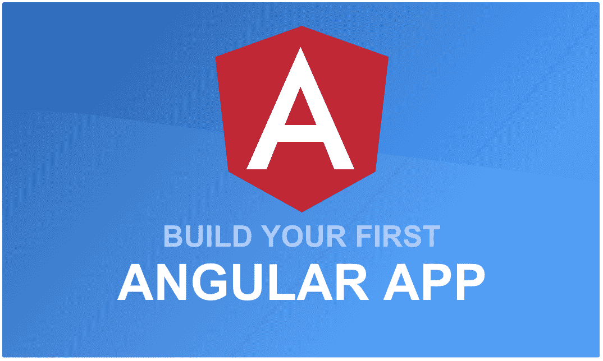

通过学习 Angular，你将大大增加你作为前端开发人员获得工作的机会！所以在本课程中，知名角度专家 Dan Wahlin 将通过构建一个真实世界的应用来教你框架。

这门课程分成几个部分。在**简介**中，您将了解您将要构建的应用程序以及您将要学习的概念。接下来，在我们继续进行**数据绑定**之前，您将了解**组件和模块**。然后，您将了解**服务和 http** ，最后是**路由**。

在整个课程中，您将构建一个显示客户订单的应用程序。Wahlin 精心选择了这个项目，因为它会教你 Angular 背后的所有核心概念。所以准备好 36 个有价值的视频吧。

不用说，我们 Scrimba 非常高兴有 Dan Wahlin 作为我们的老师。

#### [学会反应](https://scrimba.com/g/glearnreact?utm_source=freecodecamp.org&utm_medium=referral&utm_campaign=2018_summary_article)

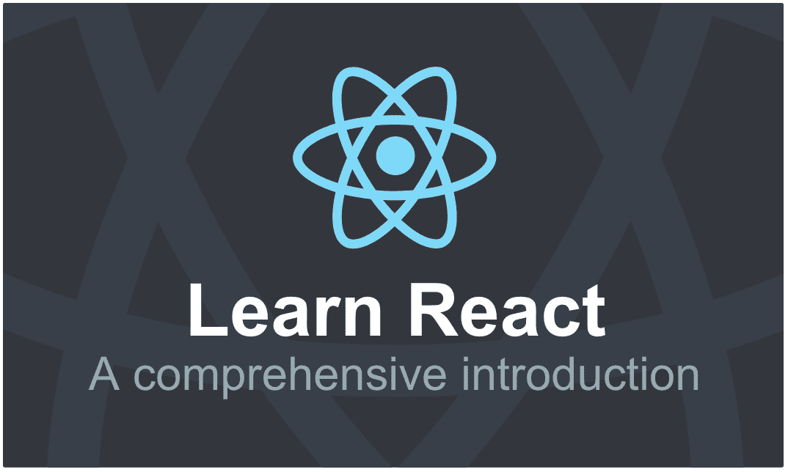

在本课程中，您将学习使用 React 构建动态、交互式 web 应用程序的所有基础知识。React 是由脸书的开发人员创建的一个库，它擅长使用由简单易懂的 API 构建的 web 组件来创建非常快速的 web 应用程序。

完成本课程后，您将了解在 React 中构建 web 应用程序所需的一切。它涵盖了 JSX、道具和状态、条件渲染、样式组件、生命周期方法、从 API 获取数据、处理事件、表单和受控组件、编写现代 React 代码以及在 Scrimba 之外设置环境。

这是我们在 Scrimba 上最长的课程，有 48 个有价值的讲座。因此，参加这个课程实际上是向成为 React 开发人员迈出的一大步。

此外，讲师鲍勃·齐罗尔是 T2 V 学校的教育主管，他非常擅长用简单的方式解释复杂的代码。

#### [JavaScript 中的神经网络](https://scrimba.com/g/gneuralnetworks?utm_source=freecodecamp.org&utm_medium=referral&utm_campaign=2018_summary_article)

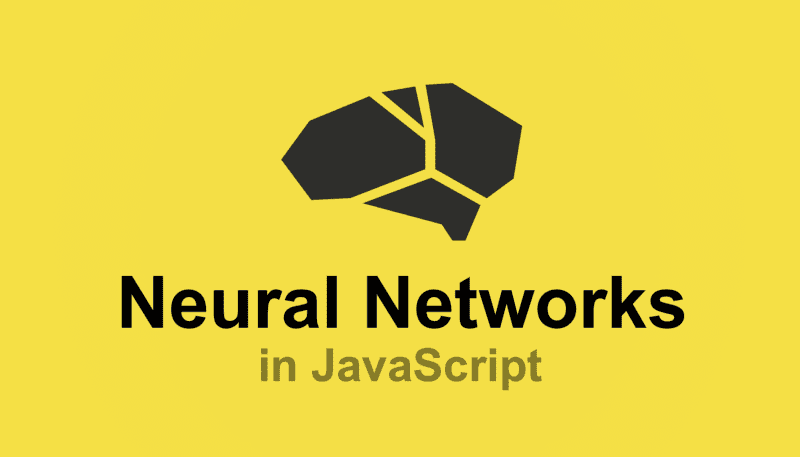

这是 2018 年的最后一门课程，但却是关于机器学习的第一门课程，所以我们非常兴奋地与你分享。

[JavaScript 中的神经网络](https://scrimba.com/g/gneuralnetworks?utm_source=freecodecamp.org&utm_medium=referral&utm_campaign=2018_summary_article)为您提供了对 [Brain.js](https://github.com/BrainJS/brain.js) 的实用介绍，这是一个用于在浏览器和 Node.js 中构建神经网络的流行库。幸运的是，我们有 Brain.js 的主要贡献者 [Robert Plummer 来创建该课程。](https://twitter.com/robertlplummer)

这些讲座没有过多地讨论理论，而是讨论如何对网络进行编码，因为罗伯特热衷于让更多的开发人员使用机器学习来解决问题。他以简单易懂的方式解释复杂的主题，这意味着该课程适合任何懂 JavaScript 的人。

这就是 2018 年！但是不要担心，我们有更多的产品将在 2019 年推出。

* * *

感谢阅读！我的名字叫 Per Borgen，我是最简单的学习编码方法——Scrimba 的联合创始人。如果你想学习建立专业水平的现代网站，你应该看看我们的[响应式网页设计训练营](https://scrimba.com/g/gresponsive?utm_source=freecodecamp.org&utm_medium=referral&utm_campaign=2018_summary_article)。

[Click here to get to the advanced bootcamp.](https://scrimba.com/g/gresponsive?utm_source=freecodecamp.org&utm_medium=referral&utm_campaign=2018_summary_article)