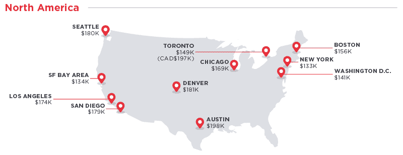

# 以下是 2017 年全球软件工程师的平均薪资

> 原文：<https://www.freecodecamp.org/news/here-are-the-average-salaries-of-software-engineers-around-the-world-in-2017-f121af69f23e/>

以下是根据旧金山生活成本调整后的相同工资:

正如你所看到的，生活成本是一个重要的考虑因素。此外，你不需要搬到旧金山才能找到一份软件工程师的好工作(尽管那里有很多有声望的工作)。

你可以在这里阅读完整的分析( [5 分钟阅读](http://hrd.cm/2kQnac1))

我只写编程和技术。如果你在推特上关注我，我不会浪费你的时间。？