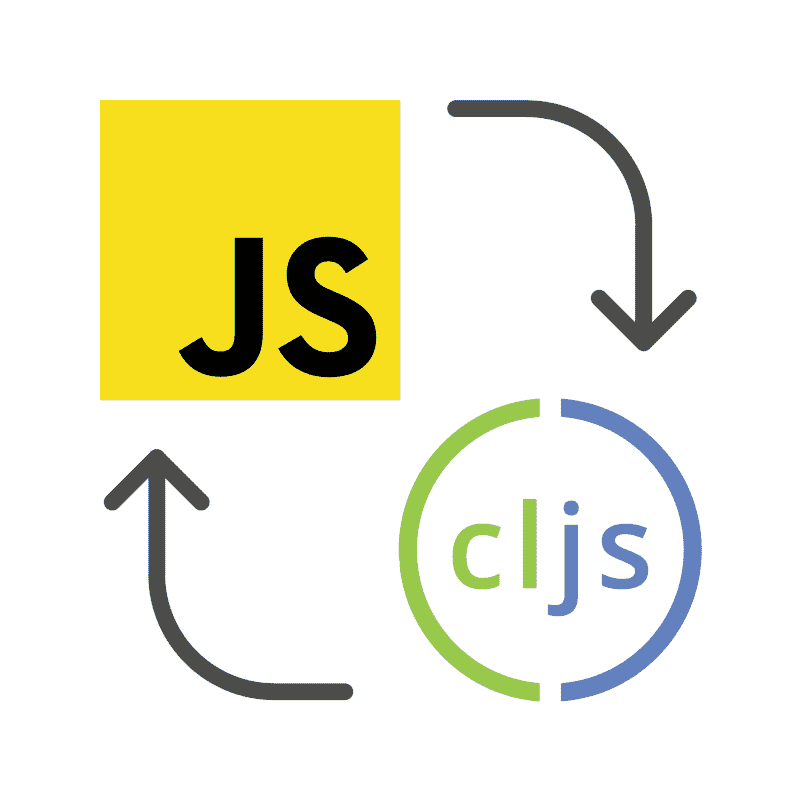
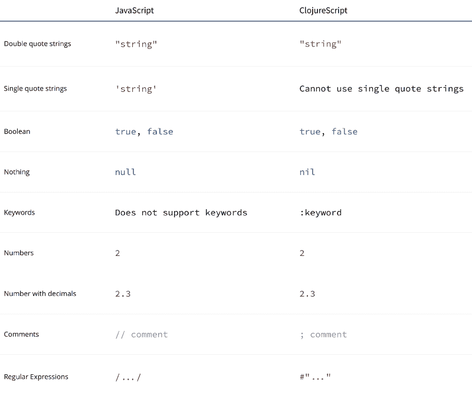
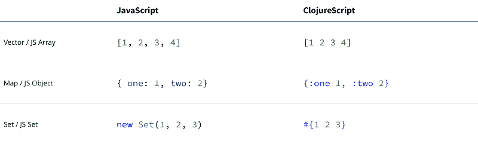
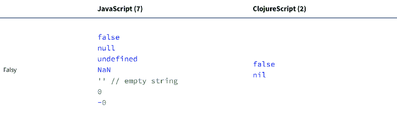
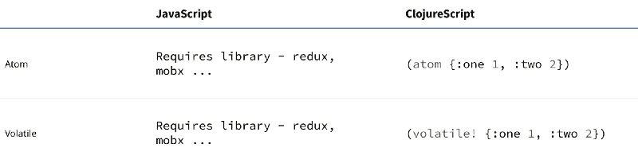
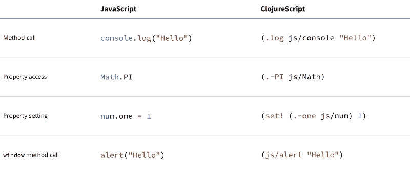

# ClojureScript 和 JavaScript 之间的相似性和差异的可视化概述

> 原文：<https://www.freecodecamp.org/news/here-is-a-quick-overview-of-the-similarities-and-differences-between-clojurescript-and-javascript-c5bd51c5c007/>

作者亚采克·沙

# ClojureScript 和 JavaScript 之间的相似性和差异的可视化概述

如果您想知道 ClojureScript 和 JavaScript 有什么不同或相似之处，那么这篇文章应该有助于回答这个问题。希望能给你几次惊喜。

通过本文底部的 GitHub Gist 可以获得代码示例。

### 基础

### 收集

### 功能

### 流控制

### 真实性

### 状态

### 互操作

下面是这些代码示例:

> [JavaScript 示例](https://gist.github.com/jacekschae/17992f9627f3e247ba46f62fa35fdaec)

> [ClojureScript 示例](https://gist.github.com/jacekschae/ddffcdcd981ecf80dbe66fbef8b54719)

如果你喜欢这篇文章，并且希望在我发布类似的故事时得到通知，可以考虑在 Medium 和 [Twitter](https://twitter.com/jacekschae) 上关注我。

感谢[布莱恩·克拉夫特](https://www.freecodecamp.org/news/here-is-a-quick-overview-of-the-similarities-and-differences-between-clojurescript-and-javascript-c5bd51c5c007/undefined)和[迈克·菲克斯](https://www.freecodecamp.org/news/here-is-a-quick-overview-of-the-similarities-and-differences-between-clojurescript-and-javascript-c5bd51c5c007/undefined)捕捉到“cond”错误，该错误已被纠正。