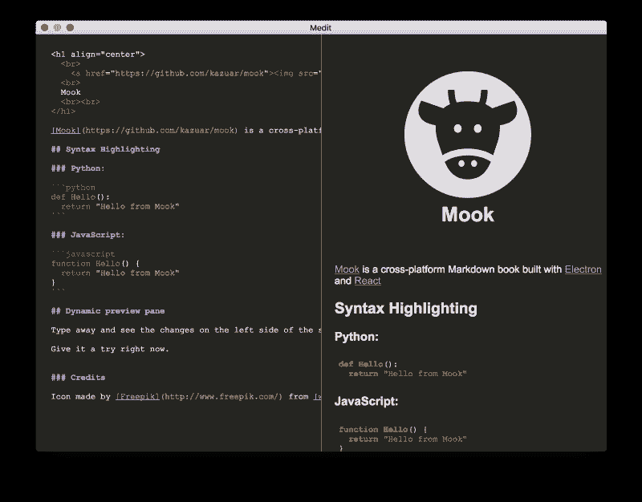
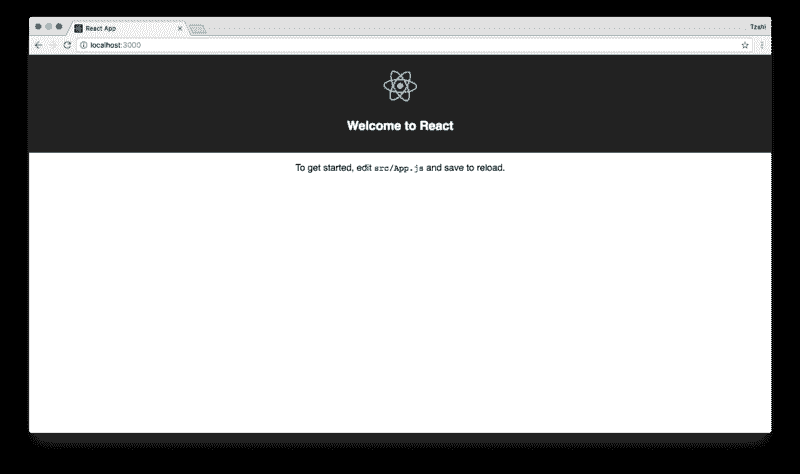
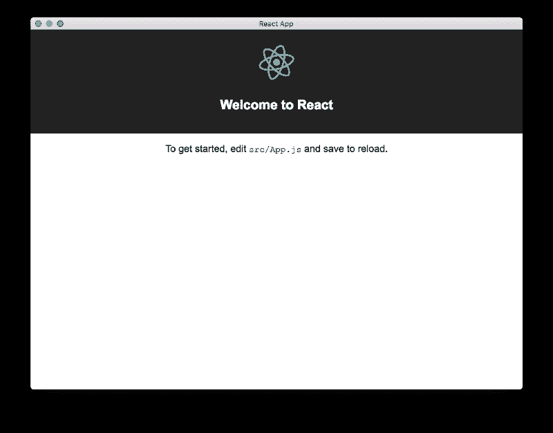
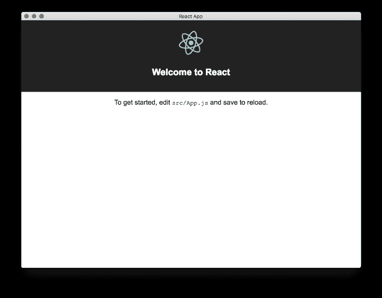
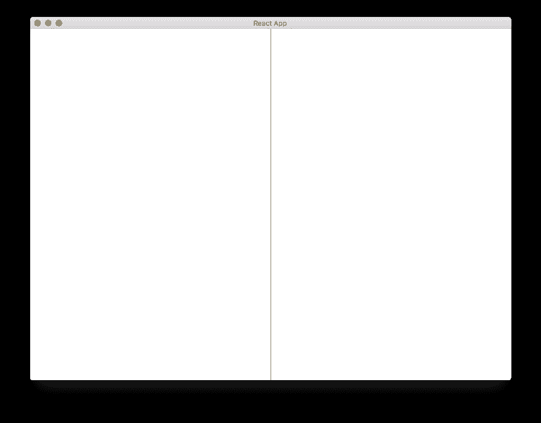
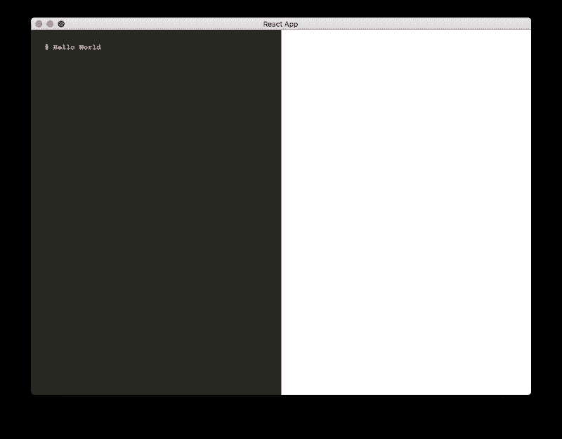
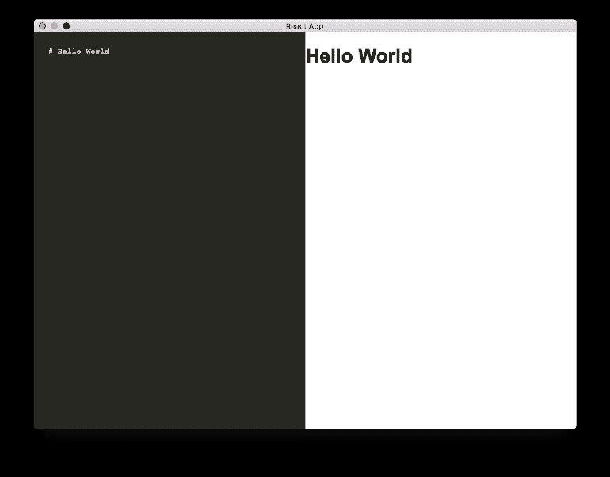
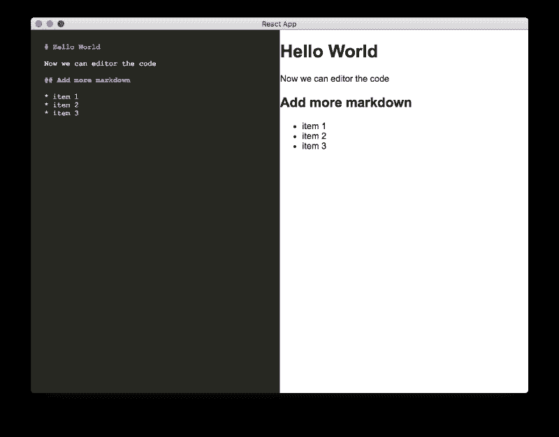

# 下面是我如何用 Electron 和 React 创建一个 markdown 应用程序

> 原文：<https://www.freecodecamp.org/news/heres-how-i-created-a-markdown-app-with-electron-and-react-1e902f8601ca/>

作者:察希·维达斯



# 下面是我如何用 Electron 和 React 创建一个 markdown 应用程序

这篇文章是关于如何使用 [Electron](https://electron.atom.io/) 和 [React 创建一个基本的 markdown 应用程序的分步指南。](https://facebook.github.io/react/)

我将描述为什么，如何，以及我用什么来创建 markdown 应用程序，我称之为 **Mook** 。

Mook 的源代码可以在 [GitHub](https://github.com/kazuar/mook) 上找到。

### 动机

我开始这个项目有几个原因。

最近，我看到了更多令人印象深刻和有趣的事情，你可以用 JavaScript 来做。我也一直想用[电子](https://electron.atom.io/)做点什么。

我一直觉得用 JavaScript 编码很奇怪，因此尽量避免使用。每次我试图用 JavaScript 做一些事情，我总是觉得我只是在键盘上敲敲打打，想让它工作。


然而，我最近发现自己更关注 JavaScript。我突然觉得这是一个很好的工具，可以用来解决我一直在研究的一些问题。

另一方面(见双关语？)，每当我使用一个笔记应用的时候，总觉得少了一个在另一个应用里能找到的功能。但是另一个应用程序没有第三个应用程序可能提供的功能。所以我一直在寻找新的更好的笔记应用。

带着这些想法，我决定在用 electronic 构建 markdown notes 编辑器的同时学习 JavaScript。

### 要求

我对 markdown 应用程序的一些要求如下。注意还有很多，但以下是我最初列出的。

*   编辑器和预览窗格
*   可以动态移动的编辑器和预览窗格之间的分割屏幕
*   支持代码块和代码语言突出显示
*   支持在 GitHub 上保存和同步笔记
*   笔记本和减价笔记的层次结构
*   编辑器支持 LaTeX / math 方程
*   能够使用共享主题对不同的笔记本进行分组
*   能够在 GitHub 和 Dropbox、Google Docs 等平台上共享笔记本。

### 堆栈

我不得不为这个项目做一些决定。例如:

我应该使用[样板文件](https://github.com/chentsulin/electron-react-boilerplate)吗？

我应该用 React、 [AngularJS](https://en.wikipedia.org/wiki/AngularJS) 、 [Riot](http://riotjs.com/) 还是 [Vue](https://vuejs.org/) ？

我会使用什么样的包装？

诸如此类。

最后，我决定避免样板方法(至少现在是这样)。我这样做是因为我想自己构建应用程序的基础，并在这个过程中了解更多。

我尝试用 React 来开发这个应用，因为我从朋友那里听到了很多关于它的信息。这似乎是现在酷孩子使用的东西。


### 为应用程序创建环境

因为我们正在使用 React，所以我们将从创建一个基本的 React 应用程序开始，然后向它添加电子。

我们将使用 [create-react-app](https://github.com/facebookincubator/create-react-app) 开始我们的项目。

#### 准备环境

使用基本配置创建 React 应用程序的一个简单方法是使用 **create-react-app** 。

首先，确保您的计算机上有最新的节点和 npm 版本。要进行检查，请运行以下命令:

```
node -v
npm -v
yarn — version
```

当我写这篇文章时，我的机器上有以下版本:

```
node = v8.4.0
npm = 5.3.0
yarn = 1.0.1
```

#### 使用创建-反应-应用程序创建反应应用程序

要将 **create-react-app** 作为全局包安装，请键入以下命令:

```
npm install -g create-react-app
```

创建新的 React 应用程序并在其中添加`cd`:

```
create-react-app mook
cd mook
```

这就是我们的项目现在的样子。我已经从视图中排除了`**node_modules**`文件夹，这样你可以清楚地看到这个项目。

```
tree -I “node_modules”
.
├── README.md
├── package.json
├── public
│ ├── favicon.ico
│ ├── index.html
│ └── manifest.json
├── src
│ ├── App.css
│ ├── App.js
│ ├── App.test.js
│ ├── index.css
│ ├── index.js
│ ├── logo.svg
│ └── registerServiceWorker.js
└── yarn.lock

2 directories, 13 files
```

现在我们有了一个基本的 React 应用程序，为了看看它是什么样子，让我们运行在`**package.json**`文件中定义的`start`脚本:

```
yarn run start
```

这将打开一个新的浏览器窗口，显示以下页面:



#### 安装电子设备

Electron 允许我们构建一个能够跨平台运行的应用程序。

要安装电子组件:

```
yarn add electron — dev
```

打开`**package.json**`文件。

如果一切正常，你应该可以在文件的`**devDependencies**` 部分看到电子包。

用以下更改更新`**package.json**`文件:

*   将下面一行添加到脚本部分:

```
“electron-start”: “electron .”
```

*   添加一个顶级的`**main**`属性并指向主电子文件(这个文件还不存在，但是我们很快就会创建它):

```
“main”: “public/main.js”
```

`**package.json**`文件现在看起来像这样:

```
{
  “name”: “mook”,
  “version”: “0.1.0”,
  “main”: “public/main.js”,
  “private”: true,
  “dependencies”: {
    “react”: “¹⁵.6.1”,
    “react-dom”: “¹⁵.6.1”,
    “react-scripts”: “1.0.13”
  },
  “scripts”: {
    “start”: “react-scripts start”,
    “build”: “react-scripts build”,
    “test”: “react-scripts test — env=jsdom”,
    “eject”: “react-scripts eject”,
    “electron-start”: “electron .”
  },
  “devDependencies”: {
    “electron”: “¹.7.6”
  }
}
```

接下来，我们将添加一些 [Electron 的事件](https://github.com/electron/electron/blob/master/docs/api/app.md)来控制应用程序的生命周期。我们将实施以下活动:

*   [**就绪**](https://github.com/electron/electron/blob/master/docs/api/app.md#event-ready) **:** 电子完成初始化后运行。在代码中，这将运行`**createWindow**` **，**创建一个带有 React 的本地 URL`**http://localhost:3000**`的浏览器窗口，并将`close`上的【关于】面板和`**mainWindow**`设置为`null`。
*   [**激活**](https://github.com/electron/electron/blob/master/docs/api/app.md#event-activate-macos):在应用程序被激活时运行。我们想调用`**createWindow**`函数来创建一个新窗口。
*   [**【窗全关】**](https://github.com/electron/electron/blob/master/docs/api/app.md#event-window-all-closed) **:** 当所有的窗都已关闭时发出。这将关闭所有平台上的应用程序，但 Mac 除外，它只会关闭窗口，但会明确要求用户退出程序。

将以下代码添加到`**public/main.js**`:

```
const electron = require(‘electron’);
const app = electron.app;
const BrowserWindow = electron.BrowserWindow;

let mainWindow;

function createWindow() {
  mainWindow = new BrowserWindow({width: 900, height: 680});
  mainWindow.loadURL(‘http://localhost:3000');

  app.setAboutPanelOptions({
    applicationName: “Mook”,
    applicationVersion: “0.0.1”,
  })

  mainWindow.on(‘closed’, () => mainWindow = null);
}

app.on(‘ready’, createWindow);

app.on(‘window-all-closed’, () => {
  if (process.platform !== ‘darwin’) {
    app.quit();
  }
});

app.on(‘activate’, () => {
  if (mainWindow === null) {
    createWindow();
  }
});
```

确保 React 仍在后台运行。如果没有，请使用以下命令再次运行它:

```
yarn run start
```

在项目文件夹中打开一个新的命令行窗口，并运行以下命令:

```
yarn run electron-start
```

运行该命令后，将打开以下窗口:



如果 React 没有在后台运行，电子应用程序将打开一个空白的白色窗口。

#### 创建稳定的开发和构建流程

现在我们已经有了一个使用 Electron 和 React 的项目工作模板，我们需要确保我们有一个稳定的开发和发布版本。

到目前为止，我们已经创建了很好的开发，但最终我们希望为 OS X、Windows 和 Linux 创建应用程序的发行版本。

我也不喜欢我们必须在两个不同的命令行外壳中分别运行 React 服务器和电子应用程序。

在对这个话题做了一些研究后，我发现了下面这个帖子， [@thekitze](http://twitter.com/thekitze) 的《[从 React 到一个准备生产的电子 app](https://medium.com/@kitze/%EF%B8%8F-from-react-to-an-electron-app-ready-for-production-a0468ecb1da3)》，这个帖子对我帮助很大。

我们需要将以下包添加到我们的项目中:

*   [electron-builder](https://www.electron.build/) —一个完整的解决方案，用于打包和构建一个现成的面向 MacOS、Windows 和 Linux 的分发电子应用程序，支持开箱即用的“自动更新”。我们将使用这个包来构建我们的应用程序进行分发。
*   [并发](https://github.com/kimmobrunfeldt/concurrently) —并发运行命令。我们将使用这个包在一个命令中同时运行 React 和 Electron。
*   [wait-on](https://github.com/jeffbski/wait-on) —命令行实用程序和 Node.js API，它将等待文件、端口、套接字和 http(s)资源变得可用。在启动电子应用程序之前，我们将使用这个包来等待 React 服务器开始运行。

运行以下命令将这些包添加到我们的应用程序中:

```
yarn add electron-builder wait-on concurrently — dev
```

由于这些包只在开发时需要，我们将把标志`— dev` 添加到`yarn add` 命令中。这也会自动将包添加到`**package.json**`的`**devDependencies**`部分。

#### 创建开发脚本

我们希望创建一个开发脚本，以便在构建应用程序时使用。这将有助于我们测试我们在应用程序中开发的新功能，还可以调试并确保我们在编辑代码时不会破坏任何东西。

我们将在`**package.json**`文件的`**scripts**`部分添加一个新脚本:

```
“electron-dev”: “concurrently \”BROWSER=none yarn start\” \”wait-on http://localhost:3000 && electron .\””
```

这一行发生了很多事情，我们来分解一下:


1.  "**并发"** — 同时运行以下命令。
2.  " **BROWSER=none yarn start"** —启动 react 应用程序并设置" **BROWSER=none"** 。这意味着浏览器不会自动打开 React 应用程序。
3.  "**wait-on http://localhost:3000&&electron "***——等待开发服务器启动。一旦启动，它将启动电子应用程序。*

*现在，如果您从命令行运行以下代码，您将只能获得一个带有 React 徽标的电子应用程序窗口。*

```
*`yarn run electron-dev`*
```

**

#### *创建构建脚本*

*创建构建脚本稍微容易一些。*

*我们需要在`**package.json**`文件的`**scripts**`部分添加几个脚本:*

*   *下面是在构建电子应用程序之前构建 React 应用程序的脚本:*

```
*`“preelectron-pack”: “yarn build”`*
```

*   *以下是打包电子应用程序的脚本。这个脚本使用**电子构建器**构建应用程序包。*

```
*`“electron-pack”: “build — em.main=build/electron.js”`*
```

*接下来，我们必须指定`**build**`属性。这是因为**创造-反应-应用**和**电子制造商**之间的小冲突。两者都将`**build**`文件夹用于不同的目的。*

*为了解决这个冲突，我们需要为构建步骤手动配置**电子构建器的**正确文件夹。将以下`**build**`部分添加到`**package.json**`文件中:*

```
*`“build”: {
  “appId”: “com.mook”,
  “files”: [
    “build/**/*”,
    “node_modules/**/*”
  ],
  “directories”: {
    “buildResources”: “assets”
  }
}`*
```

*我们还需要添加`**homepage**`属性，以允许打包的电子应用程序找到 JavaScript 和 CSS 文件:*

```
*`“homepage”: “./”`*
```

*此时，您的`**package.json**`文件应该如下所示:*

```
*`{
  “name”: “mook”,
  “version”: “0.1.0”,
  “main”: “public/main.js”,
  “homepage”: “./”,
  “private”: true,
  “scripts”: {
    “start”: “react-scripts start”,
    “build”: “react-scripts build”,
    “test”: “react-scripts test — env=jsdom”,
    “eject”: “react-scripts eject”,
    “electron-start”: “electron .”,
    “electron-dev”: “concurrently \”BROWSER=none yarn start\” \”wait-on http://localhost:3000 && electron .\””,
    “electron-pack”: “build — em.main=build/main.js”,
    “preelectron-pack”: “yarn build”
  },
  “dependencies”: {
    “react”: “¹⁵.6.1”,
    “react-dom”: “¹⁵.6.1”,
    “react-scripts”: “1.0.13”,
    “electron-is-dev”: “⁰.3.0”
  },
  “devDependencies”: {
    “concurrently”: “³.5.0”,
    “electron”: “¹.7.6”,
    “electron-builder”: “¹⁹.27.7”,
    “wait-on”: “².0.2”
  },
  “build”: {
    “appId”: “com.mook”,
    “files”: [
      “build/**/*”,
      “node_modules/**/*”
    ],
    “directories”: {
      “buildResources”: “assets”
    }
  }
}`*
```

*最后一步是更新`**public/main.js**`。到目前为止，我们只支持该应用程序的开发版本。在生产中我们将不能使用`**localhost:3000**`，取而代之的是我们将从`**build**`文件夹中提供`**index.html**`文件。*

*首先，我们需要安装 [electron-is-dev](https://github.com/sindresorhus/electron-is-dev) ，这将帮助我们确定 electron 是否在开发中运行。*

*要安装**电子开发**包:*

```
*`yarn add electron-is-dev`*
```

*更新`**public/main.js**`以使用[电子开发:](https://github.com/sindresorhus/electron-is-dev)*

*   *要将包添加到代码中:*

```
*`const isDev = require(‘electron-is-dev’);
const path = require(‘path’);`*
```

*   *要更改`**createWindow**`功能中的`**mainWindow.loadURL**`功能:*

```
*`mainWindow.loadURL(isDev ? ‘http://localhost:3000' : `file://${path.join(__dirname, ‘../build/index.html’)}`);`*
```

*这段代码检查我们是否处于开发模式，如果是，它将使用`**localhost:3000**`。否则就要服`**/build/index.html**` **。***

*您的`**public/main.js**`文件现在应该是这样的:*

```
*`const electron = require(‘electron’);
const app = electron.app;
const BrowserWindow = electron.BrowserWindow;
const isDev = require(‘electron-is-dev’);
const path = require(‘path’);

let mainWindow;

function createWindow() {
  mainWindow = new BrowserWindow({width: 900, height: 680});
  mainWindow.loadURL(isDev ? ‘http://localhost:3000' : `file://${path.join(__dirname, ‘../build/index.html’)}`);

  app.setAboutPanelOptions({
    applicationName: “Mook”,
    applicationVersion: “0.0.1”,
  })

  mainWindow.on(‘closed’, () => mainWindow = null);
}

app.on(‘ready’, createWindow);

app.on(‘window-all-closed’, () => {
  if (process.platform !== ‘darwin’) {
    app.quit();
  }
});

app.on(‘activate’, () => {
  if (mainWindow === null) {
    createWindow();
  }
});`*
```

*现在，让我们尝试使用以下命令运行构建脚本:*

```
*`yarn run electron-pack`*
```

*当脚本运行完成时，您应该会在项目目录中看到一个名为`**dist**`的新文件夹。您可以在以您的操作系统命名的文件夹中找到打包的应用程序。例如，Mac 用户将能够在`**dist/mac**`文件夹中找到打包的应用程序`**mook.app**`。*

*当您运行该文件时，您应该看到与调试版本相同屏幕:*

**

*太好了，我们刚刚完成了应用程序的基础架构构建。*

**

### *添加主要功能*

*现在，我们可以开始向 markdown 应用程序添加构建模块了。*

#### *创建拆分窗格屏幕*

*让我们首先将拆分窗格组件 [react-split-pane](https://github.com/tomkp/react-split-pane) 添加到应用程序中。*

*要安装**反应分格**组件:*

```
*`yarn add react-split-pane`*
```

*将以下 JavaScript 代码添加到`**src/App.js**`文件中:*

*   *导入`**react-split-pane**`:*

```
*`import SplitPane from ‘react-split-pane’;`*
```

*   *用下面的代码替换 render 函数。这段代码将`**SplitPane**`元素添加到具有两个 div 的渲染函数中，一个用于编辑器，一个用于预览窗格:*

```
*`render() {
  return (
    <div className=”App”>
      <SplitPane split=”vertical” defaultSize=”50%”>
        <div className=”editor-pane”>
        </div>
        <div className=”view-pane”>
        </div>
      </SplitPane>
    </div>
  );
}`*
```

*我们还需要添加一些 CSS。*

*将以下代码添加到`**src/App.css**`:*

```
*`.Resizer {
  background: #000;
  opacity: 0.4;
  z-index: 1;
  -moz-box-sizing: border-box;
  -webkit-box-sizing: border-box;
  box-sizing: border-box;
  -moz-background-clip: padding;
  -webkit-background-clip: padding;
  background-clip: padding-box;
}
.Resizer:hover {
  -webkit-transition: all 2s ease;
  transition: all 2s ease;
}
.Resizer.horizontal {
  height: 11px;
  margin: -5px 0;
  border-top: 5px solid rgba(255, 255, 255, 0);
  border-bottom: 5px solid rgba(255, 255, 255, 0);
  cursor: row-resize;
  width: 100%;
}
.Resizer.horizontal:hover {
  border-top: 5px solid rgba(0, 0, 0, 0.5);
  border-bottom: 5px solid rgba(0, 0, 0, 0.5);
}
.Resizer.vertical {
  width: 11px;
  margin: 0 -5px;
  border-left: 5px solid rgba(255, 255, 255, 0);
  border-right: 5px solid rgba(255, 255, 255, 0);
  cursor: col-resize;
}
.Resizer.vertical:hover {
  border-left: 5px solid rgba(0, 0, 0, 0.5);
  border-right: 5px solid rgba(0, 0, 0, 0.5);
}
.Resizer.disabled {
  cursor: not-allowed;
}
.Resizer.disabled:hover {
  border-color: transparent;
}`* 
```

*如果您刷新应用程序或使用命令`**yarn run electron-dev**`、运行它，您应该会看到以下屏幕，它目前只是一个分为两个窗格的空白页面:*

**

*您可以尝试使用分隔条，看看它如何调整不同窗格的大小。*

### *创建编辑器和预览窗格*

*现在我们有了分割屏幕，我们需要为编辑器和预览窗格添加功能。*

*我们希望像通常在 markdown 编辑器中那样设置窗格，编辑器窗格在左边，预览窗格在右边。我们将在编辑器窗格中写下我们的 markdown，并且每次我们在编辑器窗格中更改某些内容时，预览窗格都会更新。*

#### *创建编辑器窗格*

*让我们从编辑器窗格开始。*

*我们将使用 [CodeMirror](https://codemirror.net/) ，这是一个 JavaScript 文本编辑器。*

*安装代码镜像[的 React 包 React-CodeMirror](https://github.com/JedWatson/react-codemirror) 。因为 **React-CodeMirror** 中的[代码镜像值不随状态变化](https://github.com/JedWatson/react-codemirror/issues/106)更新，我们将安装`[**@skidding/react-codemirror**](http://twitter.com/skidding/react-codemirror)`，解决了这个问题:*

```
*`yarn add @skidding/react-codemirror`*
```

*创建一个名为`**src/editor.js**`的新文件，用一个名为`Editor`的新类扩展 React 的组件类:*

```
*`import React, { Component } from ‘react’;

class Editor extends Component {
}

export default Editor;`*
```

*这个类将基本上包装 **react-codemirror** 包，它是 codemirror 的 react 组件。*

*接下来，我们将导入`**@skidding/react-codemirror**`和一些我们想要用于 CodeMirror 组件、语法高亮和 markdown 模式的 CSS 文件。*

*我们还将添加一个返回 CodeMirror 元素的`render`函数，并将一个`**constructor**`添加到`**Editor**`类中。这个**构造函数**允许我们用主文件中的值初始化 CodeMirror。*

*我们将把`CodeMirror`组件设置为`**markdown**`模式，主题设置为`**monokai**`:*

```
*`import React, { Component } from ‘react’;
import CodeMirror from ‘@skidding/react-codemirror’;

require(‘codemirror/lib/codemirror.css’);
require(‘codemirror/mode/javascript/javascript’);
require(‘codemirror/mode/python/python’);
require(‘codemirror/mode/xml/xml’);
require(‘codemirror/mode/markdown/markdown’);
require(‘codemirror/theme/monokai.css’);

class Editor extends Component {
  constructor(props) {
    super(props);
  }

  render() {
    var options = {
      mode: ‘markdown’,
      theme: ‘monokai’,
    }
    return (
      <CodeMirror value={this.props.value} 
 options={options} height=”100%”/>
    );
  }
}

export default Editor;`*
```

*在`**src/App.js**`文件中，我们将导入`**editor.js**`(添加到文件的开头):*

```
*`import Editor from ‘./editor.js’;`*
```

*在`**App**` 类中，让我们为我们的编辑器添加一个带有初始值的构造函数:*

```
*`constructor(props) {
  super();

  this.state = {
    markdownSrc: “# Hello World”,
  }
}`*
```

*在`**App**`类的`**render**`函数中，添加`**Editor**`组件，并将值设置为`**markdownSrc**`:*

```
*`render() {
  return (
    <div className=”App”>
      <SplitPane split=”vertical” defaultSize=”50%”>
        <div className=”editor-pane”>
          <Editor className=”editor” value={this.state.markdownSrc}/>
        </div>
        <div className=”view-pane”>
        </div>
      </SplitPane>
    </div>
  );
}`*
```

*`**src/App.js**`文件应该是这样的:*

```
*`import React, { Component } from ‘react’;
import logo from ‘./logo.svg’;
import SplitPane from ‘react-split-pane’;
import Editor from ‘./editor.js’;

import ‘./App.css’;

class App extends Component {
  constructor(props) {
    super();

    this.state = {
      markdownSrc: “# Hello World”,
    }
  }

  render() {
    return (
      <div className=”App”>
        <SplitPane split=”vertical” defaultSize=”50%”>
          <div className=”editor-pane”>
            <Editor className=”editor” value={this.state.markdownSrc}/>
          </div>
          <div className=”view-pane”>
          </div>
        </SplitPane>
      </div>
    );
  }
}

export default App;`*
```

*使用以下更改更新 CSS 文件`**src/App.css**`:*

1.  *在`***.*App**` 部分(在文件的顶部)，删除 `text-align: center*;*`,使文本不居中对齐。*
2.  *添加以下 CSS 代码，以便它将编辑器拉伸到最大高度，并在文本右侧添加少量填充:*

```
*`.editor-pane {
  height: 100%;
}

.CodeMirror {
  height: 100%;
  padding-top: 20px;
  padding-left: 20px;
}

.ReactCodeMirror {
  height: 100%;
}`*
```

*刷新应用程序或使用命令`**yarn run electron-dev**`运行它，您应该会看到以下屏幕:*

**

#### *创建预览窗格*

*我们希望右窗格是左窗格上的编辑器的实时预览。*

*为此，我们将使用 [React-Markdown](https://github.com/rexxars/react-markdown) 包:*

```
*`yarn add react-markdown`*
```

*在`**src\App.js**`文件中，添加以下导入:*

```
*`import ReactMarkdown from ‘react-markdown’;`*
```

*在`view-pane` div 中添加`**ReactMarkdown**`组件:*

```
*`<div className=”view-pane”>
  <ReactMarkdown className=”result” source={this.state.markdownSrc} />
</div>`*
```

*设置`**ReactMarkdown**`组件的源，使其与编辑器中的源`**this.state.markdownSrc**`相同。*

*现在，您可以运行 yarn 应用程序并查看预览窗格:*

```
*`yarn run electron-dev`*
```

**

*我们可以在预览窗格中看到文本。然而，如果我们在编辑器(左)窗格中输入一些东西，它不会转移到预览(右)窗格。*

*我们要做的是通过`**App**`类将编辑器中的每一个更改传递给预览。*

*将`onMarkdownChange`函数添加到`**src\App.js**`将使用编辑器中更新的文本更新`**markdownSrc**`。该函数将在编辑器中发生的每次更改时运行。*

*将以下代码添加到`**src\App.js**`:*

```
*`constructor(props) {
  super();

  this.state = {
    markdownSrc: “# Hello World”
  }

  this.onMarkdownChange = this.onMarkdownChange.bind(this);
}

onMarkdownChange(md) {
  this.setState({
    markdownSrc: md
  });
}`*
```

*在`render`函数中，将以下内容添加到`Editor`元素中:*

```
*`<Editor className=”editor” value={this.state.markdownSrc} onChange={this.onMarkdownChange}/>`*
```

*在`**src/editor.js**`文件中，将 **CodeMirror** 的`onChange`函数绑定到父节点的`onChange`:*

```
*`constructor(props) {
  super(props);

  this.updateCode = this.updateCode.bind(this);
}

updateCode(e) {
  this.props.onChange(e);
}`*
```

*在`**render**`函数中，将以下内容添加到`**CodeMirror**`元素中:*

```
*`<CodeMirror
  value={this.props.value}
  onChange={this.updateCode}
  options={options}
  height=”100%”
/>`*
```

*`**src/App.js**`文件应该是这样的:*

```
*`import React, { Component } from ‘react’;
import logo from ‘./logo.svg’;
import SplitPane from ‘react-split-pane’;
import Editor from ‘./editor.js’;
import ReactMarkdown from ‘react-markdown’;

import ‘./App.css’;

class App extends Component {
  constructor(props) {
    super();

    this.state = {
      markdownSrc: “# Hello World”
    }

    this.onMarkdownChange = this.onMarkdownChange.bind(this);
  }

  onMarkdownChange(md) {
    this.setState({
      markdownSrc: md
    });
  }

  render() {
    return (
      <div className=”App”>
        <SplitPane split=”vertical” defaultSize=”50%”>
          <div className=”editor-pane”>
            <Editor className=”editor” value={this.state.markdownSrc} onChange={this.onMarkdownChange}/>
          </div>
          <div className=”view-pane”>
            <ReactMarkdown className=”result” source={this.state.markdownSrc} />
          </div>
        </SplitPane>
      </div>
    );
  }
}

export default App;`*
```

*`**src/editor.js**`文件现在看起来像这样:*

```
*`import React, { Component } from ‘react’;
import CodeMirror from ‘@skidding/react-codemirror’;

require(‘codemirror/lib/codemirror.css’);
require(‘codemirror/mode/javascript/javascript’);
require(‘codemirror/mode/python/python’);
require(‘codemirror/mode/xml/xml’);
require(‘codemirror/mode/markdown/markdown’);
require(‘codemirror/theme/monokai.css’);

class Editor extends Component {
  constructor(props) {
    super(props);

    this.updateCode = this.updateCode.bind(this);
  }

  updateCode(e) {
    this.props.onChange(e);
  }

  render() {
    var options = {
      mode: ‘markdown’,
      theme: ‘monokai’,
    }
    return (
      <CodeMirror value={this.props.value} onChange={this.updateCode} options={options} height=”100%”/>
    );
  }
}

export default Editor;`*
```

*当您重新加载应用程序时，您应该能够用文本更新左侧的编辑器，并在右侧的预览窗格中看到更改。*

**

*完整的源代码可以在 [GitHub](https://github.com/kazuar/mook) 上找到。*

### *下一步是什么？*

*在这里，我们仍有许多事情需要完成:*

1.  *保存和打开文件*
2.  *编辑时自动保存*
3.  *窗格布局的工具栏/控件*
4.  *GitHub、Dropbox 等上的备份笔记。*
5.  *支持将笔记分组保存或统一保存在一个“笔记本”中*
6.  *支持 M [edium](https://medium.com/@kazuarous/1e902f8601ca) 中的数学方程*
7.  *更多令人惊叹的功能！*

*我想这就是我们下次要做的…*

**

*在 Twitter 上关注我，了解关于进展、即将推出的功能或任何其他原因的更新。*

### *贡献*

*你可以用任何你想用的方式做出贡献。感谢任何帮助。不要犹豫，分享你的建议或意见。*

*此外，如果你想看到你认为重要的功能，请在下面的评论中提问，或者在 [GitHub](https://github.com/kazuar/mook) 上发表一个问题。*