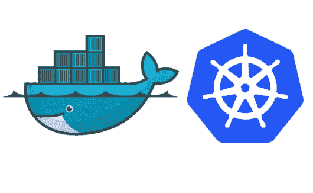

# 以下是如何让您的云基础架构稳定、安全且可扩展。

> 原文：<https://www.freecodecamp.org/news/heres-how-to-make-your-cloud-infrastructure-stable-secure-and-scalable-f9f4749697d6/>

### 启动 DevOps 很难

作为一家创业公司，需要担心的事情很多。营销，产品开发，保持团队团结。一切都倾向于采取“最小可行”的模式，让最低限度的，所以你不会崩溃和烧伤。

作为一名企业云架构师，我直接知道在 DevOps 领域可以做多少工作。作为一名初创公司的创始人，我也知道你必须花在事情上的时间有多少——这更像是你必须一次花在所有事情上的时间。

不幸的是，云基础设施也倾向于遵循这一规则，该领域的所有“最佳实践”都倾向于遵循需要大量时间投资的模式，而创业公司肯定不具备这一点。

通过本指南，我希望向您概述“最低可行的云基础设施”可能是什么样子，重点关注稳定性、安全性和可扩展性。

### 稳定性？

当考虑云基础架构的稳定性时，在开发最低可行的云基础架构时，有几个关键点需要关注。从灾难性故障中恢复、自动重启，并确保有足够的资源可用。如果你关注这三件事，就正常运行时间而言，你应该处于一个相当好的位置。

#### 从灾难性故障中恢复(自动备份)

您知道最糟糕的情况——您用砖砌成了您的服务器和磁盘。对此，最可行的解决方案是进行计划的自动备份，以防止数据丢失。

根据您的云提供商，您可以选择几个不同的选项。拍摄磁盘快照通常是执行最小可行备份过程的最简单方法，但是更高级(也更稳定)的方法包括特定于数据库的备份(转储数据库)和分布式系统。

*   **AWS**
    如果你用的是亚马逊，我会推荐用 CloudWatch。它可以让你创建预定的任务(例如自动快照)——[参见本指南](http://docs.aws.amazon.com/AmazonCloudWatch/latest/events/TakeScheduledSnapshot.html)
*   **GCP**
*   **云不可知**
    不想将您的备份过程锁定在您的云提供商身上？您最重要的数据将是数据库和任何可能提供的上传。对于数据库，您应该编写一个脚本，定期转储数据库并将数据发送到一个安全的位置(私有 s3 存储桶、分布式文件系统等)。)然而，这比特定于平台的方法更容易出错，所以要小心。

### ？**？**马**克确定要测试你的备份恢复方法还是冒险 wh [在 GitLab，](https://about.gitlab.com/2017/02/01/gitlab-dot-com-database-incident/) w** 这里他们的 5 种备份方法都失败了，因为他们从来没有测试过恢复。？？

#### 服务器重启时自动重启服务

自动重启有两个部分。第一，当你的应用崩溃时，它会再次启动吗？第二，当你的服务器重启时，你的应用会自动启动吗？

Crontab —Crontab 是一个有用的工具，可以让你轻松地安排工作。也许自动启动堆栈的最简单的方法是创建一个在重启时运行的 crontab 作业— [参见本指南了解如何操作](https://www.cyberciti.biz/faq/linux-execute-cron-job-after-system-reboot/)。

**/etc/init.d** —大多数系统都支持 init.d 脚本。使用 init.d，您可以定义脚本，这些脚本可以在引导时启动，并且还支持**停止、启动和状态**命令(例如`service start myscript`)，以便您对应用程序进行更多的控制。它比 crontab 稍微复杂一点，但是它给了你更多的特性——[参见这篇文章来设置一个 init.d 脚本](https://unix.stackexchange.com/questions/20357/how-can-i-make-a-script-in-etc-init-d-start-at-boot)。

如果你对这些方法之间的区别感兴趣，可以看看这个栈交换帖子。

#### 应用程序崩溃时自动重启服务

应用程序并不总是稳定的，在不方便的时候很容易崩溃。保持稳定性的一个好方法是拥有一个可以自动重启的工具。

*   NodeJS — [永远](https://github.com/foreverjs/forever)还是 [PM2](https://github.com/Unitech/pm2)
*   常规— [查看这篇关于如何使用 bash 脚本重启进程的文章](https://stackoverflow.com/questions/696839/how-do-i-write-a-bash-script-to-restart-a-process-if-it-dies)

#### 始终确保有足够的资源可用

服务器停机最常见的原因之一是服务器资源耗尽。我遇到过 SQL 服务器因磁盘空间不足而死亡，生产应用程序因内存不足而死亡的情况。设置资源监控是降低这种风险的好方法。

*   **AWS** — [CloudWatch](https://aws.amazon.com/cloudwatch/) 是一个很好的监控工具。您可以设置特定事件的电子邮件提醒。
*   **GCP**—[stack driver monitoring](https://cloud.google.com/monitoring/)提供了类似的功能，也与 Slack 等消息系统集成。
*   **云不可知** — Crontab 对于这种任务来说还是不错的，但是你需要编写一个脚本来检查系统资源，并在它们达到你的阈值时发送电子邮件。

### ？？确保记录您的自动启动方法和引导脚本。将代码放在版本控制中，否则在扩展时，由于您忘记了神秘的代码，您将面临麻烦。？？

### 保安？

不幸的是，当谈到 MVP 理念时，安全性被忽略了。人们只是看不到所需时间投资的价值。这是一种危险的赌博，因为安全漏洞可能导致数据、客户信任和时间的严重损失。这里是一些基本的事情，你可以做，以开始一个安全的心态。

#### 加密套接字协议层

如今，SSL 基本上是现代 SaaS 应用程序的一项要求，许多用户拒绝使用没有 https 支持的应用程序。像 [Let's Encrypt](https://letsencrypt.org/) 这样的工具让获取证书变得简单而免费。

#### 服务器安全性

谈到安全性，最重要的事情之一是正确管理服务器。这里有一些你应该记住的基本提示。

*   开放的互联网不应该访问数据库。
*   保持应用程序和操作系统最新。通常会有安全更新来保护您的服务器免受新漏洞的攻击。
*   关闭所有端口，除了绝对必要的端口。
*   不要使用用户名/密码——使用密钥更安全。
*   当人们需要访问您的服务器时，不要给他们根密钥。创建新帐户，并让他们给你他们的公钥。

#### 秘密管理

需要管理 API 密钥、凭证、配置和所有敏感数据。当我把这种数据放在云上时，我总是犹豫不决，不仅因为我不知道云提供商可以查看什么，还因为如果他们获得了我的帐户，我所有的秘密都暴露了。

*   尽可能多地保留当地的秘密。
*   不要把秘密硬编码到你的应用程序中——创建你可以存储在应用程序代码之外的配置文件。
*   不要在一个公共的 Github repo 中存储秘密(一般要警惕云)。
*   在存储用户密码和您自己的秘密时，避免使用明文

### 可扩展性？

### ？？在大多数情况下，当谈到可伸缩性时，Y **o [u 并不需要它(刚开始时是](https://en.wikipedia.org/wiki/You_aren%27t_gonna_need_it))。？？**

如果您有时间、意愿和技能(或资金)，在可伸缩性方面投入一些努力可能会给您带来未来的好处。如果没有，我建议忽略它，专注于前面两点。

专注于将你的产品交付给你的前 5 个客户，而不是前 1000 个客户。在构建可扩展的基础设施时，你能做的最好的事情就是在构建应用程序时考虑设计原则，这样当最终需要扩展时就不会有太多的工作要做。我应该知道——我已经多次陷入过度设计的陷阱。

#### 集装箱化

Tools like Docker and Kubernetes are great for scaling

谈到扩展，一个简单的方法就是将应用程序容器化。查看 Docker 寻找好的指南。以下是一些建议:

*   允许通过环境变量配置您的应用程序。当涉及到构建 CI/CD 管道和自动化您的应用程序部署时，数据库信息和初始管理员用户名/密码之类的东西将大有帮助。
*   尽可能在容器之外保留更多的状态。这将允许通过像 Kubernetes 这样的工具进行无状态部署。
*   在构建过程中安装模块，以减少依赖性和映像大小。

#### 妥善记录您的服务器配置

将一切存储在版本控制中:配置、脚本和准备服务器的过程。这将在扩展时节省您的时间。我不得不处理需要以非常特殊的方式配置服务器的扩展应用程序，如果缺少文档，您将会陷入困境。

### 结论

建立和维护云基础设施涉及大量工作。创业公司最困难，因为他们没有时间，而且当涉及到开发工作时，他们往往缺乏技能。你能做的就是关注本质。安全性、稳定性，如果您有时间，还有可扩展性。

#### [ServiceBot](https://servicebot.io?ref=medium) 通过自动化部署(CI/CD)、管理您的订阅以及消除您与客户之间的常见摩擦点，帮助您扩展您的 SaaS。[看看这个](https://servicebot.io)